# Especificación de Requisitos de Software (SRS)
## OS — Sistema Operativo de Negocio

---

## 0. Control del documento

| Campo | Valor |
|---|---|
| Producto | OS — Sistema Operativo de Negocio (nombre de trabajo) |
| Versión del documento | 1.0 |
| Estado | Línea base para construcción |
| Fecha | 22 de septiembre de 2026 |
| Autor | Gab (propietario del producto) |
| Alcance cubierto | Núcleo universal completo: 402 funciones, 7 áreas, 46 departamentos |
| Fuera de alcance | Satélites de industria · paquetes de modelo de negocio (documentados como extensión futura) |
| Documentos que complementa | `docs/01-alcance.md` · `docs/areas/*` (catálogo de funciones) · `docs/04-modelo-de-datos.md` · `docs/05-catalogo-eventos.md` · `docs/06-matriz-roles.md` · `docs/07-reglas-contables.md` · `docs/08-motor-fiscal.md` · `docs/11-plan-de-construccion.md` · `docs/12-pruebas-y-calidad.md` · `docs/16-seguridad-y-cumplimiento.md` · `docs/17-operacion-y-despliegue.md` |

### 0.1 Para quién es este documento

| Lector | Qué busca aquí | Por dónde empieza |
|---|---|---|
| Quien programa (persona o agente de IA) | Qué construir exactamente y con qué criterio se da por terminado | §7 Requisitos funcionales · §10 Arquitectura · §11 Comportamiento |
| El contador que valida | Que las reglas fiscales y contables sean correctas | §3 Dominio · §5.6 Proceso de cierre · §7.5 Motor contable · §7.4 Motor fiscal |
| Quien vende y define el producto | Qué resuelve, para quién y cómo se mide | §1 Introducción · §4 Necesidades del negocio · §6 Casos de uso |
| Quien audita o revisa cumplimiento | Qué controles existen y cómo se evidencian | §8 Requisitos no funcionales · §10.8 Seguridad · §11.9 Auditoría |
| Quien llegue en dos años a mantenerlo | Por qué está hecho así | §10.10 Decisiones · §13 Escalabilidad |

### 0.2 Convenciones

**Nivel de obligatoriedad.** Este documento usa tres verbos con significado técnico exacto:

| Verbo | Significado | Consecuencia de incumplirlo |
|---|---|---|
| **debe** | Requisito obligatorio | El sistema no se considera conforme. Bloquea la liberación |
| **debería** | Recomendación fuerte | Se puede incumplir solo con justificación registrada en un ADR |
| **puede** | Opcional | Queda a criterio de quien implementa |

**Identificadores.** Todo elemento rastreable lleva clave estable y permanente:

| Prefijo | Qué identifica | Ejemplo |
|---|---|---|
| `OB-nn` | Objetivo de negocio | `OB-03` |
| `OU-nn` | Objetivo de usuario | `OU-07` |
| `P-nn` | Proceso de negocio | `P-01` |
| `CU-nnn` | Caso de uso | `CU-022` |
| `RF-nnn` | Requisito funcional | `RF-108` |
| `RNF-nnn` | Requisito no funcional | `RNF-054` |
| `RN-nnn` | Regla de negocio (invariante del dominio) | `RN-012` |
| `EV-nn` | Evento del bus | `EV-17` |
| `ACT-nn` | Actor | `ACT-04` |
| `RI-nn` | Riesgo | `RI-05` |
| `FIN-nnn` … `TEC-nnn` | Función del catálogo de producto | `FIN-020` |
| `CD-nn` | Caso dorado de prueba | `CD-06` |

Las claves **nunca se renumeran ni se reutilizan**. Un requisito retirado se marca como retirado y conserva su número; su clave sigue viviendo en commits, pruebas y en este documento.

**Prioridad.** Se usa MoSCoW acotado:

| Prioridad | Significado operativo |
|---|---|
| **Obligatorio** | Sin esto el sistema no puede usarse en producción, o incumple la ley |
| **Importante** | El sistema funciona sin esto, pero el usuario sufre o improvisa fuera del sistema |
| **Deseable** | Mejora medible, no bloquea nada |

**Ambigüedad prohibida.** Este documento no usa las palabras "rápido", "amigable", "seguro", "robusto" o "escalable" como requisito. Cada una está traducida a un número verificable en §8. Donde un dato todavía no existe —porque depende de una validación externa— se declara explícitamente como **decisión abierta** en §16 con su responsable y su fecha límite, en lugar de dejarse al criterio de quien programa.

---

## 1. Introducción

### 1.1 Propósito de este documento

Este documento especifica **qué debe hacer el sistema, cómo debe comportarse y por qué**, con el detalle necesario para que se construya sin volver a preguntar lo ya decidido. Es la línea base contra la cual se verifica el software: una funcionalidad que no esté aquí no se construye, y una que esté aquí y no funcione como dice es un defecto, no una interpretación.

El documento cumple tres funciones concretas:

1. **Contrato interno.** Define el alcance. Lo que entra, lo que no, y bajo qué criterio se considera terminado cada pieza.
2. **Fuente única de verdad.** Cuando la especificación y el código difieren, gana la especificación; si la especificación está equivocada, se corrige aquí primero y después en el código.
3. **Defensa contra la deriva.** Un sistema de 402 funciones construido por una persona con ayuda de IA, a lo largo de meses, se desvía si no hay un punto fijo. Este es el punto fijo.

### 1.2 El problema que resuelve el producto

Una empresa mexicana pequeña o mediana opera hoy repartida entre herramientas que no se hablan:

| Dónde vive la información | Herramienta típica | Consecuencia |
|---|---|---|
| Clientes y cotizaciones | Hoja de cálculo, WhatsApp, correo | Nadie sabe qué se cotizó ni en qué quedó |
| Facturación | Portal del SAT o sistema del despacho contable | Facturar exige recapturar lo que ya estaba en la cotización |
| Contabilidad | En el despacho contable externo, con un mes de retraso | La dirección decide con números de hace 30–60 días |
| Cobranza | Memoria y recordatorios manuales | Se cobra tarde porque nadie lleva la antigüedad de saldos |
| Nómina | Despacho externo o sistema aparte | El costo real por persona no se conecta con la operación |
| Operación | Hojas de cálculo y mensajes | El costo de ejecutar un trabajo nunca se compara con lo que se cobró |
| Documentos legales | Carpetas y correos | Los vencimientos se descubren cuando ya vencieron |

El problema de fondo **no es la falta de herramientas**: es que el dato se captura varias veces, envejece en trayecto y nunca se convierte en una sola verdad que la dirección pueda usar para decidir. El valor del producto no está en almacenar más datos, sino en que **un mismo hecho económico se capture una vez y se propague solo** a la factura, a la póliza, al impuesto, al flujo de efectivo y al tablero.

### 1.3 Alcance del producto

#### 1.3.1 Lo que el sistema hace

El sistema es una **aplicación web multiempresa** que cubre la operación administrativa completa de una empresa mexicana:

| Bloque | Qué resuelve |
|---|---|
| **Comercial** | Prospectos, oportunidades, clientes, cotizaciones, pedidos, facturación, marketing básico, servicio al cliente |
| **Operaciones y Abastecimiento** | Órdenes de trabajo, planeación y asignación de recursos, evidencias en campo, consumos, compras, recepción, inventario básico, activos y mantenimiento |
| **Finanzas** | Contabilidad completa con libro inmutable, cumplimiento fiscal (CFDI, IVA, ISR, DIOT, contabilidad electrónica), tesorería (bancos, CxC, CxP, cobranza, flujo de efectivo), control de gestión |
| **Personas** | Expediente, nómina propia timbrada, IMSS, seguridad y salud, talento, compensaciones, relaciones laborales |
| **Legal y Riesgo** | Contratos, documentos corporativos, permisos, cumplimiento, riesgos, seguros |
| **Dirección** | Tablero ejecutivo, alertas, objetivos, planeación, gobierno corporativo |
| **Tecnología y Datos** | Usuarios y roles, configuración, integraciones, respaldos, ciberseguridad, reportes y agentes de IA |

Y tres capacidades transversales que atraviesan todo lo anterior:

- **Contabilidad automática.** Cada hecho económico genera su póliza sin captura manual, con un libro que no se puede alterar.
- **Cumplimiento fiscal nativo.** El sistema emite CFDI, timbra nómina, calcula impuestos y genera las declaraciones informativas, sin depender de un sistema externo.
- **Permisos por rol.** Toda la empresa usa el mismo sistema; cada persona ve y edita solo lo suyo.

#### 1.3.2 Lo que el sistema NO hace (y por qué)

Declarar los límites es parte de la especificación: lo que no está aquí no se construye aunque parezca fácil.

| Fuera de alcance | Por qué | Dónde queda |
|---|---|---|
| Funciones específicas de una industria (viajes de carga, obra civil, expediente clínico, manufactura) | El núcleo se define justamente por ser independiente del giro. Mezclarlas contamina el modelo | Satélites de industria, después de terminar el núcleo |
| Inventario avanzado (multi-almacén, lotes, caducidades, logística) | No lo necesita toda empresa; sí lo necesita quien maneja bienes físicos a escala | Paquete "Inventarios y Cadena de Suministro" (`docs/areas/08-paquetes-de-modelo.md`) |
| Comercio electrónico, marketplaces, punto de venta | Depende del canal de venta, no del giro ni del tamaño | Paquete "Canales de Venta" |
| Comercio exterior, precios de transferencia, expatriados | Solo aplica a empresas con operación internacional | Paquete "Operación Internacional" |
| Consolidación de grupo, cap table, family office | Aplica a grupos empresariales, no a una empresa | Paquete "Grupo Empresarial" |
| Operar en países distintos de México | El motor fiscal está construido sobre normativa mexicana | §13.6 describe cómo se abriría |
| Sustituir al contador | El sistema calcula y genera archivos; la presentación de declaraciones y el criterio profesional siguen siendo humanos | — |
| Presentar declaraciones directamente ante el SAT | El SAT no expone una API de presentación para estas declaraciones. El sistema genera el archivo o los datos; una persona los presenta | §12.3 |
| Ser un banco o mover dinero por sí mismo | El sistema genera layouts de pago y registra movimientos; la transferencia la ejecuta el banco | §12.3 |
| Aplicación móvil nativa (iOS/Android en tiendas) | Una PWA cubre las necesidades de campo con una sola base de código | `RNF-045` |

### 1.4 Objetivos del producto

Los objetivos son verificables. Cada uno tiene una métrica y una forma de medirla; un objetivo sin métrica no es un objetivo, es un deseo.

| # | Objetivo del producto | Métrica | Cómo se verifica |
|---|---|---|---|
| **OP-01** | Capturar cada hecho económico una sola vez | Número de recapturas manuales entre cotización → pedido → factura → póliza = **0** | Prueba E2E `CD-01`: el usuario escribe los datos una vez; la factura y la póliza se generan sin captura adicional |
| **OP-02** | Contabilidad al día, no a 30 días | Días entre el hecho económico y su póliza ≤ **0 días** (la póliza nace con el evento) | Consulta: `max(fecha_poliza − fecha_evento)` en el periodo = 0 |
| **OP-03** | Cumplimiento fiscal sin sistema externo | 100% de CFDI de ingreso, pago y nómina emitidos desde el sistema; IVA, ISR, DIOT y contabilidad electrónica generados por el sistema | Un mes completo declarado con cifras del sistema que coinciden con lo presentado |
| **OP-04** | Que toda la empresa lo use, no solo administración | ≥ 80% de los empleados con cuenta activa y al menos un uso mensual | Consulta de usuarios activos ÷ empleados dados de alta |
| **OP-05** | Que la dirección decida con datos de hoy | Antigüedad del dato del tablero ejecutivo ≤ **5 minutos** | Marca de tiempo de la vista analítica frente a la hora de consulta |
| **OP-06** | Que un satélite de industria se pueda agregar sin rediseñar el núcleo | Número de tablas del núcleo modificadas al agregar el primer satélite = **0** | Revisión del diff de migraciones al construir el primer satélite |
| **OP-07** | Que una empresa nueva arranque sin reprogramar | Configuración de una empresa nueva sin escribir código: **100%** de los casos dentro del núcleo | Alta de la segunda empresa: cero commits de código asociados |
| **OP-08** | Integridad contable demostrable | Pólizas alteradas después de su registro = **0**; cadena de hash íntegra en el 100% de los periodos cerrados | Verificación de hash encadenado sobre el libro completo |

### 1.5 Referencias normativas

El sistema implementa obligaciones legales concretas. Esta es la lista de normas cuyo cumplimiento condiciona el diseño. Las versiones y tasas vigentes **no se escriben en el código**: viven como parámetros con vigencia (`RF-012`).

| Ámbito | Norma / referencia | Qué condiciona |
|---|---|---|
| Fiscal general | Código Fiscal de la Federación (CFF), art. 28, 29, 29-A, 30, 32-B Ter | Contabilidad electrónica, requisitos del CFDI, conservación 5 años, beneficiario controlador |
| Comprobantes | Anexo 20 vigente del SAT: CFDI 4.0, complemento de recepción de pagos 2.0, complemento de nómina 1.2 | Estructura del XML, catálogos, validaciones |
| Contabilidad electrónica | Anexo 24 del SAT (catálogo con código agrupador, balanza, pólizas) | Formato de los XML contables |
| ISR | Ley del ISR: pagos provisionales de persona moral, retenciones, declaración anual, PTU | Cálculos de `RF-132`, `RF-134` y `RF-135` |
| IVA | Ley del IVA: causación en flujo de efectivo, acreditamiento, retenciones, DIOT | Cálculos de `RF-131` a `RF-133` |
| Laboral | Ley Federal del Trabajo: jornada, vacaciones, prima vacacional, aguinaldo, finiquito, PTU | Motor de nómina `RF-160` a `RF-169` |
| Seguridad social | Ley del Seguro Social e INFONAVIT: SDI, cuotas, movimientos afiliatorios | `RF-170` a `RF-174` |
| Local | Leyes de hacienda estatales: Impuesto Sobre Nómina, tasa por estado | `RF-175` |
| Seguridad y salud | NOM-035-STPS (riesgos psicosociales) | `RF-176` |
| Firma y conservación | NOM-151-SCFI (constancia de conservación de mensajes de datos) | `RF-201` |
| Datos personales | Ley Federal de Protección de Datos Personales en Posesión de los Particulares | `RNF-060` a `RNF-066` |
| Prevención de lavado | Ley Federal para la Prevención e Identificación de Operaciones con Recursos de Procedencia Ilícita | `RF-209` (nivel Profesional) |
| Contable | Normas de Información Financiera (NIF) mexicanas, en particular NIF D-5 (arrendamientos) | Tratamiento de activos por derecho de uso, `RF-127` |
| Clasificación de empresa | Estratificación DOF 30/06/2009 (trabajadores 10% + ventas 90%) | Segmentación de planes, §4.3 |

**Regla permanente sobre normativa.** Toda norma cambia. El sistema **debe** tratar tasas, tablas, topes, catálogos y versiones de complemento como datos con fecha de vigencia, nunca como constantes de código. Un cambio del SAT en enero no debe requerir un despliegue: debe requerir cargar un parámetro. Ver `RF-012` y `RNF-081`.

---

## 2. Descripción general del sistema

### 2.1 Perspectiva del producto

El sistema es un producto nuevo, sin sistema predecesor que reemplace directamente. Se inserta en un lugar que hoy ocupan, parcialmente y sin comunicarse, un CRM, un ERP ligero, el sistema del despacho contable, hojas de cálculo y carpetas de documentos.

La arquitectura de producto es **núcleo universal + satélites de industria**:

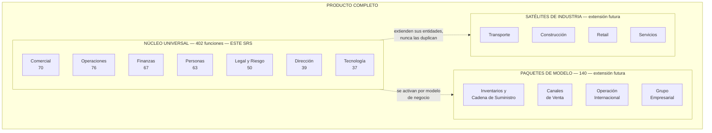

**Las tres reglas que sostienen esta arquitectura** y que este SRS hace obligatorias:

| # | Regla | Requisito que la impone |
|---|---|---|
| 1 | El núcleo funciona completo con todos los satélites desactivados | `RNF-090` |
| 2 | Un satélite **extiende** una entidad del núcleo; nunca la duplica ni la modifica | `RNF-091` |
| 3 | Un satélite vive dentro de los módulos existentes y se comunica por el bus de eventos, como cualquier módulo | `RNF-092` |

### 2.2 Diagrama de contexto

Quién y qué interactúa con el sistema, y en qué dirección fluye la información.

```mermaid
graph TB
    subgraph PERSONAS["Personas de la empresa"]
        U1["Propietario<br/>Dirección"]
        U2["Contabilidad<br/>Tesorería"]
        U3["Comercial"]
        U4["Personas RH"]
        U5["Operaciones"]
        U6["Campo<br/>PWA"]
        U7["Colaborador"]
        U8["Administrador<br/>del sistema"]
    end

    SISTEMA["<b>OS — Sistema Operativo de Negocio</b><br/>Aplicación web multiempresa + PWA"]

    subgraph EXTERNOS["Sistemas y terceros externos"]
        E1["PAC<br/>sella CFDI"]
        E2["SAT<br/>descarga masiva,<br/>catálogos, listas"]
        E3["Bancos<br/>estados de cuenta,<br/>layouts de pago"]
        E4["IMSS / INFONAVIT<br/>IDSE, SUA"]
        E5["Correo<br/>transaccional"]
        E6["Slack / n8n<br/>webhooks opcionales"]
    end

    subgraph CONTRAPARTES["Contrapartes del negocio"]
        C1["Cliente"]
        C2["Proveedor"]
        C3["Contador externo"]
        C4["Autoridad<br/>en auditoría"]
    end

    U1 --> SISTEMA
    U2 --> SISTEMA
    U3 --> SISTEMA
    U4 --> SISTEMA
    U5 --> SISTEMA
    U6 --> SISTEMA
    U7 --> SISTEMA
    U8 --> SISTEMA

    SISTEMA -->|"XML a timbrar"| E1
    E1 -->|"XML timbrado, UUID"| SISTEMA
    E2 -->|"CFDI recibidos, catálogos,<br/>lista 69-B, opinión"| SISTEMA
    E3 -->|"estado de cuenta"| SISTEMA
    SISTEMA -->|"layout de pagos"| E3
    SISTEMA -->|"archivos de movimientos<br/>y cuotas"| E4
    SISTEMA -->|"facturas, recordatorios,<br/>alertas"| E5
    SISTEMA -.->|"eventos seleccionados"| E6

    SISTEMA -->|"factura XML + PDF,<br/>estado de cuenta"| C1
    C2 -->|"factura, vía SAT"| SISTEMA
    SISTEMA -->|"balanza, pólizas,<br/>papeles de trabajo"| C3
    SISTEMA -->|"contabilidad electrónica,<br/>evidencia con hash"| C4
```

**Lectura del diagrama.** El sistema es el único punto donde una persona de la empresa captura o consulta información de negocio. Hacia afuera existen exactamente seis integraciones y ninguna de ellas es opcional para operar, salvo la última:

| Integración | ¿Se puede operar sin ella? | Qué pasa si falla |
|---|---|---|
| PAC | No: sin PAC no hay factura válida | El CFDI queda en estado `por_timbrar` y se reintenta. Ver `RF-118` y §11.7 |
| SAT descarga masiva | Sí, con captura manual de gastos | Los gastos se capturan a mano ese día; al restablecerse, la descarga recupera el histórico |
| Bancos | Sí, con captura manual de movimientos | La conciliación se retrasa; no se pierde nada |
| IMSS / INFONAVIT | Sí: son archivos que una persona carga en sus portales | La nómina se calcula igual; los archivos se generan después |
| Correo | Sí | Las facturas y alertas quedan en cola; se reenvían |
| Slack / n8n | Sí, está desactivado por defecto | Nada |

### 2.3 Clases de usuario

El sistema **no** es "software para administración". Es software para toda la empresa, con la superficie visible recortada por rol. Esta es la definición formal de los actores.

| ID | Actor | Quién es en la empresa real | Qué hace en el sistema | Frecuencia de uso | Dispositivo | Competencia técnica |
|---|---|---|---|---|---|---|
| `ACT-01` | **Propietario** | Dueño o socio | Ve todo, incluidos salarios individuales. Es el único que no puede ser restringido | Semanal | Escritorio, móvil | Media |
| `ACT-02` | **Administrador** | Quien administra el sistema (puede ser el propio dueño al inicio) | Usuarios, roles, configuración, integraciones, respaldos. **No** ve contenido de negocio | Mensual | Escritorio | Media-alta |
| `ACT-03` | **Dirección** | Director general o gerente general | Lee todas las áreas, aprueba lo que excede umbrales, fija objetivos. Ve totales de nómina, no salarios individuales | Diaria | Escritorio, móvil | Media |
| `ACT-04` | **Tesorería** | Quien maneja el dinero | Bancos, cobranza, programación de pagos, conciliación | Diaria | Escritorio | Media |
| `ACT-05` | **Contabilidad** | Contador interno o despacho externo con acceso | Pólizas, cierre, impuestos, contabilidad electrónica, reglas contables | Diaria en cierre, semanal el resto | Escritorio | Alta en su dominio |
| `ACT-06` | **Personas** | Recursos humanos | Expedientes, nómina, IMSS, incidencias. Único rol que ve salarios individuales además del Propietario | Diaria | Escritorio | Media |
| `ACT-07` | **Comercial** | Vendedor o gerente comercial | Prospectos, clientes, cotizaciones, pedidos, facturación desde pedido | Diaria | Escritorio, móvil | Baja-media |
| `ACT-08` | **Operaciones** | Quien coordina y despacha el trabajo | Órdenes de trabajo, asignación, compras, proveedores, activos | Diaria | Escritorio, tableta | Media |
| `ACT-09` | **Campo** | Quien ejecuta el trabajo fuera de la oficina | Sus órdenes asignadas, checklists, evidencias, consumos, incidencias. Solo ve lo propio | Diaria | **Móvil (PWA), frecuentemente sin señal** | **Baja. Diseñar para esto** |
| `ACT-10` | **Colaborador** | Cualquier empleado | Su espacio: recibos de nómina, vacaciones, permisos, gastos, capacitación | Quincenal | Móvil | Baja |
| `ACT-11` | **Agente de IA** | Actor no humano que actúa dentro del sistema | Lo que su usuario invocador puede hacer, nunca más | Continua | — | — |
| `ACT-12` | **Sistema externo** | PAC, SAT, banco, correo | Intercambia datos por adaptador | Continua | — | — |
| `ACT-13` | **Planificador** | Actor interno del sistema: tareas programadas | Descarga diaria, alertas, recordatorios, respaldos, despacho de eventos | Continua | — | — |

**Consecuencias de diseño que se derivan de la tabla anterior** y que este SRS convierte en requisitos:

1. `ACT-09` (Campo) tiene baja competencia técnica y conectividad intermitente. Por eso la PWA **debe** funcionar sin conexión y sincronizar al recuperarla (`RF-014`, `RNF-047`).
2. `ACT-02` (Administrador) **no debe** poder leer contenido de negocio. Separar quién administra el sistema de quién ve el dinero es un control, no una comodidad (`RF-005`, `RNF-055`).
3. `ACT-11` (Agente de IA) nunca amplía permisos. Un agente que puede leer algo que su invocador no puede es una fuga de datos, no una funcionalidad (`RF-230`, `RNF-058`).
4. `ACT-03` (Dirección) ve el costo total de nómina pero no los salarios individuales. La agregación es el control (`RF-166`, `RNF-063`).

### 2.4 Entorno operativo

| Elemento | Especificación | Requisito |
|---|---|---|
| Cliente web | Navegadores con soporte vigente del fabricante: Chrome, Edge, Firefox, Safari — las dos últimas versiones mayores | `RNF-040` |
| Cliente móvil | PWA instalable en Android e iOS, con cámara, geolocalización y almacenamiento local | `RNF-045` |
| Resolución mínima | 360 px de ancho (móvil) y 1280 px (escritorio) | `RNF-042` |
| Servidor de aplicación | Plataforma de cómputo sin servidor con despliegue continuo desde el repositorio: **Vercel** (confirmado) | `RNF-100` |
| Base de datos | **PostgreSQL 16 o superior sobre Supabase** (confirmado), con RLS, `pg_cron` y bóveda de secretos | `RNF-101` |
| Almacenamiento de archivos | Almacenamiento de objetos con URLs firmadas de vigencia limitada | `RNF-102` |
| Región de datos | Los datos **deben** residir en una región geográfica declarada y estable | `RNF-064` |
| Conectividad del usuario | Se asume conexión intermitente en campo y estable en oficina | `RNF-047` |
| Zona horaria de operación | América/Ciudad de México para presentación; UTC para almacenamiento | `RNF-085` |
| Idioma | Español de México, con arquitectura preparada para otros idiomas | `RNF-080`, §13.6 |
| Moneda base | Peso mexicano (MXN), con soporte multimoneda en nivel Profesional | `RF-128` |

### 2.5 Restricciones de diseño e implementación

Estas restricciones no son negociables por quien implementa. Cambiar alguna exige un ADR aprobado.

| # | Restricción | Razón |
|---|---|---|
| `RE-01` | Una sola aplicación desplegable, con módulos de frontera estricta (monolito modular). No microservicios | El equipo es una persona con IA; operar microservicios excede su capacidad. Ver ADR-0001 |
| `RE-02` | Un esquema de base de datos por módulo. Un módulo escribe solo en su esquema | Hace la frontera verificable por la base de datos, no por disciplina |
| `RE-03` | La frontera entre módulos se verifica con herramienta automática en CI, no por revisión humana | Una frontera que solo vive en la cabeza no existe |
| `RE-04` | El libro contable es de solo inserción. Ningún `UPDATE` ni `DELETE` | Es evidencia ante la autoridad. Ver ADR-0002 |
| `RE-05` | Toda tabla de negocio lleva `empresa_id` y política RLS desde su primera migración | Agregar multiempresa después es una reescritura |
| `RE-06` | Ningún parámetro fiscal, laboral o de seguridad social vive en el código | La norma cambia cada año; el código no debe cambiar por eso |
| `RE-07` | Los importes monetarios se representan con decimal exacto, nunca con punto flotante | Un centavo perdido por redondeo binario invalida una balanza |
| `RE-08` | Toda escritura de negocio deja rastro en bitácora | Requisito de auditoría y de diagnóstico |
| `RE-09` | Los secretos viven en almacén cifrado; las tablas guardan solo la referencia | Una fuga de base de datos no debe ser una fuga de credenciales |
| `RE-10` | Toda integración externa vive detrás de un adaptador con interfaz propia del sistema | Cambiar de proveedor no debe tocar módulos de negocio. Ver ADR-0003 |
| `RE-11` | El dominio se nombra en español (`factura`, `poliza`, `cobranza`) | Quien valida las reglas es un contador mexicano, no un ingeniero anglosajón |
| `RE-12` | Las reglas contables se almacenan como datos, no como código | El contador debe poder ajustarlas sin reprogramar |

### 2.6 Supuestos y dependencias

**Supuestos** — si alguno resulta falso, el alcance o el calendario cambian:

| # | Supuesto | Si resulta falso |
|---|---|---|
| `SU-01` | El PAC elegido acepta recibir el comprobante y sellarlo con el CSD que la empresa le cargó | Hay que implementar cadena original, XSLT y firma propios: semanas adicionales |
| `SU-02` | Existe un proveedor con API para la descarga masiva de CFDI del SAT | Hay que implementar el servicio SOAP con e.firma y custodiarla |
| `SU-03` | Los bancos de los clientes entregan estado de cuenta descargable en un formato tabular estable | La conciliación bancaria se vuelve captura manual asistida |
| `SU-04` | Un contador validará el catálogo de cuentas y las reglas contables antes de construir el motor | El motor se construye sobre supuestos y se rehace tras el primer cierre |
| `SU-05` | La empresa de prueba tiene RFC, e.firma, CSD y cuenta bancaria empresarial al llegar a producción | Se puede desarrollar y probar en sandbox, pero no liberar |
| `SU-06` | El volumen inicial es de una a pocas empresas, con decenas de usuarios y miles de documentos al mes | Las decisiones de §13.3 se adelantan |

**Dependencias externas** — el sistema no controla estos elementos:

| # | Dependencia | Riesgo asociado |
|---|---|---|
| `DE-01` | Disponibilidad del PAC | Sin PAC no se factura. Mitigación: cola de reintento y estado explícito (`RF-118`) |
| `DE-02` | Disponibilidad y cambios del SAT (catálogos, versiones de complemento, esquemas) | Mitigación: parámetros con vigencia y adaptadores (`RF-012`) |
| `DE-03` | Cambios anuales en tablas de ISR, UMA, salario mínimo, cuotas IMSS, tasas de ISN | Mitigación: carga de parámetros sin despliegue |
| `DE-04` | Formatos de archivo de IDSE y SUA | Mitigación: generación por adaptador, validada con el contador |
| `DE-05` | Continuidad del proveedor de base de datos y de cómputo | Mitigación: PostgreSQL estándar y exportación completa bajo demanda (`RNF-075`) |

---

## 3. Dominio del problema

Esta sección describe el mundo real que el software modela. Se escribe antes que los requisitos porque un requisito que contradiga el dominio es un requisito equivocado, aunque esté bien redactado.

### 3.1 Modelo conceptual del dominio

Las entidades del negocio y cómo se relacionan, independientemente de cómo se guarden.

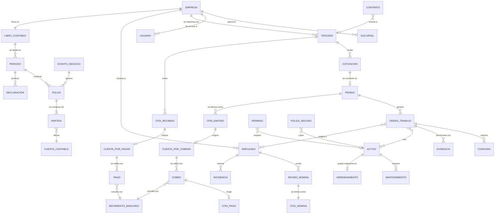

**Cómo se lee este modelo.** Hay cuatro cadenas que atraviesan el sistema y explican por qué las áreas no se pueden construir por separado:

| Cadena | Recorrido | Por qué importa |
|---|---|---|
| **Del ingreso** | Tercero → Cotización → Pedido → Orden de trabajo → CFDI emitido → CxC → Cobro → CFDI de pago → Movimiento bancario → Póliza | Es el camino del dinero que entra. Cortarlo en cualquier punto obliga a recapturar |
| **Del egreso** | Tercero → CFDI recibido → CxP → Autorización → Pago → Movimiento bancario → Póliza | Es el camino del dinero que sale, y la fuente del IVA acreditable y la DIOT |
| **Del trabajo** | Pedido → Orden de trabajo → Asignación (empleados, activos) → Consumos → Evidencias → Cierre → Facturación | Es lo que permite comparar lo que costó ejecutar contra lo que se cobró |
| **De la gente** | Empleado → Incidencias → Recibo de nómina → CFDI de nómina → Dispersión → Póliza → Obligaciones IMSS/ISN | Es la mayor partida de costo de casi cualquier empresa de servicios |

Las cuatro terminan en el mismo lugar: **una póliza en el libro contable**. Esa convergencia es el corazón del producto.

### 3.2 Reglas del dominio (invariantes)

Estas son verdades del negocio, no decisiones de software. El sistema **debe** hacerlas imposibles de violar, no solo desaconsejarlas. Una regla que el sistema permite romper "en un caso especial" no es una regla.

| # | Regla del dominio | Dónde se hace cumplir |
|---|---|---|
| `RN-001` | La suma de cargos de una póliza es exactamente igual a la suma de sus abonos | Restricción en la base de datos, verificada al cierre de la transacción |
| `RN-002` | Una partida contable tiene cargo o abono, nunca ambos, nunca ninguno | Restricción en la base de datos |
| `RN-003` | Una póliza registrada no se modifica ni se elimina. Se corrige con una póliza de reversa | Disparador que rechaza `UPDATE` y `DELETE` |
| `RN-004` | Un periodo contable cerrado no admite pólizas nuevas ni modificaciones | Disparador que valida el estado del periodo |
| `RN-005` | Un CFDI timbrado no se modifica. Se cancela y, si procede, se sustituye | Máquina de estados del CFDI (§11.1) |
| `RN-006` | Un CFDI cancelado que ya generó póliza exige una póliza de reversa; el libro nunca se borra | Motor contable |
| `RN-007` | El IVA trasladado se causa al **cobrar**, no al facturar; el IVA acreditable se causa al **pagar**, no al recibir la factura | Motor fiscal y reglas contables `R-01` a `R-07` |
| `RN-008` | Una factura con método de pago PPD obliga a emitir un complemento de pago por cada cobro | `RF-119`, alerta automática |
| `RN-009` | Un cobro no puede aplicarse por un importe mayor al saldo insoluto de la factura | Validación en la aplicación de pagos |
| `RN-010` | Un dato de una empresa nunca es visible desde otra empresa | RLS en toda tabla de negocio |
| `RN-011` | El salario individual de un empleado solo es visible para Personas y Propietario | RLS restringida en la tabla de condiciones salariales |
| `RN-012` | Un empleado dado de baja pierde el acceso al sistema el mismo día | `RF-009` |
| `RN-013` | Un pago que excede el umbral configurado requiere aprobación de **otra persona** con rol autorizado, nunca de quien lo capturó, aunque tenga el rol que aprueba | Motor de flujos, `RF-152`, `RF-032` |
| `RN-014` | Quien captura una operación no puede ser quien la aprueba | Motor de flujos, `RNF-057` |
| `RN-015` | Un documento fiscal o contable se conserva mínimo 5 años y no se elimina | Política de archivos, `RNF-070` |
| `RN-016` | Un parámetro fiscal aplica según la fecha del hecho económico, no según la fecha de captura | Consulta de parámetro por vigencia, `RF-012` |
| `RN-017` | Una orden de trabajo cerrada no admite consumos nuevos | Máquina de estados de la orden (§11.3) |
| `RN-018` | Un activo dado de baja no puede asignarse a una orden de trabajo | Validación de asignación |
| `RN-019` | Un empleado con documento obligatorio vencido no puede ser asignado a trabajo que lo requiera | Validación de asignación, `RF-186` |
| `RN-020` | Un tercero listado en el artículo 69-B del CFF marca sus comprobantes como no deducibles hasta resolución | `RF-140` |
| `RN-021` | El importe de un documento se calcula por concepto y se suma; nunca se calcula sobre el total | Motor fiscal, §11.8 |
| `RN-022` | Un agente de IA no puede leer ni escribir nada que su usuario invocador no pueda | `RF-230` |
| `RN-023` | Un evento de negocio se publica dentro de la misma transacción que el cambio que lo produjo | Patrón outbox, `RF-021` |
| `RN-024` | Procesar dos veces el mismo evento produce el mismo resultado que procesarlo una vez | Idempotencia, `RF-022` |
| `RN-025` | Toda escritura de negocio queda registrada con autor, momento y valor anterior | Bitácora, `RF-024` |

### 3.3 Glosario de términos

Ordenado por ámbito. Incluye los términos que aparecen en este documento y en el código.

#### 3.3.1 Términos del producto

| Término | Definición precisa |
|---|---|
| **Núcleo** | Conjunto de funciones que sirven a cualquier empresa sin importar su giro. 402 funciones. Es el alcance de este SRS |
| **Satélite** | Extensión del sistema para una industria concreta. Extiende entidades del núcleo agregando tablas en su propio esquema; nunca modifica las del núcleo |
| **Paquete de modelo de negocio** | Add-on que se activa según el modelo de negocio (inventarios, canales de venta, operación internacional, grupo empresarial), no según la industria |
| **Área** | Una de las 7 divisiones del catálogo de funciones. Corresponde uno a uno con un módulo de código y un esquema de base de datos |
| **Departamento** | Subdivisión dentro de un área (Contabilidad, Fiscal, Tesorería…). Hay 46 |
| **Función** | Unidad del catálogo de producto, con clave estable (`FIN-020`). Pertenece a exactamente un área y un departamento |
| **Nivel** | `E` Esencial, `P` Profesional, `A` Avanzado. Determina en qué plan comercial aparece la función, no cuándo se construye |
| **Plan** | Empaquetado comercial: Basic (nivel E, 118 funciones), Pro (E+P, 281), Max (E+P+A, 402) |
| **Micro app** | Calculadora autocontenida (IVA, finiquito, punto de equilibrio). No escribe en la base de negocio; solo lee parámetros vigentes |
| **Espacio del Colaborador** | Vista mínima que todo empleado tiene: sus recibos, vacaciones, permisos, gastos y capacitación |
| **Agente de IA** | Componente que ejecuta tareas en nombre de un usuario, con exactamente sus permisos |

#### 3.3.2 Términos de arquitectura

| Término | Definición precisa |
|---|---|
| **Monolito modular** | Una sola aplicación desplegable, dividida en módulos con fronteras reales: código, esquema de base de datos y contrato público propios |
| **Contrato (`contracts`)** | Lo único que un módulo expone a los demás: tipos y funciones públicas. El resto es interno e inaccesible |
| **Bus de eventos** | Mecanismo por el cual un módulo comunica que algo ocurrió, sin conocer ni llamar a quienes reaccionan |
| **Outbox** | Patrón en el que el evento se escribe en una tabla dentro de la misma transacción que el cambio de negocio. Si la transacción falla, el evento no existe; si tiene éxito, el evento se entregará |
| **Suscriptor** | Componente que reacciona a un tipo de evento. Un evento puede tener varios; ninguno conoce a los otros |
| **Idempotencia** | Propiedad por la que procesar la misma entrada dos veces produce el mismo resultado que procesarla una vez |
| **Dead-letter** | Destino de un evento que agotó sus reintentos. Genera alerta; nunca se descarta en silencio |
| **RLS** (Row Level Security) | Mecanismo de PostgreSQL que filtra por fila según la sesión. Es lo que aísla una empresa de otra |
| **Vault** | Almacén cifrado de secretos. Las tablas de negocio guardan solo una referencia |
| **Bitácora** | Registro inmutable de quién hizo qué, cuándo y desde dónde |
| **Los 6 almacenes** | ① operativa ② libro contable inmutable ③ bóveda cifrada ④ eventos de alto volumen ⑤ archivos ⑥ analítico |
| **Motor** | Componente transversal con lógica especializada que varios módulos consumen: fiscal, contable, nómina, flujos, documentos, alertas |
| **Adaptador** | Traductor entre la interfaz que define el sistema y la API concreta de un proveedor externo |
| **Multiempresa (multi-tenant)** | Capacidad de servir a varias empresas con una sola instancia, con aislamiento estricto entre ellas |

#### 3.3.3 Términos contables

| Término | Definición precisa |
|---|---|
| **Póliza** | Asiento contable: conjunto de partidas con cargos y abonos que suman igual. Aquí la genera el motor contable a partir de eventos |
| **Partida** | Renglón de una póliza: una cuenta y un cargo o un abono, nunca ambos |
| **Cargo / abono** | Los dos lados del registro contable. En cuentas de naturaleza deudora el cargo aumenta; en las acreedoras, disminuye |
| **Cuenta contable** | Clasificador del catálogo donde se registran los movimientos. Lleva naturaleza (deudora/acreedora) y código agrupador del SAT |
| **Código agrupador SAT** | Clasificación oficial obligatoria que asocia cada cuenta de la empresa con una cuenta estándar del SAT |
| **Balanza de comprobación** | Listado de todas las cuentas con saldo inicial, movimientos y saldo final. Si no cuadra, hay un error |
| **Libro diario / libro mayor** | Registro cronológico de pólizas / registro acumulado por cuenta |
| **Póliza de reversa** | Póliza que anula una anterior invirtiendo sus partidas. Única forma válida de corregir |
| **Periodo contable** | Mes o ejercicio. Puede estar abierto o cerrado; cerrado significa bloqueado para escritura |
| **Cierre** | Proceso por el cual un periodo se revisa, se completa y se bloquea |
| **Devengado** | Criterio por el cual un ingreso o gasto se registra cuando ocurre, independientemente del movimiento de dinero |
| **Flujo de efectivo** | Criterio por el cual algo se reconoce cuando el dinero se mueve. En México el IVA sigue este criterio |
| **Depreciación / amortización** | Reconocimiento del desgaste de un activo tangible / intangible o derecho de uso, a lo largo de su vida útil |
| **Provisión** | Reconocimiento de una obligación cuyo monto o fecha es estimado |
| **Estado de resultados** | Reporte de ingresos menos costos y gastos de un periodo |
| **Balance general** | Reporte de activos, pasivos y capital a una fecha |
| **NIF** | Normas de Información Financiera mexicanas. La NIF D-5 regula arrendamientos: un bien arrendado se reconoce como activo por derecho de uso con su pasivo |
| **Centro de costo** | Clasificador adicional (sucursal, proyecto, unidad de negocio) que permite ver resultados por segmento |

#### 3.3.4 Términos fiscales mexicanos

| Término | Definición precisa |
|---|---|
| **SAT** | Servicio de Administración Tributaria: la autoridad fiscal mexicana |
| **RFC** | Registro Federal de Contribuyentes: identificador fiscal de una persona física o moral |
| **CFDI 4.0** | Comprobante Fiscal Digital por Internet: la factura electrónica. Es un XML que solo es válido una vez sellado por un PAC |
| **PAC** | Proveedor Autorizado de Certificación: empresa autorizada por el SAT para sellar CFDI. Sin PAC no hay comprobante válido |
| **Timbrar** | Acto por el cual el PAC sella el comprobante y le asigna su folio fiscal (UUID) |
| **UUID / folio fiscal** | Identificador único e irrepetible que el PAC asigna a cada CFDI |
| **CSD** | Certificado de Sello Digital: certificado con el que se firman los CFDI |
| **e.firma** | Firma electrónica avanzada del contribuyente. Da acceso a trámites; es más sensible que el CSD |
| **PUE / PPD** | Pago en Una sola Exhibición / Pago en Parcialidades o Diferido. Un CFDI PPD obliga a emitir complemento de pago por cada cobro |
| **Complemento de pagos 2.0** | Comprobante que se emite al cobrar total o parcialmente una factura PPD |
| **Complemento de nómina 1.2** | Estructura con la que se timbra cada recibo de nómina |
| **Uso de CFDI** | Clave que declara para qué usará el receptor el comprobante. Debe ser compatible con su régimen fiscal |
| **Régimen fiscal** | Clasificación del contribuyente que determina sus obligaciones y los usos de CFDI válidos |
| **Descarga masiva** | Servicio del SAT que permite obtener los CFDI emitidos y recibidos de un periodo. Es la fuente automática de gastos |
| **IVA trasladado** | IVA que la empresa cobra a sus clientes |
| **IVA acreditable** | IVA que la empresa paga a sus proveedores y puede restar del trasladado |
| **IVA retenido** | IVA que un tercero retiene a la empresa, o que la empresa retiene a un tercero, según el tipo de operación |
| **IVA en flujo** | Principio por el cual el IVA se causa al cobrar y se acredita al pagar, no al facturar |
| **DIOT** | Declaración Informativa de Operaciones con Terceros: mensual, se construye desde los CFDI recibidos pagados |
| **ISR provisional** | Pago mensual a cuenta del impuesto anual, calculado con el coeficiente de utilidad del ejercicio anterior |
| **Coeficiente de utilidad** | Factor que relaciona la utilidad fiscal con los ingresos del ejercicio anterior; base del pago provisional |
| **Retención** | Impuesto que quien paga descuenta y entera por cuenta de quien cobra (honorarios, arrendamiento, salarios) |
| **69-B (EFOS)** | Lista pública de contribuyentes que emitieron comprobantes de operaciones inexistentes. Comprar a uno invalida la deducción |
| **Opinión de cumplimiento** | Documento del SAT que indica si un contribuyente está al corriente |
| **Contabilidad electrónica** | Obligación de entregar al SAT catálogo de cuentas, balanza y, bajo requerimiento, pólizas, en XML |
| **PTU** | Participación de los Trabajadores en las Utilidades: reparto anual obligatorio |
| **RESICO** | Régimen Simplificado de Confianza, con reglas y tasas propias |
| **Carta Porte** | Complemento obligatorio para trasladar mercancía por vías federales. Pertenece a un satélite de industria, no al núcleo |

#### 3.3.5 Términos de nómina y seguridad social

| Término | Definición precisa |
|---|---|
| **IMSS** | Instituto Mexicano del Seguro Social. Recibe altas, bajas, modificaciones de salario y cuotas |
| **SDI** | Salario Diario Integrado: base de cálculo de las cuotas, incluye prestaciones |
| **Factor de integración** | Multiplicador que convierte el salario diario en SDI según las prestaciones de ley y las adicionales |
| **SUA** | Sistema Único de Autodeterminación: software con el que se determinan y pagan las cuotas al IMSS e INFONAVIT |
| **IDSE** | Portal del IMSS para movimientos afiliatorios |
| **INFONAVIT / FONACOT** | Instituciones cuyos créditos se descuentan por nómina y se enteran junto con las cuotas |
| **ISN** | Impuesto Sobre Nómina: estatal; tasa y reglas cambian por estado |
| **UMA** | Unidad de Medida y Actualización: referencia para topes, multas y cuotas |
| **Subsidio para el empleo** | Cantidad que reduce el ISR de los salarios bajos, con reglas propias que han cambiado recientemente |
| **Prima de riesgo de trabajo** | Porcentaje que el IMSS asigna a la empresa según su siniestralidad |
| **Incidencia** | Hecho del periodo que afecta la nómina: falta, incapacidad, hora extra, permiso, percepción variable |
| **Finiquito / liquidación** | Pago por terminación de la relación laboral: finiquito siempre; liquidación cuando el despido es injustificado |
| **NOM-035** | Norma que obliga a identificar y prevenir factores de riesgo psicosocial |
| **REPSE** | Registro de prestadoras de servicios especializados u obras especializadas |

#### 3.3.6 Términos de construcción y calidad

| Término | Definición precisa |
|---|---|
| **Caso dorado** | Escenario de prueba con entradas y resultado esperado exactos, revisado y firmado por el contador. Los motores deben pasarlo siempre |
| **ADR** | Architecture Decision Record: registro de una decisión de arquitectura con su contexto, alternativas y consecuencias |
| **Tarea** | Unidad de trabajo del plan de construcción, con clave por área (`T-FIN-04`), dependencias y criterio de aceptación |
| **Semilla** | Datos iniciales cargados en un entorno para poder probar |
| **Definición de terminado** | Lista de condiciones que una tarea debe cumplir antes de considerarse completa |

---

### 3.4 Los regímenes fiscales soportados

El sistema **no asume un régimen fiscal**. El régimen es un dato que la empresa declara al darse de alta (`RF-001`) y que gobierna, desde ahí, tres cosas distintas: cuándo se acumula el ingreso, cómo se calcula el ISR, y qué obligaciones informativas existen.

El núcleo soporta cuatro regímenes. La clave del catálogo del SAT se carga como dato (`RF-011`); las que aparecen aquí son de referencia y se validan contra el catálogo vigente.

| Régimen | Clave SAT (ref.) | Fundamento | Base de acumulación | ISR provisional |
|---|---|---|---|---|
| **General de personas morales** | `601` | LISR Título II | **Devengado**: se acumula al expedir el comprobante, entregar el bien o cobrar, lo que ocurra primero | Ingresos nominales × coeficiente de utilidad del ejercicio anterior, menos pérdidas pendientes, PTU pagada, pagos previos y retenciones |
| **RESICO de personas morales** | `626` | LISR Título VII Cap. XII | **Flujo de efectivo**: se acumula lo efectivamente cobrado | Ingresos cobrados menos deducciones pagadas, sin coeficiente de utilidad. Deducción de inversiones con porcientos propios |
| **Coordinados (autotransporte)** | `624` | LISR Título II Cap. VII | **Flujo de efectivo** | Utilidad determinada conforme al régimen de actividad empresarial de personas físicas; el coordinado cumple por cuenta de sus integrantes. Aplican las facilidades administrativas del ejercicio |
| **Persona física con actividad empresarial y profesional** | `612` | LISR Título IV Cap. II Sec. I | **Flujo de efectivo** | Utilidad acumulada del periodo contra la tarifa progresiva, menos pagos previos y retenciones |
| **RESICO de personas físicas** | `626` | LISR Título IV Cap. II Sec. IV | **Flujo de efectivo** | Tasa sobre ingresos **cobrados**, sin deducciones, conforme a la tabla del régimen. Retención de las personas morales que le pagan |

**Lo que cambia y lo que no.** Conviene separarlo, porque la mayor parte del sistema es igual para todos:

| Ámbito | ¿Cambia con el régimen? | Detalle |
|---|---|---|
| Emisión y recepción de CFDI | **No** | El comprobante lleva el régimen del emisor y valida el del receptor; el mecanismo es el mismo (`RF-116`, `RF-117`) |
| IVA | **No** | El IVA siempre se causa en flujo, sea cual sea el régimen (`RF-131`). Por eso el catálogo de cuentas ya separa *IVA trasladado cobrado* de *no cobrado* |
| Nómina, IMSS, INFONAVIT, ISN | **No** | Dependen de tener empleados, no del régimen del patrón |
| Contabilidad de doble partida | **No** | Todos llevan libro; lo que cambia es **cuándo** se reconoce el ingreso |
| **Momento de acumulación** | **Sí** | Devengado o flujo. Es la diferencia de fondo: gobierna la regla contable que convierte un evento en póliza |
| **Cálculo de ISR provisional y anual** | **Sí** | Cada régimen tiene su propia definición de cálculo (`RF-053`) |
| **Contabilidad electrónica** | **Sí** | Obligatoria para personas morales; RESICO de personas físicas está relevado |
| **DIOT** | **Sí** | Aplica según el régimen y el ejercicio; vive como obligación del calendario, no como código |
| **PTU y coeficiente de utilidad** | **Sí** | Existen en el régimen general; no en RESICO ni en flujo de efectivo puro |
| **Facilidades administrativas** | **Sí** | Propias del autotransporte, publicadas cada año. Son parámetros con vigencia, nunca constantes |

**La decisión que ordena todo esto:** el régimen no es una bifurcación del código, es **una fila de un catálogo** con sus propiedades, y los cálculos son **definiciones de datos** que el motor interpreta. Un cambio del SAT en enero es una carga de datos y un caso dorado nuevo, no un despliegue. Ver `RF-051` a `RF-059` y `ADR-0006`.

**Límite declarado.** Los regímenes no listados —fines no lucrativos, AGAPES, plataformas tecnológicas, arrendamiento, grupos de sociedades— no están soportados. Agregar uno consiste en dar de alta su fila en el catálogo, escribir su definición de cálculo y sus casos dorados: no se modifica el código del motor. Esa es exactamente la prueba de que el diseño es correcto.

---

## 4. Necesidades del negocio

### 4.1 Quién es el cliente

**Cliente objetivo:** empresa mexicana —persona moral o persona física con actividad empresarial— de 10 a 100 empleados, con contador externo o un contador interno, que ya factura electrónicamente y que ha superado el punto en que una hoja de cálculo alcanza.

| Característica | Valor típico | Por qué importa para el diseño |
|---|---|---|
| Empleados | 10 a 100 | Define la escala de nómina y el número de usuarios concurrentes |
| Facturas emitidas al mes | 20 a 500 | Define el volumen de CFDI y de conciliación |
| Facturas recibidas al mes | 50 a 800 | Define el volumen de la descarga masiva y de la DIOT |
| Régimen fiscal | **Cualquiera de los cuatro regímenes soportados** (§3.4). El más común en el cliente objetivo es el general de personas morales | Define la base de acumulación —devengado o flujo—, el cálculo de ISR y las obligaciones informativas |
| Quién lleva la contabilidad | Despacho externo, con retraso de 30 a 60 días | Es el dolor central: la dirección decide con datos viejos |
| Sucursales | 1 a 5 | Define la necesidad de centros de costo y de sucursal en el modelo |
| Madurez tecnológica | Baja a media. Usan correo, hoja de cálculo y mensajería | Define el nivel de simplicidad exigible a la interfaz |

**Clasificación oficial de referencia.** La estratificación publicada en el DOF el 30 de junio de 2009 calcula un puntaje combinando trabajadores (10%) y ventas anuales (90%). El cliente objetivo cae en **pequeña y mediana empresa**. Esa estratificación se usa en el sistema para sugerir el plan durante la configuración inicial, nunca para restringir funciones (`RF-006`).

### 4.2 Objetivos del negocio

Los objetivos del negocio son los del cliente que compra el sistema, no los del producto. Cada uno se conecta con procesos y requisitos verificables.

| # | Objetivo de negocio | Situación actual típica | Meta | Cómo se mide en el sistema | Procesos que lo sirven |
|---|---|---|---|---|---|
| `OB-01` | **Saber cuánto gana realmente la empresa, hoy** | Estado de resultados con 30–60 días de retraso | Estado de resultados disponible en cualquier momento, con el dato del día | Antigüedad del último asiento respecto a hoy | `P-01`, `P-02`, `P-06` |
| `OB-02` | **Cobrar más rápido** | Se cobra tarde porque nadie lleva la antigüedad | Reducir los días de cobranza (DSO) en 20% en 6 meses | `v_cxc_antiguedad` y DSO calculado mensualmente | `P-01`, `P-07` |
| `OB-03` | **No pagar multas ni perder deducciones** | Obligaciones que se recuerdan por calendario personal; gastos que se pierden | Cero obligaciones fuera de plazo; 100% de CFDI recibidos clasificados antes del cierre | Calendario fiscal con estado; conciliación CFDI vs contabilidad | `P-02`, `P-06` |
| `OB-04` | **Saber si cada trabajo fue rentable** | Se sabe el ingreso, no el costo real de ejecutarlo | Margen por orden de trabajo disponible al cerrarla | `v_rentabilidad_orden` | `P-03`, `P-01` |
| `OB-05` | **Controlar quién ve y quién autoriza qué** | Todos ven todo, o nadie ve nada, y se autoriza por mensaje | 100% de los pagos sobre umbral con aprobación registrada de un segundo rol | Bitácora de aprobaciones | `P-02`, `P-09` |
| `OB-06` | **Pagar nómina correcta y a tiempo, sin depender de un tercero** | Nómina en despacho externo; errores se descubren tarde | Nómina calculada, timbrada y dispersada desde el sistema, sin ajuste posterior | Recibos timbrados a la primera ÷ total | `P-04` |
| `OB-07` | **Dejar de recapturar** | El mismo dato se escribe en 3 o 4 lugares | Cero recapturas en la cadena cotización → factura → póliza | Auditoría del flujo E2E | `P-01` |
| `OB-08` | **Que nada dependa de la memoria de una persona** | Vencimientos, renovaciones y obligaciones viven en la cabeza de alguien | 100% de vencimientos con alerta automática antes del plazo | Motor de alertas | `P-05`, `P-08` |
| `OB-09` | **Poder demostrar lo que se hizo** | La evidencia está repartida en correos y carpetas | Trazabilidad completa de cualquier operación, con autor y momento | Bitácora y hash del libro contable | `P-09` |
| `OB-10` | **Crecer sin romper el sistema** | Cada empresa nueva o área nueva exige otra herramienta | Alta de una segunda empresa o área sin reprogramar | Alta de empresa sin commits de código | Todos |

### 4.3 Objetivos de los usuarios

Un objetivo de negocio no se cumple solo porque la dirección lo quiera: se cumple si la persona que hace el trabajo diario encuentra el sistema más fácil que su hoja de cálculo. Esta es la traducción por rol.

| # | Actor | Lo que la persona quiere realmente | Lo que odia | Qué le da el sistema | Requisitos |
|---|---|---|---|---|---|
| `OU-01` | Propietario `ACT-01` | Abrir una pantalla y saber si el negocio va bien | Pedir reportes y esperar tres días | Tablero ejecutivo con datos del día y alertas críticas | `RF-210`, `RF-211` |
| `OU-02` | Dirección `ACT-03` | Enterarse de los problemas antes de que sean caros | Enterarse cuando ya no hay remedio | Alertas por umbral, aprobaciones en bandeja, reporte automático | `RF-211`, `RF-152` |
| `OU-03` | Tesorería `ACT-04` | Saber exactamente qué entra y qué sale esta semana | Conciliar a mano línea por línea | Flujo a 13 semanas, conciliación automática por referencia e importe | `RF-145`, `RF-147` |
| `OU-04` | Contabilidad `ACT-05` | Cerrar el mes sin perseguir a nadie | Capturar pólizas una por una; descubrir un gasto sin factura en el día 28 | Pólizas automáticas, conciliación CFDI vs contabilidad, checklist de cierre | `RF-121`, `RF-141`, `RF-130` |
| `OU-05` | Personas `ACT-06` | Correr la nómina y que salga bien a la primera | Recalcular por una incidencia capturada tarde | Incidencias capturadas por el propio empleado y aprobadas por su jefe, prenómina revisable | `RF-162`, `RF-164` |
| `OU-06` | Comercial `ACT-07` | Cotizar rápido y facturar sin pedir favores | Esperar a que administración facture | Cotización → pedido → factura sin recaptura, con permiso acotado | `RF-102`, `RF-104`, `RF-116` |
| `OU-07` | Operaciones `ACT-08` | Saber qué hay que hacer hoy, con qué y con quién | Descubrir a media ejecución que falta un recurso | Agenda de recursos, asignación con validación de disponibilidad y vigencias | `RF-182`, `RF-186` |
| `OU-08` | Campo `ACT-09` | Registrar lo que hizo en tres toques y sin señal | Formularios largos; perder lo capturado por falta de red | PWA con captura mínima, cámara, cola sin conexión | `RF-014`, `RF-185` |
| `OU-09` | Colaborador `ACT-10` | Bajar su recibo y pedir vacaciones sin preguntarle a nadie | Pedir por WhatsApp y que se olvide | Espacio del Colaborador con recibos, solicitudes y su estado | `RF-236`, `RF-237` |
| `OU-10` | Administrador `ACT-02` | Dar y quitar accesos sin equivocarse | Descubrir que un ex empleado sigue entrando | Consola de usuarios y roles, revocación ligada a la baja | `RF-004`, `RF-009` |
| `OU-11` | Contador externo `ACT-05` | Recibir la información completa y cuadrada | Pedir por correo lo que falta, tres veces | Acceso de solo lectura con exportación de balanza, pólizas y papeles | `RF-124`, `RNF-075` |

### 4.4 Criterios de éxito del producto

El sistema se considera exitoso cuando, sobre una empresa real, se cumplen simultáneamente:

| # | Criterio | Umbral | Momento de medición |
|---|---|---|---|
| `CE-01` | Un mes calendario completo opera dentro del sistema sin hoja de cálculo paralela | 1 mes | Primer cierre |
| `CE-02` | Las cifras de IVA, ISR y DIOT del sistema coinciden con lo presentado ante el SAT | Diferencia = 0 | Primer cierre |
| `CE-03` | La balanza del sistema coincide con la del contador | Diferencia = 0 | Primer y segundo cierre |
| `CE-04` | Toda la nómina del periodo se timbra desde el sistema sin ajuste manual posterior | 100% de recibos | Primera nómina |
| `CE-05` | Al menos el 80% de los empleados usa su espacio al menos una vez al mes | 80% | Tercer mes |
| `CE-06` | Ningún usuario ve datos que su rol no permite | 0 incidencias | Prueba de seguridad previa a producción |
| `CE-07` | Ninguna póliza fue alterada después de registrarse | 0 | Verificación de hash, cada cierre |

### 4.5 Trazabilidad: objetivo de negocio → proceso → requisito

Ninguna función existe porque sí. Esta matriz es la prueba.

| Objetivo | Procesos | Casos de uso principales | Requisitos funcionales núcleo |
|---|---|---|---|
| `OB-01` | `P-01`, `P-02`, `P-06` | `CU-020`, `CU-030`, `CU-040` | `RF-121`, `RF-122`, `RF-126`, `RF-130` |
| `OB-02` | `P-01`, `P-07` | `CU-023`, `CU-024` | `RF-142`, `RF-143`, `RF-144` |
| `OB-03` | `P-02`, `P-06` | `CU-031`, `CU-041` | `RF-131` a `RF-141` |
| `OB-04` | `P-03`, `P-01` | `CU-050`, `CU-055` | `RF-184`, `RF-188`, `RF-155` |
| `OB-05` | `P-02`, `P-09` | `CU-033`, `CU-011` | `RF-005`, `RF-007`, `RF-152` |
| `OB-06` | `P-04` | `CU-060` a `CU-064` | `RF-160` a `RF-175` |
| `OB-07` | `P-01` | `CU-020` a `CU-022` | `RF-102`, `RF-104`, `RF-116` |
| `OB-08` | `P-05`, `P-08` | `CU-070`, `CU-071` | `RF-025`, `RF-026`, `RF-207` |
| `OB-09` | `P-09` | `CU-012` | `RF-024`, `RF-123`, `RNF-070` |
| `OB-10` | Todos | `CU-001` | `RF-001`, `RF-002`, `RNF-090` a `RNF-093` |

---

## 5. Procesos del negocio

Cada proceso describe cómo trabaja la empresa, no cómo se ve la pantalla. El software existe para soportar estos procesos; si un proceso cambia, cambian los requisitos que lo sirven.

Formato de cada proceso: objetivo · disparador · actores · precondiciones · flujo · excepciones · salidas · reglas · indicadores.

### 5.1 Mapa general de procesos

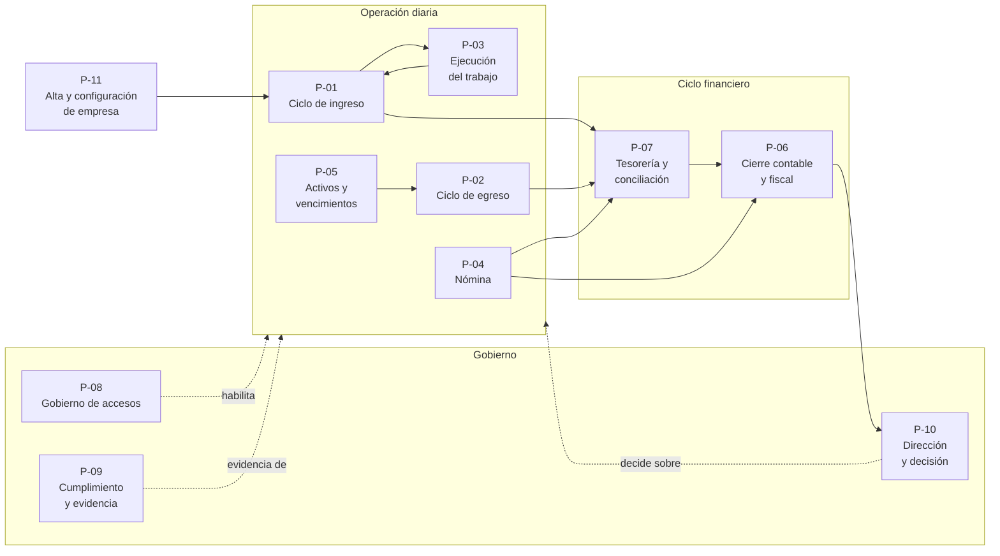

### 5.2 `P-01` · Ciclo de ingreso

**Objetivo.** Convertir una oportunidad comercial en dinero cobrado y registrado, capturando el dato una sola vez.

**Disparador.** Un prospecto solicita una propuesta, o un cliente existente pide un servicio o producto.

**Actores.** `ACT-07` Comercial (ejecuta) · `ACT-03` Dirección (autoriza descuentos fuera de política) · `ACT-04` Tesorería (cobra) · `ACT-05` Contabilidad (supervisa el registro) · `ACT-12` PAC (sella).

**Precondiciones.** La empresa tiene CSD cargado en el PAC, catálogo de productos y servicios configurado, y catálogo de cuentas con regla contable para ingresos.

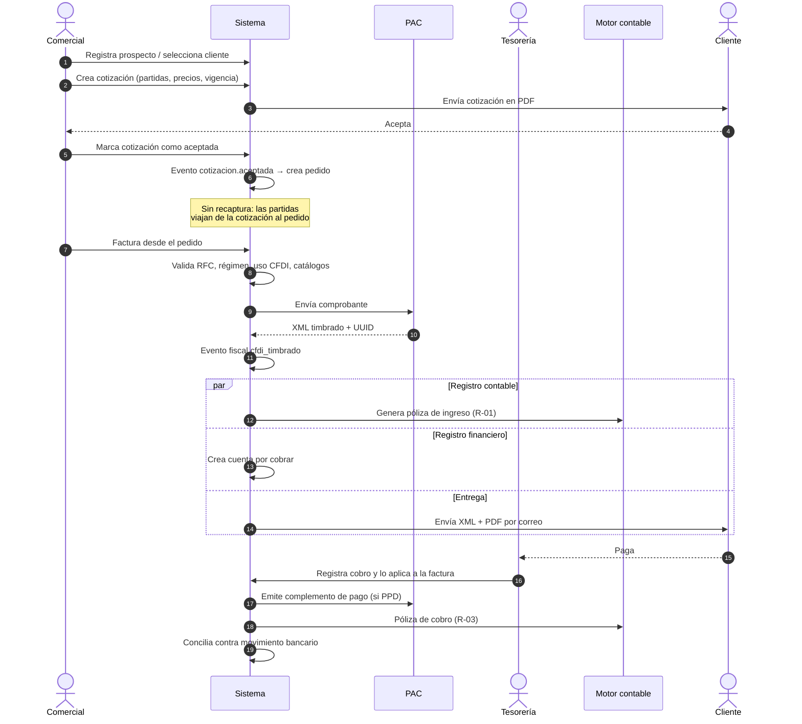

**Flujo normal.**

| # | Paso | Quién | Salida |
|---|---|---|---|
| 1 | Registrar prospecto o seleccionar cliente existente | Comercial | Tercero en el maestro |
| 2 | Crear oportunidad y registrar actividades de seguimiento | Comercial | Oportunidad en el embudo |
| 3 | Elaborar cotización con partidas, precios de lista, vigencia y condiciones | Comercial | Cotización en estado `borrador` |
| 4 | Enviar cotización al cliente | Sistema | PDF enviado, cotización `enviada` |
| 5 | Registrar la aceptación del cliente | Comercial | Cotización `aceptada`; el sistema crea el pedido |
| 6 | Si el trabajo requiere ejecución, se dispara `P-03` | Sistema | Orden de trabajo |
| 7 | Facturar desde el pedido o desde la orden cerrada | Comercial | CFDI `por_timbrar` |
| 8 | Validar y timbrar | Sistema + PAC | CFDI `timbrado` con UUID |
| 9 | Registrar contablemente y crear la cuenta por cobrar | Motor contable | Póliza + CxC |
| 10 | Enviar XML y PDF al cliente | Sistema | Correo enviado y registrado |
| 11 | Gestionar cobranza según antigüedad y promesas de pago | Tesorería | Gestiones registradas |
| 12 | Registrar el cobro y aplicarlo a una o varias facturas | Tesorería | Cobro aplicado, saldo actualizado |
| 13 | Emitir complemento de pago si la factura era PPD | Sistema + PAC | CFDI de tipo pago |
| 14 | Conciliar contra el movimiento bancario | Tesorería | Movimiento conciliado |

**Excepciones.**

| Excepción | Comportamiento exigido |
|---|---|
| El cliente rechaza la cotización | Se registra el motivo. La cotización queda `rechazada` y alimenta el análisis de ganadas/perdidas |
| La cotización vence sin respuesta | Estado `vencida` automático al pasar la fecha de vigencia |
| El RFC del cliente no existe o el régimen no admite el uso de CFDI elegido | Se bloquea el timbrado **antes** de enviar al PAC, con mensaje que nombra el campo |
| El PAC rechaza el comprobante | El CFDI queda `error_timbrado` con el código y el mensaje del PAC. No se genera póliza. Se reintenta |
| El PAC no responde | El CFDI queda `por_timbrar` y se reintenta con espera creciente. Nunca se duplica el timbrado (§11.7) |
| El cliente paga de menos | La factura queda parcialmente saldada; el saldo insoluto sigue en antigüedad |
| El cliente paga de más o paga dos facturas juntas | Un cobro se aplica a varias facturas; el excedente queda como anticipo |
| La factura se emitió con error y ya está timbrada | Se cancela (con sustitución si procede) y se genera póliza de reversa. Nunca se edita |
| El cliente excede su límite de crédito | El pedido se bloquea y requiere autorización de Dirección |

**Salidas del proceso.** CFDI timbrado · póliza de ingreso · cuenta por cobrar · complemento de pago · movimiento bancario conciliado · datos para IVA trasladado cobrado.

**Reglas aplicables.** `RN-005`, `RN-007`, `RN-008`, `RN-009`, `RN-021`.

**Indicadores.** Tasa de conversión del embudo · tiempo de cotización a factura · DSO · porcentaje de facturas PPD con complemento emitido · porcentaje de cobros conciliados automáticamente.

### 5.3 `P-02` · Ciclo de egreso

**Objetivo.** Registrar, autorizar y pagar lo que la empresa debe, capturando el gasto desde la fuente oficial —el SAT— y no desde un papel.

**Disparador.** Un proveedor emite un CFDI a la empresa. El sistema lo descubre solo, por descarga masiva diaria.

**Actores.** `ACT-13` Planificador (descarga) · `ACT-05` Contabilidad (clasifica) · `ACT-08` Operaciones (valida la recepción) · `ACT-03` Dirección (autoriza sobre umbral) · `ACT-04` Tesorería (paga).

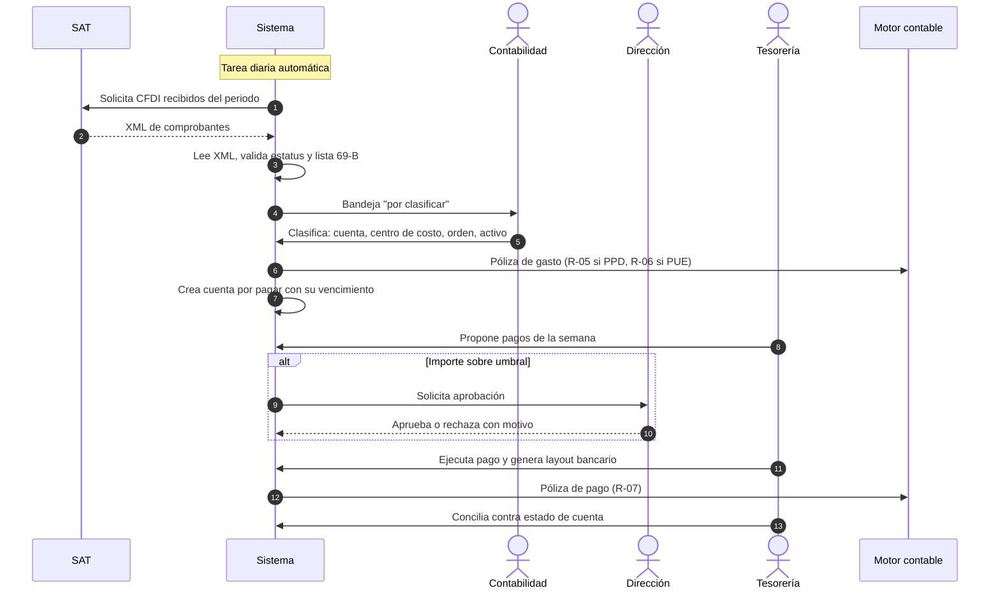

**Flujo normal.**

| # | Paso | Quién | Salida |
|---|---|---|---|
| 1 | Descargar los CFDI recibidos del SAT | Planificador | Comprobantes en bandeja |
| 2 | Validar estatus del comprobante y situación del emisor (69-B, opinión) | Sistema | Marca de riesgo si aplica |
| 3 | Clasificar: cuenta contable, centro de costo, orden de trabajo o activo | Contabilidad | Gasto clasificado |
| 4 | Conciliar contra orden de compra y recepción cuando existan | Operaciones | Conciliación de tres vías |
| 5 | Generar póliza y cuenta por pagar | Motor contable | Póliza + CxP |
| 6 | Programar pagos según vencimiento y flujo disponible | Tesorería | Propuesta de pago |
| 7 | Autorizar los que exceden el umbral | Dirección | Aprobación registrada |
| 8 | Ejecutar pago y generar layout bancario | Tesorería | Layout + póliza de pago |
| 9 | Conciliar contra el estado de cuenta | Tesorería | Movimiento conciliado |

**Excepciones.**

| Excepción | Comportamiento exigido |
|---|---|
| Existe un gasto sin CFDI | Se registra como gasto no deducible, marcado explícitamente. Nunca se inventa un comprobante |
| Existe un CFDI sin operación reconocida | Se marca para revisión. Es el mecanismo que detecta facturas apócrifas a nombre de la empresa |
| El proveedor aparece en la lista 69-B | El comprobante se marca como no deducible y genera alerta. No se borra: se documenta |
| El proveedor cancela un CFDI ya contabilizado | Se genera póliza de reversa y se avisa a Contabilidad |
| El importe pagado difiere del facturado | Se registra la diferencia (descuento, nota de crédito o error) y se exige su justificación |
| Un empleado pagó con recursos propios o con anticipo | Se registra como gasto por comprobar contra su cuenta de deudor, no contra bancos |
| El pago se rechaza en el banco | El pago vuelve a estado pendiente y la CxP se reabre |

**Salidas.** Póliza de gasto · CxP · pago · IVA acreditable pagado · insumos de la DIOT · retenciones enteradas.

**Reglas.** `RN-007`, `RN-013`, `RN-014`, `RN-020`.

**Indicadores.** Porcentaje de gastos que entran por descarga automática · días de clasificación pendiente · porcentaje de pagos con aprobación completa · gastos no deducibles sobre el total.

### 5.4 `P-03` · Ejecución del trabajo

**Objetivo.** Planear, ejecutar y documentar el trabajo comprometido, registrando lo que realmente costó.

**Disparador.** Un pedido aceptado que requiere ejecución, o una solicitud interna.

**Actores.** `ACT-08` Operaciones (planea y asigna) · `ACT-09` Campo (ejecuta) · `ACT-07` Comercial (factura al cierre).

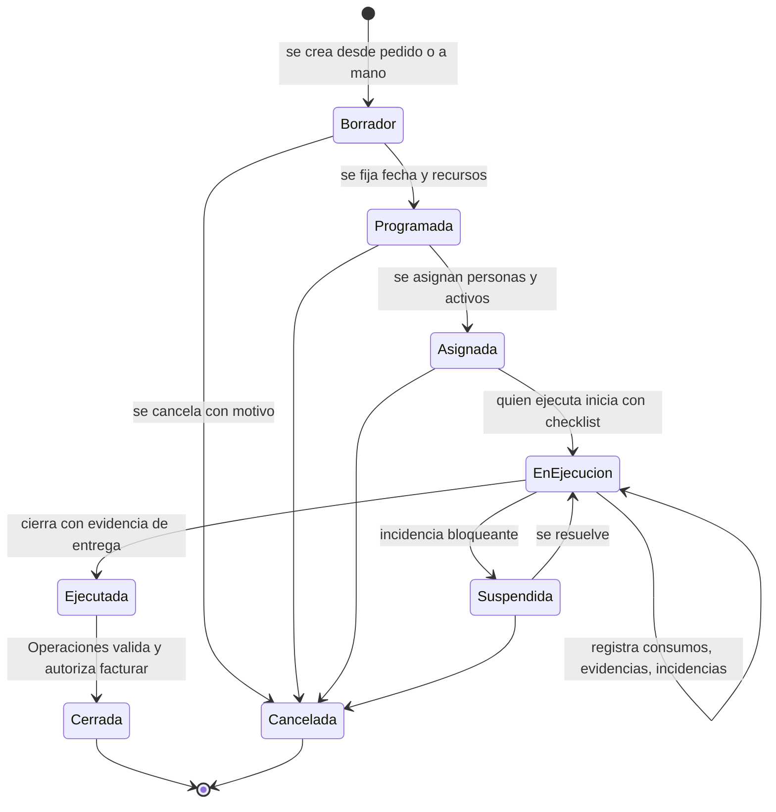

**Flujo normal.**

| # | Paso | Quién | Salida |
|---|---|---|---|
| 1 | Crear la orden desde el pedido o manualmente, con plantilla del tipo de trabajo | Operaciones | Orden `borrador` |
| 2 | Programar fecha y verificar disponibilidad de recursos en la agenda | Operaciones | Orden `programada` |
| 3 | Asignar personas y activos, validando vigencias y disponibilidad | Operaciones | Orden `asignada` |
| 4 | Iniciar el trabajo con checklist de arranque | Campo (PWA) | Orden `en ejecución`, evidencias iniciales |
| 5 | Registrar consumos (materiales, horas, gastos) y evidencias durante la ejecución | Campo (PWA) | Consumos y archivos |
| 6 | Reportar incidencias si las hay | Campo | Incidencia con severidad y ubicación |
| 7 | Cerrar con evidencia de entrega y firma del cliente | Campo | Orden `ejecutada` |
| 8 | Validar y autorizar la facturación | Operaciones | Orden `cerrada`, evento que habilita facturar |
| 9 | Calcular el costo real y compararlo con lo cotizado | Sistema | Margen de la orden |

**Excepciones.**

| Excepción | Comportamiento exigido |
|---|---|
| No hay señal en el lugar de trabajo | La PWA guarda localmente y sincroniza al recuperar conexión, sin pérdida ni duplicación |
| Un activo asignado tiene mantenimiento vencido crítico | El sistema bloquea la asignación y explica por qué |
| Un empleado asignado tiene un documento obligatorio vencido | El sistema bloquea la asignación y notifica a Personas |
| El trabajo consume más de lo estimado | Se registra igual; la diferencia queda visible en el margen, no se oculta |
| El cliente rechaza el trabajo entregado | Se registra la incidencia, la orden vuelve a ejecución y el costo adicional queda registrado |
| La orden se cancela con consumos ya registrados | Los consumos permanecen y se contabilizan como costo sin ingreso asociado |

**Salidas.** Orden cerrada · consumos · evidencias · base para facturar · costo real para rentabilidad.

**Reglas.** `RN-017`, `RN-018`, `RN-019`.

**Indicadores.** Órdenes cerradas a tiempo · desviación costo real vs estimado · margen por orden · tiempo de ejecución.

### 5.5 `P-04` · Nómina

**Objetivo.** Calcular, autorizar, timbrar, dispersar y contabilizar la nómina, cumpliendo las obligaciones laborales y de seguridad social.

**Disparador.** El inicio de un periodo de nómina (semanal, quincenal o mensual).

**Actores.** `ACT-10` Colaborador (solicita) · jefe inmediato (aprueba) · `ACT-06` Personas (calcula) · `ACT-03` Dirección (autoriza) · `ACT-04` Tesorería (dispersa) · `ACT-12` PAC (timbra).

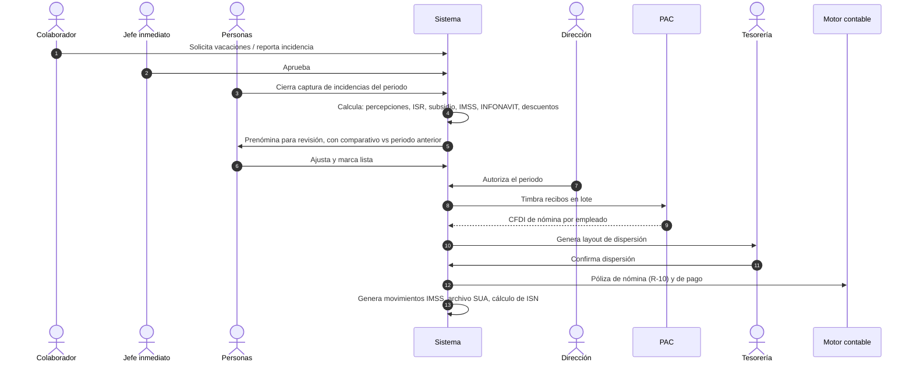

**Flujo normal.**

| # | Paso | Quién | Salida |
|---|---|---|---|
| 1 | Capturar y aprobar incidencias del periodo (faltas, incapacidades, horas extra, percepciones variables) | Colaborador y jefe | Incidencias aprobadas |
| 2 | Cerrar la captura del periodo | Personas | Periodo bloqueado para incidencias |
| 3 | Calcular la nómina | Sistema | Prenómina con detalle por empleado |
| 4 | Revisar la prenómina contra el periodo anterior y explicar variaciones | Personas | Prenómina validada |
| 5 | Autorizar el periodo | Dirección | Periodo autorizado |
| 6 | Timbrar los recibos en lote | Sistema + PAC | CFDI de nómina por empleado |
| 7 | Generar el layout de dispersión bancaria | Sistema | Archivo para el banco |
| 8 | Confirmar dispersión y conciliar | Tesorería | Movimientos conciliados |
| 9 | Registrar contablemente | Motor contable | Pólizas de provisión y pago |
| 10 | Generar movimientos afiliatorios, archivo de cuotas y cálculo de ISN | Sistema | Archivos para IDSE, SUA y declaración estatal |

**Excepciones.**

| Excepción | Comportamiento exigido |
|---|---|
| Una incidencia llega después del cierre de captura | Se registra en el periodo siguiente como ajuste retroactivo, identificado como tal. No se reabre un periodo timbrado |
| El timbrado falla para algunos empleados | El lote continúa; los fallidos quedan en estado de error individual y se reintentan sin re-timbrar los exitosos |
| Un recibo se timbró con error | Se cancela y se re-timbra. La póliza se corrige con reversa |
| Un empleado causa baja a mitad de periodo | Se calcula proporcional y se dispara el finiquito |
| Cambia la tabla de ISR o la UMA | Se carga el nuevo parámetro con su vigencia. Los periodos anteriores siguen usando el parámetro que tenían |
| El banco rechaza una dispersión individual | Ese pago vuelve a pendiente; el resto del lote no se afecta |

**Salidas.** Recibos timbrados · dispersión · pólizas · movimientos IMSS · archivo de cuotas · base de ISN · acumulados anuales para la declaración informativa.

**Reglas.** `RN-011`, `RN-016`, `RN-021`.

**Indicadores.** Recibos timbrados a la primera · tiempo de cálculo a dispersión · incidencias capturadas por el propio empleado · diferencias detectadas en revisión de prenómina.

### 5.6 `P-06` · Cierre contable y fiscal

**Objetivo.** Dar por terminado un periodo: que todo esté registrado, cuadrado, declarado y bloqueado.

**Disparador.** Fin de mes.

**Actores.** `ACT-05` Contabilidad (ejecuta) · `ACT-04` Tesorería (concilia) · `ACT-03` Dirección (aprueba reapertura, si llegara a ocurrir).

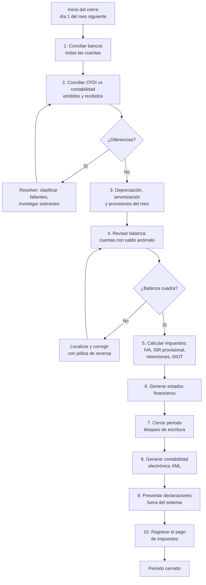

**Flujo normal, con su criterio de paso.**

| # | Paso | Criterio para continuar |
|---|---|---|
| 1 | Conciliación bancaria de todas las cuentas | 100% de movimientos conciliados o justificados |
| 2 | Conciliación CFDI vs contabilidad | Cero comprobantes sin registro y cero registros sin comprobante |
| 3 | Depreciación, amortización y provisiones | Cálculo generado y revisado |
| 4 | Revisión de balanza | Cargos = abonos; sin saldos de naturaleza contraria sin explicación |
| 5 | Cálculo de impuestos | IVA, ISR provisional, retenciones y DIOT calculados y cuadrados contra la balanza |
| 6 | Estados financieros | Generados y revisados |
| 7 | Cierre del periodo | El periodo queda bloqueado; toda escritura posterior se rechaza |
| 8 | Contabilidad electrónica | XML de catálogo y balanza válidos contra el esquema del SAT |
| 9 | Presentación de declaraciones | Fuera del sistema; se registra el acuse |
| 10 | Registro del pago de impuestos | Póliza de pago y conciliación |

**Excepciones.**

| Excepción | Comportamiento exigido |
|---|---|
| Aparece un gasto del periodo después del cierre | Se registra en el periodo abierto siguiente. Un periodo cerrado no se reabre por conveniencia |
| Es imprescindible reabrir un periodo | Solo Contabilidad, con aprobación de Dirección, y queda registrado en bitácora con motivo. Es una excepción auditada, no un botón normal |
| La balanza no cuadra | El cierre no avanza. No existe la opción de cerrar con diferencia |
| El cálculo del sistema difiere del cálculo del contador | Se documenta la diferencia y se resuelve antes de cerrar; si la regla estaba mal, se corrige la regla —que es dato— y se recalcula |

**Salidas.** Periodo cerrado · estados financieros · declaraciones calculadas · XML de contabilidad electrónica · pólizas de impuestos.

**Reglas.** `RN-001` a `RN-004`, `RN-007`, `RN-016`.

**Indicadores.** Días naturales para cerrar · número de ajustes posteriores · diferencias entre sistema y contador · porcentaje de conciliación automática.

### 5.7 `P-07` · Tesorería y conciliación

**Objetivo.** Saber en todo momento cuánto dinero hay, cuánto entra y cuánto sale, y que el saldo del sistema sea igual al del banco.

**Disparador.** Diario, y en cada movimiento de dinero.

**Flujo.** Importar el estado de cuenta → conciliar automáticamente por referencia, importe y fecha → resolver a mano los no conciliados → actualizar el flujo real → proyectar 13 semanas con CxC por vencimiento y promesas de pago, CxP programadas, nómina comprometida e impuestos estimados → identificar semanas con déficit → decidir.

**Excepciones.** Movimiento en el banco que no existe en el sistema (se investiga: puede ser un cargo no autorizado) · movimiento en el sistema que no llegó al banco (pago rechazado) · importe parcialmente distinto (comisión bancaria, diferencia cambiaria) · depósito de un cliente sin identificar (queda como cobro por aplicar).

**Indicadores.** Porcentaje conciliado automáticamente · días de desfase de conciliación · exactitud de la proyección a 4 semanas.

### 5.8 `P-05` · Activos y vencimientos

**Objetivo.** Que ningún activo, permiso, contrato o póliza de seguro se venza sin que alguien se entere a tiempo.

**Disparador.** Alta de un activo, contrato, permiso o póliza; y una revisión diaria automática.

**Flujo.** Registrar el bien o documento con su fecha de vencimiento y su responsable → programar mantenimientos por fecha o por lectura de uso → revisión diaria automática de vencimientos → alerta escalonada (anticipada, en el plazo, vencida) → ejecutar la renovación o el mantenimiento → registrar el costo, que llega desde `P-02`.

**Excepciones.** Vencimiento ignorado tras varias alertas: escala a Dirección · activo con mantenimiento crítico vencido: bloquea su asignación en `P-03` · documento renovado pero no cargado: la alerta persiste hasta que exista la evidencia.

**Indicadores.** Vencimientos atendidos antes del plazo · costo de mantenimiento por activo · disponibilidad de activos.

### 5.9 `P-08` · Gobierno de accesos

**Objetivo.** Que cada persona tenga exactamente los accesos que su función requiere, ni más ni menos, y que eso se pueda demostrar.

**Flujo.** Alta de empleado en Personas → creación de usuario con rol según puesto → asignación de permisos por rol, nunca individuales → uso → revisión periódica de accesos → baja de empleado, que revoca el acceso el mismo día.

**Excepciones.** Acceso temporal (suplencia): se otorga con vigencia y se revoca solo · empleado que cambia de puesto: se retira el rol anterior antes de otorgar el nuevo, nunca se acumulan · acceso de un tercero (contador externo): rol de solo lectura con alcance acotado y vigencia.

**Indicadores.** Usuarios activos sin empleado vigente (**debe ser 0**) · días entre baja laboral y revocación (**debe ser 0**) · permisos otorgados fuera de rol (**debe ser 0**).

### 5.10 `P-09` · Cumplimiento y evidencia

**Objetivo.** Poder demostrar, ante una auditoría o un conflicto, qué se hizo, cuándo, quién lo hizo y con qué respaldo.

**Flujo.** Toda operación deja bitácora → los documentos se guardan con hash y versión → las pólizas se encadenan con hash → los periodos cerrados quedan bloqueados → ante un requerimiento, se exporta el paquete de evidencia del periodo.

**Indicadores.** Integridad de la cadena de hash · porcentaje de operaciones con bitácora completa · tiempo para producir un paquete de evidencia.

### 5.11 `P-10` · Dirección y decisión

**Objetivo.** Convertir todo lo anterior en decisiones.

**Flujo.** Las áreas operan → las vistas analíticas agregan → el tablero muestra → las alertas interrumpen cuando algo se sale de rango → la dirección aprueba, corrige o redirige → los objetivos miden si funcionó.

**Regla que define este proceso.** Dirección **no captura datos propios**: solo lee lo que las demás áreas produjeron. Si un número no existe en otra área, no puede existir en el tablero. Esta regla evita el vicio más común de los sistemas directivos: un tablero alimentado a mano que dice lo que alguien quiere que diga.

### 5.12 `P-11` · Alta y configuración de una empresa

**Objetivo.** Poner una empresa a operar dentro del sistema sin escribir una línea de código.

**Flujo obligatorio y en este orden** —cada paso depende del anterior:

| # | Paso | Criterio de paso |
|---|---|---|
| 1 | Alta de la empresa: RFC, régimen fiscal, domicilio, sucursales | Datos validados contra catálogos del SAT |
| 2 | Carga de catálogos SAT vigentes y parámetros fiscales del año | Consulta por fecha devuelve el valor correcto |
| 3 | Catálogo de cuentas con código agrupador, revisado por el contador | Aprobación explícita registrada |
| 4 | Reglas contables activas para los eventos del negocio | Cada evento tiene su regla o se rechaza el cierre |
| 5 | Usuarios y roles | Cada persona con uno o más roles, ninguno con permisos individuales |
| 6 | Credenciales de PAC, banco y correo, cargadas en la bóveda | Prueba de conexión exitosa |
| 7 | Maestros: clientes, proveedores, productos y servicios, empleados | Cargados y validados |
| 8 | **Saldos iniciales**: balanza de apertura, CxC y CxP abiertas, activos con depreciación acumulada | **La balanza inicial del sistema es igual a la del contador, al centavo** |
| 9 | Timbrado de prueba en ambiente de pruebas y primer timbrado real | Ambos exitosos |
| 10 | Operación en paralelo con el método anterior durante dos cierres | Diferencias resueltas y aprobadas por el contador |

**El paso 8 es el que no se puede saltar.** Un sistema contable que arranca con saldos que no cuadran nunca vuelve a cuadrar, y todo lo construido encima hereda el error.

---

## 6. Casos de uso

### 6.1 Diagrama de casos de uso por actor

```mermaid
graph LR
    ADM(("Administrador"))
    COM(("Comercial"))
    TES(("Tesorería"))
    CONT(("Contabilidad"))
    PER(("Personas"))
    OPE(("Operaciones"))
    CAM(("Campo"))
    COL(("Colaborador"))
    DIR(("Dirección"))

    subgraph PLATAFORMA
        CU001["CU-001 Configurar empresa"]
        CU004["CU-004 Administrar usuarios y roles"]
        CU009["CU-009 Dar de baja un acceso"]
        CU011["CU-011 Aprobar una solicitud"]
        CU012["CU-012 Consultar bitácora"]
    end
    subgraph INGRESO
        CU020["CU-020 Cotizar"]
        CU021["CU-021 Convertir a pedido"]
        CU022["CU-022 Emitir CFDI"]
        CU023["CU-023 Registrar cobro"]
        CU024["CU-024 Gestionar cobranza"]
        CU025["CU-025 Cancelar CFDI"]
    end
    subgraph EGRESO
        CU030["CU-030 Clasificar CFDI recibido"]
        CU031["CU-031 Conciliar CFDI vs contabilidad"]
        CU033["CU-033 Autorizar y ejecutar pago"]
        CU034["CU-034 Comprobar gasto de empleado"]
    end
    subgraph CONTABLE
        CU040["CU-040 Consultar balanza y EF"]
        CU041["CU-041 Cerrar periodo"]
        CU042["CU-042 Registrar póliza manual"]
        CU043["CU-043 Calcular impuestos del mes"]
    end
    subgraph OPERACION
        CU050["CU-050 Crear y asignar orden"]
        CU051["CU-051 Ejecutar orden en campo"]
        CU055["CU-055 Cerrar orden y facturar"]
        CU056["CU-056 Comprar a proveedor"]
    end
    subgraph GENTE
        CU060["CU-060 Registrar incidencia"]
        CU061["CU-061 Calcular nómina"]
        CU062["CU-062 Timbrar y dispersar"]
        CU063["CU-063 Solicitar vacaciones"]
        CU064["CU-064 Calcular finiquito"]
    end
    subgraph DIRECCION
        CU070["CU-070 Consultar tablero"]
        CU071["CU-071 Atender alerta"]
    end

    ADM --> CU001
    ADM --> CU004
    ADM --> CU009
    COM --> CU020
    COM --> CU021
    COM --> CU022
    TES --> CU023
    TES --> CU024
    CONT --> CU025
    CONT --> CU030
    CONT --> CU031
    TES --> CU033
    COL --> CU034
    CONT --> CU040
    CONT --> CU041
    CONT --> CU042
    CONT --> CU043
    OPE --> CU050
    CAM --> CU051
    OPE --> CU055
    OPE --> CU056
    COL --> CU060
    PER --> CU061
    PER --> CU062
    COL --> CU063
    PER --> CU064
    DIR --> CU070
    DIR --> CU071
    DIR --> CU011
    DIR --> CU012
```

### 6.2 Catálogo de casos de uso

| ID | Caso de uso | Actor principal | Disparador | Proceso | Prioridad |
|---|---|---|---|---|---|
| `CU-001` | Configurar una empresa nueva | Administrador | Alta de cliente | `P-11` | Obligatorio |
| `CU-002` | Cargar catálogos SAT y parámetros fiscales | Administrador | Inicio de año o cambio normativo | `P-11` | Obligatorio |
| `CU-003` | Configurar catálogo de cuentas y reglas contables | Contabilidad | Alta de empresa | `P-11` | Obligatorio |
| `CU-004` | Administrar usuarios y roles | Administrador | Alta, cambio o baja de personal | `P-08` | Obligatorio |
| `CU-005` | Iniciar sesión con segundo factor | Cualquiera | Acceso diario | `P-08` | Obligatorio |
| `CU-006` | Cambiar de empresa activa | Usuario multiempresa | Trabajo en varias empresas | `P-08` | Importante |
| `CU-007` | Configurar integraciones y credenciales | Administrador | Alta o cambio de proveedor | `P-11` | Obligatorio |
| `CU-008` | Configurar reglas de aprobación y umbrales | Dirección | Definición de política | `P-08` | Obligatorio |
| `CU-009` | Revocar accesos por baja laboral | Administrador | Baja de empleado | `P-08` | Obligatorio |
| `CU-010` | Restaurar y verificar un respaldo | Administrador | Prueba trimestral | — | Obligatorio |
| `CU-011` | Aprobar o rechazar una solicitud | Dirección | Solicitud sobre umbral | `P-02` | Obligatorio |
| `CU-012` | Consultar la bitácora de un registro | Dirección, Contabilidad | Investigación | `P-09` | Obligatorio |
| `CU-020` | Elaborar y enviar una cotización | Comercial | Solicitud del cliente | `P-01` | Obligatorio |
| `CU-021` | Convertir cotización aceptada en pedido | Comercial | Aceptación del cliente | `P-01` | Obligatorio |
| `CU-022` | Emitir un CFDI de ingreso | Comercial | Pedido u orden cerrada | `P-01` | Obligatorio |
| `CU-023` | Registrar un cobro y emitir complemento | Tesorería | Depósito del cliente | `P-01` | Obligatorio |
| `CU-024` | Gestionar cobranza de facturas vencidas | Tesorería | Vencimiento | `P-01` | Importante |
| `CU-025` | Cancelar un CFDI timbrado | Contabilidad | Error o cancelación comercial | `P-01` | Obligatorio |
| `CU-026` | Autorizar crédito a un cliente | Dirección | Solicitud comercial | `P-01` | Importante |
| `CU-030` | Clasificar un CFDI recibido | Contabilidad | Descarga diaria | `P-02` | Obligatorio |
| `CU-031` | Conciliar CFDI contra contabilidad | Contabilidad | Cierre mensual | `P-02`, `P-06` | Obligatorio |
| `CU-032` | Registrar una cuenta por pagar | Contabilidad | Clasificación del gasto | `P-02` | Obligatorio |
| `CU-033` | Programar, autorizar y ejecutar pagos | Tesorería | Vencimientos de la semana | `P-02` | Obligatorio |
| `CU-034` | Comprobar un gasto de empleado | Colaborador | Gasto realizado | `P-02` | Importante |
| `CU-035` | Importar estado de cuenta y conciliar | Tesorería | Diario | `P-07` | Obligatorio |
| `CU-036` | Proyectar el flujo a 13 semanas | Tesorería | Semanal | `P-07` | Importante |
| `CU-040` | Consultar balanza y estados financieros | Contabilidad, Dirección | Cuando se necesite | `P-06` | Obligatorio |
| `CU-041` | Cerrar un periodo contable | Contabilidad | Fin de mes | `P-06` | Obligatorio |
| `CU-042` | Registrar una póliza manual | Contabilidad | Ajuste | `P-06` | Obligatorio |
| `CU-043` | Calcular impuestos del mes | Contabilidad | Cierre | `P-06` | Obligatorio |
| `CU-044` | Generar contabilidad electrónica | Contabilidad | Cierre o requerimiento | `P-06` | Obligatorio |
| `CU-045` | Reabrir un periodo cerrado | Contabilidad + Dirección | Excepción justificada | `P-06` | Obligatorio |
| `CU-046` | Corregir un asiento contable | Contabilidad | Se detecta un error en el libro | `P-06` | Obligatorio |
| `CU-050` | Crear, programar y asignar una orden | Operaciones | Pedido o solicitud | `P-03` | Obligatorio |
| `CU-051` | Ejecutar una orden en campo | Campo | Inicio del trabajo | `P-03` | Obligatorio |
| `CU-055` | Cerrar una orden y habilitar su facturación | Operaciones | Trabajo terminado | `P-03` | Obligatorio |
| `CU-056` | Requisitar, cotizar y ordenar una compra | Operaciones | Necesidad interna | `P-02` | Importante |
| `CU-057` | Recibir mercancía o servicio y conciliar tres vías | Operaciones | Entrega del proveedor | `P-02` | Importante |
| `CU-058` | Registrar un activo y programar su mantenimiento | Operaciones | Adquisición | `P-05` | Importante |
| `CU-060` | Registrar o aprobar una incidencia de nómina | Colaborador, jefe | Durante el periodo | `P-04` | Obligatorio |
| `CU-061` | Calcular la nómina del periodo | Personas | Cierre de periodo | `P-04` | Obligatorio |
| `CU-062` | Timbrar y dispersar la nómina | Personas, Tesorería | Nómina autorizada | `P-04` | Obligatorio |
| `CU-063` | Solicitar vacaciones o permiso | Colaborador | Necesidad personal | `P-04` | Importante |
| `CU-064` | Calcular un finiquito o liquidación | Personas | Terminación laboral | `P-04` | Obligatorio |
| `CU-065` | Generar movimientos IMSS y archivo de cuotas | Personas | Alta, baja, modificación, mes | `P-04` | Obligatorio |
| `CU-070` | Consultar el tablero ejecutivo | Dirección | Diario | `P-10` | Obligatorio |
| `CU-071` | Atender una alerta crítica | Quien corresponda | Alerta generada | `P-10` | Obligatorio |
| `CU-072` | Registrar y dar seguimiento a un contrato o permiso | Legal | Firma o renovación | `P-05` | Importante |
| `CU-073` | Consultar el negocio en lenguaje natural | Dirección | Pregunta puntual | `P-10` | Deseable |

### 6.3 Especificación detallada de los casos de uso críticos

Se especifican en detalle los casos de uso donde un malentendido cuesta dinero, incumple la ley o rompe la integridad del libro contable. El resto sigue la misma estructura y se detalla al construirse.

---

#### `CU-022` · Emitir un CFDI de ingreso

| Campo | Contenido |
|---|---|
| **Actor principal** | `ACT-07` Comercial |
| **Actores secundarios** | `ACT-12` PAC · Motor fiscal · Motor contable |
| **Objetivo** | Convertir un pedido u orden cerrada en una factura fiscalmente válida, sin recapturar datos |
| **Proceso** | `P-01` |
| **Frecuencia** | De 1 a 50 veces al día |
| **Prioridad** | Obligatorio |

**Precondiciones**

1. Existe un pedido en estado `confirmado` o una orden de trabajo en estado `cerrada`.
2. El cliente tiene RFC, régimen fiscal y código postal de domicilio fiscal registrados.
3. La empresa tiene configurada la integración con el PAC y su CSD cargado en él.
4. Existe folio disponible en la serie correspondiente.
5. El usuario tiene permiso `crear` sobre el recurso `finanzas.cfdi_emitidos`.

**Flujo principal**

| # | Actor | Acción | Respuesta del sistema |
|---|---|---|---|
| 1 | Comercial | Selecciona un pedido y elige "Facturar" | Precarga receptor, partidas, importes, impuestos, moneda y condiciones desde el pedido |
| 2 | Comercial | Indica uso de CFDI, método de pago (PUE/PPD) y forma de pago | Valida que el uso de CFDI sea compatible con el régimen fiscal del receptor |
| 3 | Comercial | Revisa el borrador | Muestra subtotal, descuentos, impuestos trasladados, retenciones y total, calculados por concepto |
| 4 | Comercial | Confirma la emisión | Ejecuta las validaciones previas completas (lista en §11.8) |
| 5 | — | — | Asigna folio de la serie, deja el CFDI en estado `por_timbrar` y lo envía al PAC |
| 6 | PAC | Sella | Devuelve XML timbrado, UUID, fecha y sello |
| 7 | — | — | Guarda XML y PDF en el almacén de archivos, pasa el CFDI a `timbrado` y publica el evento `fiscal.cfdi_timbrado` |
| 8 | — | — | El motor contable genera la póliza (regla `R-01` si PPD, `R-02` si PUE); tesorería crea la cuenta por cobrar; el sistema envía XML y PDF al cliente |
| 9 | Comercial | Ve la confirmación | Muestra UUID, enlace de descarga y estado de envío |

**Flujos alternativos**

| Ref | Condición | Comportamiento |
|---|---|---|
| 2a | El uso de CFDI no es compatible con el régimen del receptor | El sistema lo impide, nombra el campo y propone los usos válidos para ese régimen |
| 2b | El método de pago es PPD | La forma de pago se fija en "por definir" y el sistema programa la vigilancia del complemento de pago |
| 3a | El comercial aplica un descuento mayor al autorizado por su rol | Se genera una solicitud de aprobación y el CFDI no avanza hasta que se resuelva |
| 4a | El cliente excede su límite de crédito y el método es PPD | Se bloquea la emisión y se ofrece solicitar autorización a Dirección |
| 8a | El envío de correo falla | El CFDI sigue siendo válido. El envío queda en cola y se reintenta; se muestra su estado |

**Flujos de excepción**

| Ref | Excepción | Comportamiento exigido |
|---|---|---|
| E1 | Una validación previa falla (RFC inexistente, catálogo desconocido, impuesto mal calculado) | **No se envía nada al PAC.** Se muestra la lista completa de errores con el campo de cada uno. El CFDI permanece en `borrador` |
| E2 | El PAC rechaza el comprobante | El CFDI pasa a `error_timbrado` con el código y mensaje del PAC guardados. **No se genera póliza ni CxC.** Se permite corregir y reintentar |
| E3 | El PAC no responde dentro del tiempo límite | El CFDI permanece en `por_timbrar`. El sistema reintenta con espera creciente. **Antes de cada reintento consulta al PAC si el comprobante ya fue timbrado**, para no duplicarlo (§11.7) |
| E4 | Se agota el folio de la serie | Se bloquea la emisión y se alerta al Administrador. No se salta ni se reutiliza un folio |
| E5 | La conexión del usuario se pierde tras confirmar | La operación es idempotente por la clave del pedido: al recuperar, el usuario ve el resultado real, no un duplicado |

**Poscondiciones**

- **En caso de éxito:** existe un CFDI `timbrado` con UUID único; existe exactamente una póliza de ingreso asociada al evento; existe una cuenta por cobrar por el total, o un cobro registrado si el método es PUE y se cobró; el XML y el PDF están almacenados con hash; la bitácora registra autor y momento.
- **En caso de fallo:** no existe póliza, no existe CxC, no se consumió folio de forma irrecuperable, y el estado del CFDI explica exactamente qué pasó.

**Reglas aplicables.** `RN-005`, `RN-007`, `RN-008`, `RN-021`.
**Requisitos que lo implementan.** `RF-116`, `RF-117`, `RF-118`, `RF-121`, `RF-142`.
**Caso dorado asociado.** `CD-01`.

---

#### `CU-023` · Registrar un cobro y emitir el complemento de pago

| Campo | Contenido |
|---|---|
| **Actor principal** | `ACT-04` Tesorería |
| **Objetivo** | Registrar el dinero recibido, aplicarlo a las facturas correctas, cumplir la obligación del complemento y reconocer el IVA cobrado |
| **Proceso** | `P-01` |
| **Prioridad** | Obligatorio |

**Precondiciones.** Existe al menos una factura con saldo insoluto. Existe la cuenta bancaria destino. El usuario tiene permiso `crear` sobre `finanzas.cobros`.

**Flujo principal**

| # | Acción | Respuesta del sistema |
|---|---|---|
| 1 | Tesorería registra el cobro: fecha, importe, cuenta destino, forma de pago, referencia | Valida que la fecha no caiga en periodo cerrado |
| 2 | Selecciona las facturas a las que se aplica | Muestra solo las facturas del mismo cliente con saldo, con su antigüedad |
| 3 | Distribuye el importe entre facturas | Valida que ninguna aplicación exceda el saldo insoluto de su factura |
| 4 | Confirma | Registra el cobro, actualiza saldos, publica `finanzas.cobro_registrado` |
| 5 | — | Si alguna factura aplicada es PPD, construye y timbra el complemento de pago 2.0 |
| 6 | — | El motor contable genera la póliza: reconoce el IVA trasladado como **cobrado** (traslada de la cuenta de IVA no cobrado a la de IVA cobrado) |
| 7 | — | Deja el cobro disponible para conciliación bancaria |

**Flujos alternativos.**
- 3a. El importe excede la suma de saldos: el excedente se registra como **anticipo del cliente**, que es un pasivo, y se documenta como tal.
- 3b. El cobro corresponde a un cliente no identificado: queda como "cobro por aplicar", visible en el tablero de tesorería hasta su aplicación. No se contabiliza como ingreso.
- 5a. La factura era PUE y se cobró en la misma fecha de emisión: no se emite complemento.

**Excepciones.**
- E1. El complemento de pago falla en el PAC: el cobro queda registrado —el dinero entró— y el complemento pendiente, con alerta. **Nunca se pierde el registro del dinero por un problema de timbrado.**
- E2. Se intenta registrar un cobro con fecha de un periodo cerrado: se rechaza y se indica el periodo abierto más próximo.

**Poscondiciones.** Saldo de la factura actualizado · IVA reconocido como cobrado · complemento emitido si procedía · movimiento listo para conciliar.

**Reglas.** `RN-007`, `RN-008`, `RN-009`, `RN-004`.
**Requisitos.** `RF-142`, `RF-119`, `RF-121`. **Caso dorado.** `CD-02`.

---

#### `CU-030` · Clasificar un CFDI recibido

| Campo | Contenido |
|---|---|
| **Actor principal** | `ACT-05` Contabilidad |
| **Objetivo** | Convertir un comprobante bajado del SAT en un gasto contabilizado, deducible y pagable |
| **Proceso** | `P-02` |
| **Prioridad** | Obligatorio |

**Precondiciones.** La descarga masiva trajo comprobantes. Existe catálogo de cuentas y reglas contables.

**Flujo principal**

| # | Acción | Respuesta del sistema |
|---|---|---|
| 1 | Contabilidad abre la bandeja "por clasificar" | Lista los comprobantes con emisor, fecha, importe, estado ante el SAT y marca de riesgo 69-B |
| 2 | Selecciona un comprobante | Muestra el detalle del XML, sus conceptos e impuestos, y sugiere clasificación por historial del proveedor |
| 3 | Asigna cuenta contable, centro de costo y, si aplica, orden de trabajo o activo | Valida que la cuenta admita el tipo de movimiento |
| 4 | Indica si es deducible y, si no, el motivo | Si el emisor está en 69-B, el sistema marca no deducible por defecto y exige justificación para cambiarlo |
| 5 | Confirma | Publica `finanzas.cfdi_recibido_registrado`; el motor contable genera la póliza (`R-05` si PPD, `R-06` si PUE pagado); se crea la cuenta por pagar |

**Flujos alternativos.**
- 3a. Existe una orden de compra y una recepción: el sistema propone la conciliación de tres vías y señala diferencias de cantidad o precio.
- 3b. El gasto corresponde a un activo fijo: se dirige al alta del activo en lugar de a una cuenta de gasto, y se programa su depreciación.
- 4a. El comprobante es un anticipo: se registra contra la cuenta de anticipos a proveedores, no como gasto.

**Excepciones.**
- E1. El comprobante fue cancelado por el emisor después de contabilizarse: el sistema detecta el cambio de estatus en la siguiente descarga, alerta a Contabilidad y exige póliza de reversa.
- E2. El XML está incompleto o no es legible: queda en una bandeja de error con el motivo; nunca se descarta en silencio.
- E3. El comprobante corresponde a otra empresa del grupo: se puede reasignar solo si el usuario tiene acceso a ambas empresas; el movimiento queda en bitácora.

**Poscondiciones.** Gasto contabilizado · CxP creada · IVA acreditable registrado con el criterio correcto (pendiente si PPD, acreditable si ya pagado) · insumo de DIOT generado.

**Reglas.** `RN-007`, `RN-020`. **Requisitos.** `RF-139`, `RF-140`, `RF-121`. **Caso dorado.** `CD-04`.

---

#### `CU-041` · Cerrar un periodo contable

| Campo | Contenido |
|---|---|
| **Actor principal** | `ACT-05` Contabilidad |
| **Objetivo** | Dar por terminado un mes: completo, cuadrado y bloqueado |
| **Proceso** | `P-06` |
| **Prioridad** | Obligatorio |

**Precondiciones.** El periodo está abierto. El usuario tiene permiso `aprobar` sobre `contabilidad.periodos`.

**Flujo principal**

| # | Acción | Respuesta del sistema |
|---|---|---|
| 1 | Contabilidad abre el checklist de cierre | Muestra cada punto con su estado calculado automáticamente, no declarado a mano |
| 2 | Revisa los puntos en rojo | Cada punto enlaza a la pantalla donde se resuelve |
| 3 | Ejecuta depreciación, amortización y provisiones del mes | Genera las pólizas correspondientes |
| 4 | Revisa la balanza | Señala cuentas con saldo de naturaleza contraria y variaciones atípicas contra el mes anterior |
| 5 | Ejecuta el cálculo de impuestos | Muestra IVA, ISR provisional, retenciones y DIOT, cuadrados contra la balanza |
| 6 | Solicita el cierre | Verifica **todas** las condiciones de bloqueo (abajo) |
| 7 | Confirma | Marca el periodo `cerrado`, calcula el hash de cierre y publica `contable.periodo_cerrado` |

**Condiciones de bloqueo — el sistema NO permite cerrar si:**

| # | Condición | Por qué |
|---|---|---|
| 1 | La balanza no cuadra | Un cierre con diferencia es un error que se propaga a todos los meses siguientes |
| 2 | Existen movimientos bancarios sin conciliar ni justificar | El saldo del sistema no coincidiría con el real |
| 3 | Existen CFDI emitidos o recibidos del periodo sin registro contable | Faltaría ingreso o deducción |
| 4 | Existen pólizas en estado de error del motor contable | Hay hechos económicos no registrados |
| 5 | Existen eventos en la cola de errores sin resolver | Puede faltar un registro |
| 6 | La depreciación del mes no se ha calculado | El resultado estaría inflado |

Cuando una condición falla, el sistema **debe** indicar exactamente cuál, cuántos registros la incumplen y el enlace para resolverlos. Un mensaje de "no se puede cerrar" sin detalle es un defecto.

**Excepción — reapertura (`CU-045`).** Un periodo cerrado puede reabrirse solo con: rol Contabilidad, aprobación explícita de Dirección, motivo escrito y registro en bitácora. Al reabrir, el sistema invalida el hash de cierre y lo recalcula al volver a cerrar. La contabilidad electrónica ya entregada se marca para reenvío.

**Poscondiciones.** Periodo bloqueado · estados financieros del periodo disponibles e inmutables · impuestos calculados · hash de cierre registrado.

**Reglas.** `RN-001` a `RN-004`. **Requisitos.** `RF-130`, `RF-126`, `RF-127`. **Caso dorado.** `CD-05`.

---

#### `CU-046` · Corregir un asiento contable

| Campo | Contenido |
|---|---|
| **Actor principal** | `ACT-05` Contabilidad |
| **Objetivo** | Dejar los saldos correctos sin destruir la evidencia de lo que se registró |
| **Proceso** | `P-06` |
| **Prioridad** | Obligatorio |

**El principio.** El libro contable no se edita. Lo que se edita es **lo que todavía no es contabilidad**, y lo que ya lo es se corrige **agregando**, nunca sobrescribiendo. De ahí salen cuatro caminos, y el sistema elige el que corresponde según dónde esté el error:

| Dónde está el error | Camino | Qué hace el sistema |
|---|---|---|
| En el documento origen, aún sin contabilizar | **Editar el origen** (`RF-044`) | Nada contable. Se corrige el dato y, cuando se contabilice, nacerá bien |
| En una póliza en borrador | **Editar el borrador** (`RF-041`) | Nada contable. El borrador no existe para la balanza |
| En una póliza del libro, periodo abierto | **Corregir** (`RF-042`) | En una transacción: póliza de reversa + póliza correcta, ambas ligadas a la original, con motivo |
| Solo la cuenta, el tercero o la dimensión | **Reclasificar** (`RF-043`) | Póliza de ajuste que traslada el importe, ligada a la partida original |
| En una póliza de un periodo cerrado | **Ajuste en el periodo abierto**, o **reapertura** (`CU-045`) | El ajuste se marca como corrección de ejercicio anterior; la reapertura exige doble autorización |

**Flujo principal (corregir en periodo abierto).** Contabilidad abre la póliza → elige *Corregir* → escribe el motivo (obligatorio) → ajusta las partidas en un formulario que parte de las originales → el sistema valida cuadre y cuentas afectables → al confirmar, escribe la reversa y la póliza nueva en la misma transacción → el saldo queda corregido y la cadena queda visible.

**Reglas que el sistema debe imponer.**

| # | Regla |
|---|---|
| 1 | El motivo es obligatorio y queda en la póliza, no solo en la bitácora |
| 2 | La reversa y la póliza sustituta se escriben en la misma transacción: nunca existe un estado intermedio descuadrado |
| 3 | La póliza original conserva su número y su hash. Nada se renumera |
| 4 | La cadena de correcciones es consultable desde cualquier renglón de la balanza (`RF-045`) y **no es ocultable por ningún rol** |
| 5 | Si el periodo está cerrado, *Corregir* no aparece: aparece *Ajustar en el periodo actual*, o la reapertura con doble autorización |
| 6 | Si la póliza origina un CFDI timbrado, corregir la póliza no cancela el CFDI: son dos actos distintos y el sistema lo advierte |

**Excepciones.** Se intenta corregir una póliza que ya fue corregida: se permite, y la cadena crece; el sistema muestra la cadena antes de confirmar. Se intenta corregir una póliza incluida en contabilidad electrónica ya entregada: se permite, y el periodo se marca para reenvío, como en `CU-045`.

**Poscondiciones.** Saldos correctos · cadena de corrección completa y visible · periodo marcado para reenvío si aplica.

**Reglas.** `RN-001` a `RN-004`. **Requisitos.** `RF-041` a `RF-045`, `RF-123`.

---

#### `CU-051` · Ejecutar una orden de trabajo en campo

| Campo | Contenido |
|---|---|
| **Actor principal** | `ACT-09` Campo, desde la PWA, **frecuentemente sin señal** |
| **Objetivo** | Que quien hace el trabajo registre lo que hizo, con evidencia, en el menor número de toques posible |
| **Proceso** | `P-03` |
| **Prioridad** | Obligatorio |

**Precondiciones.** La orden está asignada a este usuario. La PWA está instalada y sincronizó la orden antes de perder la señal.

**Flujo principal**

| # | Acción | Respuesta del sistema |
|---|---|---|
| 1 | Abre "Mis órdenes" | Muestra las de hoy y las próximas, disponibles sin conexión |
| 2 | Abre la orden y pulsa "Iniciar" | Presenta el checklist de arranque con captura de fotos |
| 3 | Completa el checklist | Guarda localmente; marca la orden `en ejecución` |
| 4 | Registra consumos con foto del comprobante | Guarda localmente con marca de tiempo y ubicación |
| 5 | Reporta una incidencia si ocurre | Guarda con severidad, descripción, foto y ubicación |
| 6 | Cierra con evidencia de entrega y firma del cliente | Marca la orden `ejecutada` localmente |
| 7 | Recupera conexión | Sincroniza en orden cronológico; resuelve conflictos según §11.6; confirma qué se subió |

**Excepciones.**
- E1. El dispositivo se queda sin batería o la aplicación se cierra: lo capturado permanece en el almacenamiento local y se recupera al reabrir.
- E2. Se sincroniza un registro que ya existía en el servidor: la clave de idempotencia lo detecta y no duplica.
- E3. La orden fue cancelada en el servidor mientras se ejecutaba sin señal: se aceptan los registros de campo —el trabajo se hizo— y se marca el conflicto para que Operaciones lo resuelva. **Nunca se descarta trabajo real de una persona.**
- E4. La foto excede el tamaño permitido: se comprime en el dispositivo antes de guardarla.

**Poscondiciones.** Orden en estado `ejecutada` · consumos y evidencias registrados y atribuidos · costo real disponible para el margen.

**Requisitos.** `RF-014`, `RF-185`, `RF-187`, `RNF-047`.

---

#### `CU-061` · Calcular la nómina del periodo

| Campo | Contenido |
|---|---|
| **Actor principal** | `ACT-06` Personas |
| **Objetivo** | Calcular percepciones, deducciones y obligaciones de todos los empleados del periodo, correctamente a la primera |
| **Proceso** | `P-04` |
| **Prioridad** | Obligatorio |

**Precondiciones.** Existe periodo de nómina abierto. Los empleados tienen condiciones salariales vigentes. Los parámetros del año están cargados (tablas de ISR, subsidio, UMA, salario mínimo, cuotas, prima de riesgo, tasas de ISN).

**Flujo principal**

| # | Acción | Respuesta del sistema |
|---|---|---|
| 1 | Personas cierra la captura de incidencias | Bloquea nuevas incidencias para ese periodo |
| 2 | Ejecuta el cálculo | Para cada empleado: percepciones ordinarias y variables, gravado y exento por tipo, ISR según tabla del periodo, subsidio, cuotas IMSS obrero y patronal, INFONAVIT, FONACOT, descuentos, neto |
| 3 | Revisa la prenómina | Muestra comparativo contra el periodo anterior, resaltando variaciones superiores al umbral configurado |
| 4 | Investiga las variaciones | Cada renglón enlaza a las incidencias que lo explican |
| 5 | Marca la prenómina como lista | Solicita autorización a Dirección |
| 6 | Dirección autoriza | El periodo queda listo para timbrar |

**Reglas de cálculo que el sistema debe cumplir.**

| # | Regla | Consecuencia |
|---|---|---|
| 1 | Toda tabla, tope y tasa se lee por la **fecha del periodo**, no por la fecha de ejecución | Recalcular un periodo viejo da el mismo resultado que dio entonces |
| 2 | El SDI se integra con el factor correspondiente a la antigüedad y las prestaciones vigentes, con tope en UMA | El cálculo de cuotas es correcto |
| 3 | Las percepciones se clasifican en gravadas y exentas por tipo, con sus topes legales | El ISR y el CFDI de nómina son correctos |
| 4 | El subsidio para el empleo aplica la regla vigente del periodo | Este subsidio ha cambiado recientemente; no se asume |
| 5 | El redondeo se aplica al final de cada concepto, nunca en pasos intermedios acumulados | Diferencias de centavos multiplicadas por la plantilla |
| 6 | Un empleado con baja a media quincena se calcula proporcional por días trabajados | Pago correcto |

**Excepciones.**
- E1. Falta un parámetro vigente para la fecha del periodo: **el cálculo se detiene** y nombra el parámetro faltante. No se usa el del año anterior.
- E2. Un empleado no tiene condiciones salariales vigentes: se excluye y se reporta; el resto se calcula.
- E3. El resultado de un empleado sale negativo (descuentos mayores a percepciones): se marca para revisión y se aplica el tope legal de descuento.

**Poscondiciones.** Prenómina calculada y autorizada · base para timbrado · provisión contable pendiente hasta el timbrado.

**Requisitos.** `RF-160` a `RF-169`. **Caso dorado.** `CD-06`.

---

#### `CU-004` · Administrar usuarios y roles

| Campo | Contenido |
|---|---|
| **Actor principal** | `ACT-02` Administrador |
| **Actor secundario** | `ACT-01` Propietario, único que autoriza combinaciones incompatibles |
| **Quién puede asignar roles** | Solo Administrador y Propietario. Ningún otro rol, por alto que sea: Dirección lo ve todo y no reparte accesos |
| **Objetivo** | Que cada persona tenga exactamente los accesos de su función, aunque su función sean varias |
| **Proceso** | `P-08` |
| **Prioridad** | Obligatorio |

**Flujo principal.** Crear usuario (correo, nombre, empresa) → asignar **uno o más roles**, nunca permisos sueltos → si la combinación es incompatible, el sistema la bloquea y pide autorización del Propietario con motivo → el sistema envía invitación → el usuario establece contraseña y configura su segundo factor → el sistema registra el alta en bitácora.

**Reglas que el sistema debe imponer.**

| # | Regla |
|---|---|
| 1 | Los permisos se otorgan **por rol**. No existe la opción de dar un permiso individual, porque esa excepción es la que vuelve ingobernable el acceso |
| 2 | Un usuario puede tener **varios roles en la misma empresa**. Sus permisos son la unión de ellos (`RF-031`). Una persona de 15 empleados hace dos funciones; el sistema lo reconoce en lugar de obligar a inventar un usuario falso |
| 3 | Ciertas combinaciones rompen la segregación de funciones y están marcadas como incompatibles (`RF-032`). No se prohíben: se bloquean hasta que el Propietario las autorice con un motivo, y quedan visibles en el reporte de control interno mientras existan |
| 4 | El rol Propietario es excluyente y no se combina: ya los contiene todos (`RF-033`) |
| 5 | El Administrador no puede otorgarse a sí mismo acceso a contenido de negocio |
| 6 | Un usuario puede pertenecer a varias empresas, con roles distintos en cada una |
| 7 | Un acceso temporal lleva fecha de vencimiento y se revoca solo |
| 8 | Al cambiar de puesto, los roles anteriores se retiran en la misma operación en que se otorgan los nuevos |
| 9 | La baja laboral de un empleado revoca sus accesos el mismo día, automáticamente |
| 10 | Toda alta, cambio y baja de rol queda en bitácora con autor, momento y —si hubo excepción de segregación— motivo |

**Excepciones.** Se intenta eliminar el último usuario con rol Propietario: se rechaza, porque dejaría la empresa sin administrador posible. Se intenta dar de baja a un usuario con aprobaciones pendientes: se exige reasignarlas primero.

**Requisitos.** `RF-004` a `RF-009`, `RF-031` a `RF-033`.

---

## 7. Requisitos funcionales

### 7.0 Cómo leer esta sección

Los requisitos están agrupados por módulo, y la numeración reserva un bloque a cada uno para que crezca sin renumerar:

| Bloque | Módulo | Esquema de base de datos |
|---|---|---|
| `RF-001` a `RF-019` | Plataforma: empresa, identidad, permisos, configuración | `plataforma` |
| `RF-020` a `RF-030` | Servicios transversales: eventos, bitácora, archivos, alertas, flujos, documentos | `plataforma` |
| `RF-031` a `RF-040` | Plataforma: identidad y permisos (ampliación) | `plataforma` |
| `RF-041` a `RF-050` | Contabilidad: preparación y corrección (ampliación) | `contabilidad` |
| `RF-051` a `RF-065` | Motor fiscal: regímenes y cálculos como definiciones de datos (ampliación) | motor `fiscal` |
| `RF-101` a `RF-115` | Comercial | `comercial` |
| `RF-116` a `RF-120` | Motor fiscal — emisión de comprobantes | motor `fiscal` |
| `RF-121` a `RF-130` | Contabilidad y motor contable | `contabilidad` |
| `RF-131` a `RF-141` | Fiscal — recepción, impuestos y declaraciones | motor `fiscal` |
| `RF-142` a `RF-152` | Tesorería | `finanzas` |
| `RF-153` a `RF-159` | Control de gestión | `finanzas`, `analitica` |
| `RF-160` a `RF-179` | Personas y nómina | `personas`, motor `nomina` |
| `RF-180` a `RF-189` | Operaciones — ejecución del trabajo | `operaciones` |
| `RF-190` a `RF-199` | Abastecimiento, inventario y activos | `operaciones` |
| `RF-200` a `RF-209` | Legal y Riesgo | `legal` |
| `RF-210` a `RF-219` | Dirección | `direccion`, `analitica` |
| `RF-220` a `RF-229` | Tecnología y Datos | `plataforma` |
| `RF-230` a `RF-235` | Agentes de IA | transversal |
| `RF-236` a `RF-239` | Espacio del Colaborador | `personas` |

Los rangos de la tabla anterior son **reservas**: los números no usados dentro de un bloque quedan libres para crecer sin renumerar lo existente. Un requisito nuevo toma el siguiente número libre de su bloque.

Cada requisito indica su **criterio de aceptación**: la condición objetiva que decide si está terminado. Un requisito sin criterio verificable no se considera especificado.

Los requisitos aquí cubren los niveles Esencial y, donde se indica, Profesional y Avanzado. El catálogo completo de las 402 funciones, con su nivel y departamento, está en `docs/areas/`; esta sección especifica **el comportamiento**, el catálogo especifica **el alcance comercial**.

---

### 7.1 Plataforma: empresa, identidad y permisos

| ID | Requisito | Criterio de aceptación | Prioridad | Función |
|---|---|---|---|---|
| `RF-001` | El sistema **debe** permitir dar de alta una empresa con RFC, razón social, régimen fiscal, domicilio fiscal con código postal, logotipo y sucursales | Una empresa nueva queda operativa sin escribir código ni ejecutar migraciones | Obligatorio | `TEC-005` |
| `RF-002` | El sistema **debe** aislar por completo los datos entre empresas mediante seguridad a nivel de fila en toda tabla de negocio | Un usuario de la empresa A no lee ni escribe ningún registro de la empresa B, ni por interfaz, ni por API, ni por consulta directa. Prueba automatizada por módulo | Obligatorio | `TEC-005` |
| `RF-003` | El sistema **debe** permitir que un usuario pertenezca a varias empresas, con roles distintos en cada una, y cambiar de empresa activa sin cerrar sesión | El cambio de empresa recarga el contexto completo; ningún dato de la empresa anterior permanece visible | Importante | `TEC-001` |
| `RF-004` | El sistema **debe** permitir crear, modificar y desactivar usuarios, asignándoles **uno o más roles por empresa**. Los permisos se otorgan siempre por rol | No existe interfaz ni mecanismo para otorgar un permiso individual fuera de rol. Un usuario con dos roles obtiene exactamente la unión de ambos, según `RF-031` | Obligatorio | `TEC-001` |
| `RF-005` | El sistema **debe** reservar la asignación de roles a los roles Administrador y Propietario, y separar el rol Administrador (gestiona el sistema) del acceso a contenido de negocio. Administrador **es** combinable con un rol de negocio —una empresa chica no tiene a nadie más—, pero esa combinación es incompatible según `RF-032` y requiere autorización | Un usuario con rol Administrador y sin rol de negocio no puede leer facturas, pólizas, salarios ni saldos. Verificado por prueba. Si tiene además un rol de negocio, ve exactamente lo de ese rol y la combinación queda registrada | Obligatorio | `TEC-001` |
| `RF-006` | El sistema **debe** proponer un plan durante la configuración inicial, a partir del número de empleados y las ventas anuales declaradas | La propuesta se calcula con la fórmula de estratificación vigente; el usuario puede ignorarla. **Nunca restringe funciones ya contratadas** | Deseable | `TEC-005` |
| `RF-007` | El sistema **debe** implementar un modelo de permiso compuesto por recurso, acción (ver, crear, editar, aprobar, eliminar, exportar), alcance de datos (todos / su área / propios) y campos sensibles | La matriz de `docs/06-matriz-roles.md` se carga como semilla y se verifica con pruebas por rol | Obligatorio | `TEC-001` |
| `RF-008` | El sistema **debe** exigir segundo factor de autenticación (TOTP) a quien tenga alguno de los roles Propietario, Administrador, Dirección, Tesorería, Contabilidad o Personas, en cualquiera de sus empresas | Basta un rol de esa lista, en una sola empresa, para que el segundo factor sea obligatorio. Sin él no se completa el inicio de sesión | Obligatorio | `TEC-011` |
| `RF-009` | El sistema **debe** revocar automáticamente los accesos de un usuario cuando su empleado asociado se da de baja | El mismo día de la baja, el usuario no puede iniciar sesión. Consulta de control: usuarios activos sin empleado vigente = 0 | Obligatorio | `TEC-004` |
| `RF-010` | El sistema **debe** mantener un catálogo único de productos y servicios, y un maestro único de terceros (clientes, proveedores, ambos), compartido por todos los módulos | Un cliente que también es proveedor es un solo registro con dos roles, no dos registros | Obligatorio | `COM-002`, `OPE-012` |
| `RF-011` | El sistema **debe** almacenar los catálogos del SAT (productos y servicios, unidades, formas y métodos de pago, usos de CFDI, regímenes, aduanas, impuestos) con su vigencia, y validarlos contra ellos | Un valor fuera de catálogo se rechaza antes de enviar al PAC, señalando el campo | Obligatorio | `TEC-005` |
| `RF-012` | El sistema **debe** almacenar todo parámetro fiscal, laboral y de seguridad social como dato con fecha de vigencia, y resolverlo **por la fecha del hecho económico** | Recalcular una operación de un ejercicio anterior produce exactamente el mismo resultado que produjo entonces. Ningún parámetro aparece en el código fuente: verificado por análisis estático | Obligatorio | `TEC-005` |
| `RF-013` | El sistema **debe** administrar series y folios por tipo de documento, garantizando unicidad y continuidad | Dos emisiones simultáneas nunca obtienen el mismo folio; no se salta ningún número sin registro de su causa | Obligatorio | `TEC-005` |
| `RF-014` | El sistema **debe** ofrecer una aplicación web instalable (PWA) con cámara, geolocalización, almacenamiento local y cola de sincronización | Una captura hecha sin conexión se sincroniza íntegra al recuperar red, sin duplicar ni perder datos. Prueba: modo avión durante toda la captura | Obligatorio | `TEC-005` |
| `RF-015` | El sistema **debe** permitir configurar campos adicionales por empresa en las entidades principales, sin modificar el esquema | Un campo adicional se crea, se captura, se muestra, se filtra y se exporta sin desplegar código | Importante | `TEC-005` |
| `RF-016` | El sistema **debe** registrar y administrar integraciones externas con sus credenciales en bóveda cifrada, mostrando solo una referencia | Tras guardarse, un secreto no vuelve a ser legible por ningún usuario ni por la interfaz | Obligatorio | `TEC-006` |
| `RF-017` | El sistema **debe** ejecutar respaldos automáticos diarios y permitir exportar íntegramente los datos de una empresa en formato abierto | Una restauración de prueba trimestral se completa y se documenta. La exportación incluye datos y archivos | Obligatorio | `TEC-007` |
| `RF-018` | El sistema **debe** permitir configurar la política de aprobaciones: umbrales por tipo de operación, rol aprobador y cadena de escalamiento | Un cambio de umbral aplica a las operaciones nuevas sin requerir despliegue | Obligatorio | `TEC-005` |
| `RF-019` | El sistema **debe** permitir configurar reglas de alerta: qué vigilar, con cuánta anticipación, a quién notificar y por qué canal | Una regla nueva empieza a generar alertas en la siguiente ejecución diaria | Obligatorio | `TEC-005` |
| `RF-031` | El sistema **debe** resolver los permisos de un usuario con varios roles como la **unión** de ellos: por cada recurso, la acción más amplia y el alcance más amplio que le otorgue cualquiera de sus roles | Resolución determinista y probada: Tesorería `V C E` + Contabilidad `V E X` sobre el mismo recurso da `V C E X`. Alcance `propios` + `todos` da `todos`. El sistema muestra en una sola pantalla los **permisos efectivos** de cualquier usuario, con el rol que origina cada uno | Obligatorio | `TEC-001` |
| `RF-032` | El sistema **debe** impedir que quien asigna roles se otorgue a sí mismo una combinación incompatible, y **debe** mantener una **matriz de combinaciones incompatibles** de roles (segregación de funciones) y, al intentar asignar una de ellas, bloquear la operación salvo autorización explícita del rol Propietario, con motivo registrado | La combinación Tesorería + Dirección (solicita y aprueba pagos) no se asigna sin autorización. La autorización queda en bitácora con autor, motivo y momento, y la excepción aparece de forma permanente en el reporte de control interno de `RF-159` hasta que se retire | Obligatorio | `TEC-001`, `FIN-048` |
| `RF-033` | El sistema **debe** tratar el rol Propietario como **excluyente**: no se combina con ningún otro, porque ya los contiene todos; y **debe** impedir que una empresa se quede sin al menos un Propietario activo | Asignar Propietario retira los demás roles de esa empresa en la misma operación. Retirar el último Propietario se rechaza con mensaje explícito | Obligatorio | `TEC-001` |

### 7.2 Servicios transversales

| ID | Requisito | Criterio de aceptación | Prioridad |
|---|---|---|---|
| `RF-020` | Todo cambio relevante de negocio **debe** publicar un evento en la tabla de salida (outbox) **dentro de la misma transacción** que lo produjo | Si la transacción de negocio falla, el evento no existe. Si tiene éxito, el evento existe. Prueba con fallo inducido | Obligatorio |
| `RF-021` | El sistema **debe** despachar los eventos pendientes a sus suscriptores, con reintentos de espera creciente y envío a una cola de errores tras agotarlos | Un suscriptor caído no pierde eventos; al restablecerse, procesa el rezago en orden | Obligatorio |
| `RF-022` | Todo suscriptor **debe** ser idempotente, registrando los eventos ya procesados | Reprocesar un evento no genera una segunda póliza, un segundo correo ni un segundo timbrado. Prueba: entrega duplicada forzada | Obligatorio |
| `RF-023` | Un evento enviado a la cola de errores **debe** generar una alerta y quedar visible en una bandeja operativa con su carga útil y el error | Ningún evento se descarta en silencio. La bandeja permite reintentar tras corregir | Obligatorio |
| `RF-024` | Toda escritura de negocio **debe** registrarse en bitácora con usuario, momento, dirección de origen, entidad, acción y valor anterior | La bitácora de un registro reconstruye su historia completa. La bitácora no admite edición ni borrado | Obligatorio |
| `RF-025` | El sistema **debe** ejecutar una revisión diaria de vencimientos (contratos, permisos, pólizas, obligaciones fiscales, mantenimientos, documentos de empleados, cuentas por cobrar y pagar) y generar alertas escalonadas | Un vencimiento simulado genera alerta en la anticipación configurada, en el plazo y al vencerse | Obligatorio |
| `RF-026` | Las alertas **debe**n entregarse en la aplicación y por correo, con acuse de lectura, y escalar al superior si no se atienden en el plazo configurado | Una alerta crítica no atendida escala automáticamente y queda registrada | Obligatorio |
| `RF-027` | El sistema **debe** almacenar archivos con hash de contenido, versión, tipo documental y control de acceso por permiso, entregándolos mediante URL firmada de vigencia limitada | Un enlace caducado deja de funcionar. Dos cargas del mismo archivo comparten hash y no se duplican | Obligatorio |
| `RF-028` | El motor de flujos **debe** ejecutar aprobaciones por reglas configurables, con bandeja de pendientes, registro de decisión y motivo, y delegación temporal | Una operación sobre umbral no avanza sin aprobación registrada de un rol distinto al capturista | Obligatorio |
| `RF-029` | El motor de documentos **debe** generar PDF a partir de plantillas por empresa (cotización, pedido, factura, estado de cuenta, recibo) | Una plantilla se modifica sin desplegar código. El PDF generado es idéntico en cada ejecución con los mismos datos | Obligatorio |
| `RF-030` | El sistema **debe** ofrecer búsqueda transversal por folio, RFC, nombre, importe y fecha, respetando permisos | Un usuario solo encuentra lo que puede ver. La búsqueda responde dentro del umbral de `RNF-011` | Importante |

### 7.3 Comercial

| ID | Requisito | Criterio de aceptación | Prioridad | Función |
|---|---|---|---|---|
| `RF-101` | Gestionar prospectos y un embudo de oportunidades con etapas configurables, probabilidad, valor estimado y motivo de pérdida | Una oportunidad recorre el embudo y su historia queda registrada. El motivo de pérdida es obligatorio al perder | Obligatorio | `COM-001`, `COM-003` |
| `RF-102` | Elaborar cotizaciones con partidas, precios de lista, descuentos, impuestos, vigencia, condiciones y plantilla de la empresa | La cotización se envía en PDF y cambia de estado al ser enviada, aceptada, rechazada o vencida | Obligatorio | `COM-005` |
| `RF-103` | Registrar actividades y seguimiento (llamadas, correos, reuniones) asociados a un tercero u oportunidad, con recordatorios | La ficha del cliente muestra la historia completa de interacciones | Obligatorio | `COM-004` |
| `RF-104` | Convertir una cotización aceptada en pedido **sin recapturar ninguna partida ni importe** | El pedido creado reproduce exactamente las partidas, precios, impuestos y condiciones de la cotización. Verificado por prueba de igualdad campo a campo | Obligatorio | `COM-006` |
| `RF-105` | Administrar listas de precios por cliente, volumen o vigencia, con control de descuento máximo por rol | Un descuento superior al permitido genera una solicitud de aprobación y detiene el documento | Importante | `COM-037` |
| `RF-106` | Mantener una ficha de cliente 360 que muestre contactos, cotizaciones, pedidos, órdenes, facturas, saldo, antigüedad y actividades | Todo lo anterior se ve en una pantalla, sin exportar ni cruzar reportes | Obligatorio | `COM-002` |
| `RF-107` | Registrar metas por vendedor y mostrar el avance en un tablero de ventas | El avance se calcula desde documentos reales, nunca capturado a mano | Importante | `COM-009`, `COM-010` |
| `RF-108` | Gestionar campañas de correo, formularios, páginas de aterrizaje, segmentación y origen de prospectos | Un prospecto generado por formulario entra al embudo con su origen identificado | Importante | `COM-011` a `COM-016` |
| `RF-109` | Gestionar tickets de servicio multicanal con acuerdos de nivel de servicio, base de conocimiento, quejas, devoluciones y encuesta de satisfacción | Un ticket que excede su SLA genera alerta y escala | Importante | `COM-017` a `COM-021` |
| `RF-110` | Registrar el historial de correo y mensajería asociado al cliente | Un correo enviado desde el sistema queda en la ficha del cliente | Importante | `COM-008` |

### 7.4 Motor fiscal — emisión

Este bloque es el de mayor riesgo del sistema: un comprobante mal emitido tiene consecuencias legales y fiscales. Por eso sus requisitos son más detallados y todos llevan caso dorado.

| ID | Requisito | Criterio de aceptación | Prioridad |
|---|---|---|---|
| `RF-116` | El sistema **debe** construir el modelo de un CFDI 4.0 de ingreso a partir de un pedido o de una orden cerrada, sin captura adicional de partidas | La factura reproduce el documento de origen. Cero campos recapturados. Caso dorado `CD-01` | Obligatorio |
| `RF-117` | El sistema **debe** ejecutar, **antes** de enviar al PAC, la validación completa: estructura del RFC, existencia y vigencia de claves de catálogo, compatibilidad entre régimen fiscal del receptor y uso de CFDI, coherencia entre método y forma de pago, objeto de impuesto por concepto, y cuadre de la suma de impuestos con la suma de conceptos | Ningún comprobante inválido llega al PAC. Los errores se muestran todos juntos, cada uno nombrando su campo. Prueba con 10 comprobantes inválidos distintos | Obligatorio |
| `RF-118` | El sistema **debe** timbrar mediante un adaptador de PAC, guardar XML y PDF, registrar el UUID y manejar los estados `borrador`, `por_timbrar`, `timbrado`, `error_timbrado`, `cancelacion_solicitada`, `cancelado` | Un fallo de red no produce comprobantes duplicados: antes de reintentar, el sistema consulta al PAC si el comprobante ya existe. Prueba con interrupción forzada | Obligatorio |
| `RF-119` | El sistema **debe** emitir el complemento de recepción de pagos 2.0 al registrar el cobro de una factura PPD, y vigilar que ninguna factura PPD cobrada quede sin complemento | Una factura PPD cobrada sin complemento genera alerta diaria hasta resolverse. Caso dorado `CD-02` | Obligatorio |
| `RF-120` | El sistema **debe** permitir cancelar un CFDI con motivo y, cuando aplique, comprobante sustituto, y **debe** generar la póliza de reversa correspondiente | Un CFDI cancelado deja el libro contable consistente, sin borrar la póliza original. Caso dorado `CD-03` | Obligatorio |

**Comportamiento obligatorio del cálculo de importes** (`RF-117`, detalle):

1. Los importes se calculan **por concepto**: base, descuento, impuestos trasladados y retenidos.
2. El redondeo se aplica al final de cada concepto, a dos decimales, con la regla de redondeo hacia el valor más cercano y, en el empate, hacia arriba.
3. Los totales se obtienen **sumando conceptos ya redondeados**, nunca calculando sobre el total.
4. Si la suma de impuestos por concepto difiere del total declarado en cualquier centavo, el comprobante **no se envía**.
5. Todo importe se opera con decimal exacto. El uso de punto flotante en cualquier cálculo monetario es un defecto bloqueante (`RE-07`).

#### 7.4.1 Cómo es una definición de cálculo

Una definición es una **lista ordenada de pasos**. Cada paso tiene una clave, una descripción en español, una expresión, y su fundamento legal. El motor los evalúa en orden y guarda el resultado de cada uno: eso es el papel de trabajo.

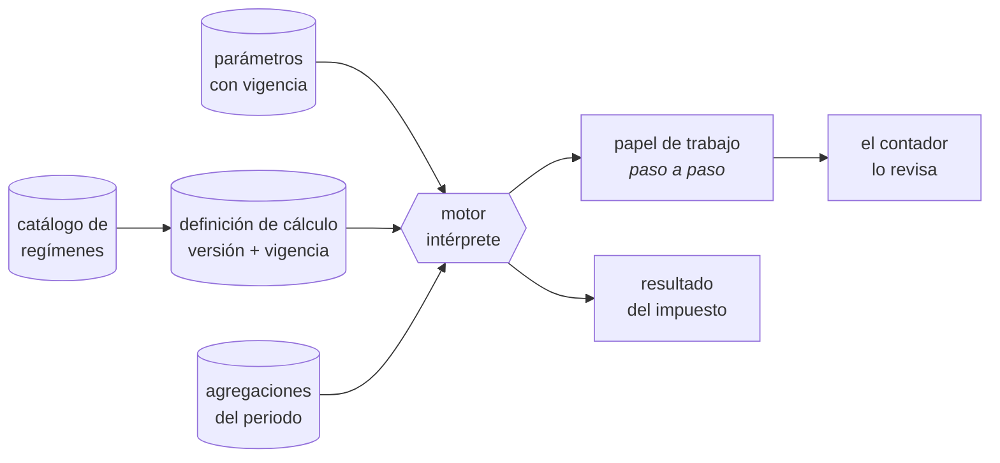

Un paso puede ser de cinco tipos, y ninguno más:

| Tipo | Qué hace | Ejemplo |
|---|---|---|
| `agregacion` | Suma un conjunto del periodo, acotado por la base del régimen | Ingresos efectivamente cobrados de enero a marzo |
| `parametro` | Resuelve un parámetro por la fecha del hecho | Coeficiente de utilidad del ejercicio anterior; tasa del régimen |
| `expresion` | Aritmética decimal exacta sobre pasos anteriores | `utilidad = ingresos − deducciones` |
| `tabla` | Aplica una tabla progresiva por rangos | Tarifa de ISR de personas físicas; tabla de tasas de RESICO |
| `condicional` | Elige entre dos pasos según una comparación | Si la utilidad es negativa, el pago es cero |

**Reglas que hacen esto seguro.** Un motor que interpreta datos es una puerta si no se acota, así que se acota:

| # | Regla |
|---|---|
| 1 | El lenguaje no tiene ciclos ni llamadas externas; toda ejecución termina (`RF-054`) |
| 2 | Una definición solo lee el alcance que declara, y siempre dentro de la empresa que ejecuta. El aislamiento por fila sigue debajo, intacto |
| 3 | Todo importe es decimal exacto con su regla de redondeo declarada. Nunca punto flotante |
| 4 | Una definición no se activa sin pasar sus casos dorados firmados por el contador (`RF-056`) |
| 5 | Las definiciones las escribe el proveedor, no el cliente (`RF-058`). El cliente configura sus datos, no la mecánica del impuesto |
| 6 | Cada ejecución guarda qué versión usó, para que recalcular el pasado reproduzca el pasado (`RF-057`) |

**Por qué vale la pena.** La ley fiscal mexicana cambia cada año: tarifas, topes, facilidades administrativas del autotransporte, tablas de RESICO. Con el cálculo en código, cada enero es un despliegue urgente con todos los clientes en juego. Con el cálculo como dato, es cargar una versión nueva que ya pasó sus casos dorados, con la anterior intacta para recalcular ejercicios previos.

---

### 7.5 Contabilidad y motor contable

| ID | Requisito | Criterio de aceptación | Prioridad | Función |
|---|---|---|---|---|
| `RF-121` | El motor contable **debe** generar la póliza correspondiente a cada evento de negocio, aplicando **reglas almacenadas como datos**, no como código | El contador modifica una regla desde la interfaz y la siguiente operación se contabiliza con la regla nueva, sin desplegar código | Obligatorio | `FIN-002` |
| `RF-122` | El sistema **debe** permitir registrar pólizas manuales de ingreso, egreso y diario, con adjuntos y justificación | Una póliza manual descuadrada se rechaza en el momento de guardarla | Obligatorio | `FIN-003` |
| `RF-123` | El libro contable **debe** ser de solo inserción: prohibido modificar o eliminar pólizas y partidas. Las correcciones se hacen con póliza de reversa (`RF-042`) o reclasificación (`RF-043`); lo que se corrige libremente vive antes del libro, en la zona de preparación (`RF-041`) | Un intento de `UPDATE` o `DELETE` falla a nivel de base de datos, no solo de aplicación. Prueba: ejecución directa en SQL. **No existe credencial, rol ni contraseña que lo permita**: la restricción no distingue quién pregunta | Obligatorio | `FIN-002` |
| `RF-124` | El sistema **debe** producir libro diario, libro mayor, auxiliares y balanza de comprobación, exportables | La balanza cuadra siempre. La exportación conserva el formato que el contador necesita | Obligatorio | `FIN-004` |
| `RF-125` | El sistema **debe** generar balance general y estado de resultados a cualquier fecha, en tiempo real | El estado de resultados de hoy incluye la operación de hoy | Obligatorio | `FIN-005` |
| `RF-126` | El sistema **debe** cerrar periodos con checklist automático y bloquear toda escritura posterior en el periodo cerrado | Se cumplen íntegramente las condiciones de bloqueo de `CU-041`. Caso dorado `CD-05` | Obligatorio | `FIN-007` |
| `RF-127` | El sistema **debe** calcular depreciación y amortización contable y fiscal, incluyendo activos por derecho de uso y su pasivo por arrendamiento conforme a la NIF D-5 | La tabla de amortización de un arrendamiento a 36 meses coincide con la del contador. Caso dorado `CD-05` | Obligatorio | `FIN-008`, `FIN-038` |
| `RF-128` | El sistema **debe** soportar operaciones en moneda extranjera con tipo de cambio por fecha y revaluación periódica (nivel Profesional) | La diferencia cambiaria se registra automáticamente al revaluar | Importante | `FIN-029` |
| `RF-129` | El sistema **debe** registrar provisiones y amortizaciones recurrentes del periodo | Una provisión configurada se genera sola en cada cierre | Importante | `FIN-031` |
| `RF-130` | El sistema **debe** presentar un checklist de cierre cuyo estado se calcula automáticamente, no se declara a mano | Cada punto del checklist enlaza a la pantalla donde se resuelve y muestra cuántos registros lo incumplen | Obligatorio | `FIN-007` |
| `RF-041` | El sistema **debe** ofrecer una **zona de preparación**: toda póliza nace en estado borrador, donde se edita y se elimina libremente, y solo al aprobarse cruza al libro contable | Un borrador no aparece en balanza, libro diario, estados financieros ni contabilidad electrónica. Editarlo no deja póliza de ajuste, porque todavía no es contabilidad. Al aprobarse se valida cuadre, cuentas afectables y periodo abierto, y se vuelve inmutable | Obligatorio | `FIN-003` |
| `RF-042` | El sistema **debe** ofrecer la operación **corregir** sobre una póliza del libro en un periodo abierto: en una sola transacción genera la póliza de reversa y la póliza correcta, ambas ligadas a la original, con motivo obligatorio | El usuario ve una sola acción; el libro registra tres pólizas encadenadas. El saldo queda como si el error no hubiera ocurrido. Sin motivo, la operación no procede | Obligatorio | `FIN-003` |
| `RF-043` | El sistema **debe** permitir **reclasificar** una partida registrada —cambiar cuenta contable, tercero o dimensión analítica (centro de costos, proyecto, activo)— generando automáticamente la póliza de ajuste que traslada el importe | La partida original no se altera. El ajuste queda ligado a ella con motivo y autor. Si el periodo está cerrado, el ajuste se registra en el periodo abierto más cercano y se marca como corrección de un ejercicio anterior | Obligatorio | `FIN-003`, `FIN-004` |
| `RF-044` | El sistema **debe** permitir corregir el **documento origen** (clasificación, cuenta sugerida, tercero, dimensión) de una operación aún no contabilizada, sin restricción alguna | Mientras el evento no haya generado póliza, el dato se edita como cualquier otro registro operativo. La limpieza de datos ocurre aquí, no en el libro | Obligatorio | `FIN-003` |
| `RF-045` | El sistema **debe** mostrar, para cualquier póliza o partida, su **cadena completa de correcciones**: original, reversas, pólizas sustitutas y reclasificaciones, con autor, momento y motivo de cada paso | Desde cualquier renglón de la balanza se llega en un clic a la historia completa. Ninguna parte de esa cadena es ocultable, ni por el Propietario | Obligatorio | `FIN-004`, `FIN-049` |

**Contrato del motor contable.** El motor es el único componente autorizado a escribir en el esquema contable. Funciona así:

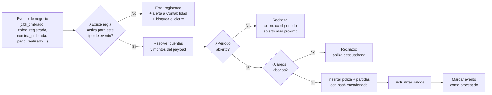

**Reglas que este diagrama impone:**

- Un evento sin regla contable **no se ignora**: se registra como error y bloquea el cierre. El silencio es lo que produce contabilidades incompletas.
- El motor nunca "ajusta" para cuadrar. Si no cuadra, rechaza.
- El hash de cada póliza incluye el hash de la anterior, formando una cadena verificable de principio a fin.

### 7.6 Fiscal — recepción, impuestos y declaraciones

| ID | Requisito | Criterio de aceptación | Prioridad | Función |
|---|---|---|---|---|
| `RF-131` | El sistema **debe** calcular el IVA mensual con criterio de flujo: trasladado efectivamente cobrado, acreditable efectivamente pagado y retenido efectivamente cobrado, con saldo a favor acumulable | El cálculo cuadra contra las cuentas de IVA de la balanza, al centavo. Caso dorado `CD-07` | Obligatorio | `FIN-012` |
| `RF-132` | El sistema **debe** calcular y controlar las retenciones de ISR e IVA, tanto efectuadas a terceros como sufridas | Las retenciones enteradas coinciden con las registradas en los comprobantes del periodo | Obligatorio | `FIN-013` |
| `RF-133` | El sistema **debe** generar la DIOT del periodo a partir de los CFDI recibidos efectivamente pagados, agrupados por RFC y tipo de operación, en el formato vigente | El archivo se acepta en el portal de la autoridad sin ajustes manuales. Caso dorado `CD-09` | Obligatorio | `FIN-014` |
| `RF-134` | El sistema **debe** calcular el pago provisional de ISR **del régimen que tenga la empresa**, ejecutando la definición de cálculo vigente para ese régimen (`RF-053`) | Cada régimen soportado tiene su definición y sus casos dorados. El del régimen general —coeficiente de utilidad, pérdidas pendientes, PTU, pagos previos y retenciones— es el caso dorado `CD-08`; los demás, `CD-11` en adelante. El cálculo coincide con el del contador | Obligatorio | `FIN-011` |
| `RF-135` | El sistema **debe** calcular la declaración anual del régimen de la empresa y, donde aplique, la base de PTU, también como definición de datos | Cuadra contra los estados financieros del ejercicio. Donde el régimen no genera PTU ni coeficiente, la definición simplemente no los incluye | Obligatorio | `FIN-015` |
| `RF-136` | El sistema **debe** mantener un calendario fiscal con todas las obligaciones aplicables, sus fechas límite, su estado y sus alertas | Ninguna obligación llega a su fecha sin haber alertado. Estado visible: pendiente, calculada, presentada, pagada | Obligatorio | `FIN-016` |
| `RF-137` | El sistema **debe** generar los archivos de contabilidad electrónica (catálogo, balanza y pólizas) conforme al formato vigente | Los XML validan contra el esquema oficial sin errores | Obligatorio | `FIN-006` |
| `RF-138` | El sistema **debe** descargar diariamente los CFDI emitidos y recibidos desde el SAT, mediante adaptador, y detectar cambios de estatus de comprobantes ya registrados | Un comprobante cancelado por el emisor se detecta en la siguiente descarga y genera alerta | Obligatorio | `FIN-009` |
| `RF-139` | El sistema **debe** permitir clasificar cada CFDI recibido (cuenta, centro de costo, orden, activo, deducible o no) y generar su póliza y su cuenta por pagar | La bandeja de pendientes por clasificar llega a cero antes de cerrar. Caso dorado `CD-04` | Obligatorio | `FIN-010` |
| `RF-140` | El sistema **debe** validar a los proveedores contra la lista del artículo 69-B y su opinión de cumplimiento, marcando como no deducibles los comprobantes afectados | Un proveedor que aparece en la lista genera alerta y marca sus comprobantes; cambiar esa marca exige justificación registrada | Obligatorio | `FIN-017` |
| `RF-141` | El sistema **debe** conciliar los CFDI del periodo contra los registros contables, en ambos sentidos | Reporta comprobantes sin registro y registros sin comprobante. Ambas listas deben estar vacías para cerrar | Obligatorio | `FIN-010` |
| `RF-051` | El sistema **debe** mantener el **catálogo de regímenes fiscales** como dato: clave del SAT, fundamento legal, tipo de persona, base de acumulación (devengado o flujo), obligaciones aplicables y vigencia | Agregar un régimen soportado es dar de alta una fila y su definición de cálculo. Ninguna parte del código menciona un régimen por nombre: verificado por análisis estático | Obligatorio | `FIN-011`, `TEC-005` |
| `RF-052` | La **base de acumulación** del régimen **debe** gobernar la regla contable que convierte un evento en póliza: en devengado, la factura acumula el ingreso; en flujo, lo acumula el cobro | La misma venta produce pólizas distintas en dos empresas de régimen distinto, con la misma regla y sin código condicional. Casos dorados `CD-11` y `CD-12` | Obligatorio | `FIN-002` |
| `RF-053` | Todo cálculo fiscal **debe** existir como **definición de datos versionada con vigencia** —una secuencia ordenada de pasos que el motor interpreta—, nunca como algoritmo en código | Cambiar la mecánica de un cálculo (no solo una tasa) es cargar una versión nueva de la definición. Prueba: alterar la definición del ISR provisional y ver el resultado cambiar sin desplegar | Obligatorio | `FIN-011` |
| `RF-054` | El lenguaje de las definiciones **debe** ser **restringido y sin efectos secundarios**: aritmética decimal exacta, comparaciones, mínimos y máximos, tablas progresivas, condicionales, y referencias a parámetros con vigencia, a agregaciones del periodo y a pasos anteriores. Sin ciclos, sin acceso a datos fuera del alcance declarado, sin llamadas externas | Una definición no puede leer datos de otra empresa, ni ejecutarse indefinidamente, ni provocar una escritura. Verificado con pruebas adversas | Obligatorio | `TEC-011` |
| `RF-055` | Toda ejecución de un cálculo **debe** producir un **papel de trabajo**: cada paso con su descripción, su fórmula, sus entradas, su resultado y su fundamento legal | El contador revisa el cálculo paso por paso sin abrir el código. Un resultado sin papel de trabajo se considera defecto | Obligatorio | `FIN-011` |
| `RF-056` | Una definición de cálculo **no debe** poder activarse sin pasar sus **casos dorados** firmados por el contador | Publicar una definición que falla un caso dorado se rechaza con el detalle de la diferencia. Prueba: intentar activar una definición con un paso alterado | Obligatorio | `FIN-011` |
| `RF-057` | El sistema **debe** registrar, en cada ejecución, la **versión de la definición y de los parámetros** utilizados, y recalcular un periodo anterior con esa misma versión | Recalcular un pago provisional de hace dos años produce exactamente el resultado que produjo entonces, aunque la definición vigente hoy sea otra | Obligatorio | `FIN-011` |
| `RF-058` | Las definiciones de cálculo **deben** ser del proveedor del sistema, **no editables por la empresa cliente** ni por ninguno de sus roles, incluido el Propietario | No existe interfaz para que un cliente altere un cálculo fiscal. Lo que el cliente configura son sus datos y sus opciones declaradas (coeficiente, facilidades aplicadas), nunca la mecánica del impuesto | Obligatorio | `TEC-001` |
| `RF-059` | El sistema **debe** permitir que una empresa **cambie de régimen con fecha de efecto**, conservando la historia | Los periodos anteriores al cambio se calculan y se reimprimen con el régimen que tenían entonces. El cambio queda en bitácora con su fecha y su autor | Importante | `FIN-011` |
| `RF-060` | El **calendario de obligaciones** de cada empresa **debe** derivarse de su régimen, su tamaño y su actividad, como datos | Una empresa de RESICO de personas físicas no ve en su calendario la contabilidad electrónica. Agregar o retirar una obligación no toca el código (`RF-136`) | Obligatorio | `FIN-012` |

### 7.7 Tesorería

| ID | Requisito | Criterio de aceptación | Prioridad | Función |
|---|---|---|---|---|
| `RF-142` | El sistema **debe** llevar cuentas por cobrar con antigüedad de saldos, y permitir aplicar un cobro a una o varias facturas, con control de excedente como anticipo | Ninguna aplicación excede el saldo insoluto de su factura. La antigüedad se calcula por vencimiento real | Obligatorio | `FIN-020` |
| `RF-143` | El sistema **debe** ejecutar cobranza automatizada: recordatorios programados, estados de cuenta, registro de gestiones y promesas de pago | Una factura vencida genera su recordatorio sin intervención. Las promesas alimentan la proyección de flujo | Importante | `FIN-021` |
| `RF-144` | El sistema **debe** administrar límite y días de crédito por cliente, bloqueando pedidos que lo excedan hasta su autorización | Un pedido que excede el límite no avanza sin aprobación de Dirección, registrada | Importante | `FIN-022` |
| `RF-145` | El sistema **debe** proyectar el flujo de efectivo a 13 semanas, combinando saldo actual, CxC por vencimiento y promesas, CxP programadas, nómina comprometida e impuestos estimados | La proyección se recalcula al cambiar cualquier insumo. Se señalan las semanas con déficit | Importante | `FIN-026` |
| `RF-146` | El sistema **debe** administrar cuentas bancarias y cajas con saldo en tiempo real | El saldo del sistema coincide con el conciliado del banco | Obligatorio | `FIN-018` |
| `RF-147` | El sistema **debe** importar estados de cuenta bancarios y conciliar automáticamente por referencia, importe y fecha, dejando los no conciliados en una bandeja | Una importación repetida del mismo archivo no duplica movimientos. Meta: ≥ 80% conciliado automáticamente | Obligatorio | `FIN-019` |
| `RF-148` | El sistema **debe** administrar caja chica, anticipos y comprobación de gastos de empleados, con su registro contra la cuenta del deudor | Un gasto comprobado descuenta del anticipo; el remanente se reembolsa o se descuenta, con registro | Importante | `FIN-025` |
| `RF-149` | El sistema **debe** llevar cuentas por pagar con calendario de vencimientos y estado | La CxP refleja el saldo real considerando pagos parciales y notas de crédito | Obligatorio | `FIN-023` |
| `RF-150` | El sistema **debe** permitir programar pagos por vencimiento, prioridad y disponibilidad de flujo | La propuesta de pago semanal se genera con un clic y es editable antes de autorizar | Importante | `FIN-024` |
| `RF-151` | El sistema **debe** generar layouts de dispersión bancaria por banco | El archivo se carga en el portal del banco sin edición manual | Importante | `FIN-034` |
| `RF-152` | El sistema **debe** exigir autorización para pagos que excedan el umbral configurado, otorgada por un **usuario distinto** de quien los capturó y con rol autorizado | Un pago sobre umbral sin aprobación no se ejecuta. Quien captura no puede aprobar su propio pago aunque acumule el rol que aprueba: el control es sobre la persona, no sobre el rol. Verificado con prueba | Obligatorio | `FIN-024` |

### 7.8 Control de gestión

| ID | Requisito | Criterio de aceptación | Prioridad | Función |
|---|---|---|---|---|
| `RF-153` | Presupuesto anual por cuenta y centro de costo, con comparativo contra lo real | La variación se calcula automáticamente contra la balanza | Importante | `FIN-041`, `FIN-042` |
| `RF-154` | Centros de costo aplicables a ingresos, costos y gastos | Un estado de resultados por centro de costo cuadra con el consolidado | Importante | `FIN-028` |
| `RF-155` | Costeo y rentabilidad por línea, cliente, sucursal y orden de trabajo | El margen de una orden incluye consumos, costo de personal asignado y depreciación prorrateada. Caso dorado `CD-10` | Importante | `FIN-043`, `FIN-044` |
| `RF-156` | Indicadores financieros calculados (liquidez, endeudamiento, rotación, márgenes, DSO, DPO) | Cada indicador muestra su fórmula y sus insumos, sin cifras capturadas a mano | Importante | `FIN-045` |
| `RF-157` | Proyecciones y escenarios financieros | Un escenario se guarda, se compara y no altera los datos reales | Deseable | `FIN-046` |
| `RF-158` | Evaluación de inversiones (valor presente neto, tasa interna de retorno) | Los resultados coinciden con el cálculo financiero estándar, verificado con casos conocidos | Deseable | `FIN-047` |
| `RF-159` | Matriz de autorizaciones y controles internos con segregación de funciones | El sistema reporta cualquier combinación de permisos que rompa la segregación | Importante | `FIN-048`, `FIN-049` |

### 7.9 Personas y nómina

| ID | Requisito | Criterio de aceptación | Prioridad | Función |
|---|---|---|---|---|
| `RF-160` | Expediente digital del empleado con documentos, vigencias y datos personales protegidos | Un documento obligatorio faltante o vencido genera alerta a Personas | Obligatorio | `PER-001` |
| `RF-161` | Puestos, organigrama y contratos laborales con plantillas | El organigrama se deriva de los puestos, no se dibuja a mano | Obligatorio | `PER-002`, `PER-003` |
| `RF-162` | Registro y aprobación de incidencias (faltas, incapacidades, horas extra, permisos, percepciones variables) y control de asistencia con geolocalización | Una incidencia capturada por el empleado y aprobada por su jefe entra al cálculo sin recaptura | Obligatorio | `PER-009`, `PER-010` |
| `RF-163` | Solicitud, aprobación y control de vacaciones y permisos, con saldo por antigüedad conforme a la ley vigente | El saldo de vacaciones se calcula automáticamente y no permite exceder lo disponible sin autorización | Obligatorio | `PER-011` |
| `RF-164` | Motor de nómina: percepciones gravadas y exentas, ISR del periodo, subsidio para el empleo, SDI, cuotas IMSS obrero y patronal, INFONAVIT, FONACOT, otros descuentos y neto | El cálculo de un periodo pasado, repetido hoy, produce el mismo resultado. Caso dorado `CD-06` | Obligatorio | `PER-005`, `PER-006` |
| `RF-165` | Timbrado del complemento de nómina 1.2 por lote, con reintento individual | Un fallo individual no detiene el lote ni re-timbra los exitosos | Obligatorio | `PER-007` |
| `RF-166` | Confidencialidad salarial: los importes individuales solo son visibles para Personas y Propietario; Dirección accede únicamente a cifras agregadas | Una consulta de Dirección nunca devuelve un salario individual. Verificado por prueba de RLS | Obligatorio | `PER-005` |
| `RF-167` | Dispersión de nómina con generación de layout bancario y conciliación posterior | El layout se genera desde los recibos autorizados, sin captura | Obligatorio | `PER-008` |
| `RF-168` | Cálculo de aguinaldo, prima vacacional y reparto de PTU | Los resultados coinciden con el cálculo legal verificado por el contador | Obligatorio | `PER-012`, `PER-014` |
| `RF-169` | Cálculo de finiquitos y liquidaciones, distinguiendo ambos supuestos | El sistema explica cada concepto del cálculo y su fundamento | Obligatorio | `PER-013` |
| `RF-170` | Generación de movimientos afiliatorios al IMSS (altas, bajas, modificaciones de salario) | El archivo se acepta en el portal del IMSS sin ajustes | Obligatorio | `PER-004` |
| `RF-171` | Determinación de cuotas y generación del archivo para el sistema de autodeterminación | Las cifras coinciden con la determinación oficial del periodo | Obligatorio | `PER-015` |
| `RF-172` | Control de créditos INFONAVIT y FONACOT, con su descuento en nómina y su entero | Un crédito activo se descuenta automáticamente en cada periodo | Obligatorio | `PER-015` |
| `RF-173` | Registro de la prima de riesgo de trabajo de la empresa y su aplicación en el cálculo de cuotas | Un cambio de prima aplica desde su fecha de vigencia | Obligatorio | `PER-025` |
| `RF-174` | Acumulados anuales por empleado y generación de constancias | Los acumulados cuadran con la suma de los recibos timbrados del ejercicio | Obligatorio | `PER-017` |
| `RF-175` | Cálculo del impuesto sobre nómina estatal, con tasa por estado de la sucursal | Una empresa con sucursales en dos estados calcula cada una con su tasa | Obligatorio | `PER-016` |
| `RF-176` | Aplicación, seguimiento y evidencia de la NOM-035 | Las encuestas, sus resultados y las acciones derivadas quedan registradas y son exportables como evidencia | Obligatorio | `PER-019` |
| `RF-177` | Registro de accidentes y riesgos de trabajo, con su seguimiento e indicadores | Un accidente registrado alimenta el indicador de siniestralidad | Obligatorio | `PER-022` |
| `RF-178` | Control de equipo de protección personal, comisión de seguridad e higiene y protección civil | Las entregas de equipo quedan con acuse; los recorridos de la comisión quedan documentados | Obligatorio | `PER-021`, `PER-023`, `PER-024` |
| `RF-179` | Registro de capacitación obligatoria y generación de constancias DC-3 | El plan anual de capacitación y su cumplimiento son exportables | Obligatorio | `PER-018` |

### 7.10 Operaciones — ejecución del trabajo

| ID | Requisito | Criterio de aceptación | Prioridad | Función |
|---|---|---|---|---|
| `RF-180` | Crear órdenes de trabajo desde un pedido o manualmente, usando plantillas por tipo de trabajo | La orden creada desde un pedido conserva su vínculo y sus partidas | Obligatorio | `OPE-001`, `OPE-002` |
| `RF-181` | Planear y agendar recursos (personas, activos) en un calendario con detección de conflictos | Asignar un recurso ya ocupado se bloquea o exige confirmación explícita | Obligatorio | `OPE-003` |
| `RF-182` | Asignar personas y activos a una orden | La asignación es visible para quien ejecuta desde su dispositivo | Obligatorio | `OPE-004` |
| `RF-183` | Seguimiento en tiempo real del estado de las órdenes, en lista y en tablero | El estado refleja lo que campo reporta, sin intermediarios | Obligatorio | `OPE-005`, `OPE-011` |
| `RF-184` | Registrar consumos por orden (materiales, horas, gastos) con su costo | El costo de la orden es la suma de sus consumos valuados, sin estimaciones | Obligatorio | `OPE-008` |
| `RF-185` | Capturar evidencias con foto, firma, ubicación y marca de tiempo desde la PWA, con funcionamiento sin conexión | Una evidencia capturada sin red llega íntegra al sincronizar, con su marca de tiempo original | Obligatorio | `OPE-007` |
| `RF-186` | Validar, al asignar, que el activo no tenga mantenimiento crítico vencido y que el empleado no tenga documento obligatorio vencido | La asignación se bloquea y explica cuál vigencia falla | Obligatorio | `OPE-042`, `PER-001` |
| `RF-187` | Registrar incidencias operativas con severidad, descripción, evidencia, ubicación y seguimiento hasta su resolución | Una incidencia de severidad alta genera alerta inmediata | Obligatorio | `OPE-009` |
| `RF-188` | Cerrar la orden y habilitar su facturación, calculando el costo real y el margen contra lo cotizado | Al cerrar, el margen está disponible sin cálculo manual | Obligatorio | `OPE-010` |
| `RF-189` | Ejecutar checklists y procedimientos configurables por tipo de trabajo | Un checklist incompleto impide cerrar la orden si así se configuró | Obligatorio | `OPE-006` |

### 7.11 Abastecimiento, inventario y activos

| ID | Requisito | Criterio de aceptación | Prioridad | Función |
|---|---|---|---|---|
| `RF-190` | Administrar proveedores con documentos, condiciones y opinión de cumplimiento | Un proveedor con documentación vencida genera alerta antes de pagarle | Obligatorio | `OPE-012` |
| `RF-191` | Requisiciones internas con flujo de aprobación | Una requisición aprobada puede convertirse en orden de compra sin recaptura | Importante | `OPE-013` |
| `RF-192` | Solicitud de cotizaciones a varios proveedores y comparativo | El comparativo muestra precio, tiempo de entrega y condiciones lado a lado | Importante | `OPE-014` |
| `RF-193` | Órdenes de compra con seguimiento de su estado | El proveedor y la fecha comprometida quedan registrados | Importante | `OPE-015` |
| `RF-194` | Recepción de bienes y servicios, total o parcial | Una recepción parcial deja la orden de compra abierta por el saldo | Importante | `OPE-016` |
| `RF-195` | Conciliación de tres vías: orden de compra, recepción y factura | Las diferencias de cantidad o precio se señalan y bloquean el pago hasta resolverse | Importante | `OPE-017` |
| `RF-196` | Historial de precios por proveedor y devoluciones a proveedor | Una compra fuera del rango histórico de precio genera alerta | Importante | `OPE-018`, `OPE-019` |
| `RF-197` | Inventario básico condicional (existencias en un almacén, entradas y salidas, costo promedio, punto de reorden), activable por empresa | Con el inventario desactivado, ninguna pantalla ni cálculo lo requiere | Importante | `OPE-020` a `OPE-023` |
| `RF-198` | Registro de activos con identificación, ubicación, responsable, propiedad (propio o arrendado) y lectura de uso | Un activo arrendado se vincula a su contrato y genera su derecho de uso conforme a `RF-127` | Importante | `OPE-040` |
| `RF-199` | Mantenimiento preventivo por fecha o por lectura de uso, mantenimiento correctivo, historial y costo por activo, garantías, seguros y talleres | Un mantenimiento vencido genera alerta y, si es crítico, bloquea la asignación del activo | Importante | `OPE-042` a `OPE-047` |

### 7.12 Legal y Riesgo

| ID | Requisito | Criterio de aceptación | Prioridad | Función |
|---|---|---|---|---|
| `RF-200` | Repositorio de contratos con plantillas, versiones, partes, vigencias y alertas de renovación | Un contrato próximo a vencer alerta con la anticipación configurada | Obligatorio | `LEG-001` |
| `RF-201` | Firma electrónica de documentos con constancia de conservación conforme a la NOM-151, mediante proveedor autorizado | La constancia queda asociada al documento y es verificable | Importante | `LEG-003` |
| `RF-202` | Solicitudes de contrato desde otras áreas, con flujo de revisión | Una solicitud comercial llega a Legal con su contexto, sin correos | Importante | `LEG-002` |
| `RF-203` | Documentos corporativos y libros sociales (acta constitutiva, estatutos, asambleas) | Los documentos se conservan con versión y hash, sin posibilidad de borrado | Obligatorio | `LEG-004` |
| `RF-204` | Poderes y facultades vigentes, con alcance y vencimiento | Un poder vencido se señala antes de usarse en una operación | Obligatorio | `LEG-005` |
| `RF-205` | Registro del beneficiario controlador conforme al CFF | La información exigida está completa y es exportable ante requerimiento | Obligatorio | `LEG-006` |
| `RF-206` | Registro de marcas y propiedad intelectual con sus vigencias | Una renovación próxima alerta con meses de anticipación | Importante | `LEG-007` |
| `RF-207` | Permisos y licencias con vigencias, responsable y evidencia documental | Ningún permiso vence sin alerta previa. Un permiso vencido bloquea la operación que lo requiere | Obligatorio | `LEG-008` |
| `RF-208` | Registro de riesgos, mapa de calor, planes de mitigación, pólizas de seguro y siniestros | Un siniestro registra su reclamación y su seguimiento hasta el cobro | Importante | `LEG-020` a `LEG-024` |
| `RF-209` | Cumplimiento: matriz de obligaciones regulatorias, políticas con acuse, línea de denuncia, datos personales y antilavado | Cada obligación tiene responsable, periodicidad, estado y evidencia | Importante | `LEG-013` a `LEG-019` |

### 7.13 Dirección

| ID | Requisito | Criterio de aceptación | Prioridad | Función |
|---|---|---|---|---|
| `RF-210` | Tablero ejecutivo con indicadores de todas las áreas, calculados desde vistas analíticas | Ningún número del tablero se captura a mano. Cada uno permite navegar hasta los documentos que lo componen | Obligatorio | `DIR-001` |
| `RF-211` | Alertas críticas de negocio (flujo insuficiente, cartera vencida, incumplimientos, vencimientos, desviaciones de margen) | Una alerta crítica llega a su destinatario y su atención queda registrada | Obligatorio | `DIR-002` |
| `RF-212` | Bandeja de aprobaciones centralizadas para Dirección | Toda solicitud pendiente se ve en un lugar, con su antigüedad | Obligatorio | `DIR-003` |
| `RF-213` | Objetivos del negocio con avance calculado desde datos reales | El avance nunca se captura manualmente | Obligatorio | `DIR-004` |
| `RF-214` | Juntas, minutas y acuerdos con responsable y fecha compromiso, y su seguimiento | Un acuerdo vencido sin cerrar aparece en el tablero | Importante | `DIR-005` |
| `RF-215` | Reporte ejecutivo automático periódico, enviado por correo | El reporte se genera y envía sin intervención, con los datos del periodo | Importante | `DIR-006` |
| `RF-216` | Consulta del negocio en lenguaje natural, respetando permisos del usuario que pregunta | Una pregunta cuya respuesta excede los permisos del usuario se rechaza explicando el límite, sin filtrar el dato | Deseable | `DIR-007` |
| `RF-217` | Planeación estratégica, OKRs en cascada e iniciativas (nivel Profesional) | Un OKR se vincula a los indicadores que lo miden | Importante | `DIR-008` a `DIR-010` |
| `RF-218` | Portafolio de proyectos con semáforos y priorización (nivel Profesional) | El estado del proyecto se deriva de sus tareas, no se declara | Importante | `DIR-013` a `DIR-016` |
| `RF-219` | Gobierno corporativo: consejo, comités, asambleas y seguimiento de acuerdos (nivel Profesional) | Las convocatorias y actas quedan archivadas con su evidencia | Importante | `DIR-017` a `DIR-020` |

### 7.14 Tecnología y Datos

| ID | Requisito | Criterio de aceptación | Prioridad | Función |
|---|---|---|---|---|
| `RF-220` | Inventario de equipos y licencias, con responsable y vencimientos | Un equipo sin responsable asignado aparece en el reporte de control | Importante | `TEC-002` |
| `RF-221` | Mesa de ayuda interna de TI con tickets y base de conocimiento | Un ticket sin atender en su SLA escala | Importante | `TEC-003` |
| `RF-222` | Constructor de reportes y tableros personalizados, sujeto a los permisos del usuario | Un reporte creado por un usuario nunca muestra datos que ese usuario no puede ver | Importante | `TEC-018`, `TEC-019` |
| `RF-223` | Conexión de herramientas externas de inteligencia de negocio mediante credenciales de solo lectura y alcance limitado | La credencial se revoca sin afectar a los usuarios | Importante | `TEC-020` |
| `RF-224` | Control de calidad de datos: duplicados, campos vacíos obligatorios, inconsistencias | El reporte de calidad se ejecuta periódicamente y propone la corrección | Importante | `TEC-021` |
| `RF-225` | Políticas de acceso y sesión, recertificación periódica de accesos y alertas de actividad sospechosa | La recertificación produce una lista firmada por el responsable de cada área | Importante | `TEC-011` a `TEC-013` |
| `RF-226` | Registro de incidentes de seguridad con su clasificación y seguimiento | Un incidente queda documentado desde su detección hasta su cierre | Importante | `TEC-015` |
| `RF-227` | Automatizaciones sin código sobre eventos del sistema | Una automatización se crea, se prueba y se desactiva sin desplegar | Importante | `TEC-009` |
| `RF-228` | Control de cambios de configuración con registro de quién cambió qué y cuándo | Un cambio de configuración se puede revertir desde su historial | Importante | `TEC-010` |
| `RF-229` | API pública documentada, con llaves por empresa, alcance limitado y control de consumo | Una llave comprometida se revoca sin afectar a otras. Su consumo es visible y limitable | Importante | `TEC-006` |

### 7.15 Agentes de IA

| ID | Requisito | Criterio de aceptación | Prioridad |
|---|---|---|---|
| `RF-230` | Todo agente de IA **debe** ejecutarse con los permisos del usuario que lo invoca, sin ampliarlos en ningún caso | Un agente invocado por un usuario de Comercial no puede leer nóminas. Verificado por prueba explícita | Obligatorio |
| `RF-231` | Toda acción de un agente que modifique datos **debe** requerir confirmación humana explícita antes de ejecutarse | Ningún agente escribe sin aprobación. Las acciones de solo lectura no la requieren | Obligatorio |
| `RF-232` | Toda intervención de un agente **debe** quedar en bitácora, identificando al agente, al usuario invocador y la acción | La bitácora distingue una acción humana de una asistida | Obligatorio |
| `RF-233` | Los agentes **deben** citar los registros en los que basan su respuesta, con enlace navegable | Una afirmación sin respaldo verificable se considera defecto del agente | Importante |
| `RF-234` | El sistema **debe** medir y limitar el consumo de los agentes por empresa y por periodo | El consumo es visible y se puede acotar sin desactivar el sistema | Importante |
| `RF-235` | Un agente **debe** declarar explícitamente cuando no puede responder por falta de datos o de permisos, en lugar de estimar | Ante datos insuficientes, el agente lo dice; no completa con supuestos | Obligatorio |

### 7.16 Espacio del Colaborador

| ID | Requisito | Criterio de aceptación | Prioridad | Función |
|---|---|---|---|---|
| `RF-236` | Todo empleado **debe** poder consultar y descargar sus recibos de nómina timbrados y sus constancias | El empleado accede sin pedirlo a nadie. Solo ve lo propio | Obligatorio | `PER-001` |
| `RF-237` | Todo empleado **debe** poder solicitar vacaciones y permisos y ver el estado de su solicitud y su saldo | La solicitud llega a su jefe y su resolución le notifica | Obligatorio | `PER-011` |
| `RF-238` | Todo empleado **debe** poder registrar y comprobar sus gastos y ver su reembolso | El gasto comprobado sigue el flujo de `RF-148` | Importante | `FIN-025` |
| `RF-239` | Todo empleado **debe** poder consultar su expediente de capacitación y sus constancias | El empleado descarga su DC-3 sin intervención de Personas | Importante | `PER-018` |

---

## 8. Requisitos no funcionales

Cada requisito no funcional lleva un número. Las palabras "rápido", "seguro" o "escalable" no aparecen sin su traducción medible, porque no se pueden verificar.

### 8.1 Rendimiento

Los umbrales se miden en el percentil 95 de las peticiones, con la base de datos cargada al volumen de `RNF-030`, desde una conexión de 10 Mbps.

| ID | Requisito | Umbral | Cómo se mide |
|---|---|---|---|
| `RNF-010` | Tiempo de carga de una pantalla de captura | ≤ 1.5 s | Métrica de la primera interacción posible |
| `RNF-011` | Tiempo de respuesta de una búsqueda o listado con filtros | ≤ 1.0 s | Registro del servidor, p95 |
| `RNF-012` | Tiempo de guardado de un documento de negocio (cotización, pedido, póliza manual) | ≤ 800 ms sin contar el tiempo del PAC | Registro del servidor, p95 |
| `RNF-013` | Tiempo total de emisión de un CFDI, incluyendo al PAC | ≤ 8 s; si se excede, la interfaz libera al usuario y notifica al terminar | Prueba con PAC de pruebas |
| `RNF-014` | Tiempo de generación de la balanza de comprobación de un mes | ≤ 3 s con 50 000 partidas | Prueba de carga |
| `RNF-015` | Tiempo de cálculo de la nómina de 100 empleados | ≤ 60 s | Prueba de carga |
| `RNF-016` | Tiempo de timbrado de un lote de 100 recibos de nómina | ≤ 10 min, con progreso visible y reintento individual | Prueba con PAC de pruebas |
| `RNF-017` | Latencia entre un evento de negocio y su póliza | ≤ 60 s en operación normal | Diferencia entre marcas de tiempo |
| `RNF-018` | Tiempo de carga del tablero ejecutivo | ≤ 2 s, con datos de antigüedad ≤ 5 min | Métrica de la pantalla |
| `RNF-019` | Tiempo de sincronización de la PWA al recuperar conexión, con 50 registros en cola | ≤ 30 s | Prueba con modo avión |

### 8.2 Capacidad y escalabilidad

| ID | Requisito | Umbral de la primera etapa | Umbral de diseño |
|---|---|---|---|
| `RNF-030` | Volumen soportado sin degradación por empresa | 100 usuarios · 500 CFDI emitidos y 800 recibidos al mes · 100 empleados en nómina · 50 000 partidas contables al mes | 10× lo anterior sin cambio de arquitectura |
| `RNF-031` | Número de empresas en una instancia | 10 | 1 000, con el particionado de §13.3 |
| `RNF-032` | Usuarios concurrentes | 50 | 500 |
| `RNF-033` | Tamaño máximo de un archivo adjunto | 25 MB | Configurable por empresa |
| `RNF-034` | Retención en línea de datos operativos | 5 ejercicios completos | Archivado en frío de lo anterior, sin perder acceso |
| `RNF-035` | El crecimiento de una empresa no **debe** degradar a las demás | Ninguna consulta de una empresa puede consumir recursos ilimitados; existen límites por empresa | Prueba de carga con una empresa dominante |

### 8.3 Disponibilidad y continuidad

| ID | Requisito | Umbral |
|---|---|---|
| `RNF-040` | Disponibilidad mensual del servicio en horario hábil (lunes a viernes, 7:00–21:00, hora del centro de México) | ≥ 99.5% |
| `RNF-041` | Objetivo de punto de recuperación (pérdida máxima de datos aceptable) | 24 horas |
| `RNF-042` | Objetivo de tiempo de recuperación | 8 horas |
| `RNF-043` | Respaldo automático de la base de datos y de los archivos | Diario, con retención mínima de 30 días |
| `RNF-044` | Prueba de restauración documentada | Trimestral. Un respaldo no restaurado no cuenta como respaldo |
| `RNF-045` | Operación de campo sin conexión | La PWA opera sin red para consultar sus órdenes, capturar evidencias, consumos e incidencias |
| `RNF-046` | Degradación elegante ante caída de un proveedor externo | La caída del PAC, del SAT, del banco o del correo **no** impide operar el resto del sistema. Cada una tiene su comportamiento definido en §11.7 |
| `RNF-047` | Integridad de la sincronización | Cero pérdidas y cero duplicados tras sincronizar, verificado con prueba de reconexión repetida |

### 8.4 Seguridad

| ID | Requisito | Verificación |
|---|---|---|
| `RNF-050` | Todo el tráfico **debe** viajar cifrado en tránsito | Prueba de configuración; sin puertos sin cifrar |
| `RNF-051` | Todos los datos **deben** estar cifrados en reposo | Configuración del proveedor verificada |
| `RNF-052` | Las credenciales de integración y los certificados **deben** vivir en bóveda cifrada, nunca en tablas ni en variables del código | Auditoría de código y de esquema |
| `RNF-053` | Las contraseñas **deben** almacenarse con función de derivación de clave resistente a fuerza bruta | Revisión de la configuración de autenticación |
| `RNF-054` | El acceso a datos **debe** filtrarse en la base de datos mediante seguridad a nivel de fila, no solo en la aplicación | Prueba: consulta directa con credencial de otro usuario devuelve cero filas |
| `RNF-055` | Toda acción de servidor **debe** verificar permiso antes de ejecutarse | Prueba automatizada por acción; ocultar en la interfaz no es control |
| `RNF-056` | La sesión **debe** expirar por inactividad y poder revocarse centralmente | Prueba de expiración y revocación |
| `RNF-057` | El sistema **debe** impedir que quien captura una operación sea quien la aprueba | Prueba por cada flujo de aprobación |
| `RNF-058` | Un agente de IA **no debe** poder acceder a nada fuera de los permisos de su invocador | Prueba explícita por rol |
| `RNF-059` | El sistema **debe** registrar intentos fallidos de acceso y actividad anómala, y alertar | Simulación de intentos fallidos genera alerta |

### 8.5 Privacidad y protección de datos personales

| ID | Requisito |
|---|---|
| `RNF-060` | El sistema **debe** mantener un inventario de los datos personales que almacena, su finalidad y su tiempo de conservación |
| `RNF-061` | El sistema **debe** permitir atender solicitudes de acceso, rectificación, cancelación y oposición sobre los datos de una persona |
| `RNF-062` | Los datos de salud de empleados (incapacidades, exámenes médicos) **deben** almacenarse separados del expediente general, con acceso restringido al rol Personas |
| `RNF-063` | Los importes salariales individuales **deben** ser inaccesibles para todo rol distinto de Personas y Propietario, incluida Dirección, que accede solo a agregados |
| `RNF-064` | Los datos **deben** residir en una región geográfica declarada, y esa región **debe** informarse al cliente |
| `RNF-065` | Los registros técnicos **no deben** contener datos personales ni financieros: ni CLABE, ni salarios, ni contenido de XML con RFC completo |
| `RNF-066` | Los entornos de desarrollo y pruebas **no deben** contener datos reales de ningún cliente |

### 8.6 Auditoría e integridad

| ID | Requisito | Verificación |
|---|---|---|
| `RNF-070` | Los documentos contables y fiscales **deben** conservarse íntegros al menos 5 años y **no deben** poder eliminarse | Intento de borrado rechazado; prueba de recuperación de un documento de hace 5 años |
| `RNF-071` | El libro contable **debe** encadenarse con hash verificable de principio a fin | Verificación de la cadena completa en cada cierre; cualquier ruptura genera alerta crítica |
| `RNF-072` | La bitácora **debe** ser inmutable y conservar al menos 5 años | Intento de modificación rechazado a nivel de base de datos |
| `RNF-073` | Todo archivo almacenado **debe** guardar su hash de contenido | Verificación de integridad bajo demanda |
| `RNF-074` | El sistema **debe** poder producir un paquete de evidencia de un periodo (pólizas, comprobantes, bitácora, estados financieros) | Generado en menos de 1 hora ante un requerimiento |
| `RNF-075` | El cliente **debe** poder exportar íntegramente sus datos en formato abierto, en cualquier momento | Exportación completa que incluye datos y archivos, sin intervención del proveedor |

### 8.7 Usabilidad y accesibilidad

| ID | Requisito | Verificación |
|---|---|---|
| `RNF-080` | Toda la interfaz **debe** estar en español de México, con terminología del dominio contable y fiscal mexicano | Revisión por el contador |
| `RNF-081` | Un usuario nuevo con rol Comercial **debe** poder emitir su primera cotización sin capacitación previa, siguiendo solo la interfaz | Prueba con un usuario real que no conoce el sistema |
| `RNF-082` | Todo error **debe** indicar qué campo falló, por qué y qué hacer | Ningún mensaje del tipo "ocurrió un error" sin detalle. Revisión de todos los mensajes |
| `RNF-083` | Toda acción destructiva o irreversible **debe** pedir confirmación explícita que nombre lo que se va a hacer | Revisión de cada acción destructiva |
| `RNF-084` | La interfaz de campo (PWA) **debe** permitir completar el registro de una orden en **8 toques o menos** en el caso típico | Conteo en prueba con usuario real |
| `RNF-085` | Los importes **deben** mostrarse con separador de miles y dos decimales; las fechas en formato local; las horas en la zona horaria de la empresa | Revisión de pantallas |
| `RNF-086` | El sistema **debe** cumplir el nivel AA de las pautas de accesibilidad para contenido web en contraste, navegación por teclado y etiquetado de formularios | Auditoría de accesibilidad |
| `RNF-087` | La interfaz **debe** ser utilizable desde 360 px de ancho | Prueba en dispositivo real |
| `RNF-088` | Toda decisión visual —color, tipografía, espaciado, radios, sombras, transiciones— **debe** vivir en un único archivo de tokens con nombres por significado, y ningún componente **debe** incrustar un valor visual | Análisis estático: ningún valor de color ni familia tipográfica fuera del archivo de tokens. Falla la compilación. Integrar una identidad de marca consiste en sustituir valores de ese archivo, sin tocar componentes |
| `RNF-089` | Toda pantalla **debe** resolver sus cuatro estados: cargando, vacío, error y con datos. El estado vacío **debe** explicar qué es la pantalla y ofrecer la acción para empezar | Revisión de diseño por pantalla. Una pantalla sin estado vacío diseñado no se considera terminada (§12.1.2) |

### 8.8 Mantenibilidad y evolución

| ID | Requisito | Verificación |
|---|---|---|
| `RNF-090` | El núcleo **debe** funcionar completo sin ningún satélite ni paquete activo | Prueba de instalación limpia con todo desactivado |
| `RNF-091` | Un satélite **debe** poder construirse sin modificar ninguna tabla del núcleo | Revisión del diff de migraciones al construir el primero. Meta: cero tablas del núcleo alteradas |
| `RNF-092` | Un satélite o paquete **debe** comunicarse exclusivamente por contratos públicos y eventos | Verificación automática de fronteras |
| `RNF-093` | Activar o desactivar un módulo, paquete o satélite **debe** ser una operación de configuración, no un despliegue | Prueba de activación en caliente |
| `RNF-094` | Las fronteras entre módulos **deben** verificarse automáticamente en integración continua | La compilación falla si un módulo importa internals de otro |
| `RNF-095` | La cobertura de pruebas de los motores fiscal, contable y de nómina **debe** ser del 100% de sus reglas | Reporte de cobertura por regla, no por línea |
| `RNF-096` | Todo cambio de regla fiscal, contable o laboral **debe** poder aplicarse cargando parámetros o reglas, sin desplegar código | Prueba: cambio de tasa aplicado sin despliegue |
| `RNF-097` | Toda decisión de arquitectura costosa de revertir **debe** estar registrada en un ADR | Revisión del directorio de decisiones |
| `RNF-098` | El código **debe** nombrar el dominio en español y mantener la correspondencia uno a uno entre área del catálogo, módulo de código y esquema de base de datos | Revisión estructural en cada revisión de código |

### 8.9 Observabilidad y operación

| ID | Requisito |
|---|---|
| `RNF-100` | El sistema **debe** exponer métricas de: eventos en cola, eventos fallidos, timbrados rechazados, tareas programadas no ejecutadas, tiempo de respuesta por pantalla y errores por módulo |
| `RNF-101` | Todo error de un proveedor externo **debe** registrarse con su código y su mensaje original, no como un fallo genérico |
| `RNF-102` | Toda tarea programada **debe** ser idempotente y registrar su ejecución, su duración y su resultado |
| `RNF-103` | El sistema **debe** alertar cuando una tarea programada no se ejecute en su ventana esperada |
| `RNF-104` | Las migraciones de base de datos **deben** ser acumulativas y hacia adelante; una migración aplicada en producción no se edita |
| `RNF-105` | Toda migración que cree una tabla de negocio **debe** crear su política de aislamiento en la misma migración |

### 8.10 Cumplimiento legal

| ID | Requisito |
|---|---|
| `RNF-110` | El sistema **debe** emitir comprobantes conforme a la versión vigente del estándar del SAT, y **debe** poder adoptar una versión nueva mediante configuración y adaptador, sin rediseño |
| `RNF-111` | El sistema **debe** conservar los XML originales tal como fueron timbrados, sin transformarlos |
| `RNF-112` | El sistema **debe** poder demostrar, ante un requerimiento, la integridad y la inalterabilidad de su contabilidad |
| `RNF-113` | El sistema **debe** soportar las obligaciones de conservación, entrega y formato exigidas por la autoridad fiscal mexicana |
| `RNF-114` | Cuando una norma cambie, el sistema **debe** seguir reproduciendo el cálculo de los periodos anteriores con las reglas que estaban vigentes entonces |

---

## 9. Modelo de datos lógico

Esta sección describe **qué información existe y cómo se relaciona**, a nivel lógico. El modelo físico detallado, tabla por tabla y columna por columna, está en `docs/04-modelo-de-datos.md`.

### 9.1 Organización por esquema

Cada módulo posee un esquema y **solo escribe en el suyo**. Las lecturas entre esquemas se hacen por vistas o por contratos; las escrituras cruzadas están prohibidas por `RE-02`.

| Esquema | Contenido principal | Quién escribe |
|---|---|---|
| `plataforma` | Empresas, sucursales, usuarios, roles, permisos, terceros, productos y servicios, catálogos SAT, parámetros fiscales, folios, configuración, eventos, bitácora, archivos, secretos, integraciones, aprobaciones, alertas | Módulo de plataforma |
| `comercial` | Prospectos, oportunidades, actividades, cotizaciones, pedidos, campañas, tickets | Módulo comercial |
| `operaciones` | Órdenes de trabajo, plantillas, asignaciones, checklists, evidencias, consumos, incidencias, proveedores, compras, recepciones, inventario, activos, mantenimientos | Módulo de operaciones |
| `finanzas` | Cuentas bancarias, movimientos, CFDI emitidos y recibidos, cuentas por cobrar y pagar, cobros, pagos, gastos, arrendamientos, declaraciones | Módulo de finanzas |
| `contabilidad` | Cuentas, periodos, reglas contables, pólizas, partidas, saldos | **Solo el motor contable** |
| `personas` | Empleados, puestos, contratos, condiciones salariales, incidencias, periodos de nómina, recibos, movimientos de seguridad social, seguridad y salud | Módulo de personas |
| `legal` | Contratos, documentos corporativos, poderes, permisos, marcas, riesgos, pólizas de seguro, siniestros, obligaciones | Módulo legal |
| `direccion` | Objetivos, juntas, acuerdos, iniciativas, proyectos | Módulo de dirección |
| `analitica` | Vistas de solo lectura que agregan datos de todos los esquemas | Nadie escribe: son vistas |

### 9.2 Reglas de integridad obligatorias

| # | Regla | Implementación |
|---|---|---|
| 1 | Toda tabla de negocio tiene `empresa_id` no nulo y política de aislamiento | Restricción + política en la misma migración |
| 2 | Toda tabla de negocio tiene `creado_en`, `creado_por`, `actualizado_en`, `actualizado_por` | Columnas obligatorias con disparador |
| 3 | Los importes son decimales de precisión fija, nunca punto flotante | Tipo `numeric(18,2)` en base de datos; decimal exacto en la aplicación |
| 4 | Las fechas se almacenan en UTC y se presentan en la zona de la empresa | Tipo con zona horaria |
| 5 | Ninguna tabla de negocio admite borrado físico; se usa estado o baja lógica, salvo en el libro contable donde no se admite ni siquiera eso | Revisión por módulo |
| 6 | Toda llave foránea entre esquemas apunta a una entidad estable del esquema destino | Revisión de migraciones |
| 7 | Las partidas contables cumplen `(cargo = 0) <> (abono = 0)` | Restricción en la tabla |
| 8 | Las pólizas cumplen `total_cargos = total_abonos` | Restricción diferida, verificada al cierre de la transacción |
| 9 | Un CFDI timbrado tiene UUID único a nivel global de la instancia | Índice único |
| 10 | Un evento procesado por un suscriptor no se reprocesa | Llave primaria compuesta de evento y suscriptor |

### 9.3 Entidades centrales y sus vínculos

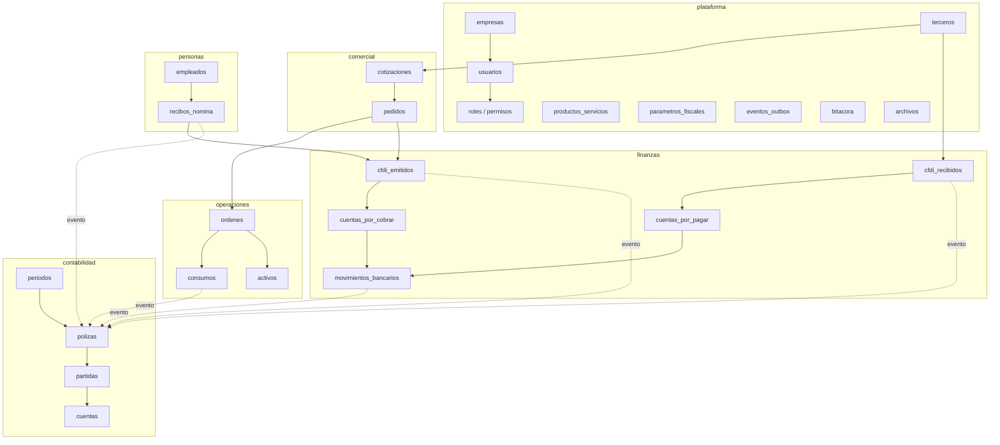

**Lo que este diagrama hace explícito:** ningún módulo escribe directamente en `contabilidad`. Las flechas punteadas son eventos, no llamadas. Esa es la diferencia entre un sistema con contabilidad integrada y uno con contabilidad acoplada.

---

## 10. Arquitectura del sistema

### 10.1 Principios de arquitectura

| # | Principio | Consecuencia práctica |
|---|---|---|
| 1 | **Una sola aplicación, módulos con fronteras reales** | El usuario vive en una pantalla; el código vive en compartimentos verificables |
| 2 | **La frontera se verifica con herramienta, no con disciplina** | La compilación falla si alguien cruza una frontera |
| 3 | **Los módulos se comunican por eventos, no por llamadas** | Agregar un suscriptor no modifica a quien publica |
| 4 | **La contabilidad es un destino, no un módulo más** | Solo un componente escribe en ella, y solo reaccionando a eventos |
| 5 | **Las reglas cambiantes son datos** | Un cambio normativo es una carga de datos, no un despliegue |
| 6 | **Lo externo vive detrás de un adaptador** | Cambiar de proveedor no toca el negocio |
| 7 | **Multiempresa desde la primera línea** | Agregarlo después es reescribir |
| 8 | **Lo que no se puede medir, no se promete** | Todo requisito no funcional tiene número |

### 10.2 Vista de capas

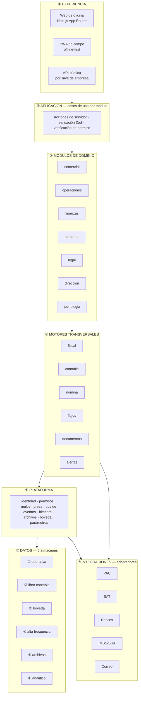

**Reglas de dependencia entre capas** —se verifican automáticamente (`RNF-094`):

1. Una capa **solo** depende de la capa inmediatamente inferior. La experiencia nunca habla con la base de datos.
2. Un módulo de la capa ③ **nunca** importa internals de otro módulo de la capa ③. Solo su contrato público.
3. Los motores de la capa ④ **no** conocen a los módulos: reciben eventos y datos, devuelven resultados.
4. La capa ⑦ solo se alcanza desde motores y plataforma, nunca desde un módulo de dominio.
5. El almacén ② (libro contable) solo es escrito por el motor contable.

### 10.3 Vista de módulos y comunicación

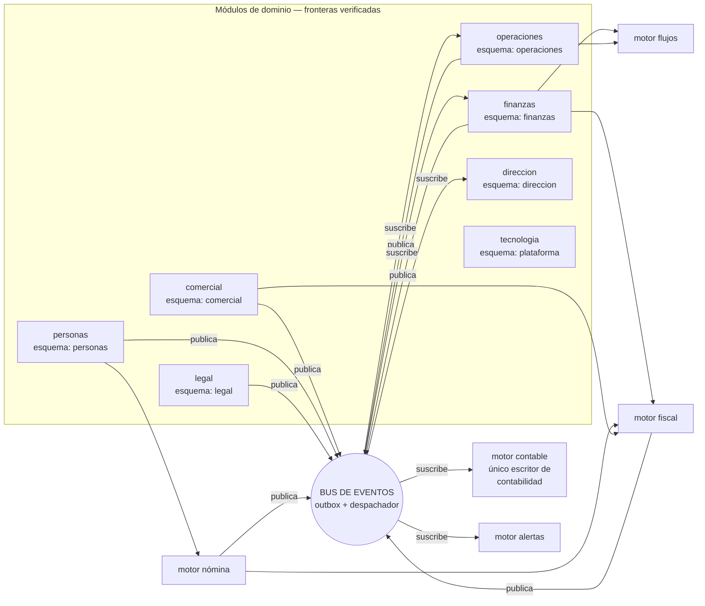

**Ejemplo concreto de por qué esto importa.** Cuando se emite una factura, el módulo comercial **no** llama a contabilidad, ni a tesorería, ni al servicio de correo. Publica un hecho: *se timbró un CFDI*. Tres suscriptores reaccionan de forma independiente:

| Suscriptor | Qué hace | Si falla |
|---|---|---|
| Motor contable | Genera la póliza de ingreso | Se reintenta; el CFDI sigue siendo válido |
| Finanzas | Crea la cuenta por cobrar | Se reintenta; la póliza ya existe |
| Alertas | Envía el comprobante al cliente | Se reintenta; nada más se afecta |

Agregar mañana un cuarto suscriptor —por ejemplo, avisar por mensajería al vendedor— **no modifica una sola línea del módulo comercial**. Eso es lo que hace que el sistema pueda crecer a 402 funciones sin volverse frágil.

### 10.4 Los seis almacenes de datos

Separar los datos por naturaleza, no por módulo, es lo que permite que la contabilidad sea inmutable mientras la operación es ágil.

| # | Almacén | Qué guarda | Naturaleza | Reglas |
|---|---|---|---|---|
| ① | **Operativa** | Todo el registro de negocio: clientes, cotizaciones, órdenes, facturas, empleados | Lectura y escritura frecuentes | Un esquema por módulo; RLS en todo |
| ② | **Libro contable** | Cuentas, periodos, pólizas, partidas, saldos | **Solo inserción** | Escrito únicamente por el motor contable; hash encadenado; periodos bloqueables |
| ③ | **Bóveda cifrada** | CSD, e.firma, credenciales de PAC, banco y API, CLABE, salarios | Acceso restringido | Las tablas guardan referencias, no valores |
| ④ | **Alta frecuencia** | Bitácora y todo dato de alta cadencia que no es registro de negocio | Escritura masiva, lectura ocasional | Particionable por fecha; archivable |
| ⑤ | **Archivos** | XML, PDF, fotos, evidencias, documentos legales | Objetos inmutables | Hash de contenido; versiones; URLs firmadas |
| ⑥ | **Analítico** | Vistas que agregan para tableros y reportes | Solo lectura | Nadie escribe; se recalculan |

**Por qué esta separación no es un lujo.** Sin ella ocurren tres cosas que arruinan sistemas de este tipo:

1. La contabilidad se contamina con correcciones operativas y deja de ser evidencia.
2. La bitácora y los datos de alta cadencia hacen crecer las tablas de negocio hasta volver lentas las consultas del día a día.
3. Las credenciales terminan en columnas de texto y una fuga de base de datos se convierte en una fuga de certificados fiscales.

### 10.5 Bus de eventos: mecanismo exacto

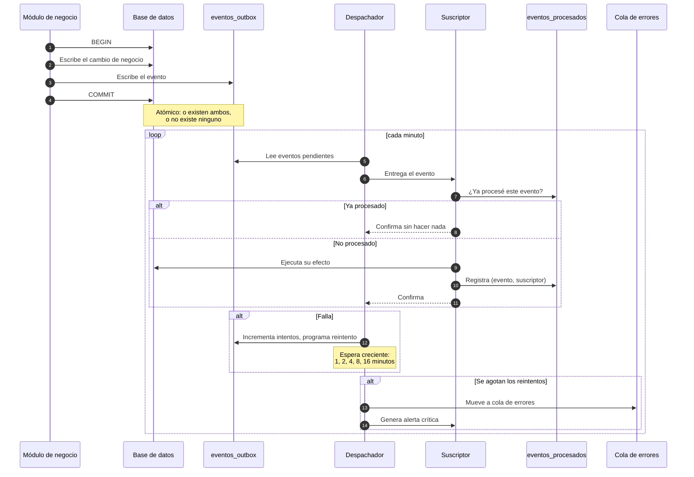

**Las cuatro garantías que esto da y que el sistema necesita:**

| Garantía | Por qué es indispensable aquí |
|---|---|
| **Si el negocio se registró, el evento existe** | Nunca hay una factura sin su póliza pendiente |
| **Si el negocio falló, el evento no existe** | Nunca hay una póliza de una factura que no se emitió |
| **Procesar dos veces = procesar una vez** | Un reintento no genera una segunda póliza ni un segundo correo |
| **Nada se pierde en silencio** | Un evento fallido termina en una bandeja visible con alerta, nunca en el olvido |

**Catálogo de eventos.** El catálogo completo, con su carga útil y sus suscriptores, está en `docs/05-catalogo-eventos.md`. La convención de nombres es `<modulo>.<entidad>_<verbo_en_pasado>`: `comercial.pedido_creado`, `fiscal.cfdi_timbrado`, `finanzas.cobro_registrado`, `contable.periodo_cerrado`. Se nombra por **lo que pasó en el negocio**, no por lo que debe hacerse en consecuencia: un evento llamado `generar_poliza` acoplaría a quien publica con quien reacciona, que es justo lo que se quiere evitar.

### 10.6 Los motores

| Motor | Responsabilidad | Entrada | Salida | Quién lo consume |
|---|---|---|---|---|
| **Fiscal** | Construir, validar, timbrar y cancelar comprobantes; calcular impuestos | Documento de negocio, parámetros vigentes | XML timbrado, UUID, cálculos de impuestos | Comercial, Finanzas, Nómina |
| **Contable** | Traducir eventos a pólizas mediante reglas almacenadas como datos | Evento + reglas + catálogo de cuentas | Póliza con partidas cuadradas | Nadie lo llama: reacciona a eventos |
| **Nómina** | Calcular percepciones, deducciones, ISR, subsidio, SDI, cuotas | Empleados, incidencias, parámetros del periodo | Recibos con su detalle | Personas |
| **Flujos** | Ejecutar aprobaciones según reglas configurables | Solicitud + reglas + roles | Aprobación o rechazo registrado | Finanzas, Operaciones, Personas |
| **Documentos** | Generar PDF desde plantillas por empresa | Datos + plantilla | Archivo en el almacén ⑤ | Todos |
| **Alertas** | Vigilar condiciones y notificar | Reglas + revisión diaria + eventos | Notificaciones con escalamiento | Todos |

**Regla común a todos los motores:** son deterministas y sin estado propio de negocio. Dada la misma entrada y los mismos parámetros vigentes, producen exactamente la misma salida. Esto es lo que permite recalcular un periodo antiguo y obtener el resultado que se obtuvo entonces (`RNF-114`).

### 10.7 Vista de despliegue

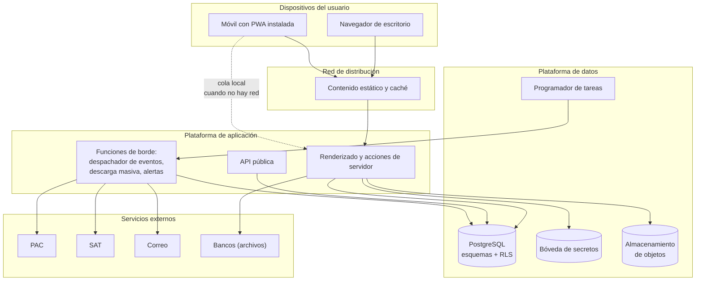

**Decisiones de despliegue y su justificación:**

| Decisión | Por qué |
|---|---|
| Cómputo administrado, sin servidores propios | Una persona no puede operar infraestructura y construir 402 funciones a la vez |
| Base de datos administrada con RLS nativa | El aislamiento entre empresas se apoya en la base de datos, no en el código de aplicación |
| Tareas programadas dentro de la plataforma de datos | Sobreviven a despliegues; no dependen de un servidor encendido |
| Almacenamiento de objetos separado de la base | Los archivos crecen distinto que los datos y se sirven distinto |
| PWA en lugar de aplicación nativa | Una base de código, sin ciclos de aprobación de tiendas, con capacidad de trabajo sin conexión |

#### 10.7.1 Dónde vive el código y dónde corre

Son dos preguntas distintas que conviene no mezclar: **vivir** es dónde está guardado; **correr** es dónde se ejecuta cuando alguien lo usa.


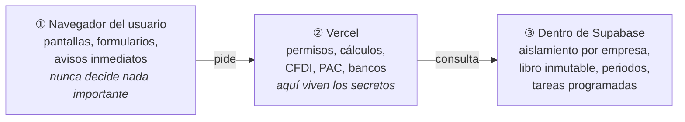

**Qué corre en cada lugar, y por qué ahí:**

| Dónde corre | Qué corre | Por qué ahí |
|---|---|---|
| **Navegador del usuario** | La interfaz: pantallas, formularios, validaciones inmediatas de formato | Responde sin esperar a la red. **Nunca** se le confía una decisión: el usuario puede manipular lo que corre en su propia máquina |
| **Vercel** (servidores de aplicación) | Verificación de permisos, cálculos fiscales y contables, construcción del CFDI, llamadas al PAC, al SAT y a los bancos | Es donde viven los secretos y donde se toman las decisiones. El navegador nunca ve una credencial |
| **Supabase** (dentro de la base de datos) | El aislamiento por empresa, el rechazo de `UPDATE` sobre pólizas, el bloqueo de periodos cerrados, el despachador de eventos, las tareas programadas | **Estas reglas no pueden fallar nunca.** Lo que corre en la aplicación puede tener un error; lo que corre en la base se aplica siempre, venga la petición de donde venga |

**El principio que ordena este reparto:** *cuanto más grave sea que una regla falle, más abajo vive.* Una validación de formato puede vivir en el navegador; el aislamiento entre empresas vive en la base de datos, que es lo más abajo que existe.

#### 10.7.2 Los servidores no guardan nada

Una petición de un usuario dura unos cientos de milisegundos: llega, un servidor cualquiera la atiende, pide a la base de datos que lea o escriba, responde y **olvida todo**. El siguiente clic del mismo usuario lo puede atender otro servidor distinto, sin consecuencia alguna.

| Pieza | ¿Guarda estado? | Si se pierde |
|---|---|---|
| Servidores de aplicación | **No** | Otro atiende la siguiente petición; nadie lo nota |
| Base de datos | **Sí, todo** | Se pierde el negocio. Es la pieza que se respalda |
| Almacén de archivos | **Sí** | Se pierden XML, PDF y evidencias. También se respalda |
| Repositorio en GitHub | **Sí, la historia** | Se pierde la capacidad de reconstruir y de saber por qué algo está como está |

De ahí se derivan dos consecuencias que este SRS convierte en requisitos:

1. **No se asigna infraestructura por usuario ni por empresa a nivel de cómputo.** Un servidor atiende peticiones de cualquier empresa; la separación vive en los datos, no en las máquinas (`RF-002`).
2. **La unidad de aislamiento es la empresa, nunca el usuario.** Los usuarios de una misma empresa *deben* compartir datos: el vendedor cotiza, contabilidad factura y tesorería cobra sobre el mismo documento. Separar usuarios entre sí rompería el sistema en lugar de protegerlo.

#### 10.7.3 Los tres entornos

El código es el mismo en los tres. Lo que cambia son los datos y las credenciales.

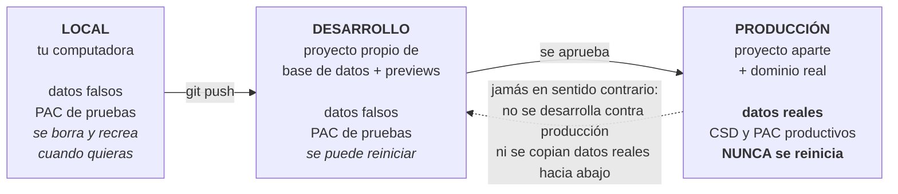

| | Local | Desarrollo | Producción |
|---|---|---|---|
| Datos | Falsos | Falsos y semillas de prueba | **Reales de los clientes** |
| PAC | Ambiente de pruebas | Ambiente de pruebas | Productivo, con el CSD real |
| Se puede borrar y recrear | Todos los días | Cuando haga falta | **Nunca** |
| Cuándo se crea | Al iniciar (`T-PLT-01`) | Al iniciar | Cuando existan RFC, e.firma, CSD y contrato con el PAC (`T-END-04`) |

**Dos reglas absolutas sobre entornos:**

- **Nunca se desarrolla conectado a producción**, ni para depurar un caso real.
- **Nunca se copian datos reales hacia desarrollo** (`RNF-066`). Si hace falta reproducir un caso, se construye la semilla que lo reproduce.

#### 10.7.4 El viaje de un cambio

```mermaid
flowchart LR
    A["1 · Se escribe<br/>en local"] --> B["2 · Se registra<br/>qué cambió y por qué"]
    B --> C["3 · Se sube<br/>al repositorio"]
    C --> D{"4 · Verificación<br/>automática<br/>lint · tipos · pruebas<br/>fronteras de módulo"}
    D -->|falla| E["Se detiene aquí.<br/>No llega a nadie"]
    E --> A
    D -->|pasa| F["5 · Se aplican las<br/>migraciones de base<br/><b>primero</b>"]
    F --> G["6 · Se publica<br/>el código"]
    G --> H["7 · Bandera de función:<br/>encendida por empresa,<br/>no para todos a la vez"]
```

**El orden del paso 5 y 6 no es negociable:** la migración de base de datos se aplica **antes** que el código que la necesita. Al revés, el código nuevo consulta columnas que todavía no existen y falla para todos los clientes al mismo tiempo. De ahí la regla de las migraciones en dos pasos (§13.4, punto 2).

#### 10.7.5 Qué es irremplazable y qué no

| Pieza | ¿Irremplazable? | Cómo se recupera |
|---|---|---|
| Tu computadora | No | Se vuelve a clonar el repositorio |
| Despliegue en Vercel | No | Se reconstruye desde el repositorio en minutos |
| **Repositorio en GitHub** | **Sí** | Solo por sus copias: cada computadora que lo clonó tiene el historial completo |
| **Base de datos de producción** | **Sí** | Respaldo diario + exportación por empresa (`RNF-043`, `T-PLT-19`) |
| Almacén de archivos | Sí | Respaldo del proveedor + exportación por empresa |

Dos de las cinco piezas son irremplazables. Todo el esfuerzo de respaldo, inmutabilidad y aislamiento se concentra en esas dos; las otras tres son deliberadamente desechables.

### 10.8 Seguridad en la arquitectura

```mermaid
graph TB
    U["Usuario"] --> AUTH["1. Autenticación<br/>contraseña + TOTP"]
    AUTH --> SES["2. Sesión con empresa activa<br/>en el token"]
    SES --> PERM["3. Verificación de permiso<br/>en cada acción de servidor"]
    PERM --> RLS["4. Filtro de fila por empresa<br/>en la base de datos"]
    RLS --> CAMPO["5. Restricción de campos sensibles<br/>por rol"]
    CAMPO --> DATO["Dato entregado"]
    PERM -.->|deniega| NEG["Acción rechazada<br/>y registrada"]
    RLS -.->|filtra| VACIO["Cero filas"]
```

**Cinco capas, cada una suficiente por sí sola para detener una fuga.** El principio es que **ninguna capa confía en la anterior**:

| Capa | Qué detiene | Qué pasa si falla sola |
|---|---|---|
| 1. Autenticación | A quien no tiene cuenta | Las otras cuatro siguen protegiendo |
| 2. Sesión con empresa | El acceso a otra empresa por manipulación de la petición | La capa 4 lo detiene en la base de datos |
| 3. Permiso por acción | Acciones que el rol no permite | La capa 4 y 5 limitan el daño |
| 4. Aislamiento por fila | Cualquier lectura o escritura fuera de la empresa activa | Es la última línea; por eso nunca se desactiva |
| 5. Campos sensibles | Que un rol autorizado a la entidad vea columnas que no le corresponden (salarios) | Sin ella, Dirección vería salarios individuales |

**Regla operativa que se deriva:** ocultar un botón en la interfaz **no es un control de seguridad**, es una comodidad. Todo control vive en el servidor y en la base de datos (`RNF-055`, `RNF-054`).

#### 10.8.1 Una persona con varios roles

La capa 3 no pregunta "¿cuál es tu rol?" sino "¿alguno de tus roles te autoriza esto?". Una persona puede tener varios roles en la misma empresa, porque en una empresa de 15 personas la misma persona lleva Tesorería y Contabilidad. Sus permisos son la **unión**: por cada recurso, la acción más amplia y el alcance más amplio que le dé cualquiera de sus roles (`RF-031`).

```mermaid
flowchart LR
    A["Ana<br/>Empresa A"] --> R1["rol<br/>Tesorería"]
    A --> R2["rol<br/>Contabilidad"]
    R1 --> U{"unión de<br/>permisos"}
    R2 --> U
    U --> P["permisos efectivos<br/><i>la acción y el alcance<br/>más amplios de cada recurso</i>"]
    P --> S{"¿incompatibles?<br/>segregación<br/>de funciones"}
    S -->|"no"| OK["se asigna"]
    S -->|"sí"| EX["se bloquea hasta que<br/>el Propietario autorice<br/>con motivo, y queda en el<br/>reporte de control interno"]
```

Esto abre una puerta que hay que vigilar, y el SRS la vigila en tres niveles:

| Nivel | Qué hace |
|---|---|
| **Visibilidad** | Una pantalla muestra los permisos efectivos de cualquier usuario y qué rol origina cada uno. Sin ella, apilar roles es inauditable |
| **Bloqueo con excepción** | Las combinaciones que rompen la segregación de funciones están marcadas y se bloquean; solo el Propietario las autoriza, con motivo, y la excepción vive en el reporte de control interno mientras exista (`RF-032`) |
| **Control sobre la persona** | Aunque la excepción esté autorizada, quien captura un pago nunca lo aprueba él mismo, aunque acumule el rol que aprueba. El control es sobre la persona, no sobre el rol (`RN-013`, `RF-152`) |

**Y el operador del sistema no aparece aquí.** Quien opera la plataforma —el proveedor— no es un rol de esta matriz ni de ninguna otra: vive en un plano aparte, con identidad propia y sin acceso a contenido de negocio. Ver el **Anexo D**.

**Lo que no cambia:** la capa 5 no se une hacia arriba. Los salarios individuales los otorga el rol Personas o el Propietario; acumular Dirección y Comercial no los alcanza nunca. Y el rol Propietario es excluyente: ya los contiene todos, así que no se combina (`RF-033`).

La matriz completa de combinaciones incompatibles está en `docs/06-matriz-roles.md`.

### 10.9 Multiempresa

| Aspecto | Decisión | Razón |
|---|---|---|
| Modelo | Una base de datos, un esquema por módulo, `empresa_id` en cada tabla, aislamiento por fila | Simplicidad operativa y costo; el aislamiento lo garantiza la base de datos |
| Identidad | Un usuario puede pertenecer a varias empresas y tener **varios roles en cada una**; los permisos son la unión | Un contador externo atiende varios clientes; en una empresa chica una persona lleva Tesorería y Contabilidad |
| Contexto | La empresa activa viaja en el token de sesión y determina el filtro | El cambio de empresa recarga el contexto completo |
| Configuración | Catálogo de cuentas, reglas contables, plantillas, parámetros y numeración son **por empresa** | Dos empresas del mismo grupo pueden operar distinto |
| Datos compartidos | Solo los catálogos oficiales del SAT son globales | Todo lo demás pertenece a una empresa |
| Límite del modelo | A partir de la escala de `RNF-031`, se aplica el particionado de §13.3 | El modelo actual es correcto para el volumen actual y el siguiente orden de magnitud |
| Distribución comercial | Suscripción sobre la instancia compartida; instancia dedicada como excepción de precio alto. **Nunca se vende el código fuente** | Ver el anexo de multiempresa y distribución, y `ADR-0004` |

### 10.10 Decisiones de arquitectura registradas

| ADR | Decisión | Consecuencia principal | Costo de revertir |
|---|---|---|---|
| `ADR-0001` | Monolito modular en lugar de microservicios | Una transacción, un despliegue; la frontera se verifica por herramienta | Bajo: un módulo con contrato y esquema propios puede extraerse |
| `ADR-0002` | Libro contable inmutable y aislado | Auditabilidad real; corregir cuesta una póliza de reversa | No se revierte: un libro mutable es un defecto, no una variante |
| `ADR-0003` | Delegar el sellado de CFDI y la descarga masiva a proveedores | Primera factura real en semanas, no en meses | Bajo: ambos viven detrás de adaptador |
| `ADR-0004` | Multiempresa agrupada con aislamiento por fila | Un cliente nuevo es un alta de datos; una función llega a todos a la vez | Alto al revés: agregarlo después sería reescribir |
| `ADR-0005` | Stack: Next.js + PostgreSQL sobre Supabase + Vercel | Una persona puede construir y operar; cada regla crítica queda donde no se puede saltar | Medio: los adaptadores acotan el cambio de proveedor |
| `ADR-0006` | Regímenes como catálogo y cálculos fiscales como definiciones de datos | Un cambio del SAT es una carga, no un despliegue; agregar un régimen no toca el motor | Reversible régimen por régimen; la base de acumulación, no |

Los ADR completos, con sus alternativas consideradas, están en `docs/adr/`.

### 10.11 Por qué esta arquitectura y no otra

Las decisiones anteriores se toman juntas y se sostienen entre sí. Esta sección explica el razonamiento en lenguaje llano, para que quien llegue después entienda **qué problema resuelve cada una** y qué pasaría si se cambiara.

| Decisión | La alternativa obvia | Por qué se descartó | Qué pasaría si se cambiara hoy |
|---|---|---|---|
| **Una aplicación, módulos con fronteras verificadas** | Microservicios | Multiplican despliegues, contratos de red y consistencia eventual. Lo construye una persona: ese trabajo es justo el que no existe | Se puede extraer un módulo después, porque ya tiene contrato y esquema propios. Al revés —unir microservicios— no |
| **Comunicación por eventos, no por llamadas** | Que un módulo llame a otro directamente | Cada función nueva obligaría a modificar las anteriores: el costo de agregar crecería con lo ya construido. Con 402 funciones eso es fatal | Agregar un suscriptor hoy no toca a quien publica. Si se cambiara, cada cambio se volvería una cadena de cambios |
| **Reglas contables y parámetros fiscales como datos** | Escribirlos en el código | La norma cambia cada año. Con reglas en código, cada enero es un despliegue; y recalcular un periodo viejo daría un resultado distinto al que dio entonces | Hoy un cambio del SAT es cargar un parámetro. Si estuviera en código, sería un despliegue urgente con todos los clientes en juego |
| **Libro contable inmutable** | Pólizas editables con bitácora | La bitácora dice que algo cambió, pero el libro deja de ser evidencia de lo que se registró en su momento. Ante la autoridad, no es defendible | No se cambia. Un libro mutable no es una variante de diseño, es un defecto |
| **Aislamiento por fila en la base de datos** | Filtrar por empresa en el código | Un olvido en una consulta dejaría de ser un error y pasaría a ser una fuga de datos entre clientes | Es la única barrera sin otra detrás. No se apaga ni para depurar |
| **Una instalación compartida** | Una instalación por cliente | El costo de operar crece con cada venta: actualizar, respaldar y vigilar N sistemas. Una persona no puede | Mover un cliente a su propia instancia es configuración, porque cada fila ya lleva `empresa_id`. Al revés sería reescribir |
| **Secretos en bóveda cifrada** | Guardarlos en columnas de la base | Una fuga de base de datos se convertiría en una fuga de certificados fiscales: alguien podría facturar en nombre del cliente | Los secretos no se leen, se usan. Cambiarlo no aporta nada y expone todo |
| **Servidores sin estado** | Servidores que recuerdan al usuario | Un servidor que guarda algo no se puede tirar ni multiplicar. Perderlo sería perder datos | Hoy un servidor puede caerse sin consecuencia. Si guardara estado, cada caída sería un incidente |
| **PWA en vez de aplicación nativa** | Aplicaciones de iOS y Android | Serían dos bases de código más, con ciclos de aprobación de tiendas, para un caso de uso que se resuelve con una página instalable | Se puede envolver la PWA en una aplicación nativa después si hiciera falta; el código no se tira |
| **Cómputo y base de datos administrados** | Servidores propios | Operar infraestructura es un trabajo de tiempo completo que competiría con construir el producto | PostgreSQL es estándar y la exportación completa existe: cambiar de proveedor mueve datos, no reescribe el sistema |

**Las tres ideas de fondo, si hubiera que resumir la arquitectura en tres frases:**

1. **Lo que no puede fallar vive lo más abajo posible.** El aislamiento entre empresas y la inmutabilidad contable viven dentro de la base de datos, no en el código, porque el código se equivoca.
2. **Lo que cambia seguido vive como dato, no como código.** Tasas, tablas fiscales, reglas contables, planes contratados y banderas de función: todo eso se modifica sin desplegar.
3. **Lo que es caro de operar no se multiplica.** Una aplicación, una base de datos, un despliegue. La separación entre clientes se logra con datos, no con infraestructura repetida.

---

## 11. Comportamiento del sistema

Los requisitos dicen qué hace el sistema. Esta sección dice **cómo se comporta**: en qué estados puede estar cada cosa, qué transiciones son legales, qué ocurre cuando algo falla y cómo calcula.

### 11.1 Estados de un comprobante fiscal (CFDI)

```mermaid
stateDiagram-v2
    [*] --> Borrador: se construye desde pedido u orden
    Borrador --> Borrador: se corrige
    Borrador --> PorTimbrar: pasa todas las validaciones previas
    Borrador --> [*]: se descarta (no consumió folio)
    PorTimbrar --> Timbrado: el PAC sella y devuelve UUID
    PorTimbrar --> ErrorTimbrado: el PAC rechaza
    PorTimbrar --> PorTimbrar: el PAC no responde → reintento
    ErrorTimbrado --> Borrador: se corrige el motivo
    Timbrado --> CancelacionSolicitada: se solicita cancelar con motivo
    CancelacionSolicitada --> Cancelado: la autoridad o el receptor aceptan
    CancelacionSolicitada --> Timbrado: la cancelación se rechaza
    Timbrado --> [*]
    Cancelado --> [*]
```

| Transición | Quién la dispara | Efectos obligatorios |
|---|---|---|
| Borrador → PorTimbrar | Usuario con permiso, tras validación completa | Se asigna folio de la serie |
| PorTimbrar → Timbrado | Respuesta del PAC | Se guardan XML y PDF, se publica el evento, se genera póliza y cuenta por cobrar, se envía al cliente |
| PorTimbrar → ErrorTimbrado | Rechazo del PAC | Se guarda el código y mensaje. **No** se genera póliza ni cuenta por cobrar |
| PorTimbrar → PorTimbrar | Falta de respuesta | Antes de reintentar se consulta al PAC si el comprobante ya existe |
| Timbrado → CancelacionSolicitada | Contabilidad, con motivo | Se registra el motivo y, si aplica, el sustituto |
| CancelacionSolicitada → Cancelado | Confirmación | **Se genera póliza de reversa**; la cuenta por cobrar se cancela; el evento se publica |

**Estados prohibidos.** No existe transición de `Timbrado` a `Borrador`, ni de `Cancelado` a ningún otro estado. Un comprobante timbrado no se edita jamás (`RN-005`).

### 11.2 Estados de una cotización y un pedido

```mermaid
stateDiagram-v2
    state "COTIZACIÓN" as C {
        [*] --> Borrador
        Borrador --> Enviada: se envía al cliente
        Enviada --> Aceptada: el cliente acepta
        Enviada --> Rechazada: el cliente rechaza (motivo obligatorio)
        Enviada --> Vencida: pasa su vigencia
        Vencida --> Enviada: se reactiva con nueva vigencia
        Aceptada --> [*]
    }
    state "PEDIDO" as P {
        [*] --> Confirmado: creado desde cotización aceptada
        Confirmado --> EnProceso: se genera orden de trabajo
        EnProceso --> Surtido: el trabajo o la entrega concluyen
        Surtido --> Facturado: se emite el CFDI
        Facturado --> [*]
        Confirmado --> Cancelado
        EnProceso --> Cancelado
    }
    C --> P: al aceptarse
```

**Regla de bloqueo.** Un pedido de un cliente que excede su límite de crédito no puede pasar de `Confirmado` a `EnProceso` sin autorización registrada (`RF-144`).

### 11.3 Estados de una orden de trabajo

Definidos en §5.4. Las reglas de transición obligatorias:

| Regla | Comportamiento |
|---|---|
| No se puede asignar un recurso no disponible | El sistema muestra el conflicto y exige resolverlo |
| No se puede asignar un activo con mantenimiento crítico vencido | Bloqueo con explicación (`RF-186`) |
| No se puede asignar a un empleado con documento obligatorio vencido | Bloqueo con notificación a Personas |
| No se puede cerrar una orden con checklist obligatorio incompleto | Bloqueo, indicando qué falta |
| No se puede registrar consumos en una orden cerrada | Rechazo (`RN-017`) |
| Cancelar una orden con consumos no borra los consumos | Quedan como costo sin ingreso, visibles en el análisis |

### 11.3.1 Las tres zonas del registro contable

El sistema separa físicamente lo que se puede corregir de lo que no. No es una regla de la aplicación: son tablas distintas con permisos distintos.

```mermaid
flowchart LR
    subgraph Z1["① ORIGEN — dato operativo"]
        O1["CFDI recibido,<br/>gasto, pedido,<br/>movimiento bancario"]
    end
    subgraph Z2["② PREPARACIÓN — borrador"]
        B1["póliza en borrador<br/><i>se edita y se borra<br/>sin dejar rastro contable</i>"]
    end
    subgraph Z3["③ LIBRO — inmutable"]
        L1["póliza registrada<br/><b>solo inserción</b>"]
        L2["reversa +<br/>póliza sustituta"]
        L3["póliza de<br/>ajuste"]
        L1 -->|"corregir"| L2
        L1 -->|"reclasificar"| L3
    end
    O1 -->|"se clasifica"| B1
    B1 -->|"se aprueba"| L1
```

| Zona | Qué vive ahí | Quién puede cambiarlo | Qué ve la balanza |
|---|---|---|---|
| ① **Origen** | El documento operativo antes de contabilizarse: clasificación, cuenta sugerida, tercero, dimensión | Quien tenga permiso sobre ese documento. Edición libre (`RF-044`) | Nada. Todavía no es contabilidad |
| ② **Preparación** | La póliza en borrador, cuadrando | Contabilidad. Edición y borrado libres (`RF-041`) | Nada. El borrador no existe para ningún reporte |
| ③ **Libro** | La póliza registrada | **Nadie.** Solo se agrega: reversa, sustituta o ajuste (`RF-042`, `RF-043`) | Todo |

**Dónde está la línea.** El cruce de ② a ③ es el único punto irreversible del sistema, y es deliberado: es el momento en que un dato se convierte en evidencia. Antes de esa línea, corrige cuanto quieras; después, corriges **agregando**. Por eso la zona de preparación importa tanto: es la que hace que la inmutabilidad del libro no estorbe el trabajo diario.

**Lo que esto resuelve en la práctica.** Casi todo lo que se siente como "necesito editar la contabilidad" es en realidad un error de la zona ① o ② que se contabilizó demasiado pronto. Contabilizar más tarde —al aprobar, no al capturar— elimina la mayor parte del problema sin tocar el libro.

**Lo que el sistema no tiene, y por qué.** No existe un mecanismo para modificar un asiento registrado, ni una credencial, rol o contraseña que lo habilite, ni un registro de cambios separado del libro. La restricción vive en la base de datos y no pregunta quién es el solicitante (`RF-123`). Un libro que se puede alterar sin que se note deja de ser evidencia de nada: es precisamente lo que el CFF art. 28, la NOM-151 y la NIF A-4 exigen que sea imposible. Y en una instalación compartida por varias empresas, una sola puerta de ese tipo comprometería a todos los clientes a la vez, no solo a uno.

---

### 11.4 Estados de un periodo contable

```mermaid
stateDiagram-v2
    [*] --> Abierto: se crea al iniciar el mes
    Abierto --> EnCierre: se inicia el checklist
    EnCierre --> Abierto: se detecta algo pendiente
    EnCierre --> Cerrado: se cumplen TODAS las condiciones
    Cerrado --> Reabierto: excepción con doble autorización
    Reabierto --> EnCierre
    Cerrado --> [*]
```

| Estado | Qué se permite | Qué se prohíbe |
|---|---|---|
| `Abierto` | Toda operación con fecha del periodo | — |
| `EnCierre` | Operaciones y ajustes; el checklist se recalcula | — |
| `Cerrado` | Solo consulta | Toda escritura con fecha del periodo. Rechazo a nivel de base de datos |
| `Reabierto` | Lo mismo que `Abierto` | Requiere rol Contabilidad **y** aprobación de Dirección **y** motivo escrito; queda en bitácora; invalida el hash de cierre hasta el nuevo cierre |

### 11.5 Estados de una nómina

```mermaid
stateDiagram-v2
    [*] --> Abierto: inicia el periodo
    Abierto --> CapturaCerrada: Personas cierra incidencias
    CapturaCerrada --> Calculado: se ejecuta el motor
    Calculado --> CapturaCerrada: se detecta error y se recalcula
    Calculado --> Autorizado: Dirección autoriza
    Autorizado --> Timbrado: se timbra el lote
    Timbrado --> Dispersado: se confirma el pago
    Dispersado --> Contabilizado: se generan las pólizas
    Contabilizado --> [*]
    Timbrado --> TimbradoParcial: algunos recibos fallan
    TimbradoParcial --> Timbrado: se reintentan los fallidos
```

**Regla que evita el error más caro de nómina:** una vez `Timbrado`, el periodo no vuelve atrás. Una corrección se hace cancelando el recibo individual y re-timbrándolo, o mediante ajuste en el periodo siguiente, identificado como retroactivo. Reabrir un periodo timbrado produciría inconsistencia entre lo declarado al SAT y lo registrado.

### 11.6 Comportamiento sin conexión y resolución de conflictos

La PWA de campo opera asumiendo que **no hay red**, y trata la conexión como una mejora, no como un requisito.

| Situación | Comportamiento obligatorio |
|---|---|
| El usuario abre la aplicación sin red | Ve sus órdenes asignadas, sincronizadas la última vez que hubo conexión |
| Captura una evidencia, un consumo o una incidencia | Se guarda en el dispositivo con su marca de tiempo **original** y una clave de idempotencia |
| La aplicación se cierra o el dispositivo se apaga | Lo capturado persiste; se recupera al reabrir |
| Se recupera la conexión | Se sincroniza en orden cronológico, reintentando cada registro fallido individualmente |
| El servidor ya tenía ese registro | La clave de idempotencia lo detecta; no se duplica |
| El registro local contradice al servidor | **Gana el registro de campo para los datos que solo campo conoce** (evidencias, consumos, lecturas). Gana el servidor para el estado administrativo (asignación, cancelación) |
| La orden fue cancelada en el servidor mientras se ejecutaba sin red | Se aceptan los registros de campo —el trabajo se hizo— y se marca un conflicto para que Operaciones lo resuelva. **Nunca se descarta el trabajo de una persona** |
| La foto excede el límite | Se comprime en el dispositivo antes de guardarla |
| La cola supera el límite de almacenamiento | Se avisa al usuario y se prioriza la sincronización de lo más antiguo |

### 11.7 Comportamiento ante fallas de servicios externos

Este es el apartado que distingue un sistema que aguanta un mal día de uno que no.

| Servicio | Falla | Comportamiento obligatorio | Lo que NUNCA debe pasar |
|---|---|---|---|
| **PAC** | No responde | El comprobante queda `por_timbrar`; reintento con espera creciente; antes de cada reintento se consulta si ya fue timbrado | Emitir dos veces el mismo comprobante |
| **PAC** | Rechaza | Estado `error_timbrado` con código y mensaje; el usuario corrige y reintenta | Generar póliza o cuenta por cobrar de un comprobante no timbrado |
| **PAC** | Caído prolongadamente | Se alerta a Dirección; el resto del sistema opera con normalidad; los comprobantes se acumulan en cola y se emiten al restablecerse | Bloquear toda la operación por no poder facturar |
| **SAT descarga masiva** | No responde | Se reintenta al día siguiente; se permite captura manual de gastos; al restablecerse, la descarga recupera el histórico y detecta duplicados | Perder gastos del periodo |
| **SAT** | Cambia el formato o la versión | El adaptador falla de forma explícita y alerta; se actualiza el adaptador y los parámetros | Enviar comprobantes malformados en silencio |
| **Banco** | El archivo de estado de cuenta cambia de formato | La importación falla señalando la línea y la columna; se permite mapeo manual | Importar datos mal interpretados |
| **Banco** | Rechaza una dispersión | El pago vuelve a pendiente; el resto del lote no se afecta; se alerta a Tesorería | Marcar como pagado algo que no se pagó |
| **Correo** | No entrega | El envío queda en cola con reintentos; el estado es visible en el documento | Que el usuario crea que el cliente recibió su factura |
| **Base de datos** | No disponible | El sistema muestra un estado de mantenimiento; la PWA sigue capturando localmente | Perder lo capturado |
| **Despachador de eventos** | Se detiene | Los eventos se acumulan en la tabla de salida y se procesan al reanudar, en orden | Perder eventos o procesarlos fuera de orden dentro de la misma entidad |

### 11.8 Reglas de cálculo y representación

**Dinero.**

| Regla | Detalle |
|---|---|
| Representación | Decimal de precisión fija: `numeric(18,2)` en base de datos; decimal exacto o entero en centavos en la aplicación. **Punto flotante prohibido** |
| Redondeo | A dos decimales, al valor más cercano; en el empate, hacia arriba |
| Orden de operaciones | Se calcula por concepto, se redondea el concepto, y se suman conceptos redondeados. Nunca se calcula sobre el total |
| Diferencias por redondeo | Si la suma de conceptos no coincide con el total esperado, **se rechaza el documento**; no se "ajusta" la diferencia silenciosamente |
| Moneda extranjera | Se guarda el importe en moneda original, el tipo de cambio aplicado y su fecha, y el equivalente en pesos. Los tres se conservan |

**Fechas y horas.**

| Regla | Detalle |
|---|---|
| Almacenamiento | Siempre en UTC, con zona horaria explícita |
| Presentación | En la zona horaria de la empresa (por defecto, la del centro de México) |
| Fecha fiscal | La fecha del hecho económico determina el periodo, el parámetro vigente y la declaración. **Nunca la fecha de captura** |
| Captura retroactiva | Permitida mientras el periodo esté abierto; rechazada si está cerrado, indicando el periodo abierto más próximo |

**Parámetros vigentes.**

| Regla | Detalle |
|---|---|
| Resolución | Todo parámetro se consulta por la fecha del hecho económico |
| Ausencia | Si no existe parámetro vigente para esa fecha, **el cálculo se detiene** y nombra el parámetro faltante. Nunca se usa el del periodo anterior |
| Historicidad | Recalcular una operación antigua produce el resultado que produjo entonces (`RNF-114`) |

**Validaciones previas al timbrado** (lista completa, exigida por `RF-117`):

1. RFC del emisor y del receptor con estructura válida y longitud correcta.
2. Régimen fiscal del receptor existente y vigente en el catálogo.
3. Uso de CFDI compatible con el régimen fiscal del receptor.
4. Código postal del domicilio fiscal del receptor presente y existente en el catálogo.
5. Cada concepto con clave de producto o servicio y clave de unidad vigentes.
6. Objeto de impuesto declarado por concepto.
7. Método de pago coherente con la forma de pago (PPD implica forma "por definir").
8. Moneda y, si no es peso mexicano, tipo de cambio presente.
9. Impuestos trasladados y retenidos calculados por concepto y coincidentes con los totales.
10. Total = suma de importes − descuentos + traslados − retenciones, al centavo.
11. Serie y folio disponibles.
12. Emisor con CSD vigente configurado en el PAC.

Si cualquiera falla, **no se envía nada al PAC** y se muestran **todos** los errores juntos, cada uno con su campo. Mostrarlos de uno en uno obliga al usuario a doce intentos y es un defecto de diseño.

### 11.9 Auditoría y trazabilidad

| Qué se registra | Dónde | Cuánto tiempo | Quién lo consulta |
|---|---|---|---|
| Toda escritura de negocio: autor, momento, origen, valores anterior y nuevo | Bitácora | ≥ 5 años | Dirección, Contabilidad, Administrador |
| Toda póliza, con su hash encadenado | Libro contable | ≥ 5 años, inmutable | Contabilidad, auditoría |
| Todo comprobante emitido y recibido, en su XML original | Archivos | ≥ 5 años, inmutable | Contabilidad, auditoría |
| Toda aprobación: quién, cuándo, qué decidió, con qué motivo | Bitácora de aprobaciones | ≥ 5 años | Dirección, auditoría |
| Todo acceso fallido y actividad anómala | Registro de seguridad | ≥ 1 año | Administrador |
| Toda intervención de un agente de IA, con su invocador | Bitácora | ≥ 5 años | Dirección, Administrador |
| Todo cambio de configuración y de regla contable | Bitácora de configuración | ≥ 5 años | Administrador, Contabilidad |

**Prueba de integridad.** En cada cierre, el sistema recorre la cadena de hash del libro contable completo y verifica que ningún eslabón esté roto. Una ruptura genera alerta crítica inmediata y bloquea el cierre.

### 11.10 Concurrencia

| Situación | Comportamiento obligatorio |
|---|---|
| Dos usuarios editan el mismo documento | El segundo en guardar recibe aviso de que el documento cambió, con las diferencias, y decide |
| Dos emisiones simultáneas de comprobante | La asignación de folio es atómica; nunca se repite ni se salta un folio sin registro |
| Dos aplicaciones de cobro sobre la misma factura | La segunda valida contra el saldo actualizado; si ya no hay saldo, se rechaza |
| Dos cierres simultáneos del mismo periodo | El segundo encuentra el periodo cerrado y se rechaza |
| El motor contable recibe el mismo evento dos veces | La tabla de eventos procesados lo detecta; no se genera una segunda póliza |
| Dos sincronizaciones de la PWA del mismo dispositivo | La clave de idempotencia evita la duplicación |

---

## 12. Interfaces

### 12.1 Interfaz de usuario

**Navegación.** El menú lateral se arma con la intersección de lo contratado y lo que permite el rol; lo que un usuario no puede usar, no aparece. La estructura completa de pantallas por área está en `docs/10-pantallas.md`.

**Principios obligatorios de la interfaz:**

| # | Principio | Verificación |
|---|---|---|
| 1 | Una acción que el rol no permite no se muestra — y aun así se verifica en el servidor | `RNF-055` |
| 2 | Todo error nombra el campo, la causa y la acción correctiva | `RNF-082` |
| 3 | Toda acción irreversible pide confirmación que describe lo que ocurrirá | `RNF-083` |
| 4 | Todo listado permite filtrar, ordenar y exportar dentro de los permisos del usuario | `RF-030` |
| 5 | Todo documento muestra su estado con color y texto consistentes en todo el sistema | `RNF-088` |
| 6 | Toda pantalla de captura de campo funciona en 360 px y sin conexión | `RNF-087`, `RNF-045` |
| 7 | Ningún número de un tablero se captura a mano; cada uno navega a su origen | `RF-210` |

**Componentes reutilizables obligatorios:** tabla con filtros y exportación · formulario con validación declarativa · ficha con pestañas · tablero kanban · calendario de recursos · línea de tiempo de eventos y bitácora · visor de archivos · selector de catálogos del SAT · captura de foto, firma y ubicación · tarjetas de indicador · barra de aprobación.

#### 12.1.1 Los cinco patrones de pantalla

El sistema tiene unas 120 pantallas (`docs/10-pantallas.md`). **Todas son uno de estos cinco patrones con datos distintos.** No existe un sexto: si una pantalla no encaja, se replantea la pantalla, no se inventa un patrón.

Esta es la regla que evita que 402 funciones construyan 402 tablas ligeramente distintas.

| Patrón | Para qué | Qué incluye siempre |
|---|---|---|
| **Lista** | Ver muchos registros y encontrar uno | Filtros persistentes en la dirección web, orden por columna, paginación, exportación según permisos, acción primaria arriba a la derecha, selección múltiple donde haya acciones por lote |
| **Ficha** | Ver y editar un registro y todo lo que cuelga de él | Encabezado con identificador y estado, pestañas para lo relacionado, línea de tiempo de eventos y bitácora, acciones según el estado y el rol, archivos adjuntos |
| **Captura** | Crear o editar | Validación declarativa al salir de cada campo, errores que nombran campo y causa, guardado explícito, aviso al salir con cambios sin guardar, borrador donde el documento lo permita |
| **Tablero** | Decidir de un vistazo | Indicadores con su periodo y su comparación, **todo número navega a su origen** (`RF-210`), sin captura manual, actualización visible |
| **Asistente** | Procesos de varios pasos con orden obligado | Pasos numerados con su estado, criterio de avance explícito por paso, posibilidad de volver sin perder lo capturado. Usado en cierre de periodo, nómina y configuración inicial |

**Consecuencia para la construcción:** el paquete que implementa la pantalla de clientes y el que implementa la de proveedores usan el mismo patrón *Lista* y el mismo componente. El segundo cuesta una hora, no un día. Un paquete que construya su propia tabla en vez de usar el patrón es un defecto de revisión, no una preferencia de estilo.

#### 12.1.2 Los cuatro estados de toda pantalla

Una pantalla no está terminada cuando muestra datos. Está terminada cuando resuelve **los cuatro estados**, y esto es verificable en revisión:

| Estado | Qué debe mostrar | Por qué importa |
|---|---|---|
| **Cargando** | Estructura de la pantalla con marcadores de posición, nunca una pantalla en blanco | Una pantalla vacía durante un segundo se lee como un error |
| **Vacío** | Qué es esta pantalla, por qué no hay nada, y la acción para empezar | *"Aún no hay facturas — emite la primera"* contra un recuadro en blanco es la diferencia entre un sistema terminado y uno roto |
| **Error** | Qué falló, si el usuario puede hacer algo, y cómo reintentar. Nunca un código crudo | `RNF-082`, `RNF-089` |
| **Con datos** | El contenido | — |

**El estado vacío es el que más se olvida y el que más comunica.** En un sistema de negocio, el usuario ve pantallas vacías durante toda su primera semana.

#### 12.1.3 Identidad visual: una sola costura

La identidad de marca —color, tipografía, logotipo, tono— **está en definición y se integrará cuando esté lista**. Para que esa integración sea un cambio de un archivo y no una reescritura, el sistema se construye desde hoy bajo esta regla:

| # | Regla | Verificación |
|---|---|---|
| 1 | **Toda decisión visual vive en el archivo de tokens**: color, tipografía, escala de espaciado, radios, sombras, duración de transiciones | Análisis estático: ningún valor de color ni familia tipográfica fuera del archivo de tokens. Falla la compilación |
| 2 | Ningún componente incrusta un valor visual; solo referencia tokens | Igual que arriba |
| 3 | Los tokens tienen **significado, no apariencia**: `--color-peligro`, no `--color-rojo`; `--tipo-dato`, no `--fuente-mono` | Revisión. Un token nombrado por su color se vuelve mentira el día que cambia |
| 4 | Modo claro y modo oscuro salen de los mismos tokens, no de dos hojas de estilo | Revisión visual en ambos modos |
| 5 | Mientras la marca no exista, los tokens toman **valores neutros deliberados**: grises, un acento sobrio, tipografía de sistema. Nunca valores "provisionales" que nadie documentó | El archivo de tokens declara su estado: `neutro` o `marca` |

**Cuando la marca esté lista**, se sustituyen los valores del archivo de tokens y, si hace falta, se agregan los que la marca introduzca. El código de los componentes no se toca. Ese es todo el trabajo de integración, y es deliberado: `RNF-088`.

#### 12.1.4 Nivel de acabado exigible

No todo momento del proyecto exige el mismo acabado. Lo que **siempre** se exige, desde la primera pantalla:

| Siempre | Hasta que la marca exista, no se construye |
|---|---|
| Espaciado consistente, salido de la escala | Ilustraciones y gráficos de marca |
| Jerarquía tipográfica clara: se distingue título, dato y apoyo | Animaciones y microinteracciones |
| Los cuatro estados de §12.1.2 | Iconografía propia |
| **Cifras alineadas a la derecha con numeración tabular**: en una columna de importes, los dígitos deben alinearse verticalmente | Páginas de presentación o mercadotecnia |
| Contraste suficiente para lectura prolongada | Tipografía de pago |
| Foco visible y navegación por teclado en formularios | Temas por empresa cliente |

La numeración tabular parece un detalle menor y no lo es: **es lo que hace que una columna de dinero se vea profesional o se vea rota**, y cuesta una línea de estilo.

---

### 12.2 Interfaz de programación (API)

| Aspecto | Especificación |
|---|---|
| Estilo | REST sobre HTTPS, con cuerpos en JSON |
| Autenticación | Llave de API por empresa, con alcance limitado por recurso y acción |
| Autorización | La llave hereda un rol; aplican exactamente las mismas reglas de permiso y aislamiento que a un usuario |
| Versionado | Versión en la ruta. Una versión se mantiene al menos 12 meses tras publicarse su sucesora |
| Límites de consumo | Por llave y por periodo, configurables; el exceso devuelve un código explícito, no un fallo genérico |
| Idempotencia | Toda operación de escritura acepta una clave de idempotencia; repetirla no duplica |
| Errores | Código, mensaje legible y campo afectado. Nunca un mensaje genérico |
| Documentación | Especificación abierta, generada desde el código, siempre sincronizada |
| Webhooks salientes | Eventos seleccionados, firmados, con reintentos y registro de entrega |

### 12.3 Interfaces con sistemas externos

Cada una vive detrás de un adaptador cuya interfaz la define el sistema, no el proveedor (`RE-10`).

| Sistema | Operaciones | Modo | Datos que cruzan |
|---|---|---|---|
| **PAC** | `timbrar`, `cancelar`, `consultarEstado` | API del proveedor, con ambiente de pruebas | Sale: comprobante. Entra: XML timbrado, UUID, acuses |
| **SAT — descarga masiva** | `solicitar`, `verificar`, `descargar` | Vía proveedor (`ADR-0003`); tarea diaria | Entra: XML de comprobantes emitidos y recibidos |
| **SAT — catálogos y listas** | `actualizarCatalogos`, `consultar69B`, `opinionCumplimiento` | Descarga periódica | Entra: catálogos vigentes, lista de contribuyentes, opinión |
| **Bancos** | `importarEstadoCuenta`, `generarLayoutPagos` | Archivos, con analizador por banco | Entra: movimientos. Sale: layout de dispersión |
| **IMSS / INFONAVIT** | `generarArchivoMovimientos`, `generarArchivoCuotas` | Archivos para carga manual en los portales | Sale: movimientos afiliatorios y determinación de cuotas |
| **Correo** | `enviar` | Proveedor transaccional | Sale: facturas con XML y PDF, recordatorios, alertas, reportes |
| **Mensajería y automatización** | Webhooks salientes | Opcional, desactivado por defecto | Sale: eventos seleccionados |

**Reglas comunes a toda integración:**

1. La interfaz se define desde las necesidades del sistema, nunca copiando la API del proveedor.
2. Las credenciales viven en bóveda; en las tablas queda solo la referencia.
3. Todo webhook entrante se valida por firma y es idempotente.
4. Todo error del proveedor se guarda con su código y mensaje originales.
5. Todo adaptador tiene un modo de prueba que no toca el sistema real.

### 12.4 Interfaces de archivo

| Archivo | Dirección | Formato | Regla |
|---|---|---|---|
| Estado de cuenta bancario | Entrada | CSV, XLSX o TXT, según banco | Analizador por banco; importación idempotente por identificador de movimiento |
| Layout de dispersión | Salida | El del banco | Se genera desde pagos autorizados; nunca desde captura libre |
| Movimientos afiliatorios | Salida | El del portal del IMSS | Validado contra el formato vigente |
| Determinación de cuotas | Salida | El del sistema de autodeterminación | Cifras cuadradas contra la nómina del periodo |
| Contabilidad electrónica | Salida | XML del Anexo 24 | Validado contra el esquema oficial antes de entregarse |
| DIOT | Salida | El formato vigente | Generado desde CFDI recibidos pagados |
| Exportación del cliente | Salida | CSV y JSON, más los archivos originales | Completa, sin intervención del proveedor (`RNF-075`) |

---

## 13. Escalabilidad y evolución

Esta sección responde una pregunta concreta: **qué hay que preparar hoy para que crecer mañana sea barato**. La respuesta no es "usar tecnología que escale": es dejar puntos de extensión donde el crecimiento va a ocurrir, y prohibir desde el principio las decisiones que después son carísimas de deshacer.

### 13.1 Las seis dimensiones de crecimiento

El sistema crece en seis direcciones independientes. Cada una tiene su mecanismo previsto.

```mermaid
graph TB
    C(("SISTEMA"))
    D1["① Más empresas<br/>1 → 10 → 100 → 1000"]
    D2["② Más usuarios<br/>por empresa"]
    D3["③ Más volumen<br/>de datos"]
    D4["④ Más funciones<br/>118 → 281 → 402"]
    D5["⑤ Más industrias<br/>satélites"]
    D6["⑥ Más países<br/>otro marco fiscal"]
    C --- D1
    C --- D2
    C --- D3
    C --- D4
    C --- D5
    C --- D6
    D1 -.->|"mecanismo"| M1["empresa_id + RLS<br/>desde la migración 1"]
    D2 -.->|"mecanismo"| M2["permisos por rol,<br/>nunca individuales"]
    D3 -.->|"mecanismo"| M3["6 almacenes separados<br/>+ particionado por fecha"]
    D4 -.->|"mecanismo"| M4["módulos con frontera<br/>+ bus de eventos"]
    D5 -.->|"mecanismo"| M5["entidades extensibles<br/>+ esquema propio del satélite"]
    D6 -.->|"mecanismo"| M6["motor fiscal tras interfaz<br/>+ parámetros por jurisdicción"]
```

### 13.2 Puntos de extensión: dónde se enchufa lo nuevo

Un punto de extensión es un lugar previsto donde agregar algo **no obliga a modificar lo existente**. El sistema tiene ocho.

| # | Punto de extensión | Qué permite agregar sin tocar lo existente | Cómo se garantiza |
|---|---|---|---|
| 1 | **Bus de eventos** | Un suscriptor nuevo que reaccione a un hecho ya publicado | Quien publica no conoce a quien escucha. Prueba: agregar un suscriptor sin modificar al publicador |
| 2 | **Reglas contables como datos** | Un tratamiento contable nuevo, o distinto por empresa | El motor lee reglas de una tabla; el contador las edita |
| 3 | **Parámetros con vigencia** | Tasas, tablas y topes de cualquier ejercicio o jurisdicción | Ningún valor normativo en código (`RE-06`) |
| 4 | **Adaptadores de integración** | Otro PAC, otro banco, otro proveedor de descarga | La interfaz la define el sistema (`RE-10`) |
| 5 | **Entidades extensibles del núcleo** | Un satélite que agregue atributos a orden, cotización, activo o empleado | El satélite crea tablas en su esquema que apuntan a las del núcleo. Cero cambios en el núcleo (`RNF-091`) |
| 6 | **Campos adicionales por empresa** | Un dato que una empresa necesita y otra no | Configuración, no migración (`RF-015`) |
| 7 | **Catálogo de roles y permisos** | Un rol nuevo, o un ajuste de alcance | Los permisos son datos; la matriz es semilla, no código |
| 8 | **Complementos fiscales** | Un complemento del SAT específico de un giro | Módulos dentro del motor fiscal; el constructor base no cambia |

**La prueba de que el diseño funcionó** llegará el día en que se construya el primer satélite. El criterio es binario y está en `RNF-091`: **cero tablas del núcleo modificadas**. Si hay que alterar la tabla de órdenes para que quepa el trabajo de una industria, el núcleo se diseñó mal y hay que corregirlo antes de continuar, no después.

### 13.3 Estrategia por etapa de crecimiento

Lo que sirve para una empresa no sirve para mil. Esto declara **qué cambia en cada salto y qué no debe cambiar nunca**.

| Etapa | Escala | Qué se mantiene igual | Qué cambia | Señal que indica que llegó el momento |
|---|---|---|---|---|
| **A. Primera empresa** | 1 empresa · 50 usuarios · 500 documentos/mes | Todo lo especificado aquí | Nada | — |
| **B. Primeras decenas** | 10 empresas · 500 usuarios | Modelo de datos, arquitectura, aislamiento | Índices afinados por empresa; caché de catálogos; métricas por empresa | Consultas > 1 s en p95 |
| **C. Cientos** | 100 empresas | Modelo de datos y arquitectura | Particionado de las tablas de alto volumen (bitácora, partidas, movimientos) por empresa y fecha; réplica de lectura para analítica; límites de consumo por empresa | Tablas > 50 millones de filas, o una empresa degradando a las demás |
| **D. Miles** | 1 000 empresas | El modelo lógico y los contratos | Segmentación física: grupos de empresas en instancias separadas de base de datos, con enrutamiento por empresa. La aplicación no cambia porque **siempre** filtró por `empresa_id` | Límites del motor de base de datos, o requisitos de residencia de datos distintos por cliente |
| **E. Extracción de un módulo** | Un módulo con carga desproporcionada | El contrato del módulo y sus eventos | Ese módulo se despliega aparte; su contrato local se vuelve remoto y su suscripción, una cola | Un módulo consume más recursos que el resto junto |

**La razón por la que el salto D es barato** es una sola decisión tomada hoy: que **toda tabla de negocio lleve `empresa_id` desde su primera migración** (`RE-05`). Repartir empresas entre instancias cuando cada fila ya sabe a quién pertenece es configuración. Hacerlo cuando no lo sabe es reescribir el sistema.

### 13.4 Lo que NUNCA debe hacerse

Estas son las decisiones que parecen atajos y que destruyen la capacidad de crecer. Cada una está prohibida por un requisito:

| # | Anti-patrón | Por qué destruye la escalabilidad | Prohibido por |
|---|---|---|---|
| 1 | Desactivar el aislamiento por fila "un momento, para probar" | Es la última línea de defensa entre empresas; una vez que el código asume que puede leer todo, nunca se recupera | `RE-05`, `RNF-054` |
| 2 | Que un módulo escriba en el esquema de otro | Las fronteras dejan de existir y el sistema se vuelve un monolito clásico, imposible de dividir después | `RE-02`, `RNF-094` |
| 3 | Escribir una tasa, tabla o tope fiscal en el código | Cada cambio normativo se vuelve un despliegue; y recalcular el pasado da resultados equivocados | `RE-06`, `RNF-114` |
| 4 | Llamar directamente a otro módulo en lugar de publicar un evento | Cada función nueva obliga a modificar las anteriores; el costo de agregar crece con lo ya construido | `RE-01`, `RF-020` |
| 5 | Permitir editar una póliza "solo en este caso" | El libro deja de ser evidencia y se pierde la razón de ser del producto | `RE-04`, `RN-003` |
| 6 | Otorgar un permiso individual fuera de rol | Los accesos se vuelven ingobernables en cuanto hay más de veinte personas | `RF-004` |
| 7 | Guardar dinero en punto flotante | Los centavos se pierden y la balanza deja de cuadrar; se descubre meses después | `RE-07` |
| 8 | Meter lógica específica de una industria en el núcleo | El núcleo deja de servir a las demás industrias y se vuelve un producto vertical | `RNF-090` |
| 9 | Guardar bitácora y datos de alta cadencia en las tablas de negocio | Las consultas diarias se vuelven lentas y el crecimiento golpea donde más duele | §10.4 |
| 10 | Construir el tablero antes que sus fuentes | Obliga a capturar números a mano, y ese vicio no se corrige después | `RF-210` |

### 13.5 Evolución del catálogo de funciones

El producto crece de 118 funciones (nivel Esencial) a 402. Ese crecimiento es la prueba de fuego del diseño modular.

| Regla de evolución | Detalle |
|---|---|
| Las claves son permanentes | Se agregan al final de su área; nunca se renumeran ni se reciclan. Viven en commits, pruebas y en este documento |
| Una función pertenece a un área y un departamento | Si parece pertenecer a dos, está mal definida o son dos funciones |
| El nivel decide el plan, no el orden de construcción | Mover una función de nivel cambia en qué plan aparece, no su clave ni su módulo |
| Nada legalmente obligatorio sale del nivel Esencial | Facturar, timbrar nómina, declarar y conservar documentos no se venden como add-on |
| La línea base de seguridad tampoco | Roles, bitácora, respaldos y cifrado están en el plan más básico |
| Una función que solo sirve a una industria no es núcleo | Prueba práctica: ¿la necesitan por igual una empresa de servicios de tecnología y una comercializadora? |

El catálogo completo, editable por área, está en `docs/areas/`. Agregar una función es un cambio de documento con su propio flujo (`/agregar-funcion`), nunca un cambio de código improvisado.

### 13.6 Preparación para otras jurisdicciones

El sistema es hoy un producto mexicano, y eso es correcto: un producto fiscal genérico no sirve bien en ningún país. Pero la arquitectura **debe** dejar preparada la salida, porque rehacerla después sería una reescritura.

| Elemento | Estado hoy | Qué se necesita para otro país |
|---|---|---|
| Motor fiscal | Implementa normativa mexicana | Vive detrás de una interfaz; se agrega una implementación por jurisdicción |
| Parámetros | Con vigencia por fecha | Se agrega dimensión de jurisdicción a la clave del parámetro |
| Catálogo de cuentas | Con código agrupador del SAT | El código agrupador es un atributo opcional; otro país usa su propia clasificación |
| Motor contable | Reglas como datos | Las reglas ya son por empresa; se vuelven por empresa y jurisdicción |
| Nómina | Normativa laboral mexicana | Misma estrategia: interfaz + implementación por jurisdicción |
| Moneda | Peso mexicano base, multimoneda en Profesional | Moneda funcional configurable por empresa |
| Idioma | Español de México | Todo texto visible debe salir de un archivo de traducción, nunca estar escrito en el código |
| Zona horaria | Configurable por empresa | Ya resuelto: almacenamiento en UTC |
| Residencia de datos | Región única declarada | Segmentación física por región, con el mismo mecanismo del salto D de §13.3 |

**Requisito que esto impone desde hoy:** ningún texto visible al usuario se escribe directamente en el código, y ninguna regla fiscal se implementa fuera del motor fiscal. Cumplir estas dos condiciones convierte una expansión internacional en trabajo acotado en lugar de una reconstrucción.

### 13.7 Preparación para inteligencia artificial

El producto se define como un sistema que convierte operación en inteligencia. Eso exige preparación desde el principio, no después.

| Preparación | Por qué desde ahora | Requisito |
|---|---|---|
| Los eventos describen **hechos de negocio** con su contexto completo | Un histórico de eventos bien nombrados es el insumo de cualquier modelo futuro | `RF-020` |
| Toda operación queda fechada y atribuida | Sin serie temporal atribuible no hay predicción posible | `RF-024` |
| Los agentes heredan permisos, no los amplían | Introducir agentes después sin este principio obliga a rediseñar el acceso | `RF-230` |
| Toda afirmación de un agente cita su origen | Un agente que no se puede verificar no se puede usar para decidir | `RF-233` |
| El consumo de IA se mide por empresa | Sin medición, el costo se descubre en la factura | `RF-234` |
| Los agentes no escriben sin confirmación humana | Un error automatizado a escala es más caro que cien errores manuales | `RF-231` |

---

## 14. Calidad, pruebas y aceptación

### 14.1 Estrategia de pruebas

| Nivel | Herramienta | Alcance obligatorio |
|---|---|---|
| Unitaria | Vitest | Motores fiscal, contable y de nómina: **100% de las reglas** cubiertas por caso dorado (`RNF-095`). Resto del dominio: la lógica de negocio, no los accesorios |
| Integración | Vitest + base de datos local | Evento → suscriptor → póliza. Aislamiento por empresa. Adaptadores contra ambiente de pruebas del proveedor |
| Extremo a extremo | Playwright | Los cuatro flujos de §14.3 |
| Seguridad | Pruebas específicas | Aislamiento entre empresas, permisos por rol, campos sensibles, segregación de funciones |
| Carga | Pruebas programadas | Umbrales de §8.1 con el volumen de `RNF-030` |
| Sin conexión | Manual y automatizada | Captura completa en modo avión, con reconexión y verificación de integridad |

### 14.2 Casos dorados

Un caso dorado es un escenario con entradas y resultado esperado exactos, **revisado y firmado por el contador antes de programar el motor correspondiente**. Se almacenan como datos de prueba versionados.

| ID | Escenario | Verifica |
|---|---|---|
| `CD-01` | Factura de servicio PPD a persona moral, con y sin retención | XML esperado + póliza `R-01` |
| `CD-02` | Pago parcial de `CD-01` | Complemento de pago + póliza `R-03` + reconocimiento de IVA cobrado |
| `CD-03` | Cancelación con sustitución | Estados del CFDI + póliza de reversa |
| `CD-04` | CFDI recibido PUE pagado por un empleado con anticipo | Pólizas `R-06` y `R-09` |
| `CD-05` | Arrendamiento de un activo bajo NIF D-5: tabla a 36 meses | Pólizas `R-12`, `R-13`, `R-14` + depreciación + cierre |
| `CD-06` | Nómina quincenal con salario base más percepción variable | ISR, subsidio, SDI, cuotas, neto + póliza `R-10` |
| `CD-07` | IVA mensual con retenciones cobradas | Cálculo cuadrado contra balanza |
| `CD-08` | Pago provisional de ISR con coeficiente y pagos previos | Cálculo coincidente con el del contador |
| `CD-09` | DIOT del mes | Archivo aceptado sin ajustes |
| `CD-10` | Rentabilidad de una orden con consumos, horas y depreciación | Margen correcto |

**Regla sobre los casos dorados.** Cuando un cálculo del sistema difiere del del contador, se investiga cuál está bien. Si el sistema está mal, se corrige la regla —que es dato, no código— y se recalcula. Si el contador estaba equivocado, se actualiza el caso dorado **con su firma**. Nunca se ajusta el resultado para que coincida.

### 14.3 Flujos de aceptación extremo a extremo

| # | Flujo | Recorrido completo |
|---|---|---|
| 1 | **Ingreso** | Cotización → pedido → orden de trabajo → ejecución con evidencia → cierre → CFDI → póliza → CxC → cobro → complemento → conciliación bancaria → margen |
| 2 | **Egreso** | Descarga del SAT → clasificación → CxP → autorización → pago → layout → póliza → conciliación |
| 3 | **Nómina** | Incidencias → cálculo → revisión → autorización → timbrado → dispersión → pólizas → movimientos IMSS |
| 4 | **Cierre** | Conciliaciones → depreciación y provisiones → balanza → impuestos → estados financieros → cierre bloqueado → contabilidad electrónica |

### 14.4 Definición de terminado

Una tarea no está terminada hasta que cumple **todas** estas condiciones:

1. Migración de base de datos con su política de aislamiento en el mismo archivo.
2. Tipos regenerados desde el esquema.
3. Lógica cubierta por pruebas; si toca dinero, impuestos o nómina, su caso dorado en verde.
4. Eventos publicados conforme al catálogo.
5. Interfaz mínima funcional y protegida por permisos en el servidor.
6. Verificación automática (análisis estático, tipos, pruebas, fronteras de módulo) en verde.
7. Estado de la tarea actualizado en el plan de construcción.
8. Si se desvió de una regla de arquitectura, su ADR registrado.

### 14.5 Criterios de aceptación del sistema completo

El sistema se acepta cuando, sobre una empresa real, se cumplen simultáneamente los criterios `CE-01` a `CE-07` de §4.4, y además:

| # | Criterio adicional | Verificación |
|---|---|---|
| 8 | Todos los casos dorados en verde | Reporte de pruebas |
| 9 | Los cuatro flujos extremo a extremo completos | Playwright |
| 10 | Prueba de aislamiento entre empresas sin hallazgos | Suite de seguridad |
| 11 | Restauración de respaldo verificada | Bitácora de la prueba trimestral |
| 12 | Umbrales de rendimiento de §8.1 cumplidos con el volumen de `RNF-030` | Prueba de carga |
| 13 | Operación en paralelo durante dos cierres, con diferencias resueltas | Visto bueno escrito del contador |

---

## 15. Riesgos

> El **Anexo E** reúne estos riesgos con los de la instalación compartida (Anexo C) en un solo mapa, ordenados por reversibilidad, y agrega el procedimiento de respuesta para el día en que alguno se materializa.

| ID | Riesgo | Probabilidad | Impacto | Mitigación prevista | Señal de alerta temprana |
|---|---|---|---|---|---|
| `RI-01` | Las reglas contables resultan equivocadas y se descubre en el primer cierre | Media | Alto: hay que rehacer registros | Las reglas son datos, no código: se corrigen y se recalcula. Validación del contador **antes** de construir el motor | El contador no ha firmado los casos dorados y ya se está programando |
| `RI-02` | El alcance se desborda: se agregan funciones fuera del plan | **Alta** | Alto: el sistema nunca se termina | Catálogo cerrado con claves; ninguna función se construye si no está en el plan | Aparecen commits con funciones que no tienen clave |
| `RI-03` | El PAC elegido no cubre todos los complementos necesarios | Media | Medio: cambiar de proveedor a medio camino | El PAC vive tras un adaptador; se verifica la cobertura antes de contratar | La lista de complementos del proveedor no incluye alguno necesario |
| `RI-04` | El SAT cambia versiones o formatos durante la construcción | Media | Medio | Parámetros con vigencia y adaptadores; nunca valores en código | Publicación de una versión nueva del anexo correspondiente |
| `RI-05` | Construir solo, con IA, produce deriva de arquitectura | **Alta** | Alto: el sistema se vuelve inmantenible | Fronteras verificadas automáticamente; este SRS como punto fijo; ADR para toda desviación | La verificación de fronteras se desactiva "temporalmente" |
| `RI-06` | La nómina resulta más compleja de lo estimado | Media | Alto: es la función con más casos particulares | Casos dorados firmados; operación en paralelo dos periodos antes de confiar | Diferencias recurrentes en la revisión de prenómina |
| `RI-07` | Los saldos iniciales se cargan mal | Media | **Muy alto**: toda la contabilidad hereda el error | El paso 8 de `P-11` es bloqueante: la balanza inicial debe coincidir al centavo | Se propone "ajustar la diferencia después" |
| `RI-08` | El usuario de campo no adopta la PWA | Media | Alto: sin datos de campo no hay costo real | Diseño de 8 toques; funcionamiento sin conexión; prueba con usuario real antes de liberar | La captura de campo se sigue haciendo por mensajería |
| `RI-09` | Una fuga de datos entre empresas | Baja | **Muy alto**: pérdida de confianza irreparable | Cinco capas independientes de control; pruebas de aislamiento por módulo | Aparece una consulta que desactiva el filtro por empresa |
| `RI-10` | Dependencia de un proveedor de infraestructura | Media | Medio | PostgreSQL estándar; exportación completa bajo demanda | Uso de funciones propietarias sin equivalente estándar |
| `RI-11` | El costo de operación crece más rápido que los ingresos | Media | Medio | Medición desde el primer mes de timbres, almacenamiento y consumo de IA | Costo por empresa creciendo sin relación con su uso |
| `RI-12` | La validación del contador se retrasa y bloquea la construcción | Media | Medio | Construir el motor contra reglas provisionales marcadas como tales, y la carga del catálogo al final | El catálogo de cuentas lleva semanas sin revisión |
| `RI-13` | Una migración deja fuera a todos los clientes a la vez | Media | Alto: caída simultánea en horario hábil | Expandir y contraer en dos despliegues; tiempo límite de bloqueo en cada migración; prueba contra copia del tamaño de producción (`C.6.2`) | Una migración con `DROP` o `RENAME`; código y migración en el mismo despliegue |
| `RI-14` | Un cliente grande degrada el servicio de los demás | Media | Medio | Todo índice encabezado por `empresa_id`; cola por turnos entre empresas; límites de consumo (`C.6.2`) | Latencia p95 sube con tráfico plano; una empresa concentra más del 30% de las filas |
| `RI-15` | Hay que restaurar los datos de un solo cliente y el respaldo devuelve a todos | Media | **Muy alto**: los demás pierden un día de trabajo | Papelera con retención de 30 días; exportación lógica diaria por empresa; simulacro trimestral de restauración (`C.6.2`, `C.8`) | Un cliente pregunta si algo se puede deshacer; el procedimiento de restauración nunca se ha ejecutado |
| `RI-16` | Una definición de cálculo equivocada se publica a todo un régimen | Baja | **Muy alto**: varias empresas declaran mal el mismo mes | Casos dorados firmados como condición de activación (`RF-056`); recálculo de regresión contra periodos cerrados; la versión anterior queda intacta | Una definición se activa sin firma; un caso dorado se "ajusta" para que pase |

---

## 16. Decisiones abiertas

Un SRS sin lagunas no significa que todo esté decidido: significa que **lo no decidido está declarado**, con responsable y fecha, en lugar de quedar al criterio de quien programa.

| # | Decisión pendiente | Qué bloquea | Quién decide | Cuándo se necesita | Criterio para decidir |
|---|---|---|---|---|---|
| `DA-01` | Validación del catálogo de cuentas y de las reglas contables | La semilla del catálogo. El motor se puede construir antes, porque las reglas son datos | Contador | Antes de `T-PLT-13` | Que el catálogo refleje la operación real y los agrupadores sean correctos |
| ~~`DA-02`~~ | ~~Confirmación del stack tecnológico~~ **CERRADA el 24/09/2026**: Next.js + TypeScript + **PostgreSQL sobre Supabase** + **Vercel** + PWA. Ver `ADR-0005` | — | Propietario del producto | — | Cumple los tres criterios: aislamiento por fila nativo, tareas programadas dentro de la base y bóveda de secretos |
| `DA-03` | Elección de PAC | El motor fiscal (`T-PLT-15`) | Propietario | Antes del bloque fiscal | Cobertura de CFDI 4.0, pagos 2.0 y nómina 1.2; ambiente de pruebas; API documentada; costo por timbre |
| `DA-04` | Confirmar que el PAC sella con el CSD cargado en él (`ADR-0003`) | Semanas de trabajo en criptografía | Propietario | Con `DA-03` | Que el PAC lo soporte y que el resguardo del CSD sea aceptable |
| `DA-05` | Proveedor de descarga masiva del SAT | El bloque de recepción de gastos | Propietario | Antes de `RF-138` | Que exista API; si no, se implementa el servicio con e.firma, con el costo que eso implica |
| `DA-06` | Nombre definitivo del producto | Nada técnico; solo la interfaz pública | Propietario | Antes de la primera interfaz visible a terceros | — |
| `DA-07` | Umbrales concretos de aprobación por tipo de operación | Configuración inicial, no el código | Dirección de cada empresa | En la puesta en marcha | Política de control interno de cada empresa |
| `DA-08` | Política de retención más allá del mínimo legal de 5 años | Costo de almacenamiento a largo plazo | Propietario | Antes del primer archivado | Costo contra utilidad de la consulta histórica |
| `DA-09` | Región de residencia de datos que se declarará al cliente | Contrato y `RNF-064` | Propietario | Antes del primer cliente externo | Latencia, costo y requisitos del cliente |
| `DA-10` | Formato de estado de cuenta de cada banco con el que se opere | El analizador correspondiente | Tesorería de cada empresa | En la puesta en marcha | El que el banco entregue de forma estable |

**Regla sobre esta tabla.** Mientras una decisión esté abierta, quien construye **no la resuelve por su cuenta**: implementa detrás de un adaptador o de un parámetro, deja la decisión pendiente documentada y sigue. Adivinar una regla fiscal es la forma más cara de avanzar.

---

## 17. Trazabilidad

### 17.1 De objetivo de negocio a verificación

| Objetivo | Proceso | Caso de uso | Requisitos | Prueba que lo verifica |
|---|---|---|---|---|
| `OB-01` Contabilidad al día | `P-01`, `P-02`, `P-06` | `CU-022`, `CU-030`, `CU-041` | `RF-121`, `RF-125`, `RF-126` | Flujo E2E 1 y 4 · `CD-05` |
| `OB-02` Cobrar más rápido | `P-01`, `P-07` | `CU-023`, `CU-024` | `RF-142`, `RF-143`, `RF-145` | Flujo E2E 1 · `CD-02` |
| `OB-03` Sin multas ni deducciones perdidas | `P-02`, `P-06` | `CU-030`, `CU-031`, `CU-043` | `RF-131` a `RF-141` | `CD-04`, `CD-07`, `CD-08`, `CD-09` |
| `OB-04` Rentabilidad por trabajo | `P-03` | `CU-050`, `CU-055` | `RF-184`, `RF-188`, `RF-155` | `CD-10` |
| `OB-05` Control de accesos y autorizaciones | `P-08`, `P-02` | `CU-004`, `CU-011`, `CU-033` | `RF-004` a `RF-009`, `RF-028`, `RF-152` | Suite de seguridad |
| `OB-06` Nómina propia y correcta | `P-04` | `CU-061`, `CU-062` | `RF-160` a `RF-175` | Flujo E2E 3 · `CD-06` |
| `OB-07` Dejar de recapturar | `P-01` | `CU-020`, `CU-021`, `CU-022` | `RF-102`, `RF-104`, `RF-116` | Flujo E2E 1, con verificación campo a campo |
| `OB-08` Nada depende de la memoria | `P-05`, `P-08` | `CU-071`, `CU-072` | `RF-025`, `RF-026`, `RF-207` | Prueba de vencimiento simulado |
| `OB-09` Poder demostrar lo hecho | `P-09` | `CU-012` | `RF-024`, `RF-123`, `RNF-070` a `RNF-074` | Verificación de cadena de hash |
| `OB-10` Crecer sin romper | Todos | `CU-001` | `RF-001`, `RF-002`, `RNF-090` a `RNF-098` | Alta de segunda empresa sin código |

### 17.2 De módulo a esquema, catálogo y plan

| Área del catálogo | Módulo de código | Esquema | Archivo del catálogo | Tareas del plan |
|---|---|---|---|---|
| Finanzas | `finanzas`, `contabilidad` | `finanzas`, `contabilidad` | `docs/areas/01-finanzas.md` | `T-FIN-*` |
| Personas | `personas` | `personas` | `docs/areas/02-personas.md` | `T-PER-*` |
| Comercial | `comercial` | `comercial` | `docs/areas/03-comercial.md` | `T-COM-*` |
| Operaciones | `operaciones` | `operaciones` | `docs/areas/04-operaciones.md` | `T-OPE-*` |
| Legal y Riesgo | `legal` | `legal` | `docs/areas/05-legal-riesgo.md` | `T-LEG-*` |
| Dirección | `direccion` | `direccion`, `analitica` | `docs/areas/06-direccion.md` | `T-DIR-*` |
| Tecnología y Datos | `tecnologia` | `plataforma` | `docs/areas/07-tecnologia-datos.md` | `T-TEC-*` |
| — (transversal) | `platform`, `engines/*` | `plataforma`, `contabilidad` | — | `T-PLT-*` |

Esta correspondencia **uno a uno** entre lo que se vende, lo que se programa y dónde se guarda es lo que permite responder en segundos: "¿dónde vive `FIN-020`?" → área Finanzas → módulo `finanzas` → esquema `finanzas` → tarea `T-FIN-04`.

### 17.3 Documentos que complementan este SRS

| Documento | Qué contiene que aquí no está |
|---|---|
| `docs/areas/00-indice.md` y `01` a `08` | El catálogo completo de las 402 funciones, con nivel, departamento y descripción |
| `docs/04-modelo-de-datos.md` | El modelo físico: tablas, columnas, llaves e índices |
| `docs/05-catalogo-eventos.md` | Cada evento con su carga útil y sus suscriptores |
| `docs/06-matriz-roles.md` | La matriz completa de recurso × rol × acción |
| `docs/07-reglas-contables.md` | El catálogo de cuentas y las reglas `R-01` a `R-16` |
| `docs/08-motor-fiscal.md` | El detalle de construcción de cada tipo de comprobante y cada cálculo |
| `docs/09-integraciones.md` | El contrato de cada adaptador |
| `docs/10-pantallas.md` | La navegación y las pantallas por área |
| `docs/11-plan-de-construccion.md` | Las tareas, su orden, sus dependencias y su estado |
| `docs/12-pruebas-y-calidad.md` | El detalle de cada caso dorado |
| `docs/16-seguridad-y-cumplimiento.md` | Los controles de seguridad y las obligaciones legales |
| `docs/17-operacion-y-despliegue.md` | Entornos, migraciones, tareas programadas y puesta en marcha |
| `docs/18-glosario.md` | El glosario extendido |
| `docs/adr/` | Las decisiones de arquitectura con su contexto completo |

### 17.4 Control de cambios de este documento

| Regla |
|---|
| Este SRS es la línea base. Cuando el código y el SRS difieren, **gana el SRS**; si el SRS está equivocado, se corrige aquí primero y después el código |
| Todo cambio de alcance se refleja aquí **antes** de programarse |
| Un requisito retirado se marca como retirado y conserva su número. Las claves nunca se reciclan |
| Un cambio que afecte a un requisito obligatorio exige revisar las pruebas que lo verifican, en el mismo cambio |
| La versión del documento se incrementa en cada cambio de alcance; los cambios de redacción no la incrementan |

---

---

# Anexo A · Departamentos, características y funciones

## A.1 Cómo está organizado el producto

El sistema se organiza como se organiza una empresa: **7 áreas → 46 departamentos → 402 funciones**. No es una taxonomía inventada para el software: es el mapa de los departamentos que existen en empresas reales, filtrado por una regla — **solo entran los que existen sin importar el giro**.

```mermaid
graph TB
    R["PRODUCTO<br/>402 funciones"]
    R --> A1["Finanzas<br/>67 · 6 deptos."]
    R --> A2["Personas<br/>63 · 6 deptos."]
    R --> A3["Comercial<br/>70 · 8 deptos."]
    R --> A4["Operaciones y<br/>Abastecimiento<br/>76 · 8 deptos."]
    R --> A5["Legal y Riesgo<br/>50 · 7 deptos."]
    R --> A6["Dirección<br/>39 · 7 deptos."]
    R --> A7["Tecnología y Datos<br/>37 · 4 deptos."]
```

### Las tres dimensiones de cada función

Cada una de las 402 funciones se ubica por tres coordenadas, y las tres son independientes:

| Dimensión | Valores | Qué decide |
|---|---|---|
| **Área** | 7 | En qué módulo de código y en qué esquema de base de datos vive |
| **Departamento** | 46 | A qué parte de la empresa sirve, y quién la usa |
| **Nivel** | `E` Esencial · `P` Profesional · `A` Avanzado | En qué plan comercial aparece |

**El nivel no dice cuándo se construye.** Dice en qué plan se vende. El orden de construcción lo fija [`../11-plan-de-construccion.md`](#).

### Qué significa cada nivel en términos de empresa

| Nivel | Plan | Funciones | A quién sirve | Qué caracteriza a sus funciones |
|---|---|---|---|---|
| `E` Esencial | Basic | 118 | Micro y pequeña empresa (hasta ~30 personas) | **Operar y cumplir.** Sin esto la empresa no puede facturar, pagar, declarar ni pagar nómina. Incluye todo lo legalmente obligatorio y la línea base de seguridad |
| `P` Profesional | Pro | 281 acumuladas | Mediana empresa (30–250 personas) | **Controlar, planear y medir.** Aparece cuando hay más de una persona por función y hace falta coordinar, no solo ejecutar |
| `A` Avanzado | Max | 402 | Empresa grande o grupo | **Consolidar, gobernar y predecir.** Aparece cuando hay varias unidades de negocio, consejo, auditoría interna o presencia multipaís |

### Las dos reglas que no se rompen al mover funciones de nivel

1. **Nada legalmente obligatorio sale de `E`.** Facturar, timbrar nómina, declarar impuestos y conservar documentos 5 años no se venden como complemento.
2. **La línea base de seguridad tampoco.** Roles, bitácora, respaldos y cifrado de datos sensibles están en el plan más básico.

### Distribución de las funciones

```mermaid
graph LR
    subgraph E["NIVEL ESENCIAL — 118"]
        E1["Finanzas 27"]
        E2["Personas 25"]
        E3["Comercial 21"]
        E4["Operaciones 23"]
        E5["Legal 8"]
        E6["Dirección 7"]
        E7["Tecnología 7"]
    end
    subgraph P["NIVEL PROFESIONAL — +163"]
        P1["Finanzas 24"]
        P2["Personas 27"]
        P3["Comercial 30"]
        P4["Operaciones 32"]
        P5["Legal 21"]
        P6["Dirección 13"]
        P7["Tecnología 16"]
    end
    subgraph A["NIVEL AVANZADO — +121"]
        A1["Finanzas 16"]
        A2["Personas 11"]
        A3["Comercial 19"]
        A4["Operaciones 21"]
        A5["Legal 21"]
        A6["Dirección 19"]
        A7["Tecnología 14"]
    end
    E --> P --> A
```

**Lo que revela esta distribución.** En el nivel Esencial, el peso está en Finanzas, Personas y Operaciones: lo que una empresa chica necesita es cobrar, pagar, pagar nómina y ejecutar. Legal y Dirección casi no aparecen, porque en una empresa de 15 personas el dueño *es* la dirección y lo legal se resuelve con un despacho. En el nivel Avanzado la proporción se invierte: Legal, Dirección y Comercial dominan, porque lo que distingue a una empresa grande no es que opere distinto, sino que **gobierna, consolida y analiza**.

---

## A.2 Finanzas — 67 funciones · 6 departamentos

**Qué resuelve el área.** Todo el dinero: lo que entra, lo que sale, cómo se registra, cuánto se debe al fisco y qué dicen los números. Es el área más regulada del sistema y la que impone más restricciones técnicas al resto.

**Característica que la distingue.** Es la única área con un **libro inmutable**: sus pólizas no se editan ni se borran nunca. Todo lo demás en el sistema es corregible; la contabilidad no.

```mermaid
graph TB
    FIN["FINANZAS · 67"]
    FIN --> D1["Contabilidad<br/>15 · E8 P5 A2"]
    FIN --> D2["Fiscal<br/>15 · E9 P4 A2"]
    FIN --> D3["Tesorería<br/>16 · E10 P4 A2"]
    FIN --> D4["Control de Gestión<br/>9 · P7 A2"]
    FIN --> D5["Contraloría<br/>6 · P4 A2"]
    FIN --> D6["Riesgos Financieros<br/>6 · A6"]
    D1 -.->|"alimenta"| D4
    D3 -.->|"alimenta"| D1
    D2 -.->|"depende de"| D1
```

| Departamento | Qué hace | Cuándo aparece en una empresa | Característica dentro del sistema | Funciones |
|---|---|---|---|---|
| **Contabilidad** | Registra todo hecho económico, produce libros, balanza, estados financieros y el cierre de cada periodo | Desde el día uno: es obligación legal | Único destino de escritura del motor contable. Sus pólizas nacen de eventos, no de captura | `FIN-001` a `FIN-008` (E) · `FIN-028` a `FIN-032` (P) · `FIN-052`, `FIN-053` (A) |
| **Fiscal** | Cumple con el SAT: emite y recibe comprobantes, calcula IVA, ISR, retenciones, DIOT y contabilidad electrónica | Desde el día uno | Es el área de mayor riesgo legal del producto. Cada función lleva caso dorado firmado por el contador | `FIN-009` a `FIN-017` (E) · `FIN-033` a `FIN-036` (P) · `FIN-054`, `FIN-055` (A) |
| **Tesorería** | Administra el dinero disponible: bancos, cobranza, pagos, flujo de efectivo | Desde el día uno | Es donde el IVA se vuelve exigible: en México se causa al cobrar y se acredita al pagar | `FIN-018` a `FIN-027` (E) · `FIN-037` a `FIN-040` (P) · `FIN-056`, `FIN-057` (A) |
| **Control de Gestión (FP&A)** | Presupuesta, costea, mide rentabilidad y proyecta | Cuando la empresa deja de caber en la cabeza del dueño (~30 personas) | No captura datos: lee de contabilidad y operaciones. Si el dato no existe abajo, aquí no existe | `FIN-041` a `FIN-047` (P) · `FIN-058`, `FIN-059` (A) |
| **Contraloría** | Vigila que los controles internos se cumplan: autorizaciones, segregación de funciones, revisión de pólizas | Cuando quien autoriza ya no es quien ejecuta | Convierte la política de control en reglas del motor de flujos, no en un documento que nadie lee | `FIN-048` a `FIN-051` (P) · `FIN-060`, `FIN-061` (A) |
| **Riesgos Financieros** | Mide y cubre exposición cambiaria, de tasas, de commodities y de crédito | Cuando hay deuda relevante, moneda extranjera o insumos volátiles | Puramente analítico; no genera asientos por sí mismo | `FIN-062` a `FIN-067` (A) |

---

## A.3 Personas — 63 funciones · 6 departamentos

**Qué resuelve el área.** Todo lo relativo a las personas que trabajan en la empresa: desde su contratación hasta su recibo de nómina timbrado y sus obligaciones de seguridad social.

**Característica que la distingue.** Es la única área con **datos restringidos por ley y por decencia**: salarios, incapacidades y exámenes médicos. Ningún otro rol —ni siquiera Dirección— ve importes individuales.

```mermaid
graph TB
    PER["PERSONAS · 63"]
    PER --> D1["Capital Humano<br/>24 · E18 P6"]
    PER --> D2["Seguridad y Salud<br/>10 · E7 P3"]
    PER --> D3["Talento y Desarrollo<br/>10 · P8 A2"]
    PER --> D4["Compensaciones<br/>8 · P4 A4"]
    PER --> D5["Relaciones Laborales<br/>6 · P6"]
    PER --> D6["Cultura y Experiencia<br/>5 · A5"]
    D1 -.->|"nómina alimenta"| D4
    D3 -.->|"desempeño alimenta"| D4
```

| Departamento | Qué hace | Cuándo aparece | Característica dentro del sistema | Funciones |
|---|---|---|---|---|
| **Capital Humano** | Expediente, contratos, nómina completa, IMSS, incidencias, vacaciones, finiquitos, constancias | Desde el primer empleado | El departamento con más funciones obligatorias del sistema (18 en nivel Esencial). La nómina no admite aproximaciones | `PER-001` a `PER-018` (E) · `PER-026` a `PER-031` (P) |
| **Seguridad y Salud en el Trabajo** | NOM-035, comisión mixta, accidentes, equipo de protección, protección civil, prima de riesgo | Obligatorio desde el primer empleado, aunque se ignore en la práctica | Produce evidencia exportable ante inspección, no solo registros internos | `PER-019` a `PER-025` (E) · `PER-032` a `PER-034` (P) |
| **Talento y Desarrollo** | Reclutamiento, selección, onboarding, capacitación, evaluación de desempeño, planes de carrera | Cuando se contrata con regularidad, no por emergencia | Un candidato aprobado se convierte en empleado sin recapturar su expediente | `PER-035` a `PER-042` (P) · `PER-053`, `PER-054` (A) |
| **Compensaciones y Beneficios** | Tabulador, bonos, comisiones, prestaciones, simulación de incrementos, valuación de puestos | Cuando el sueldo deja de negociarse caso por caso | Consume datos salariales: hereda la restricción de acceso de `RF-166` | `PER-043` a `PER-046` (P) · `PER-055` a `PER-058` (A) |
| **Relaciones Laborales** | Reglamento interior, actas administrativas, sindicato, REPSE, conciliación laboral | Cuando hay sindicato, conflictos o servicios especializados | Todo documento aquí es evidencia potencial en un juicio laboral: versión y hash obligatorios | `PER-047` a `PER-052` (P) |
| **Cultura y Experiencia del Empleado** | Clima, reconocimientos, comunicación interna, bienestar, diversidad | Cuando la rotación cuesta más que el programa para evitarla | Único departamento del área que mide percepción, no hechos | `PER-059` a `PER-063` (A) |

---

## A.4 Comercial — 70 funciones · 8 departamentos

**Qué resuelve el área.** Conseguir clientes, venderles, cobrarles bien y conservarlos.

**Característica que la distingue.** Es donde **nace el dato** que recorre todo el sistema: un cliente capturado aquí termina en una póliza, en una declaración y en el tablero de dirección sin volver a escribirse.

```mermaid
graph TB
    COM["COMERCIAL · 70"]
    COM --> D1["Ventas<br/>19 · E10 P7 A2"]
    COM --> D2["Marketing<br/>11 · E6 P4 A1"]
    COM --> D3["Servicio al Cliente<br/>10 · E5 P4 A1"]
    COM --> D4["Pricing<br/>7 · P4 A3"]
    COM --> D5["Experiencia del Cliente<br/>6 · P4 A2"]
    COM --> D6["Producto e Innovación<br/>6 · P4 A2"]
    COM --> D7["Inteligencia de Mercado<br/>5 · P3 A2"]
    COM --> D8["Comunicación Corporativa<br/>6 · A6"]
    D2 -->|"prospectos"| D1
    D1 -->|"clientes"| D3
    D3 -->|"señales"| D5
    D4 -.->|"precios"| D1
```

| Departamento | Qué hace | Cuándo aparece | Característica dentro del sistema | Funciones |
|---|---|---|---|---|
| **Ventas** | Prospectos, embudo, actividades, cotizaciones, pedidos, facturación desde pedido, metas, tablero | Desde el día uno | Contiene la cadena que elimina la recaptura: cotización → pedido → factura | `COM-001` a `COM-010` (E) · `COM-022` a `COM-028` (P) · `COM-052`, `COM-053` (A) |
| **Marketing** | Segmentación, formularios, campañas, contenido, origen de prospectos, marca | Cuando dejar de vender por referidos se vuelve necesario | Cierra el circuito: un prospecto generado aquí llega al embudo con su origen identificado | `COM-011` a `COM-016` (E) · `COM-029` a `COM-032` (P) · `COM-054` (A) |
| **Servicio al Cliente** | Tickets, acuerdos de nivel de servicio, base de conocimiento, quejas, devoluciones, satisfacción | Cuando las quejas dejan de caber en un buzón de correo | Un ticket que excede su plazo escala solo | `COM-017` a `COM-021` (E) · `COM-033` a `COM-036` (P) · `COM-055` (A) |
| **Pricing y Revenue Management** | Listas de precios, descuentos con autorización, promociones, margen por precio | Cuando cada vendedor pone el precio que quiere | Aquí vive el control de descuento máximo por rol, que bloquea documentos | `COM-037` a `COM-040` (P) · `COM-056` a `COM-058` (A) |
| **Experiencia del Cliente** | Recorrido del cliente, NPS, salud de cuenta, riesgo de cancelación, lealtad | Cuando retener vale más que adquirir | Mezcla datos duros (facturación, tickets) con percepción | `COM-041` a `COM-044` (P) · `COM-059`, `COM-060` (A) |
| **Producto e Innovación** | Hoja de ruta, banco de ideas, ciclo de vida, fichas técnicas | Cuando el catálogo evoluciona y no solo se repone | Alimenta el catálogo de productos y servicios de la plataforma | `COM-045` a `COM-048` (P) · `COM-061`, `COM-062` (A) |
| **Inteligencia de Mercado** | Competidores, segmentos, encuestas, tendencias, participación de mercado | Cuando las decisiones de precio y producto necesitan afuera, no solo adentro | Único departamento que almacena datos externos como insumo formal | `COM-049` a `COM-051` (P) · `COM-063`, `COM-064` (A) |
| **Comunicación Corporativa** | Sala de prensa, medios, reputación, crisis, voceros, informe anual | Cuando la empresa es visible y una nota puede costarle dinero | Incluye protocolo de crisis: flujo de aprobación con tiempos exigentes | `COM-065` a `COM-070` (A) |

---

## A.5 Operaciones y Abastecimiento — 76 funciones · 8 departamentos

**Qué resuelve el área.** Hacer el trabajo y conseguir lo necesario para hacerlo. Es el área más grande del sistema y **el contenedor donde se enchufan los satélites de industria**.

**Característica que la distingue.** Contiene la entidad más importante para la extensibilidad del producto: la **orden de trabajo** (`OPE-001`). Un satélite de transporte la extiende como viaje; uno de construcción, como frente de obra; uno de servicios, como visita. Por eso se diseña genérica desde el principio.

```mermaid
graph TB
    OPE["OPERACIONES Y ABASTECIMIENTO · 76"]
    OPE --> D1["Operaciones<br/>17 · E11 P4 A2"]
    OPE --> D2["Compras y Abastecimiento<br/>14 · E8 P6"]
    OPE --> D3["Inventario básico<br/>4 · E4 condicional"]
    OPE --> D4["Calidad<br/>10 · P6 A4"]
    OPE --> D5["Activos y Mantenimiento<br/>11 · P8 A3"]
    OPE --> D6["Servicios Generales<br/>8 · P8"]
    OPE --> D7["Compras Estratégicas<br/>6 · A6"]
    OPE --> D8["Bienes Raíces<br/>6 · A6"]
    D2 --> D3
    D5 -.->|"activos disponibles"| D1
    D4 -.->|"no conformidades"| D1
    D1 ===>|"la orden de trabajo es<br/>lo que extienden los satélites"| SAT["SATÉLITES<br/>de industria"]
```

| Departamento | Qué hace | Cuándo aparece | Característica dentro del sistema | Funciones |
|---|---|---|---|---|
| **Operaciones** | Órdenes de trabajo, plantillas, agenda de recursos, asignación, seguimiento, checklists, evidencias, consumos, incidencias, cierre y facturación | Desde el día uno en cualquier empresa que ejecute algo | **Punto de extensión número uno del producto.** Es donde se mide el costo real de hacer el trabajo | `OPE-001` a `OPE-011` (E) · `OPE-024` a `OPE-027` (P) · `OPE-056`, `OPE-057` (A) |
| **Compras y Abastecimiento** | Proveedores, requisiciones, cotizaciones comparadas, órdenes de compra, recepción, conciliación de tres vías, devoluciones | Desde que se le compra a alguien con regularidad | La conciliación de tres vías es el control que evita pagar lo que no llegó | `OPE-012` a `OPE-019` (E) · `OPE-028` a `OPE-033` (P) |
| **Inventario básico** | Existencias en un almacén, entradas y salidas, costo promedio, punto de reorden | **Condicional:** solo si la empresa maneja bienes físicos | Se activa por configuración. Con él desactivado, ninguna pantalla lo pide | `OPE-020` a `OPE-023` (E, condicional) |
| **Calidad** | Estándares, inspecciones, no conformidades, acciones correctivas, sistema de gestión, auditorías internas, mejora continua | Cuando un cliente lo exige o una certificación lo obliga | Produce evidencia auditable bajo esquemas de certificación | `OPE-034` a `OPE-039` (P) · `OPE-058` a `OPE-061` (A) |
| **Activos y Mantenimiento** | Registro de activos, resguardos, mantenimiento preventivo y correctivo, historial, costo, refacciones, garantías, talleres | Cuando hay equipo cuya falla detiene el trabajo | Un mantenimiento crítico vencido **bloquea la asignación** del activo (`RF-186`) | `OPE-040` a `OPE-047` (P) · `OPE-062` a `OPE-064` (A) |
| **Servicios Generales** | Instalaciones, solicitudes internas, servicios y vencimientos, salas, vehículos utilitarios, visitantes, consumibles | Cuando hay oficina que administrar | Concentra los gastos recurrentes que nadie vigila hasta que suben | `OPE-048` a `OPE-055` (P) |
| **Compras Estratégicas** | Categorías de gasto, licitaciones, contratos marco, riesgo de proveedores, ahorros medidos, abastecimiento internacional | Cuando comprar bien es una ventaja competitiva, no un trámite | Mide ahorro contra una línea base, no contra la intención | `OPE-065` a `OPE-070` (A) |
| **Bienes Raíces Corporativos** | Portafolio de inmuebles, arrendamientos, ubicaciones, obras, costo de ocupación, predial | Cuando hay varias ubicaciones propias o arrendadas | Se conecta con el tratamiento contable de arrendamientos (NIF D-5) | `OPE-071` a `OPE-076` (A) |

---

## A.6 Legal y Riesgo — 50 funciones · 7 departamentos

**Qué resuelve el área.** Que la empresa no se meta en problemas y que, si se mete, tenga con qué defenderse.

**Característica que la distingue.** Casi todo lo que guarda es **evidencia**: documentos con versión, hash y conservación obligatoria. Es el área donde el sistema hace más por lo que **no** debe pasar que por lo que debe pasar.

```mermaid
graph TB
    LEG["LEGAL Y RIESGO · 50"]
    LEG --> D1["Legal<br/>13 · E8 P4 A1"]
    LEG --> D2["Cumplimiento<br/>9 · P7 A2"]
    LEG --> D3["Riesgos y Seguros<br/>7 · P5 A2"]
    LEG --> D4["Seguridad Corporativa<br/>7 · P5 A2"]
    LEG --> D5["Asuntos Públicos<br/>5 · A5"]
    LEG --> D6["Sostenibilidad / ESG<br/>5 · A5"]
    LEG --> D7["Fundación<br/>4 · A4"]
    D1 -.->|"vencimientos"| ALERT["motor de alertas"]
    D3 -.->|"vencimientos"| ALERT
```

| Departamento | Qué hace | Cuándo aparece | Característica dentro del sistema | Funciones |
|---|---|---|---|---|
| **Legal** | Contratos, solicitudes de contrato, firma electrónica, documentos corporativos, poderes, beneficiario controlador, marcas, permisos y licencias | Desde la constitución de la empresa | Todos sus documentos alimentan el motor de alertas por vencimiento. Un permiso vencido bloquea la operación que lo requiere | `LEG-001` a `LEG-008` (E) · `LEG-009` a `LEG-012` (P) · `LEG-030` (A) |
| **Cumplimiento** | Matriz de obligaciones regulatorias, políticas con acuse, línea de denuncia, datos personales, antilavado, debida diligencia de terceros | Cuando la empresa entra en un sector regulado o crece lo bastante para ser visible | Cada obligación tiene responsable, periodicidad, estado y evidencia. No es un documento: es un tablero | `LEG-013` a `LEG-019` (P) · `LEG-031`, `LEG-032` (A) |
| **Riesgos y Seguros** | Registro de riesgos, mapa de calor, planes de mitigación, pólizas de seguro, siniestros | Cuando el patrimonio a proteger justifica pensarlo | Un siniestro sigue su reclamación hasta el cobro, y ese cobro se contabiliza | `LEG-020` a `LEG-024` (P) · `LEG-033`, `LEG-034` (A) |
| **Seguridad Corporativa** | Incidentes, accesos físicos, rondas, investigaciones internas, protocolos | Cuando hay instalaciones, inventario o personal que proteger | Separado de la ciberseguridad, que vive en Tecnología | `LEG-025` a `LEG-029` (P) · `LEG-035`, `LEG-036` (A) |
| **Asuntos Públicos** | Mapa de autoridades, monitoreo regulatorio, cámaras, trámites, licitaciones públicas | Cuando el negocio depende de decisiones de gobierno | Incluye vigilancia del diario oficial, que alimenta la matriz de obligaciones | `LEG-037` a `LEG-041` (A) |
| **Sostenibilidad / ESG** | Huella de carbono, indicadores ambientales y sociales, reportes, cumplimiento ambiental | Cuando un cliente, un banco o un inversionista lo exige | Sus indicadores se alimentan de consumos reales del área de operaciones | `LEG-042` a `LEG-046` (A) |
| **Fundación** | Programas sociales, donativos con recibo, voluntariado, medición de impacto | Cuando hay una estructura filantrópica formal | Los donativos deducibles requieren tratamiento fiscal específico | `LEG-047` a `LEG-050` (A) |

---

## A.7 Dirección — 39 funciones · 7 departamentos

**Qué resuelve el área.** Ver el negocio completo y decidir.

**Característica que la distingue.** Es la única área que **no captura datos propios**. Lee de las demás a través de vistas analíticas. Si un número no existe en otra área, no puede existir aquí. Esa regla evita el vicio más común de los sistemas directivos: un tablero alimentado a mano que dice lo que alguien quiere que diga.

```mermaid
graph TB
    subgraph FUENTES["Las 6 áreas que producen datos"]
        F1["Finanzas"]
        F2["Personas"]
        F3["Comercial"]
        F4["Operaciones"]
        F5["Legal"]
        F6["Tecnología"]
    end
    VISTAS["Vistas analíticas<br/>almacén ⑥"]
    F1 --> VISTAS
    F2 --> VISTAS
    F3 --> VISTAS
    F4 --> VISTAS
    F5 --> VISTAS
    F6 --> VISTAS
    VISTAS --> DIR["DIRECCIÓN · 39"]
    DIR --> D1["Dirección General<br/>7 · E7"]
    DIR --> D2["Planeación Estratégica<br/>5 · P5"]
    DIR --> D3["PMO y Transformación<br/>6 · P4 A2"]
    DIR --> D4["Secretaría Corporativa<br/>5 · P4 A1"]
    DIR --> D5["Estrategia Corporativa<br/>5 · A5"]
    DIR --> D6["Desarrollo Corporativo y M&A<br/>5 · A5"]
    DIR --> D7["Auditoría Interna<br/>6 · A6"]
```

| Departamento | Qué hace | Cuándo aparece | Característica dentro del sistema | Funciones |
|---|---|---|---|---|
| **Dirección General** | Tablero ejecutivo, alertas críticas, aprobaciones centralizadas, objetivos, juntas y acuerdos, reporte automático, consulta en lenguaje natural | Desde el día uno: siempre hay alguien que dirige | Ningún número de su tablero se captura a mano; cada uno navega hasta los documentos que lo componen | `DIR-001` a `DIR-007` (E) |
| **Planeación Estratégica** | Plan estratégico, OKRs en cascada, iniciativas, revisión trimestral, balanced scorecard | Cuando la empresa planea a más de un trimestre | Un OKR se vincula a los indicadores que lo miden; no se declara su avance | `DIR-008` a `DIR-012` (P) |
| **PMO y Transformación** | Portafolio de proyectos, priorización, semáforos, recursos compartidos, beneficios logrados, gestión del cambio | Cuando hay más proyectos que capacidad para hacerlos | El estado del proyecto se deriva de sus tareas, no lo declara su responsable | `DIR-013` a `DIR-016` (P) · `DIR-021`, `DIR-022` (A) |
| **Secretaría Corporativa** | Consejo y comités, asambleas, seguimiento de acuerdos, estructura accionaria, portal del consejero | Cuando hay socios que no operan el negocio | Convocatorias y actas con conservación y evidencia formal | `DIR-017` a `DIR-020` (P) · `DIR-023` (A) |
| **Estrategia Corporativa** | Portafolio de negocios, asignación de capital, valuación de unidades, tablero consolidado, escenarios | Cuando hay más de un negocio bajo el mismo techo | Consume el paquete de Grupo Empresarial para consolidar | `DIR-024` a `DIR-028` (A) |
| **Desarrollo Corporativo y M&A** | Pipeline de oportunidades, debida diligencia, valuación, integración post-adquisición, alianzas | Cuando crecer por adquisición es una opción real | Su cuarto de datos exige control de acceso por documento y por persona | `DIR-029` a `DIR-033` (A) |
| **Auditoría Interna** | Plan anual basado en riesgos, papeles de trabajo, hallazgos, seguimiento, reporte al comité, auditoría continua | Cuando el consejo necesita una mirada independiente | Consume la bitácora y el libro contable como evidencia primaria | `DIR-034` a `DIR-039` (A) |

---

## A.8 Tecnología y Datos — 37 funciones · 4 departamentos

**Qué resuelve el área.** Dos cosas distintas que conviene no confundir: **el área de sistemas del cliente** (sus equipos, sus accesos, su mesa de ayuda) y **la configuración de la plataforma** (usuarios, roles, integraciones, respaldos).

**Característica que la distingue.** Es la única área cuyo rol principal —el Administrador— **no tiene acceso a contenido de negocio**. Administra el sistema sin ver el dinero. Separar esas dos cosas es un control, no una comodidad.

```mermaid
graph TB
    TEC["TECNOLOGÍA Y DATOS · 37"]
    TEC --> D1["Tecnología / Sistemas<br/>11 · E7 P3 A1"]
    TEC --> D2["Ciberseguridad<br/>11 · P7 A4"]
    TEC --> D3["Datos e IA<br/>10 · P6 A4"]
    TEC --> D4["Arquitectura Empresarial<br/>5 · A5"]
    D1 -.->|"accesos"| D2
    D2 -.->|"permisos"| D3
    D3 -.->|"un agente nunca ve<br/>más que su invocador"| LIM["RF-230"]
```

| Departamento | Qué hace | Cuándo aparece | Característica dentro del sistema | Funciones |
|---|---|---|---|---|
| **Tecnología / Sistemas** | Consola de usuarios y roles, inventario de equipos, mesa de ayuda, accesos ligados a altas y bajas, configuración, integraciones, respaldos | Desde el día uno | Contiene la configuración que hace que una empresa nueva opere sin escribir código (`RF-001`) | `TEC-001` a `TEC-007` (E) · `TEC-008` a `TEC-010` (P) · `TEC-024` (A) |
| **Ciberseguridad** | Políticas de acceso, recertificación, actividad sospechosa, dispositivos, incidentes, simulacros, riesgo de proveedores, SSO, monitoreo, pruebas de penetración | Cuando hay información que perder y gente suficiente para perderla | Lo que aquí es "función vendible" en nivel Profesional, su **línea base** está en el nivel Esencial y nunca se vende aparte | `TEC-011` a `TEC-017` (P) · `TEC-025` a `TEC-028` (A) |
| **Datos e IA** | Constructor de reportes, tableros personalizados, conexión a herramientas externas, calidad de datos, agentes personalizados, automatizaciones, modelos predictivos, gobierno de datos | Cuando hay suficiente historia acumulada para que valga la pena | Todo agente hereda los permisos de quien lo invoca. Sin esa regla, la IA es una fuga de datos | `TEC-018` a `TEC-023` (P) · `TEC-029` a `TEC-032` (A) |
| **Arquitectura Empresarial** | Mapa de sistemas, estándares, hoja de ruta tecnológica, gestión de APIs, multi-entorno | Cuando hay varios sistemas que deben entenderse entre sí | Único departamento que documenta al sistema mismo dentro del sistema | `TEC-033` a `TEC-037` (A) |

---

## A.9 Los 46 departamentos por tamaño de empresa

Una misma empresa no tiene los 46 departamentos: tiene los que su tamaño justifica. Esta tabla dice cuándo aparece cada uno **en la realidad**, y por lo tanto en qué plan tiene sentido venderlo.

| Aparece en | Departamentos | Total |
|---|---|---|
| **Micro y pequeña** (nivel Esencial) | Contabilidad · Fiscal · Tesorería · Capital Humano · Seguridad y Salud · Ventas · Marketing · Servicio al Cliente · Operaciones · Compras y Abastecimiento · Inventario básico (condicional) · Legal · Dirección General · Tecnología / Sistemas | **14** |
| **Mediana** (se suman en Profesional) | Control de Gestión · Contraloría · Talento y Desarrollo · Compensaciones · Relaciones Laborales · Pricing · Experiencia del Cliente · Producto e Innovación · Inteligencia de Mercado · Calidad · Activos y Mantenimiento · Servicios Generales · Cumplimiento · Riesgos y Seguros · Seguridad Corporativa · Planeación Estratégica · PMO · Secretaría Corporativa · Ciberseguridad · Datos e IA | **20** |
| **Grande o grupo** (se suman en Avanzado) | Riesgos Financieros · Cultura y Experiencia del Empleado · Comunicación Corporativa · Compras Estratégicas · Bienes Raíces Corporativos · Asuntos Públicos · Sostenibilidad / ESG · Fundación · Estrategia Corporativa · Desarrollo Corporativo y M&A · Auditoría Interna · Arquitectura Empresarial | **12** |

**Matiz importante:** un departamento "de empresa grande" no está prohibido para una chica. Una micro empresa que necesita ciberseguridad puede contratarla como complemento sin comprar el plan completo. El plan agrupa lo típico; **no restringe lo necesario**.

## A.10 Qué NO es un departamento del núcleo

Tres categorías de funciones quedaron fuera a propósito, y conviene saber por qué:

| Categoría | Ejemplos | Por qué no es núcleo | Dónde queda |
|---|---|---|---|
| **Específicas de una industria** | Despacho de viajes, frente de obra, expediente clínico, planeación de producción | Solo sirven a un giro. Meterlas al núcleo lo volvería un producto vertical | Satélites de industria |
| **Específicas de un modelo de negocio** | Multi-almacén, comercio electrónico, comercio exterior, consolidación de grupo | Dependen de cómo vende o se estructura la empresa, no de su tamaño ni de su giro | Los 4 paquetes de [`../areas/08-paquetes-de-modelo.md`](./areas/08-paquetes-de-modelo.md) |
| **Que el sistema no debe hacer** | Presentar declaraciones ante el SAT, mover dinero, sustituir el criterio del contador | La autoridad no lo permite, o exige juicio profesional humano | Fuera del producto, documentado en §1.3.2 |

**La prueba de pertenencia al núcleo**, aplicable a cualquier función que alguien proponga agregar:

> ¿La necesitan por igual una empresa de servicios de tecnología y una comercializadora?
> Si solo una de las dos, por su giro: **es satélite, no núcleo**.

---

---

# Anexo B · Catálogo de diagramas

Los diagramas están escritos en Mermaid dentro del propio Markdown: se ven en VS Code (con la extensión de Mermaid o la vista previa), en GitHub y en cualquier visor compatible, y **se editan como texto**, sin herramienta de dibujo.

---

## B.1 Índice de diagramas de la especificación

| # | Diagrama | Qué muestra | Dónde vive |
|---|---|---|---|
| 1 | Arquitectura de producto | Núcleo, paquetes de modelo y satélites, y la relación entre ellos | [§2.1](#) |
| 2 | Diagrama de contexto | Quién y qué interactúa con el sistema, y en qué dirección | [§2.2](#) |
| 3 | Modelo conceptual del dominio | Las entidades del negocio y cómo se relacionan | [§3.1](#) |
| 4 | Mapa general de procesos | Los 11 procesos y sus dependencias | [§5.1](#) |
| 5 | Ciclo de ingreso (secuencia) | De la cotización al cobro conciliado, con quién hace qué | [§5.2](#) |
| 6 | Ciclo de egreso (secuencia) | De la descarga del SAT al pago conciliado | [§5.3](#) |
| 7 | Estados de una orden de trabajo | Ciclo de vida completo con sus transiciones legales | [§5.4](#) |
| 8 | Nómina (secuencia) | De la incidencia al recibo timbrado y contabilizado | [§5.5](#) |
| 9 | Cierre contable y fiscal | Los 10 pasos y sus criterios de paso | [§5.6](#) |
| 10 | Casos de uso por actor | Qué puede hacer cada rol | [§6.1](#) |
| 11 | Motor contable | Cómo un evento se convierte en póliza, y cuándo se rechaza | [§7.5](#) |
| 12 | Entidades centrales por esquema | Qué tabla vive en qué esquema y cómo se enlazan | [§9.3](#) |
| 13 | Vista de capas | Las 7 capas y sus reglas de dependencia | [§10.2](#) |
| 14 | Vista de módulos | Quién publica y quién escucha en el bus de eventos | [§10.3](#) |
| 15 | Bus de eventos (secuencia) | El patrón outbox paso a paso, con reintentos y cola de errores | [§10.5](#) |
| 16 | Vista de despliegue | Dónde corre cada pieza | [§10.7](#) |
| 17 | Capas de seguridad | Las 5 barreras entre el usuario y el dato | [§10.8](#) |
| 18 | Estados de un CFDI | Ciclo de vida del comprobante fiscal | [§11.1](#) |
| 19 | Estados de cotización y pedido | Del borrador a la factura | [§11.2](#) |
| 20 | Estados de un periodo contable | Abierto, en cierre, cerrado, reabierto | [§11.4](#) |
| 21 | Estados de una nómina | Del periodo abierto a la contabilización | [§11.5](#) |
| 22 | Dimensiones de crecimiento | Las 6 direcciones en que el sistema crece y su mecanismo | [§13.1](#) |
| 23–30 | Mapas por área | Departamentos de cada área y sus relaciones internas | [Anexo A](#anexo-b--catálogo-de-diagramas) |
| 31–36 | Vistas de conjunto | Las seis de abajo | Este documento |

---

## B.2 Mapa completo del producto: 7 áreas · 46 departamentos

Lo que se vende, todo junto. Cada caja es un departamento; el color de la etiqueta indica en qué nivel empieza a aparecer.

```mermaid
graph LR
    OS(("OS<br/>402 funciones"))

    OS --> FIN["<b>FINANZAS</b> · 67"]
    FIN --> F1["Contabilidad · 15 · E"]
    FIN --> F2["Fiscal · 15 · E"]
    FIN --> F3["Tesorería · 16 · E"]
    FIN --> F4["Control de Gestión · 9 · P"]
    FIN --> F5["Contraloría · 6 · P"]
    FIN --> F6["Riesgos Financieros · 6 · A"]

    OS --> PER["<b>PERSONAS</b> · 63"]
    PER --> P1["Capital Humano · 24 · E"]
    PER --> P2["Seguridad y Salud · 10 · E"]
    PER --> P3["Talento y Desarrollo · 10 · P"]
    PER --> P4["Compensaciones · 8 · P"]
    PER --> P5["Relaciones Laborales · 6 · P"]
    PER --> P6["Cultura · 5 · A"]

    OS --> COM["<b>COMERCIAL</b> · 70"]
    COM --> C1["Ventas · 19 · E"]
    COM --> C2["Marketing · 11 · E"]
    COM --> C3["Servicio al Cliente · 10 · E"]
    COM --> C4["Pricing · 7 · P"]
    COM --> C5["Experiencia del Cliente · 6 · P"]
    COM --> C6["Producto e Innovación · 6 · P"]
    COM --> C7["Inteligencia de Mercado · 5 · P"]
    COM --> C8["Comunicación Corporativa · 6 · A"]

    OS --> OPE["<b>OPERACIONES</b> · 76"]
    OPE --> O1["Operaciones · 17 · E"]
    OPE --> O2["Compras · 14 · E"]
    OPE --> O3["Inventario básico · 4 · E*"]
    OPE --> O4["Calidad · 10 · P"]
    OPE --> O5["Activos y Mantenimiento · 11 · P"]
    OPE --> O6["Servicios Generales · 8 · P"]
    OPE --> O7["Compras Estratégicas · 6 · A"]
    OPE --> O8["Bienes Raíces · 6 · A"]

    OS --> LEG["<b>LEGAL Y RIESGO</b> · 50"]
    LEG --> L1["Legal · 13 · E"]
    LEG --> L2["Cumplimiento · 9 · P"]
    LEG --> L3["Riesgos y Seguros · 7 · P"]
    LEG --> L4["Seguridad Corporativa · 7 · P"]
    LEG --> L5["Asuntos Públicos · 5 · A"]
    LEG --> L6["Sostenibilidad ESG · 5 · A"]
    LEG --> L7["Fundación · 4 · A"]

    OS --> DIR["<b>DIRECCIÓN</b> · 39"]
    DIR --> D1["Dirección General · 7 · E"]
    DIR --> D2["Planeación Estratégica · 5 · P"]
    DIR --> D3["PMO · 6 · P"]
    DIR --> D4["Secretaría Corporativa · 5 · P"]
    DIR --> D5["Estrategia Corporativa · 5 · A"]
    DIR --> D6["Desarrollo Corporativo · 5 · A"]
    DIR --> D7["Auditoría Interna · 6 · A"]

    OS --> TEC["<b>TECNOLOGÍA Y DATOS</b> · 37"]
    TEC --> T1["Tecnología / Sistemas · 11 · E"]
    TEC --> T2["Ciberseguridad · 11 · P"]
    TEC --> T3["Datos e IA · 10 · P"]
    TEC --> T4["Arquitectura Empresarial · 5 · A"]
```

**Cómo se lee.** `E` significa que el departamento **empieza** en el nivel Esencial; casi todos siguen creciendo en los niveles superiores. `E*` marca el inventario básico, que es condicional: se activa solo si la empresa maneja bienes físicos. El detalle de cada departamento está en el [Anexo A](#anexo-b--catálogo-de-diagramas).

---

## B.3 El viaje de un dato: de la cotización al tablero

Este es el diagrama que explica el producto entero en una imagen. Un dato se captura **una vez**, a la izquierda, y llega solo hasta la decisión de dirección, a la derecha.

```mermaid
flowchart LR
    A["Comercial escribe<br/>una cotización<br/><b>ÚNICA CAPTURA</b>"] --> B["Pedido"]
    B --> C["Orden de trabajo"]
    C --> D["Consumos y evidencias<br/>capturados en campo"]
    C --> E["CFDI timbrado"]
    E --> F["Póliza de ingreso"]
    E --> G["Cuenta por cobrar"]
    G --> H["Cobro + complemento"]
    H --> I["Póliza de cobro<br/>IVA cobrado"]
    H --> J["Movimiento bancario<br/>conciliado"]
    D --> K["Costo real<br/>de la orden"]
    F --> L["Balanza"]
    I --> L
    L --> M["Estados financieros"]
    L --> N["IVA · ISR · DIOT"]
    K --> O["Margen por orden"]
    M --> P["TABLERO<br/>de dirección"]
    N --> P
    O --> P
    G --> Q["Flujo de efectivo<br/>13 semanas"]
    Q --> P
    P --> R["Decisión"]
```

**Lo que hay que notar.** Hay **una sola caja de captura humana** en todo el recorrido (y una segunda en campo, para lo que solo campo conoce). Todo lo demás son consecuencias automáticas. Cada flecha que en un sistema tradicional sería "alguien vuelve a escribir esto en otro lado" aquí es un evento del bus.

Si en la implementación aparece una segunda captura del mismo dato, eso **es un defecto**, no una decisión de diseño (objetivo `OP-01`).

---

## B.4 Quién usa qué: actores contra áreas

```mermaid
graph TB
    subgraph ACTORES["Roles"]
        A1(("Propietario"))
        A2(("Administrador"))
        A3(("Dirección"))
        A4(("Tesorería"))
        A5(("Contabilidad"))
        A6(("Personas"))
        A7(("Comercial"))
        A8(("Operaciones"))
        A9(("Campo"))
        A10(("Colaborador"))
    end
    subgraph AREAS["Áreas del sistema"]
        Z1["Finanzas"]
        Z2["Personas"]
        Z3["Comercial"]
        Z4["Operaciones"]
        Z5["Legal"]
        Z6["Dirección"]
        Z7["Tecnología"]
    end
    A1 ==> AREAS
    A2 --> Z7
    A3 --> Z6
    A3 -.->|"solo lectura"| Z1
    A3 -.->|"solo agregados"| Z2
    A4 --> Z1
    A5 --> Z1
    A6 --> Z2
    A7 --> Z3
    A8 --> Z4
    A9 -.->|"solo lo propio"| Z4
    A10 -.->|"solo lo propio"| Z2
```

**Las cuatro reglas que este diagrama hace visibles:**

1. El **Propietario** es el único con acceso total. No se le puede restringir.
2. El **Administrador** administra el sistema y **no ve contenido de negocio**. Es la separación que impide que quien da los accesos también vea el dinero.
3. **Dirección** lee todo, pero de Personas solo ve cifras agregadas: nunca un salario individual.
4. **Campo** y **Colaborador** solo ven lo propio. Su alcance de datos no es "el área", es "mis registros".

---

## B.5 El ciclo del dinero completo

Las dos mitades del negocio, y el punto donde convergen.

```mermaid
flowchart TB
    subgraph ENTRA["EL DINERO QUE ENTRA"]
        E1["Cliente"] --> E2["Cotización"] --> E3["Pedido"] --> E4["CFDI"]
        E4 --> E5["Cuenta por cobrar"] --> E6["Cobro"] --> E7["Complemento<br/>de pago"]
        E7 --> E8["IVA trasladado<br/>COBRADO"]
    end
    subgraph SALE["EL DINERO QUE SALE"]
        S1["Proveedor"] --> S2["CFDI recibido<br/>vía SAT"] --> S3["Clasificación"]
        S3 --> S4["Cuenta por pagar"] --> S5["Autorización"] --> S6["Pago"]
        S6 --> S7["IVA acreditable<br/>PAGADO"]
        N1["Empleados"] --> N2["Nómina"] --> N3["Timbrado"] --> N4["Dispersión"]
    end
    BANCO[("BANCOS<br/>conciliación")]
    E6 --> BANCO
    S6 --> BANCO
    N4 --> BANCO
    LIBRO[("LIBRO CONTABLE<br/>inmutable")]
    E4 --> LIBRO
    E6 --> LIBRO
    S3 --> LIBRO
    S6 --> LIBRO
    N3 --> LIBRO
    BANCO --> LIBRO
    LIBRO --> CIERRE["Cierre del periodo"]
    E8 --> IMP["IVA del mes"]
    S7 --> IMP
    CIERRE --> IMP
    CIERRE --> ISR["ISR provisional"]
    S3 --> DIOT["DIOT"]
    IMP --> DECL["Declaraciones"]
    ISR --> DECL
    DIOT --> DECL
```

**La regla mexicana que este diagrama codifica.** El IVA **no** se causa al facturar: se causa al **cobrar**. Y no se acredita al recibir la factura: se acredita al **pagar**. Por eso las flechas del IVA salen del cobro y del pago, no de la emisión y la recepción. Esa particularidad es la razón técnica por la que tesorería y contabilidad no pueden construirse como módulos independientes.

---

## B.6 Trazabilidad: de la función al código

Cómo se responde en segundos la pregunta "¿dónde vive `FIN-020`?".

```mermaid
flowchart LR
    F["Función<br/><b>FIN-020</b><br/>Cuentas por cobrar"]
    F --> A["Área<br/>Finanzas"]
    A --> DEP["Departamento<br/>Tesorería"]
    A --> CAT["Catálogo<br/>docs/areas/01-finanzas.md"]
    A --> MOD["Módulo de código<br/>src/modules/finanzas"]
    MOD --> ESQ["Esquema de BD<br/>finanzas"]
    F --> REQ["Requisito<br/><b>RF-142</b>"]
    REQ --> CU["Caso de uso<br/><b>CU-023</b>"]
    CU --> PROC["Proceso<br/><b>P-01</b>"]
    PROC --> OBJ["Objetivo<br/><b>OB-02</b>"]
    REQ --> TAR["Tarea<br/><b>T-FIN-04</b>"]
    TAR --> PRU["Prueba<br/><b>CD-02</b>"]
    REQ --> EVT["Eventos<br/>cobro_registrado"]
```

**Por qué esto importa.** La correspondencia **uno a uno** entre área, módulo y esquema es lo que permite que el sistema crezca a 402 funciones sin que nadie se pierda. Un commit dice `feat(FIN-020): …`; ese identificador lleva hasta el requisito, la prueba, el proceso de negocio que lo justifica y el objetivo que lo paga.

---

## B.7 Orden de construcción

No es un calendario con fechas: es un orden de dependencias. Cada fase empieza cuando la anterior cumplió su criterio.

```mermaid
flowchart TB
    F0["<b>FASE 0 · FUNDACIÓN</b><br/>plataforma y RLS · bus de eventos · libro contable<br/>motores fiscal, contable, nómina, flujos, documentos, alertas · PWA<br/><i>no se recorta ni se reordena</i>"]
    F0 --> T["Tecnología · 7 funciones E<br/>identidad, configuración, integraciones"]
    T --> C["Comercial · 21 E<br/>clientes, cotizaciones, pedidos, facturación"]
    C --> FI["Finanzas · 27 E<br/>contabilidad, fiscal, tesorería"]
    FI --> O["Operaciones · 23 E<br/>órdenes, compras, inventario"]
    O --> P["Personas · 25 E<br/>expediente, nómina, IMSS"]
    P --> L["Legal · 8 E<br/>contratos, permisos, documentos"]
    L --> D["Dirección · 7 E<br/>tablero, alertas, objetivos"]
    D --> CIERRE{"<b>CRITERIO DE CIERRE DE FASE 1</b><br/>Un mes real completo dentro del sistema,<br/>sin hoja de cálculo paralela,<br/>y las cifras coinciden con lo declarado"}
    CIERRE --> F2["<b>FASE 2 · PROFESIONAL</b><br/>163 funciones, mismo orden entre áreas"]
    F2 --> F3["<b>FASE 3 · AVANZADO</b><br/>121 funciones, mismo orden entre áreas"]
    F3 --> SAT["<b>SATÉLITES DE INDUSTRIA</b><br/>solo cuando el núcleo esté terminado"]
```

**Por qué Dirección va al final, siempre.** No captura datos propios: lee de las demás áreas. Un tablero construido antes que sus fuentes muestra ceros, y la tentación de llenarlo a mano arruina la disciplina del resto del sistema.

**Por qué Comercial va antes que Finanzas.** El dato nace en Comercial. Construir facturación antes de tener clientes y pedidos obliga a inventar una pantalla de captura de facturas que después sobra, y que se queda para siempre.

---

## B.8 Cómo se editan estos diagramas

| Necesidad | Cómo se hace |
|---|---|
| Ver un diagrama | VS Code con la extensión de Mermaid, o la vista previa de Markdown; también se renderiza en GitHub |
| Cambiar un diagrama | Se edita el bloque de código `mermaid` directamente en el Markdown. No hay archivo binario ni herramienta intermedia |
| Agregar un diagrama | Se agrega el bloque en la sección que le corresponde y se registra en la tabla de [B.1](#b1-índice-de-diagramas-de-la-especificación) |
| Exportar a imagen | Cualquier exportador de Mermaid, si hace falta para una presentación. El original sigue siendo el texto |

**Regla de mantenimiento:** un diagrama que contradice al texto es un defecto del documento. Cuando algo cambia, **se actualizan ambos en el mismo cambio**, no "después".

---

---

---

# Anexo C · Multiempresa, licencias y distribución

---

## C.1 La pregunta y la respuesta corta

> *"Quiero vender este sistema a varias empresas. Cada una independiente, que no se conozcan entre sí, que compartan el código pero no los datos. Si agrego una función, que llegue a todas. Y quiero un sandbox para probar sin romper lo que ya funciona."*

**Eso es exactamente lo que el sistema ya hace**, y es la forma estándar de construir software que se vende por suscripción. Se llama **multiempresa con aislamiento por fila** (*multi-tenant pooled*), y las tres decisiones que lo hacen posible ya están tomadas y escritas en la especificación:

| Decisión | Dónde vive | Qué garantiza |
|---|---|---|
| Toda tabla de negocio lleva `empresa_id` desde su primera migración | `RE-05`, `RF-002` | Cada fila sabe de quién es |
| Políticas de aislamiento en la base de datos, nunca solo en la aplicación | `RNF-054` | Un error de programación no expone datos de otra empresa |
| Un solo código, una sola aplicación desplegada | `RE-01`, `ADR-0001` | Una función escrita una vez llega a todas las empresas |

**Una corrección a la idea original.** Mencionaste "bases de datos distintas conectadas". Es al revés: las bases de datos de las empresas **nunca se conectan entre sí**. Lo único compartido es el código y los catálogos oficiales del SAT. Conectar los datos de dos clientes sería justo el defecto que este diseño existe para impedir.

---

## C.2 Los tres modelos posibles

Toda empresa de software que vende a varios clientes elige entre estos tres. No hay un cuarto.

```mermaid
flowchart TB
    subgraph M1["① AGRUPADO (pooled) — el elegido"]
        direction LR
        A1["Un código<br/>Una aplicación"] --> A2[("Una base de datos<br/>empresa_id + RLS<br/>en cada fila")]
        A2 --> A3["Empresa A · Empresa B · Empresa C · …"]
    end
    subgraph M2["② ESQUEMA POR EMPRESA (bridge)"]
        direction LR
        B1["Un código<br/>Una aplicación"] --> B2[("Una base de datos<br/>un esquema por empresa")]
        B2 --> B3["esquema_a · esquema_b · esquema_c"]
    end
    subgraph M3["③ AISLADO (silo) — instalación por cliente"]
        direction LR
        C1["Un código<br/>Varias instalaciones"] --> C2[("Una base de datos<br/>por empresa")]
        C2 --> C3["Instancia A · Instancia B · Instancia C"]
    end
```

| | ① Agrupado | ② Esquema por empresa | ③ Aislado |
|---|---|---|---|
| **Aislamiento de datos** | Por política de fila en la base de datos | Por esquema | Físico, total |
| **Agregar una función a todos** | Un despliegue | Un despliegue + migrar N esquemas | N despliegues |
| **Costo por cliente nuevo** | Casi cero | Bajo | Alto: infraestructura propia |
| **Esfuerzo de operación** | Uno | Crece con N | Crece con N, linealmente |
| **Restaurar solo a un cliente** | Difícil: hay que resolverlo (C.8) | Medio | Trivial |
| **Un cliente pesado afecta a los demás** | Sí, si no hay límites | Sí | No |
| **Cliente que exige sus datos aparte** | No lo satisface | A medias | Lo satisface |
| **Viable para una persona construyendo** | **Sí** | Apenas | No |

**Decisión: modelo ① para todos los clientes**, con el ③ disponible como excepción de precio alto para quien lo exija por contrato o regulación (C.9). El ② no se usa: tiene los inconvenientes de ambos y las ventajas de ninguno a esta escala.

---

## C.3 Cómo se agrega una empresa

Vender una licencia **no implica escribir una línea de código**. Es un alta de datos.

```mermaid
flowchart LR
    V["Se cierra<br/>la venta"] --> A["1. Alta de la empresa<br/>RFC, régimen, domicilio"]
    A --> B["2. Suscripción<br/>plan, módulos, usuarios,<br/>vigencia"]
    B --> C["3. Catálogos y<br/>parámetros fiscales"]
    C --> D["4. Catálogo de cuentas<br/>revisado por su contador"]
    D --> E["5. Usuarios y roles"]
    E --> F["6. Credenciales<br/>PAC, banco, correo<br/>→ bóveda"]
    F --> G["7. Maestros<br/>clientes, proveedores,<br/>empleados"]
    G --> H["8. Saldos iniciales<br/>BLOQUEANTE:<br/>cuadrar al centavo"]
    H --> I["9. Timbrado de prueba<br/>y primero real"]
    I --> J["10. Dos cierres<br/>en paralelo"]
    J --> K["Empresa<br/>operando"]
```

Este es el proceso `P-11` del SRS. Los pasos 1 a 7 son configuración; el 8 es el que no se puede saltar, porque una contabilidad que arranca descuadrada nunca vuelve a cuadrar.

**Consecuencia comercial que conviene entender desde ahora:** el cuello de botella para crecer **no es el software, es la implementación**. Cada empresa nueva necesita que alguien cargue sus saldos iniciales y que su contador revise el catálogo de cuentas. Ese trabajo se cobra aparte y se vuelve, con el tiempo, un puesto o un socio implementador.

---

## C.4 Cómo se agrega una función a todas las empresas

```mermaid
flowchart LR
    A["Escribes la función<br/>una vez"] --> B["Pruebas<br/>automáticas"]
    B --> C["Se despliega<br/>a producción"]
    C --> D{"¿Está encendida<br/>para esta empresa?"}
    D -->|"su plan la incluye"| E["La usa"]
    D -->|"no la incluye"| F["No aparece<br/>en su menú"]
    D -->|"está en beta"| G["Solo las empresas<br/>marcadas la ven"]
```

Lo que decide qué ve cada empresa **son datos, no código**. Tres interruptores independientes, y esta separación es la que evita que el producto se bifurque:

| Interruptor | Qué controla | Dónde vive | Ejemplo |
|---|---|---|---|
| **Plan contratado** | Qué nivel de funciones compró | `plataforma.suscripciones` | Basic ve 118 funciones, Max ve 402 |
| **Módulos y paquetes** | Qué complementos compró | `plataforma.empresa_modulos` | Una comercializadora activa inventario; una de servicios no |
| **Bandera de función** | Qué está en prueba o en despliegue gradual | `plataforma.banderas_funcion` | La función nueva se enciende primero en una empresa |

**Regla que no se rompe nunca:** no existe una rama de código, un archivo ni un `if` por nombre de cliente. Si alguna vez aparece `if (empresa === 'FLEETER')` en el código, el producto acaba de dejar de ser un producto. Lo que un cliente necesita distinto se resuelve con configuración, con campos adicionales (`RF-015`) o con un módulo que cualquiera puede contratar.

---

## C.5 El sandbox: tres niveles distintos

"Probar sin romper lo que existe" son en realidad tres necesidades diferentes, y cada una tiene su mecanismo.

```mermaid
flowchart TB
    subgraph N1["① Entornos — para quien construye"]
        direction LR
        L["local<br/>datos falsos"] --> DEV["dev / staging<br/>datos falsos<br/>PAC de pruebas"] --> PROD["producción<br/>datos reales"]
    end
    subgraph N2["② Empresa demo — para vender y capacitar"]
        direction LR
        DEMO["Empresa DEMO en producción<br/>datos sintéticos · se reinicia sola<br/>sin credenciales fiscales reales"]
    end
    subgraph N3["③ Ambiente de pruebas del cliente — TEC-024"]
        direction LR
        ESP["Copia de SUS datos<br/>para que él practique<br/>sin tocar su operación"]
    end
    N1 --> N2 --> N3
```

| Nivel | Para qué sirve | Quién lo usa | Cuándo se construye |
|---|---|---|---|
| **① Entornos** | Que una función nueva no toque datos reales hasta estar probada | Quien construye | Desde el primer día. Ya está en `docs/17-operacion-y-despliegue.md` |
| **② Empresa demo** | Demostrar el producto a un prospecto y capacitar sin riesgo | Ventas, implementación | Cuando haya algo que vender |
| **③ Ambiente de pruebas del cliente** | Que el cliente pruebe un cierre o una nómina con sus propios datos, sin afectar su operación | El cliente | Nivel Avanzado (`TEC-024`) |

**El cuarto mecanismo, el más importante en el día a día: las banderas de función.** Una función nueva se despliega **apagada**, se enciende primero en la empresa propia, después en un cliente que aceptó ser el primero, y solo entonces para todos. Así, "romper lo que ya existe" deja de ser un riesgo de todo o nada.

```mermaid
flowchart LR
    A["Función nueva<br/>desplegada APAGADA"] --> B["Encendida solo<br/>en la empresa propia"]
    B --> C{"¿Funcionó<br/>una semana?"}
    C -->|No| D["Se apaga<br/>sin desplegar nada"]
    D --> A
    C -->|Sí| E["Cliente piloto<br/>que aceptó"]
    E --> F{"¿Funcionó<br/>un cierre?"}
    F -->|No| D
    F -->|Sí| G["Encendida<br/>para todos"]
```

Apagar una bandera es un cambio de dato: tarda segundos y no requiere desplegar. Revertir un despliegue tarda minutos y arrastra todo lo demás que venía en él. Por eso la bandera es la red de seguridad real.

---

## C.6 Los riesgos de la instalación compartida

Esta es la parte honesta. Compartir una instalación entre varias empresas tiene ocho riesgos que conviene conocer **antes** de tener veinte clientes.

**El encuadre correcto no es "que nunca ocurran".** Solo uno de los ocho admite probabilidad cero. Los demás van a ocurrir —una migración lenta, un cliente pesado, alguien pidiendo algo a la medida— y lo que se diseña es que sean **baratos y detectables**. Por eso cada riesgo lleva tres controles y no uno:

| Control | Pregunta que responde |
|---|---|
| **Prevención** | ¿Cómo se evita que ocurra? |
| **Detección** | Si ocurre, ¿en cuánto tiempo me entero, y me entero yo o el cliente? |
| **Contención** | Cuando ocurra, ¿cuánto cuesta y a cuántos alcanza? |

Un riesgo con solo prevención es un riesgo del que te enteras tarde.

---

### C.6.1 Los ocho riesgos

| # | Riesgo | Qué pasa si ocurre | Señal de alerta temprana | Riesgo del §15 |
|---|---|---|---|---|
| `R1` | **Fuga entre empresas** | Un cliente ve datos de otro. Notificación al INAI y a los afectados; la confianza no se recupera. **El único irreversible** | Un endpoint recibe `empresa_id` del cliente en vez de tomarlo de la sesión; alguien propone desactivar RLS "un momento" | `RI-09` |
| `R2` | **Una migración tumba a todos** | Sistema inaccesible para todos a la vez, en horario hábil, y revertir es peor porque ya hay datos con el esquema nuevo | Una migración con `DROP`, `RENAME` o `ALTER COLUMN TYPE`; código y migración en el mismo despliegue; migración que tarda más de un segundo en desarrollo | `RI-13` |
| `R3` | **Un cliente pesado degrada a los demás** | Los clientes chicos sufren lentitud sin haber hecho nada, y el grande no se entera | Latencia p95 sube con tráfico plano; una empresa concentra más del 30% de las filas de una tabla; aparece un `Seq Scan` en un plan de negocio | `RI-14` |
| `R4` | **Restaurar a un solo cliente** | El respaldo devuelve a *todos* al estado de ayer, incluidos los que no tenían problema | Un cliente pregunta "¿se puede deshacer eso?"; no existe papelera; el procedimiento de restauración nunca se ha ejecutado | `RI-15` |
| `R5` | **Presión por personalizar** | El producto se bifurca. A los dos años son cinco variantes y cada función nueva se prueba cinco veces | Las palabras "solo para" en un commit o en una venta; una bandera con nombre de cliente; un módulo con una sola empresa activa | `RI-02` |
| `R6` | **Una definición fiscal equivocada publicada a todos** | Todas las empresas de ese régimen declaran mal el mismo mes. Las multas son de ellos; la responsabilidad, tuya | Una definición se activa sin casos dorados firmados; un caso dorado se "ajusta" para que pase; prisa de cierre y validación saltada | `RI-16` |
| `R7` | **El PAC se cae o corta el servicio** | Ningún cliente puede facturar. No es un inconveniente: es su operación detenida | Un solo PAC contratado, sin segundo adaptador probado; timbres agotándose sin alerta; un CSD por vencer sin vigilancia | `RI-03` |
| `R8` | **El proveedor de infraestructura suspende el servicio** | Todos los clientes caen por una razón administrativa. Es el único riesgo que un diseño técnico perfecto no cubre | Un solo método de pago; sin alertas de facturación ni de límites; respaldos solo dentro del mismo proveedor | `RI-10` |

**Los tres que no admiten "después":** `R1` y `R6`, porque son irreversibles y alcanzan a todos a la vez; y `R4`, porque la papelera hay que construirla **antes** de que alguien borre algo.

---

### C.6.2 Prevención, detección y contención, riesgo por riesgo

#### `R1` · Fuga entre empresas

| | Controles |
|---|---|
| **Prevención** | `FORCE ROW LEVEL SECURITY` en toda tabla de negocio, no solo `ENABLE`: **el dueño de la tabla se salta las políticas activadas sin `FORCE`** · La aplicación se conecta con un rol que **no es dueño de las tablas y no tiene `BYPASSRLS`** · Las políticas de escritura llevan `WITH CHECK`, no solo `USING`: sin eso se lee bien y se **escribe** en otra empresa · `empresa_id` con `NOT NULL` y valor por omisión desde el contexto de sesión, para que un `INSERT` que la olvide falle en vez de crear una fila huérfana · **Ninguna acción de servidor acepta `empresa_id` como parámetro del cliente**: siempre viene de la sesión |
| **Detección** | Prueba en CI que consulta `pg_policies` y **falla la compilación si existe una tabla de negocio sin RLS forzado y sin política** — cubre también las tablas que todavía no existen · **Empresas canario en producción**: dos empresas sintéticas con datos conocidos; una prueba entra como una y verifica que ve exactamente sus filas y **cero** de la otra · Revisión de que ningún índice ni vista cruce empresas |
| **Contención** | La consola del operador no puede volcar contenido de negocio (**Anexo D**), así que un compromiso de la herramienta interna no es una fuga completa · Los archivos del almacén llevan prefijo por empresa con su propia política · Procedimiento de notificación escrito antes del primer cliente |

**El error que comete casi todo el mundo:** probar que la empresa A ve lo de A. Lo que hay que probar es que **A no ve lo de B**, por módulo, con una segunda empresa real cargada. Es la prueba negativa, y es la única que sirve.

#### `R2` · Una migración tumba a todos

| | Controles |
|---|---|
| **Prevención** | **Expandir y contraer, siempre en dos despliegues**: agregar columna nueva nullable → desplegar código que escribe en ambas → rellenar → desplegar código que lee la nueva → mucho después, retirar la vieja. **Nunca renombrar ni eliminar en el mismo despliegue** · `SET lock_timeout` y `statement_timeout` al inicio de cada migración: un `ALTER TABLE` que espera bloqueo exclusivo **congela a todos los clientes** mientras espera; con tiempo límite falla en segundos en vez de tumbar el sistema · Índices siempre `CONCURRENTLY` · Migraciones **solo hacia adelante**: deshacer una migración sobre datos vivos es como se pierden datos |
| **Detección** | Toda migración corre antes contra una **copia restaurada del tamaño de producción**, no contra una base de desarrollo vacía: lo que tarda 40 ms con 100 filas tarda minutos con millones · La duración de cada migración se registra y se compara con la estimación |
| **Contención** | Despliegue gradual por bandera de función, empezando por una empresa canario (§10.7.4) · Ventana de mantenimiento con aviso previo a partir de diez clientes |

#### `R3` · Un cliente pesado degrada a los demás

| | Controles |
|---|---|
| **Prevención** | **Todo índice de una tabla de negocio empieza por `empresa_id`.** Si el índice es `(fecha)` en vez de `(empresa_id, fecha)`, el filtro por fila se aplica *después* de recorrer filas de todos los clientes, y la consulta del cliente chico se vuelve lenta en proporción al tamaño del grande. Esta sola regla resuelve la mayor parte del problema · `statement_timeout` por rol · Límite de peticiones por empresa · **El bus de eventos procesa por turnos entre empresas, no por orden de llegada**: en FIFO global, un cliente con 50 000 comprobantes atrasados deja a todos esperando detrás de él · Todo proceso largo va a cola con tope de concurrencia por empresa |
| **Detección** | Latencia p95 medida **por empresa**, no solo global · Alerta cuando una empresa supera un umbral de participación en filas, almacenamiento o peticiones · Revisión periódica de planes de consulta buscando recorridos secuenciales |
| **Contención** | Límites de consumo por empresa (`RNF-035`) · Instancia dedicada para el cliente que ya no cabe (C.9): es un cambio de configuración, no un proyecto |

#### `R4` · Restaurar a un solo cliente

| | Controles |
|---|---|
| **Prevención** | **La papelera.** El 90% de las peticiones de "restáurame" no son "se corrompió la base", son "borré mi catálogo por error". Un borrado lógico con 30 días de retención, reversible por el propio cliente, elimina casi toda la necesidad de restaurar y resuelve más casos que el respaldo · Confirmación explícita en toda operación destructiva masiva |
| **Detección** | Verificación automática de que la exportación diaria por empresa se generó, no está vacía y se puede abrir · Alerta ante borrados masivos inusuales |
| **Contención** | Recuperación a un punto en el tiempo del proveedor, para el desastre general · Exportación lógica diaria por empresa y procedimiento de reimportación (C.8) · **Simulacro trimestral**: restaurar la empresa canario en desarrollo y comparar. Un procedimiento de restauración escrito y nunca ejecutado no es un control, es un documento |

#### `R5` · Presión por personalizar

| | Controles |
|---|---|
| **Prevención** | **La escalera**, para casi nunca tener que decir que no de golpe: ① ¿se resuelve con **configuración**? gratis, hoy · ② ¿con un **campo adicional**? gratis, hoy · ③ ¿sirve a otros clientes? se vuelve **función del catálogo** · ④ ¿solo a él? **módulo contratable**, se cobra como desarrollo y vive en su propio módulo · ⑤ ninguna de las anteriores: no. Cuatro escalones antes del "no" convierten la presión en ingreso o en negociación, en vez de en una bifurcación |
| **Detección** | **Regla de análisis estático que falla la compilación ante cualquier literal con nombre o identificador de cliente en el código.** La regla 10 de `CLAUDE.md` lo prohíbe; esto la hace cumplir sin depender de la disciplina a las once de la noche · Revisión periódica de módulos con una sola empresa activa |
| **Contención** | Un módulo contratable es aislable y retirable; una bifurcación del producto no |

#### `R6` · Una definición fiscal equivocada publicada a todos

| | Controles |
|---|---|
| **Prevención** | Ninguna definición se activa sin pasar sus casos dorados firmados por el contador (`RF-056`) · Las definiciones son del proveedor, no del cliente (`RF-058`) · Versión y vigencia en cada ejecución, para que recalcular el pasado reproduzca el pasado (`RF-057`) |
| **Detección** | **Recálculo de regresión**: al activar una versión nueva, se recalculan periodos cerrados anteriores y se verifica que dan **exactamente** el resultado que dieron entonces · El papel de trabajo (`RF-055`) permite al contador revisar paso por paso sin abrir el código · Comparación contra el cálculo del contador durante los dos primeros cierres |
| **Contención** | La versión anterior queda intacta y activa para los periodos que le correspondían: retirar una definición equivocada es desactivarla, no reprogramar · El alcance del error es identificable de inmediato, porque cada ejecución guarda qué versión usó |

**La regla que no se negocia:** un caso dorado no se "ajusta" para que pase. Si falla, la equivocada es la definición.

#### `R7` · El PAC se cae o corta el servicio

| | Controles |
|---|---|
| **Prevención** | El PAC vive detrás de un adaptador (`ADR-0003`) · **Un segundo PAC contratado y probado antes de tenerlo que usar**: un adaptador sin implementación alterna no es redundancia, es una promesa · Alerta de timbres disponibles y de vencimiento de CSD con anticipación |
| **Detección** | Verificación periódica de disponibilidad del PAC · Alerta ante cualquier aumento de la tasa de error de timbrado |
| **Contención** | Cola de reintento con espera creciente: un comprobante no se pierde, espera · Aviso automático a los clientes afectados, para que no se enteren por su propio fracaso · Cambio de PAC como configuración, no como despliegue |

#### `R8` · El proveedor de infraestructura suspende el servicio

| | Controles |
|---|---|
| **Prevención** | Método de pago redundante y vigilado · Alertas de facturación y de cercanía a los límites del plan · Uso de funciones propietarias solo detrás de adaptador (`ADR-0005`) |
| **Detección** | Revisión mensual del consumo contra los límites contratados · Alerta ante cualquier aviso del proveedor |
| **Contención** | **Copia de los respaldos fuera del proveedor** · Copia del repositorio fuera de GitHub · La base es PostgreSQL estándar y la aplicación corre en cualquier sitio que ejecute Node: el traslado es de días, no de meses |

**Lo aburrido importa.** Este riesgo no se mitiga con arquitectura sino con administración: una tarjeta vencida puede tumbar a veinte clientes que confiaron en ti.

---

## C.7 Los controles que hay que construir, en orden

No hace falta todo desde el primer cliente. Este es el orden en que cada control se vuelve necesario, con el riesgo que cierra.

| Cuándo | Control | Cierra | Por qué en ese momento |
|---|---|---|---|
| **Antes de la primera tabla** | RLS forzado, rol sin `BYPASSRLS`, `WITH CHECK` en escrituras, `empresa_id` desde la sesión y nunca del cliente | `R1` | Agregarlo después es reescribir cada política |
| **Antes de la primera tabla** | Todo índice de negocio encabezado por `empresa_id` | `R3` | Un índice mal ordenado se arrastra hasta que duele |
| **Antes del primer cliente externo** | Prueba automática de aislamiento por módulo, con segunda empresa cargada, y verificación en CI de que ninguna tabla de negocio quede sin política | `R1` | Un cliente externo es alguien que puede demandarte |
| **Antes del primer cliente externo** | Papelera con retención de 30 días en toda operación destructiva | `R4` | Hay que tenerla **antes** de que alguien borre algo, no después |
| **Antes del primer cliente externo** | Exportación lógica diaria por empresa, verificada automáticamente | `R4` | Sin esto no puedes restaurar a uno solo |
| **Antes del primer cliente externo** | Expandir y contraer, tiempo límite de bloqueo en migraciones, prueba contra copia del tamaño de producción | `R2` | El primer cliente convierte una caída en un incumplimiento |
| **Antes del primer cliente externo** | Casos dorados firmados como condición de activación de toda definición de cálculo | `R6` | Es la única barrera entre un error de cálculo y las multas de tus clientes |
| **Antes del primer cliente externo** | Análisis estático que rechaza literales con identificador de cliente en el código | `R5` | La disciplina falla antes que la herramienta |
| **Antes del primer cliente externo** | Contrato de servicio: disponibilidad, respaldo, residencia y propiedad de los datos; y el convenio de encargado de datos personales | `R1`, `R8` | El cliente lo va a preguntar, y la ley lo exige |
| **Antes del primer cliente externo** | Método de pago redundante, alertas de facturación, copia de respaldos y del repositorio fuera del proveedor | `R8` | Es barato, es aburrido y evita el único riesgo que la arquitectura no cubre |
| **Con 2 o 3 clientes** | Banderas de función y despliegue gradual desde una empresa canario | `R2`, `R5` | Con un cliente puedes avisar por teléfono; con tres, no |
| **Con 2 o 3 clientes** | Segundo PAC contratado y probado | `R7` | Un adaptador sin implementación alterna no es redundancia, es una promesa |
| **Con 2 o 3 clientes** | Empresas canario en producción y recálculo de regresión al publicar definiciones | `R1`, `R6` | Ya hay datos reales que proteger y periodos cerrados contra los cuales comparar |
| **Con 5 clientes** | Métricas por empresa: uso, errores, consumo, latencia p95 | `R3` | Para saber a quién le está yendo mal antes de que llame |
| **Con 5 clientes** | Simulacro trimestral de restauración de una empresa | `R4` | Un procedimiento nunca ejecutado no es un control |
| **Con 10 clientes** | Límites de consumo por empresa y cola por turnos en el bus | `R3` | Uno ya es lo bastante grande para estorbar a los demás |
| **Con 10 clientes** | Ventana de mantenimiento y aviso previo | `R2` | Ya no puedes desplegar cuando se te ocurra |
| **Con 50 clientes** | Particionado de las tablas grandes; réplica de lectura | `R3` | Lo dice §13.3, etapa C |
| **Con 100+ clientes** | Segmentación física por grupos de empresas | `R3` | Etapa D. Es barata *porque* cada fila lleva `empresa_id` desde hoy |

**Lo que hay que construir mañana, si mañana empieza la construcción:** los dos primeros renglones. RLS forzado con `WITH CHECK` y los índices encabezados por `empresa_id` son decisiones de la primera migración, y son las dos que no se pueden agregar después sin rehacer trabajo.

---

## C.8 Respaldo y restauración de una sola empresa

El respaldo de la base de datos completa sirve para un desastre general. **No sirve** para el caso real y frecuente: un cliente borró mal algo, o una carga inicial salió mal, y hay que devolverlo a como estaba el martes — sin tocar a los demás.

**Lo que hay que construir:**

| Mecanismo | Qué hace | Frecuencia |
|---|---|---|
| **Exportación lógica por empresa** | Vuelca todos los datos de una empresa a archivos, con sus archivos adjuntos | Diaria, automática |
| **Reimportación a una empresa nueva** | Carga esa exportación como una empresa distinta, para comparar antes de decidir | Bajo demanda |
| **Procedimiento de reemplazo** | Sustituye los datos de la empresa por los de la exportación, dentro de una transacción, con bitácora | Bajo demanda, con autorización |
| **Prueba trimestral** | Se restaura una empresa de prueba y se verifica que quedó igual | Trimestral (`RNF-044`) |

**Regla dura:** el libro contable **nunca se restaura selectivamente**. Es inmutable por diseño (`ADR-0002`). Si hubo un error contable, se corrige con pólizas de reversa, no rebobinando el libro. Restaurar contabilidad borraría justamente la evidencia que la hace válida ante la autoridad.

---

## C.9 El cliente que exige su propia instalación

Va a pasar: un cliente grande, un banco, una dependencia de gobierno, o alguien con una política interna que prohíbe compartir infraestructura. Hay una forma correcta y una forma que destruye el producto.

| | ✅ Forma correcta: **instancia dedicada** | ❌ Forma que destruye: **venderle el código** |
|---|---|---|
| Qué recibe | Su propia base de datos y su propio despliegue | Una copia del código fuente |
| Qué código corre | **El mismo repositorio, la misma versión** | Su copia, que se congela el día uno |
| Cómo se actualiza | Con el mismo despliegue automatizado que los demás | Nunca, o a mano, o nunca igual |
| Quién lo opera | Tú | Él, o nadie |
| Qué pasa a los 2 años | Sigue siendo el mismo producto | Son dos productos distintos y tú mantienes ambos |
| Precio | Varias veces la suscripción normal | Una sola vez, y te cuesta para siempre |

**La regla:** puedes vender aislamiento. **No vendas el código.** Un cliente con el código fuente es un producto bifurcado que no puedes actualizar, no puedes soportar y no puedes dejar de mantener.

Si el cliente exige garantías sobre qué pasa si tu empresa desaparece, la figura que existe para eso es el **depósito de código en custodia** (*escrow*): un tercero guarda una copia y solo se la entrega al cliente si tú incumples o cierras. Le da su garantía sin darte el problema.

**Lo que hay que hacer hoy para que una instancia dedicada sea posible mañana, sin rediseñar nada:**

1. Que absolutamente toda la configuración viva en variables de entorno y en datos, nunca en el código.
2. Que el despliegue sea automatizado y repetible, no una secuencia de pasos manuales que alguien recuerda.
3. Que las migraciones se apliquen solas al desplegar.
4. Que ninguna función dependa de la existencia de otras empresas en la base de datos.

Las cuatro ya son reglas de la especificación. **Por eso una instancia dedicada, hoy, sería configuración y no un proyecto.**

---

## C.10 Las licencias como datos

Lo que un cliente compró se guarda, se consulta y se aplica en el servidor. No es un archivo de licencia ni una llave que alguien pueda copiar.

```mermaid
flowchart LR
    S[("plataforma.suscripciones<br/>empresa · plan · vigencia<br/>usuarios incluidos · estado")] --> G{"Al entrar<br/>y en cada acción"}
    M[("plataforma.empresa_modulos<br/>paquetes y satélites<br/>contratados")] --> G
    B[("plataforma.banderas_funcion<br/>qué está en beta<br/>y para quién")] --> G
    R[("roles y permisos<br/>del usuario")] --> G
    G --> V["Lo que el usuario<br/>puede ver y hacer"]
```

**Lo visible = lo contratado ∩ lo que permite el rol ∩ lo que la bandera habilita.** Los tres filtros se aplican en el servidor, siempre (`RNF-055`). Ocultar un botón en la pantalla no es un control de licencia, igual que no es un control de seguridad.

**Qué pasa cuando una suscripción vence.** Esto hay que decidirlo antes de vender la primera, porque involucra datos fiscales que el cliente está legalmente obligado a conservar:

| Estado | Qué puede hacer el cliente | Cuánto dura |
|---|---|---|
| **Activa** | Todo lo contratado | Mientras pague |
| **Vencida, en gracia** | Todo, con aviso visible | Por definir (sugerido: 15 días) |
| **Suspendida** | Solo leer y **exportar sus datos**. No puede facturar ni capturar | Por definir (sugerido: 60 días) |
| **Cerrada** | Nada. Sus datos se conservan cifrados el plazo legal y se le entregan si los pide | 5 años, por obligación fiscal |

**Regla que conviene escribir en el contrato desde la primera venta:** los datos son del cliente, siempre, y puede exportarlos completos en cualquier momento (`RNF-075`) — incluso con la suscripción suspendida. Un sistema que retiene los datos fiscales de una empresa como palanca de cobro es indefendible legal y comercialmente.

---

## C.11 Lo que esto agrega al plan de construcción

Nada de esto cambia la arquitectura: la confirma. Lo que agrega son tareas concretas, en el momento en que cada una se vuelve necesaria.

| Tarea | Qué construye | Cuándo |
|---|---|---|
| `T-PLT-17` | Suscripciones, módulos contratados y su verificación en el servidor | Antes del segundo cliente |
| `T-PLT-18` | Banderas de función por empresa, con pantalla de administración | Antes del segundo cliente |
| `T-PLT-19` | Exportación lógica diaria por empresa, con sus archivos | Antes del primer cliente externo |
| `T-PLT-20` | Reimportación y reemplazo de los datos de una empresa, con bitácora | Antes del primer cliente externo |
| `T-PLT-21` | Métricas y límites de consumo por empresa | Con 5 a 10 clientes |
| `T-PLT-22` | Empresa demo con datos sintéticos que se reinicia sola | Cuando haya algo que vender |
| `T-END-06` | Prueba de aislamiento entre empresas, obligatoria en cada integración | Antes del primer cliente externo |

---

## C.12 Resumen en cinco frases

1. **Tu idea es la correcta y ya está construida:** un código, una aplicación, y cada fila de datos marcada con la empresa a la que pertenece.
2. **Las empresas no se conectan entre sí.** Comparten el código; los datos jamás se tocan.
3. **Una función nueva llega a todas con un despliegue**, y lo que cada una ve lo deciden su plan, sus módulos y las banderas — que son datos, no código.
4. **El sandbox son tres cosas distintas:** entornos para quien construye, una empresa demo para vender, y un ambiente de pruebas para el cliente. La red de seguridad diaria son las banderas.
5. **Nunca vendas el código.** Vende suscripción; y a quien exija aislamiento total, véndele una instancia dedicada que corre el mismo repositorio.

---

# Anexo D · El plano de operación (consola del operador)

> Este anexo describe la herramienta que usa **quien opera el sistema** —ustedes, el proveedor— y no forma parte de lo que se le vende al cliente. Ninguna de sus funciones lleva clave del catálogo (`FIN-`, `TEC-`…) ni cuenta dentro de las 402.

---

## D.1 La decisión de fondo: un plano aparte, nunca un rol

La tentación natural es crear un rol "superadministrador" que vea todas las empresas. **Está prohibido, y la prohibición es estructural, no de estilo.**

Los roles viven *dentro* de la Puerta 1 (§10.8.1). Toda la arquitectura de aislamiento descansa en una frase: *ningún rol, por alto que sea, abre la puerta de otra empresa* (`RF-002`, `RF-033`, `ADR-0004`). Un rol que sí la abriera convertiría esa frase en mentira, y con ella se caería el argumento completo por el cual una instalación compartida es defendible. Peor: un error ordinario de permisos —el tipo de error que ocurre— podría escalar hasta ese rol y alcanzar a todos los clientes a la vez.

Por eso el operador no es un usuario con más permisos. Es **otro plano**, con otra identidad, otra aplicación y otro camino a la base de datos.

```mermaid
flowchart TB
    subgraph PN["PLANO DE NEGOCIO — lo que se vende"]
        direction LR
        U1["usuarios de<br/>Empresa A"] --> APP["aplicación<br/>del cliente"]
        U2["usuarios de<br/>Empresa B"] --> APP
        APP --> RLS["rol de base con<br/>aislamiento por fila<br/><b>siempre activo</b>"]
    end
    subgraph PO["PLANO DE OPERACIÓN — herramienta interna"]
        direction LR
        OP["operadores<br/><i>sin empresa</i>"] --> CON["consola del<br/>operador"]
        CON --> ROP["rol de base propio:<br/>solo vistas de operación,<br/><b>sin contenido de negocio</b>"]
    end
    RLS --> DB[("base de datos")]
    ROP --> DB
```

**La regla que hace esto defendible:** la consola ve **metadatos y telemetría**, no contenido de negocio. Sabe que la Empresa A timbró 340 comprobantes este mes y que tres fallaron; no sabe a quién le facturó ni por cuánto. Esa distinción separa una herramienta de operación de una llave maestra.

---

## D.2 Qué ve y qué no ve

| Ve | No ve |
|---|---|
| Conteos y volúmenes por empresa: comprobantes, pólizas, usuarios activos, almacenamiento | El contenido de un comprobante, una póliza o un contrato |
| Estado de salud: disponibilidad, latencia, tasa de error por módulo | Nombres de clientes, proveedores o empleados de una empresa |
| Rezago de la cola de eventos y contenido de la cola de errores, **con los datos de negocio enmascarados** | Importes, saldos, estados financieros |
| Tareas programadas: cuáles corrieron, cuáles fallaron, cuánto tardaron | **Salarios individuales — jamás, por ninguna vía** |
| Migraciones aplicadas por entorno, versión desplegada | **La bóveda de secretos — jamás**: CSD, e.firma, credenciales bancarias y del PAC |
| Plan contratado, módulos y banderas de función por empresa | Los archivos del almacén (XML, PDF, evidencia de campo) |
| Bitácora de acceso de los propios operadores | La bitácora de negocio de una empresa, salvo acceso de soporte concedido (D.4) |

**Las dos prohibiciones absolutas** —salarios y bóveda— no tienen excepción ni siquiera bajo acceso de soporte concedido. Son las mismas dos cosas que ningún rol del cliente alcanza sin ser Personas o Propietario, y el operador no es ni una cosa ni la otra.

---

## D.3 Qué contiene la consola

| Módulo | Para qué sirve | Por qué importa |
|---|---|---|
| **Salud del sistema** | Disponibilidad, latencia por ruta, errores por módulo, rezago de la cola de eventos, cola de errores del bus, cola de timbrado, tareas programadas fallidas | Enterarse antes que el cliente. Un sistema multiempresa falla para todos a la vez |
| **Uso por empresa** | Comprobantes, almacenamiento, usuarios activos, cercanía a los límites del plan | Dice a quién hay que subir de plan y quién está por reventar un límite |
| **Ciclo de vida del cliente** | Alta de empresa, plan contratado, módulos y banderas de función encendidas por empresa, suspensión y reactivación | Es la operación comercial del producto. Todo son datos (`ADR-0004`); la consola es donde se administran |
| **Entrega de cambios** | Qué versión corre en cada entorno, qué migraciones se aplicaron, qué bandera está encendida para quién | El despliegue gradual por bandera (§10.7.4) necesita un lugar donde verse |
| **Sandbox de operador** | Crear una empresa de demostración con datos semilla, probar una función contra ella, desecharla | Experimentar sin tocar a nadie |
| **Soporte** | Solicitar, ejercer y auditar el acceso temporal a los datos de un cliente (D.4) | El punto más delicado de todo el anexo |
| **Definiciones fiscales** | Cargar, validar contra casos dorados y activar versiones de las definiciones de cálculo (`RF-053`, `RF-056`) | Es el lugar natural del trabajo de `ADR-0006`, y no pertenece a ningún cliente |

**El sandbox de operador nunca usa datos reales de un cliente.** `RNF-066` prohíbe copiar datos de producción hacia abajo, y esa prohibición no tiene excepción para el operador: los datos son de los clientes, no del proveedor. El sandbox se llena con semillas sintéticas.

---

## D.4 El acceso de soporte: el caso difícil

Tarde o temprano un cliente dirá "no me cuadra la balanza, entren a ver". Ese es el momento en que un sistema bien diseñado se convierte en uno mal diseñado, si se resuelve mal.

```mermaid
flowchart LR
    C["El cliente pide<br/>ayuda"] --> S["El operador<br/><b>solicita</b> acceso<br/>con alcance y motivo"]
    S --> A{"El Propietario<br/>del cliente<br/><b>concede</b>"}
    A -->|"no, o no responde"| N["No hay acceso.<br/>El soporte sigue<br/>con lo que el cliente describa"]
    A -->|"sí"| V["Acceso con alcance,<br/>vencimiento corto y<br/>solo lectura"]
    V --> B["Queda en la bitácora<br/><b>del cliente</b>,<br/>visible para él"]
    V --> E["Expira solo"]
```

Las condiciones, todas obligatorias:

| # | Condición |
|---|---|
| 1 | **El cliente concede.** El operador solicita; el Propietario de esa empresa autoriza. Nunca al revés, y nunca el operador por su cuenta |
| 2 | **Alcance acotado**: el módulo o la entidad que se va a revisar, no la empresa entera |
| 3 | **Vencimiento corto y automático.** El acceso expira solo; no se renueva callado |
| 4 | **Solo lectura.** El operador no escribe en los datos del cliente; propone y el cliente ejecuta |
| 5 | **Registrado en la bitácora del cliente**, no solo en la del proveedor, y visible para él en su propia pantalla mientras ocurre y después |
| 6 | **Salarios y bóveda quedan fuera** aunque el acceso esté concedido |
| 7 | Se notifica al Propietario al concederse, al ejercerse y al expirar |

**Por qué tan estricto.** Frente a la Ley Federal de Protección de Datos Personales en Posesión de los Particulares, el proveedor es **encargado** respecto de los datos personales que sus clientes le confían: empleados, clientes, proveedores. Un acceso que el cliente no concede ni ve es tratamiento sin base y sin trazabilidad. La consola no es un detalle técnico: es parte del cumplimiento.

---

## D.5 Identidad del operador

| Aspecto | Decisión | Razón |
|---|---|---|
| Dónde vive | Tabla propia, **sin `empresa_id`** | Un operador no pertenece a ninguna empresa. No es un usuario del sistema con más permisos: es otra especie |
| Cómo entra | Segundo factor obligatorio, sin excepción, y llave física donde sea posible | Es la credencial más valiosa del sistema completo |
| Qué puede hacer | Permisos propios del plano de operación, independientes de la matriz de roles del cliente | Las dos matrices no se tocan ni se heredan |
| Cómo se audita | Toda acción del operador queda en una bitácora propia, de solo inserción, **que el operador no puede borrar ni editar** | Las mismas reglas que le exigimos al libro contable valen para quien opera el sistema |
| Separación de funciones | Quien da de alta operadores no es quien ejerce acceso de soporte | El mismo principio de `RF-032`, aplicado al proveedor |

---

## D.6 Dónde vive el código de la consola

Comparte repositorio, porque comparte modelo de datos y se despliega a la vez; pero es un **espacio propio** con su propia frontera verificada, igual que cualquier módulo (`ADR-0001`):

- Ruta o subdominio aparte, nunca una sección de la aplicación del cliente.
- Su propio módulo, con su propia `contracts/`. **La aplicación del cliente no importa nada de la consola, y la consola no importa internals de los módulos de negocio.**
- Su propio rol de base de datos, con permisos explícitos sobre vistas de operación. **Nunca un rol con desactivación general del aislamiento por fila**: lo que la consola necesita ver se expone como vista agregada, no como acceso libre a las tablas.

Esa última línea es la que impide que este anexo se convierta, con el tiempo, en la puerta trasera que dice no ser.

---

## D.7 Qué se construye y cuándo

Nada de esto va antes de tener el núcleo operando. El orden:

| Momento | Qué existe |
|---|---|
| **Antes del primer cliente** | Alta de empresa y activación de plan y módulos. Salud básica: errores, cola de eventos, tareas fallidas. Nada más |
| **Con el primer cliente externo** | Uso por empresa, exportación lógica por empresa (`C.8`), bitácora de operador, acceso de soporte completo con concesión del cliente |
| **Con varios clientes** | Tablero de salud completo, sandbox de operador, entrega por banderas, administración de definiciones fiscales |
| **Nunca** | Un rol que atraviese empresas. Un acceso a datos de cliente sin concesión. Salarios o bóveda en la consola. Datos reales en el sandbox |

---

## D.8 Resumen en cinco frases

1. **El operador no es un rol; es un plano aparte** — porque un rol que cruza empresas destruye la única barrera sin nada detrás.
2. **La consola ve metadatos, no contenido**: cuántos, cuánto tarda, qué falló; nunca a quién ni por cuánto.
3. **Entrar a los datos de un cliente lo concede el cliente**, con alcance, vencimiento y registro en su propia bitácora.
4. **Salarios y bóveda no están, nunca, bajo ninguna autorización.**
5. **Lo que le exigimos al libro contable se lo exigimos a quien opera el sistema**: su bitácora es de solo inserción y él no puede borrarla.

---

# Anexo E · Mapa de riesgos y resolución

> Este anexo reúne **todos** los riesgos del sistema —los de construcción del §15 y los de la instalación compartida del Anexo C— en un solo mapa, y agrega lo que ninguno de los dos tiene: **qué hacer el día que el riesgo se materializa**.
>
> Un riesgo documentado sin procedimiento de respuesta es un riesgo que, cuando llega, se resuelve improvisando a las tres de la mañana.

---

## E.1 Los dieciséis riesgos, ordenados por lo que cuesta deshacerlos

La pregunta que ordena esta tabla no es "¿qué tan probable es?" sino **"si ocurre, ¿se puede deshacer?"**. Un riesgo probable y reversible es un inconveniente; uno improbable e irreversible es una amenaza existencial.

| Clave | Riesgo | ¿Reversible? | Alcance | Control que lo previene | Dónde se especifica |
|---|---|---|---|---|---|
| `RI-09` | Fuga de datos entre empresas | **No** | Todos los clientes a la vez | RLS forzado, `WITH CHECK`, rol sin `BYPASSRLS`, `empresa_id` desde la sesión | `C.6.2 R1` · §10.8 |
| `RI-16` | Definición de cálculo equivocada publicada a todo un régimen | **Parcialmente**: el cálculo se corrige, la declaración presentada no | Todas las empresas de ese régimen | Casos dorados firmados como condición de activación | `RF-056` · `C.6.2 R6` |
| `RI-07` | Saldos iniciales cargados mal | Sí, pero muy caro: toda la contabilidad hereda el error | Un cliente, todo su historial | Paso bloqueante: la balanza inicial coincide al centavo | `P-11` paso 8 |
| `RI-05` | Deriva de arquitectura al construir con IA | Sí, pero el costo crece cada semana | El producto entero | Fronteras verificadas por herramienta; este SRS como punto fijo; ADR para toda desviación | `ADR-0001` · `CLAUDE.md` |
| `RI-01` | Reglas contables equivocadas descubiertas en el primer cierre | Sí: las reglas son datos, se corrigen y se recalcula | Un cliente, un periodo | Validación del contador **antes** de construir el motor | `RF-121` · doc 07 |
| `RI-15` | Restaurar a un solo cliente y el respaldo devuelve a todos | Sí, si existe la papelera y la exportación por empresa | Todos los clientes, un día de trabajo | Papelera de 30 días; exportación lógica diaria por empresa | `C.6.2 R4` · `C.8` |
| `RI-13` | Una migración deja fuera a todos | Sí, si se hizo en dos pasos. **No**, si eliminó una columna | Todos los clientes, horas | Expandir y contraer; tiempo límite de bloqueo; prueba a escala real | `C.6.2 R2` |
| `RI-02` | El alcance se desborda | Sí, pero solo decidiendo no construir | El calendario del proyecto | Catálogo cerrado con claves; nada se construye sin estar en el plan | §7 · doc 11 |
| `RI-06` | La nómina resulta más compleja de lo estimado | Sí: se ajusta el calendario | Un módulo | Casos dorados firmados; dos periodos en paralelo antes de confiar | `RF-160` a `RF-179` |
| `RI-03` | El PAC no cubre los complementos necesarios | Sí: se cambia de proveedor | Todos los clientes, su facturación | Adaptador; verificación de cobertura antes de contratar | `ADR-0003` · `C.6.2 R7` |
| `RI-08` | El usuario de campo no adopta la PWA | Sí: se rediseña | Un módulo y el costo real | Diseño de 8 toques; sin conexión; prueba con usuario real | `RF-180` a `RF-189` |
| `RI-04` | El SAT cambia versiones durante la construcción | Sí: es una carga de datos | Todos los clientes | Parámetros y definiciones con vigencia; adaptadores | `RF-012` · `ADR-0006` |
| `RI-14` | Un cliente grande degrada a los demás | Sí: límites y, en el extremo, instancia dedicada | Los clientes chicos | Índices encabezados por `empresa_id`; cola por turnos; límites | `C.6.2 R3` · `C.9` |
| `RI-10` | El proveedor de infraestructura suspende el servicio | Sí: días de traslado, si hay copias fuera | Todos los clientes | Pago redundante; alertas; respaldos y repositorio fuera del proveedor | `C.6.2 R8` · `ADR-0005` |
| `RI-11` | El costo de operación crece más rápido que los ingresos | Sí: se ajusta el precio o el consumo | El negocio | Medición por empresa desde el primer mes | `C.6.2 R3` |
| `RI-12` | La validación del contador se retrasa | Sí: se reordena el trabajo | El calendario | Construir contra reglas provisionales marcadas como tales | doc 07 |

**Los cuatro que exigen disciplina desde el primer día**, porque después ya no se arreglan: `RI-09`, `RI-16`, `RI-07` y `RI-05`. Los doce restantes cuestan tiempo o dinero; estos cuatro cuestan el proyecto o la reputación.

---

## E.2 Qué hacer el día que ocurre

Seis procedimientos. Los demás riesgos se resuelven ajustando calendario o precio y no necesitan uno.

### E.2.1 Sospecha de fuga entre empresas (`RI-09`)

**La primera hora decide todo. El orden importa.**

| # | Paso | Por qué en ese orden |
|---|---|---|
| 1 | **Preservar la evidencia antes de tocar nada**: copiar la bitácora y los registros de acceso del periodo sospechoso | Lo primero que destruye una reparación apresurada es la prueba de qué pasó |
| 2 | Determinar el alcance con la bitácora: qué consulta, qué usuario, qué filas, en qué ventana de tiempo | Sin alcance no hay notificación honesta ni reparación dirigida |
| 3 | Cerrar la vía: revocar la sesión, retirar el permiso, desplegar la corrección | Primero se cierra, después se investiga la causa raíz |
| 4 | Verificar con las empresas canario que el aislamiento volvió a funcionar | No se declara resuelto sin prueba |
| 5 | **Notificar a los titulares afectados y evaluar el aviso al INAI**, con el contador y un abogado | La LFPDPPP obliga a informar de forma inmediata las vulneraciones que afecten significativamente los derechos patrimoniales o morales |
| 6 | Escribir el informe: qué pasó, qué datos, a quién, qué se corrigió, qué control nuevo lo impide | Es lo que un cliente necesita para decidir quedarse |
| 7 | Agregar la prueba automática que habría detectado ese caso concreto | Un incidente sin prueba nueva se repite |

**Lo que nunca se hace:** borrar registros "para limpiar", minimizar el alcance sin haberlo medido, o avisar al cliente después de que él lo descubra.

### E.2.2 Una migración dejó el sistema caído (`RI-13`)

| # | Paso |
|---|---|
| 1 | **Revertir el despliegue del código, no la migración.** Si se hizo expandir-y-contraer, el código anterior sigue funcionando contra el esquema nuevo, y esa es toda la razón de hacerlo en dos pasos |
| 2 | Si el código anterior ya no sirve porque la migración eliminó algo: recuperar a un punto en el tiempo **inmediatamente anterior** a la migración, asumiendo la pérdida de los minutos posteriores |
| 3 | Avisar a los clientes con una estimación honesta. Un "estamos trabajando en ello" sin hora es peor que un "vuelve en dos horas" |
| 4 | Reproducir la migración contra una copia del tamaño de producción hasta entender qué la hizo fallar |
| 5 | Reescribirla en dos pasos y volver a intentarla en ventana de mantenimiento |

**La decisión difícil del paso 2:** una migración que eliminó datos no se revierte desplegando; se revierte restaurando, y restaurar cuesta los minutos de trabajo posteriores de **todos** los clientes. Por eso la regla de nunca eliminar en el mismo despliegue no es una recomendación.

### E.2.3 Una definición de cálculo salió equivocada (`RI-16`)

| # | Paso |
|---|---|
| 1 | **Desactivar la versión**: la anterior queda vigente para los periodos que le correspondían. No se reprograma nada |
| 2 | Identificar el alcance exacto: cada ejecución guarda qué versión usó (`RF-057`), así que la lista de empresas y periodos afectados es una consulta, no una investigación |
| 3 | Recalcular con la definición corregida y comparar el papel de trabajo viejo contra el nuevo, empresa por empresa |
| 4 | **Avisar al cliente y a su contador antes de que lo descubra el SAT**, con la diferencia exacta y el papel de trabajo de ambas versiones |
| 5 | Acompañar la declaración complementaria donde haya que presentarla |
| 6 | Agregar el caso que falló al conjunto de casos dorados, firmado, para que ninguna versión futura pueda activarse sin pasarlo |

**El costo real no es técnico**, es que tu cliente presentó mal por tu causa. Por eso el paso 4 no se pospone.

### E.2.4 El PAC está caído (`RI-07` del anexo C, `RI-03`)

| # | Paso |
|---|---|
| 1 | Los comprobantes entran a la cola de reintento; **no se pierden y no se marcan como fallidos ante el usuario** |
| 2 | Aviso automático a los clientes afectados: "el timbrado está en espera, tus comprobantes se enviarán solos". Que no se enteren por su propio fracaso |
| 3 | Si la interrupción supera el umbral acordado, **conmutar al segundo PAC** — que es un cambio de configuración, no un despliegue |
| 4 | Al restablecerse, verificar que ningún comprobante quedó duplicado: la idempotencia del bus lo cubre, y se confirma |

### E.2.5 Un cliente necesita que le restauren sus datos (`RI-15`)

| # | Paso |
|---|---|
| 1 | **Primero la papelera.** Nueve de cada diez casos se resuelven aquí, en minutos, y el propio cliente puede hacerlo |
| 2 | Si no alcanza: tomar la exportación lógica de esa empresa del día anterior |
| 3 | Restaurarla en el entorno de desarrollo y **verificar con el cliente que es el estado que quiere** antes de tocar producción |
| 4 | Reimportar solo las entidades afectadas, dentro de la transacción y respetando la inmutabilidad del libro contable: lo contable se corrige con pólizas, nunca sobrescribiendo (`RF-042`) |
| 5 | Nunca restaurar el respaldo general por un solo cliente: eso castiga a los demás por un problema que no tuvieron |

### E.2.6 El proveedor suspendió el servicio (`RI-10`)

| # | Paso |
|---|---|
| 1 | Resolver lo administrativo primero: casi siempre es una tarjeta, no una decisión |
| 2 | En paralelo, avisar a los clientes. Este es el incidente que más daña la confianza si se calla |
| 3 | Si la suspensión no se levanta: levantar la base desde la copia externa en otro proveedor de PostgreSQL y apuntar la aplicación ahí |
| 4 | La aplicación se reconstruye desde el repositorio en cualquier sitio que ejecute Node |
| 5 | Después: método de pago redundante y alertas, que es lo que debió existir desde el principio |

---

## E.3 El tablero: las señales que se vigilan solas

Un riesgo se atiende barato cuando se ve venir. Estas son las señales que el sistema debe vigilar **sin que nadie se acuerde de revisarlas**, con el riesgo que anticipan.

| Señal | Umbral de alerta | Anticipa |
|---|---|---|
| Tabla de negocio sin política de aislamiento | Cualquiera. Falla la compilación | `RI-09` |
| Prueba de empresa canario que ve filas ajenas | Una sola fila | `RI-09` |
| Acción de servidor que recibe `empresa_id` del cliente | Cualquiera. Falla la revisión | `RI-09` |
| Literal con identificador de cliente en el código | Cualquiera. Falla la compilación | `RI-02` |
| Definición de cálculo activada sin casos dorados firmados | Cualquiera. Se rechaza la activación | `RI-16` |
| Recálculo de regresión con diferencia contra un periodo cerrado | Un centavo | `RI-16` |
| Duración de una migración en la prueba a escala real | Más de 5 segundos | `RI-13` |
| Latencia p95 por empresa | Por encima de lo comprometido en §8 | `RI-14` |
| Participación de una empresa en filas, almacenamiento o peticiones | Más del 30% | `RI-14` |
| Rezago de la cola de eventos | Creciente entre picos sucesivos | `RI-14` |
| Exportación diaria por empresa ausente o vacía | Cualquiera | `RI-15` |
| Tasa de error de timbrado | Por encima de lo normal del día | `RI-03` |
| Timbres disponibles y vigencia del CSD | 30 días de anticipación | `RI-03` |
| Consumo contra los límites del plan del proveedor | 80% | `RI-10` |
| Costo por empresa contra su uso | Divergencia sostenida | `RI-11` |
| Verificación de fronteras entre módulos desactivada | Cualquiera | `RI-05` |
| Función construida sin clave del catálogo | Cualquiera | `RI-02` |

**La mitad de esta tabla vive en la compilación, no en un tablero.** Un control que depende de que alguien recuerde mirar una pantalla no es un control; es una intención.

---

## E.4 Revisión periódica

| Cadencia | Qué se revisa | Riesgos |
|---|---|---|
| **Cada despliegue** | Fronteras, aislamiento, ausencia de identificadores de cliente, duración de migraciones | `RI-09`, `RI-05`, `RI-02`, `RI-13` |
| **Diario, automático** | Empresas canario, exportaciones por empresa, colas, errores de timbrado | `RI-09`, `RI-15`, `RI-03` |
| **Mensual** | Consumo y costo por empresa contra ingresos; límites del proveedor | `RI-11`, `RI-14`, `RI-10` |
| **Trimestral** | **Simulacro de restauración de una empresa**; revisión de la matriz de riesgos completa | `RI-15`, todos |
| **Anual, o al cambiar la ley** | Definiciones de cálculo, parámetros, catálogos del SAT, con el contador | `RI-16`, `RI-04`, `RI-01` |

Este anexo se revisa **cada trimestre y después de cada incidente**. Un riesgo que se materializó y no dejó una señal nueva en `E.3` ni un paso nuevo en `E.2` es un incidente del que no se aprendió.

---

## E.5 Resumen en cinco frases

1. **Lo que ordena la prioridad no es la probabilidad, es la reversibilidad.** Cuatro riesgos no se deshacen: `RI-09`, `RI-16`, `RI-07` y `RI-05`.
2. **Cada riesgo tiene prevención, detección y contención.** Con solo prevención, te enteras tarde.
3. **La mitad de los controles vive en la compilación**, no en un tablero que alguien debe recordar mirar.
4. **Todo incidente que alcance a un cliente se le informa antes de que él lo descubra.** En fuga de datos y en cálculo fiscal equivocado, eso no es cortesía: es obligación legal.
5. **Un procedimiento de respuesta nunca ejecutado no es un control, es un documento.** Por eso el simulacro trimestral.

---

---
## Cierre

Este documento describe un sistema que hace una cosa difícil: **capturar cada hecho económico una sola vez y dejar que se propague solo** hasta la factura, la póliza, el impuesto, el flujo de efectivo y la decisión de dirección, sin que nadie lo vuelva a escribir en el camino.

Todo lo demás —las 402 funciones, los seis almacenes, el bus de eventos, el libro inmutable, los permisos por rol— existe para sostener esa única idea con la exactitud que exige la ley mexicana y con la disciplina que exige construirlo a lo largo de meses sin perder el rumbo.

Lo que no esté aquí, no se construye. Lo que esté aquí y no funcione como dice, es un defecto.
