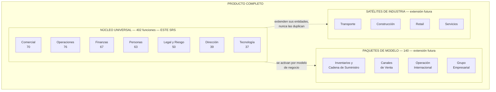

## 2. Descripción general del sistema

> Parte del [SRS del OS](./00-indice.md). Las claves (`RF-`, `RNF-`, `CU-`, `RN-`) son estables y se referencian entre documentos.

### 2.1 Perspectiva del producto

El sistema es un producto nuevo, sin sistema predecesor que reemplace directamente. Se inserta en un lugar que hoy ocupan, parcialmente y sin comunicarse, un CRM, un ERP ligero, el sistema del despacho contable, hojas de cálculo y carpetas de documentos.

La arquitectura de producto es **núcleo universal + satélites de industria**:

**Las tres reglas que sostienen esta arquitectura** y que este SRS hace obligatorias:

| # | Regla | Requisito que la impone |
|---|---|---|
| 1 | El núcleo funciona completo con todos los satélites desactivados | `RNF-090` |
| 2 | Un satélite **extiende** una entidad del núcleo; nunca la duplica ni la modifica | `RNF-091` |
| 3 | Un satélite vive dentro de los módulos existentes y se comunica por el bus de eventos, como cualquier módulo | `RNF-092` |

### 2.2 Diagrama de contexto

Quién y qué interactúa con el sistema, y en qué dirección fluye la información.

```mermaid
graph TB
    subgraph PERSONAS["Personas de la empresa"]
        U1["Propietario<br/>Dirección"]
        U2["Contabilidad<br/>Tesorería"]
        U3["Comercial"]
        U4["Personas RH"]
        U5["Operaciones"]
        U6["Campo<br/>PWA"]
        U7["Colaborador"]
        U8["Administrador<br/>del sistema"]
    end

    SISTEMA["<b>OS — Sistema Operativo de Negocio</b><br/>Aplicación web multiempresa + PWA"]

    subgraph EXTERNOS["Sistemas y terceros externos"]
        E1["PAC<br/>sella CFDI"]
        E2["SAT<br/>descarga masiva,<br/>catálogos, listas"]
        E3["Bancos<br/>estados de cuenta,<br/>layouts de pago"]
        E4["IMSS / INFONAVIT<br/>IDSE, SUA"]
        E5["Correo<br/>transaccional"]
        E6["Slack / n8n<br/>webhooks opcionales"]
    end

    subgraph CONTRAPARTES["Contrapartes del negocio"]
        C1["Cliente"]
        C2["Proveedor"]
        C3["Contador externo"]
        C4["Autoridad<br/>en auditoría"]
    end

    U1 --> SISTEMA
    U2 --> SISTEMA
    U3 --> SISTEMA
    U4 --> SISTEMA
    U5 --> SISTEMA
    U6 --> SISTEMA
    U7 --> SISTEMA
    U8 --> SISTEMA

    SISTEMA -->|"XML a timbrar"| E1
    E1 -->|"XML timbrado, UUID"| SISTEMA
    E2 -->|"CFDI recibidos, catálogos,<br/>lista 69-B, opinión"| SISTEMA
    E3 -->|"estado de cuenta"| SISTEMA
    SISTEMA -->|"layout de pagos"| E3
    SISTEMA -->|"archivos de movimientos<br/>y cuotas"| E4
    SISTEMA -->|"facturas, recordatorios,<br/>alertas"| E5
    SISTEMA -.->|"eventos seleccionados"| E6

    SISTEMA -->|"factura XML + PDF,<br/>estado de cuenta"| C1
    C2 -->|"factura, vía SAT"| SISTEMA
    SISTEMA -->|"balanza, pólizas,<br/>papeles de trabajo"| C3
    SISTEMA -->|"contabilidad electrónica,<br/>evidencia con hash"| C4
```

**Lectura del diagrama.** El sistema es el único punto donde una persona de la empresa captura o consulta información de negocio. Hacia afuera existen exactamente seis integraciones y ninguna de ellas es opcional para operar, salvo la última:

| Integración | ¿Se puede operar sin ella? | Qué pasa si falla |
|---|---|---|
| PAC | No: sin PAC no hay factura válida | El CFDI queda en estado `por_timbrar` y se reintenta. Ver `RF-118` y §11.7 |
| SAT descarga masiva | Sí, con captura manual de gastos | Los gastos se capturan a mano ese día; al restablecerse, la descarga recupera el histórico |
| Bancos | Sí, con captura manual de movimientos | La conciliación se retrasa; no se pierde nada |
| IMSS / INFONAVIT | Sí: son archivos que una persona carga en sus portales | La nómina se calcula igual; los archivos se generan después |
| Correo | Sí | Las facturas y alertas quedan en cola; se reenvían |
| Slack / n8n | Sí, está desactivado por defecto | Nada |

### 2.3 Clases de usuario

El sistema **no** es "software para administración". Es software para toda la empresa, con la superficie visible recortada por rol. Esta es la definición formal de los actores.

| ID | Actor | Quién es en la empresa real | Qué hace en el sistema | Frecuencia de uso | Dispositivo | Competencia técnica |
|---|---|---|---|---|---|---|
| `ACT-01` | **Propietario** | Dueño o socio | Ve todo, incluidos salarios individuales. Es el único que no puede ser restringido | Semanal | Escritorio, móvil | Media |
| `ACT-02` | **Administrador** | Quien administra el sistema (puede ser el propio dueño al inicio) | Usuarios, roles, configuración, integraciones, respaldos. **No** ve contenido de negocio | Mensual | Escritorio | Media-alta |
| `ACT-03` | **Dirección** | Director general o gerente general | Lee todas las áreas, aprueba lo que excede umbrales, fija objetivos. Ve totales de nómina, no salarios individuales | Diaria | Escritorio, móvil | Media |
| `ACT-04` | **Tesorería** | Quien maneja el dinero | Bancos, cobranza, programación de pagos, conciliación | Diaria | Escritorio | Media |
| `ACT-05` | **Contabilidad** | Contador interno o despacho externo con acceso | Pólizas, cierre, impuestos, contabilidad electrónica, reglas contables | Diaria en cierre, semanal el resto | Escritorio | Alta en su dominio |
| `ACT-06` | **Personas** | Recursos humanos | Expedientes, nómina, IMSS, incidencias. Único rol que ve salarios individuales además del Propietario | Diaria | Escritorio | Media |
| `ACT-07` | **Comercial** | Vendedor o gerente comercial | Prospectos, clientes, cotizaciones, pedidos, facturación desde pedido | Diaria | Escritorio, móvil | Baja-media |
| `ACT-08` | **Operaciones** | Quien coordina y despacha el trabajo | Órdenes de trabajo, asignación, compras, proveedores, activos | Diaria | Escritorio, tableta | Media |
| `ACT-09` | **Campo** | Quien ejecuta el trabajo fuera de la oficina | Sus órdenes asignadas, checklists, evidencias, consumos, incidencias. Solo ve lo propio | Diaria | **Móvil (PWA), frecuentemente sin señal** | **Baja. Diseñar para esto** |
| `ACT-10` | **Colaborador** | Cualquier empleado | Su espacio: recibos de nómina, vacaciones, permisos, gastos, capacitación | Quincenal | Móvil | Baja |
| `ACT-11` | **Agente de IA** | Actor no humano que actúa dentro del sistema | Lo que su usuario invocador puede hacer, nunca más | Continua | — | — |
| `ACT-12` | **Sistema externo** | PAC, SAT, banco, correo | Intercambia datos por adaptador | Continua | — | — |
| `ACT-13` | **Planificador** | Actor interno del sistema: tareas programadas | Descarga diaria, alertas, recordatorios, respaldos, despacho de eventos | Continua | — | — |

**Consecuencias de diseño que se derivan de la tabla anterior** y que este SRS convierte en requisitos:

1. `ACT-09` (Campo) tiene baja competencia técnica y conectividad intermitente. Por eso la PWA **debe** funcionar sin conexión y sincronizar al recuperarla (`RF-014`, `RNF-047`).
2. `ACT-02` (Administrador) **no debe** poder leer contenido de negocio. Separar quién administra el sistema de quién ve el dinero es un control, no una comodidad (`RF-005`, `RNF-055`).
3. `ACT-11` (Agente de IA) nunca amplía permisos. Un agente que puede leer algo que su invocador no puede es una fuga de datos, no una funcionalidad (`RF-230`, `RNF-058`).
4. `ACT-03` (Dirección) ve el costo total de nómina pero no los salarios individuales. La agregación es el control (`RF-166`, `RNF-063`).

### 2.4 Entorno operativo

| Elemento | Especificación | Requisito |
|---|---|---|
| Cliente web | Navegadores con soporte vigente del fabricante: Chrome, Edge, Firefox, Safari — las dos últimas versiones mayores | `RNF-040` |
| Cliente móvil | PWA instalable en Android e iOS, con cámara, geolocalización y almacenamiento local | `RNF-045` |
| Resolución mínima | 360 px de ancho (móvil) y 1280 px (escritorio) | `RNF-042` |
| Servidor de aplicación | Plataforma de cómputo sin servidor con despliegue continuo desde el repositorio: **Vercel** (confirmado) | `RNF-100` |
| Base de datos | **PostgreSQL 16 o superior sobre Supabase** (confirmado), con RLS, `pg_cron` y bóveda de secretos | `RNF-101` |
| Almacenamiento de archivos | Almacenamiento de objetos con URLs firmadas de vigencia limitada | `RNF-102` |
| Región de datos | Los datos **deben** residir en una región geográfica declarada y estable | `RNF-064` |
| Conectividad del usuario | Se asume conexión intermitente en campo y estable en oficina | `RNF-047` |
| Zona horaria de operación | América/Ciudad de México para presentación; UTC para almacenamiento | `RNF-085` |
| Idioma | Español de México, con arquitectura preparada para otros idiomas | `RNF-080`, §13.6 |
| Moneda base | Peso mexicano (MXN), con soporte multimoneda en nivel Profesional | `RF-128` |

### 2.5 Restricciones de diseño e implementación

Estas restricciones no son negociables por quien implementa. Cambiar alguna exige un ADR aprobado.

| # | Restricción | Razón |
|---|---|---|
| `RE-01` | Una sola aplicación desplegable, con módulos de frontera estricta (monolito modular). No microservicios | El equipo es una persona con IA; operar microservicios excede su capacidad. Ver ADR-0001 |
| `RE-02` | Un esquema de base de datos por módulo. Un módulo escribe solo en su esquema | Hace la frontera verificable por la base de datos, no por disciplina |
| `RE-03` | La frontera entre módulos se verifica con herramienta automática en CI, no por revisión humana | Una frontera que solo vive en la cabeza no existe |
| `RE-04` | El libro contable es de solo inserción. Ningún `UPDATE` ni `DELETE` | Es evidencia ante la autoridad. Ver ADR-0002 |
| `RE-05` | Toda tabla de negocio lleva `empresa_id` y política RLS desde su primera migración | Agregar multiempresa después es una reescritura |
| `RE-06` | Ningún parámetro fiscal, laboral o de seguridad social vive en el código | La norma cambia cada año; el código no debe cambiar por eso |
| `RE-07` | Los importes monetarios se representan con decimal exacto, nunca con punto flotante | Un centavo perdido por redondeo binario invalida una balanza |
| `RE-08` | Toda escritura de negocio deja rastro en bitácora | Requisito de auditoría y de diagnóstico |
| `RE-09` | Los secretos viven en almacén cifrado; las tablas guardan solo la referencia | Una fuga de base de datos no debe ser una fuga de credenciales |
| `RE-10` | Toda integración externa vive detrás de un adaptador con interfaz propia del sistema | Cambiar de proveedor no debe tocar módulos de negocio. Ver ADR-0003 |
| `RE-11` | El dominio se nombra en español (`factura`, `poliza`, `cobranza`) | Quien valida las reglas es un contador mexicano, no un ingeniero anglosajón |
| `RE-12` | Las reglas contables se almacenan como datos, no como código | El contador debe poder ajustarlas sin reprogramar |

### 2.6 Supuestos y dependencias

**Supuestos** — si alguno resulta falso, el alcance o el calendario cambian:

| # | Supuesto | Si resulta falso |
|---|---|---|
| `SU-01` | El PAC elegido acepta recibir el comprobante y sellarlo con el CSD que la empresa le cargó | Hay que implementar cadena original, XSLT y firma propios: semanas adicionales |
| `SU-02` | Existe un proveedor con API para la descarga masiva de CFDI del SAT | Hay que implementar el servicio SOAP con e.firma y custodiarla |
| `SU-03` | Los bancos de los clientes entregan estado de cuenta descargable en un formato tabular estable | La conciliación bancaria se vuelve captura manual asistida |
| `SU-04` | Un contador validará el catálogo de cuentas y las reglas contables antes de construir el motor | El motor se construye sobre supuestos y se rehace tras el primer cierre |
| `SU-05` | La empresa de prueba tiene RFC, e.firma, CSD y cuenta bancaria empresarial al llegar a producción | Se puede desarrollar y probar en sandbox, pero no liberar |
| `SU-06` | El volumen inicial es de una a pocas empresas, con decenas de usuarios y miles de documentos al mes | Las decisiones de §13.3 se adelantan |

**Dependencias externas** — el sistema no controla estos elementos:

| # | Dependencia | Riesgo asociado |
|---|---|---|
| `DE-01` | Disponibilidad del PAC | Sin PAC no se factura. Mitigación: cola de reintento y estado explícito (`RF-118`) |
| `DE-02` | Disponibilidad y cambios del SAT (catálogos, versiones de complemento, esquemas) | Mitigación: parámetros con vigencia y adaptadores (`RF-012`) |
| `DE-03` | Cambios anuales en tablas de ISR, UMA, salario mínimo, cuotas IMSS, tasas de ISN | Mitigación: carga de parámetros sin despliegue |
| `DE-04` | Formatos de archivo de IDSE y SUA | Mitigación: generación por adaptador, validada con el contador |
| `DE-05` | Continuidad del proveedor de base de datos y de cómputo | Mitigación: PostgreSQL estándar y exportación completa bajo demanda (`RNF-075`) |

---

---

[← 01-introduccion](./01-introduccion.md) · [Índice](./00-indice.md) · [03-dominio-y-glosario →](./03-dominio-y-glosario.md)
