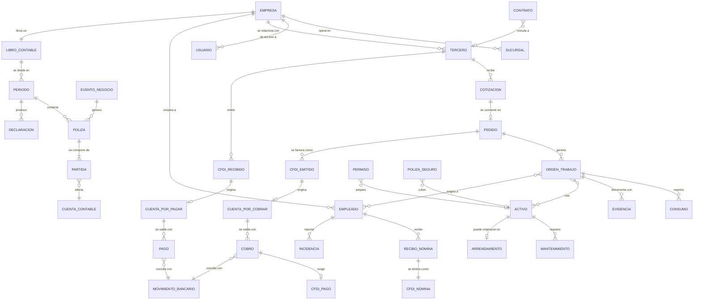

## 3. Dominio del problema

> Parte del [SRS del OS](./00-indice.md). Las claves (`RF-`, `RNF-`, `CU-`, `RN-`) son estables y se referencian entre documentos.

Esta sección describe el mundo real que el software modela. Se escribe antes que los requisitos porque un requisito que contradiga el dominio es un requisito equivocado, aunque esté bien redactado.

### 3.1 Modelo conceptual del dominio

Las entidades del negocio y cómo se relacionan, independientemente de cómo se guarden.

**Cómo se lee este modelo.** Hay cuatro cadenas que atraviesan el sistema y explican por qué las áreas no se pueden construir por separado:

| Cadena | Recorrido | Por qué importa |
|---|---|---|
| **Del ingreso** | Tercero → Cotización → Pedido → Orden de trabajo → CFDI emitido → CxC → Cobro → CFDI de pago → Movimiento bancario → Póliza | Es el camino del dinero que entra. Cortarlo en cualquier punto obliga a recapturar |
| **Del egreso** | Tercero → CFDI recibido → CxP → Autorización → Pago → Movimiento bancario → Póliza | Es el camino del dinero que sale, y la fuente del IVA acreditable y la DIOT |
| **Del trabajo** | Pedido → Orden de trabajo → Asignación (empleados, activos) → Consumos → Evidencias → Cierre → Facturación | Es lo que permite comparar lo que costó ejecutar contra lo que se cobró |
| **De la gente** | Empleado → Incidencias → Recibo de nómina → CFDI de nómina → Dispersión → Póliza → Obligaciones IMSS/ISN | Es la mayor partida de costo de casi cualquier empresa de servicios |

Las cuatro terminan en el mismo lugar: **una póliza en el libro contable**. Esa convergencia es el corazón del producto.

### 3.2 Reglas del dominio (invariantes)

Estas son verdades del negocio, no decisiones de software. El sistema **debe** hacerlas imposibles de violar, no solo desaconsejarlas. Una regla que el sistema permite romper "en un caso especial" no es una regla.

| # | Regla del dominio | Dónde se hace cumplir |
|---|---|---|
| `RN-001` | La suma de cargos de una póliza es exactamente igual a la suma de sus abonos | Restricción en la base de datos, verificada al cierre de la transacción |
| `RN-002` | Una partida contable tiene cargo o abono, nunca ambos, nunca ninguno | Restricción en la base de datos |
| `RN-003` | Una póliza registrada no se modifica ni se elimina. Se corrige con una póliza de reversa | Disparador que rechaza `UPDATE` y `DELETE` |
| `RN-004` | Un periodo contable cerrado no admite pólizas nuevas ni modificaciones | Disparador que valida el estado del periodo |
| `RN-005` | Un CFDI timbrado no se modifica. Se cancela y, si procede, se sustituye | Máquina de estados del CFDI (§11.1) |
| `RN-006` | Un CFDI cancelado que ya generó póliza exige una póliza de reversa; el libro nunca se borra | Motor contable |
| `RN-007` | El IVA trasladado se causa al **cobrar**, no al facturar; el IVA acreditable se causa al **pagar**, no al recibir la factura | Motor fiscal y reglas contables `R-01` a `R-07` |
| `RN-008` | Una factura con método de pago PPD obliga a emitir un complemento de pago por cada cobro | `RF-119`, alerta automática |
| `RN-009` | Un cobro no puede aplicarse por un importe mayor al saldo insoluto de la factura | Validación en la aplicación de pagos |
| `RN-010` | Un dato de una empresa nunca es visible desde otra empresa | RLS en toda tabla de negocio |
| `RN-011` | El salario individual de un empleado solo es visible para Personas y Propietario | RLS restringida en la tabla de condiciones salariales |
| `RN-012` | Un empleado dado de baja pierde el acceso al sistema el mismo día | `RF-009` |
| `RN-013` | Un pago que excede el umbral configurado requiere aprobación de **otra persona** con rol autorizado, nunca de quien lo capturó, aunque tenga el rol que aprueba | Motor de flujos, `RF-152`, `RF-032` |
| `RN-014` | Quien captura una operación no puede ser quien la aprueba | Motor de flujos, `RNF-057` |
| `RN-015` | Un documento fiscal o contable se conserva mínimo 5 años y no se elimina | Política de archivos, `RNF-070` |
| `RN-016` | Un parámetro fiscal aplica según la fecha del hecho económico, no según la fecha de captura | Consulta de parámetro por vigencia, `RF-012` |
| `RN-017` | Una orden de trabajo cerrada no admite consumos nuevos | Máquina de estados de la orden (§11.3) |
| `RN-018` | Un activo dado de baja no puede asignarse a una orden de trabajo | Validación de asignación |
| `RN-019` | Un empleado con documento obligatorio vencido no puede ser asignado a trabajo que lo requiera | Validación de asignación, `RF-186` |
| `RN-020` | Un tercero listado en el artículo 69-B del CFF marca sus comprobantes como no deducibles hasta resolución | `RF-140` |
| `RN-021` | El importe de un documento se calcula por concepto y se suma; nunca se calcula sobre el total | Motor fiscal, §11.8 |
| `RN-022` | Un agente de IA no puede leer ni escribir nada que su usuario invocador no pueda | `RF-230` |
| `RN-023` | Un evento de negocio se publica dentro de la misma transacción que el cambio que lo produjo | Patrón outbox, `RF-021` |
| `RN-024` | Procesar dos veces el mismo evento produce el mismo resultado que procesarlo una vez | Idempotencia, `RF-022` |
| `RN-025` | Toda escritura de negocio queda registrada con autor, momento y valor anterior | Bitácora, `RF-024` |

### 3.3 Glosario de términos

Ordenado por ámbito. Incluye los términos que aparecen en este documento y en el código.

#### 3.3.1 Términos del producto

| Término | Definición precisa |
|---|---|
| **Núcleo** | Conjunto de funciones que sirven a cualquier empresa sin importar su giro. 402 funciones. Es el alcance de este SRS |
| **Satélite** | Extensión del sistema para una industria concreta. Extiende entidades del núcleo agregando tablas en su propio esquema; nunca modifica las del núcleo |
| **Paquete de modelo de negocio** | Add-on que se activa según el modelo de negocio (inventarios, canales de venta, operación internacional, grupo empresarial), no según la industria |
| **Área** | Una de las 7 divisiones del catálogo de funciones. Corresponde uno a uno con un módulo de código y un esquema de base de datos |
| **Departamento** | Subdivisión dentro de un área (Contabilidad, Fiscal, Tesorería…). Hay 46 |
| **Función** | Unidad del catálogo de producto, con clave estable (`FIN-020`). Pertenece a exactamente un área y un departamento |
| **Nivel** | `E` Esencial, `P` Profesional, `A` Avanzado. Determina en qué plan comercial aparece la función, no cuándo se construye |
| **Plan** | Empaquetado comercial: Basic (nivel E, 118 funciones), Pro (E+P, 281), Max (E+P+A, 402) |
| **Micro app** | Calculadora autocontenida (IVA, finiquito, punto de equilibrio). No escribe en la base de negocio; solo lee parámetros vigentes |
| **Espacio del Colaborador** | Vista mínima que todo empleado tiene: sus recibos, vacaciones, permisos, gastos y capacitación |
| **Agente de IA** | Componente que ejecuta tareas en nombre de un usuario, con exactamente sus permisos |

#### 3.3.2 Términos de arquitectura

| Término | Definición precisa |
|---|---|
| **Monolito modular** | Una sola aplicación desplegable, dividida en módulos con fronteras reales: código, esquema de base de datos y contrato público propios |
| **Contrato (`contracts`)** | Lo único que un módulo expone a los demás: tipos y funciones públicas. El resto es interno e inaccesible |
| **Bus de eventos** | Mecanismo por el cual un módulo comunica que algo ocurrió, sin conocer ni llamar a quienes reaccionan |
| **Outbox** | Patrón en el que el evento se escribe en una tabla dentro de la misma transacción que el cambio de negocio. Si la transacción falla, el evento no existe; si tiene éxito, el evento se entregará |
| **Suscriptor** | Componente que reacciona a un tipo de evento. Un evento puede tener varios; ninguno conoce a los otros |
| **Idempotencia** | Propiedad por la que procesar la misma entrada dos veces produce el mismo resultado que procesarla una vez |
| **Dead-letter** | Destino de un evento que agotó sus reintentos. Genera alerta; nunca se descarta en silencio |
| **RLS** (Row Level Security) | Mecanismo de PostgreSQL que filtra por fila según la sesión. Es lo que aísla una empresa de otra |
| **Vault** | Almacén cifrado de secretos. Las tablas de negocio guardan solo una referencia |
| **Bitácora** | Registro inmutable de quién hizo qué, cuándo y desde dónde |
| **Los 6 almacenes** | ① operativa ② libro contable inmutable ③ bóveda cifrada ④ eventos de alto volumen ⑤ archivos ⑥ analítico |
| **Motor** | Componente transversal con lógica especializada que varios módulos consumen: fiscal, contable, nómina, flujos, documentos, alertas |
| **Adaptador** | Traductor entre la interfaz que define el sistema y la API concreta de un proveedor externo |
| **Multiempresa (multi-tenant)** | Capacidad de servir a varias empresas con una sola instancia, con aislamiento estricto entre ellas |

#### 3.3.3 Términos contables

| Término | Definición precisa |
|---|---|
| **Póliza** | Asiento contable: conjunto de partidas con cargos y abonos que suman igual. Aquí la genera el motor contable a partir de eventos |
| **Partida** | Renglón de una póliza: una cuenta y un cargo o un abono, nunca ambos |
| **Cargo / abono** | Los dos lados del registro contable. En cuentas de naturaleza deudora el cargo aumenta; en las acreedoras, disminuye |
| **Cuenta contable** | Clasificador del catálogo donde se registran los movimientos. Lleva naturaleza (deudora/acreedora) y código agrupador del SAT |
| **Código agrupador SAT** | Clasificación oficial obligatoria que asocia cada cuenta de la empresa con una cuenta estándar del SAT |
| **Balanza de comprobación** | Listado de todas las cuentas con saldo inicial, movimientos y saldo final. Si no cuadra, hay un error |
| **Libro diario / libro mayor** | Registro cronológico de pólizas / registro acumulado por cuenta |
| **Póliza de reversa** | Póliza que anula una anterior invirtiendo sus partidas. Única forma válida de corregir |
| **Periodo contable** | Mes o ejercicio. Puede estar abierto o cerrado; cerrado significa bloqueado para escritura |
| **Cierre** | Proceso por el cual un periodo se revisa, se completa y se bloquea |
| **Devengado** | Criterio por el cual un ingreso o gasto se registra cuando ocurre, independientemente del movimiento de dinero |
| **Flujo de efectivo** | Criterio por el cual algo se reconoce cuando el dinero se mueve. En México el IVA sigue este criterio |
| **Depreciación / amortización** | Reconocimiento del desgaste de un activo tangible / intangible o derecho de uso, a lo largo de su vida útil |
| **Provisión** | Reconocimiento de una obligación cuyo monto o fecha es estimado |
| **Estado de resultados** | Reporte de ingresos menos costos y gastos de un periodo |
| **Balance general** | Reporte de activos, pasivos y capital a una fecha |
| **NIF** | Normas de Información Financiera mexicanas. La NIF D-5 regula arrendamientos: un bien arrendado se reconoce como activo por derecho de uso con su pasivo |
| **Centro de costo** | Clasificador adicional (sucursal, proyecto, unidad de negocio) que permite ver resultados por segmento |

#### 3.3.4 Términos fiscales mexicanos

| Término | Definición precisa |
|---|---|
| **SAT** | Servicio de Administración Tributaria: la autoridad fiscal mexicana |
| **RFC** | Registro Federal de Contribuyentes: identificador fiscal de una persona física o moral |
| **CFDI 4.0** | Comprobante Fiscal Digital por Internet: la factura electrónica. Es un XML que solo es válido una vez sellado por un PAC |
| **PAC** | Proveedor Autorizado de Certificación: empresa autorizada por el SAT para sellar CFDI. Sin PAC no hay comprobante válido |
| **Timbrar** | Acto por el cual el PAC sella el comprobante y le asigna su folio fiscal (UUID) |
| **UUID / folio fiscal** | Identificador único e irrepetible que el PAC asigna a cada CFDI |
| **CSD** | Certificado de Sello Digital: certificado con el que se firman los CFDI |
| **e.firma** | Firma electrónica avanzada del contribuyente. Da acceso a trámites; es más sensible que el CSD |
| **PUE / PPD** | Pago en Una sola Exhibición / Pago en Parcialidades o Diferido. Un CFDI PPD obliga a emitir complemento de pago por cada cobro |
| **Complemento de pagos 2.0** | Comprobante que se emite al cobrar total o parcialmente una factura PPD |
| **Complemento de nómina 1.2** | Estructura con la que se timbra cada recibo de nómina |
| **Uso de CFDI** | Clave que declara para qué usará el receptor el comprobante. Debe ser compatible con su régimen fiscal |
| **Régimen fiscal** | Clasificación del contribuyente que determina sus obligaciones y los usos de CFDI válidos |
| **Descarga masiva** | Servicio del SAT que permite obtener los CFDI emitidos y recibidos de un periodo. Es la fuente automática de gastos |
| **IVA trasladado** | IVA que la empresa cobra a sus clientes |
| **IVA acreditable** | IVA que la empresa paga a sus proveedores y puede restar del trasladado |
| **IVA retenido** | IVA que un tercero retiene a la empresa, o que la empresa retiene a un tercero, según el tipo de operación |
| **IVA en flujo** | Principio por el cual el IVA se causa al cobrar y se acredita al pagar, no al facturar |
| **DIOT** | Declaración Informativa de Operaciones con Terceros: mensual, se construye desde los CFDI recibidos pagados |
| **ISR provisional** | Pago mensual a cuenta del impuesto anual, calculado con el coeficiente de utilidad del ejercicio anterior |
| **Coeficiente de utilidad** | Factor que relaciona la utilidad fiscal con los ingresos del ejercicio anterior; base del pago provisional |
| **Retención** | Impuesto que quien paga descuenta y entera por cuenta de quien cobra (honorarios, arrendamiento, salarios) |
| **69-B (EFOS)** | Lista pública de contribuyentes que emitieron comprobantes de operaciones inexistentes. Comprar a uno invalida la deducción |
| **Opinión de cumplimiento** | Documento del SAT que indica si un contribuyente está al corriente |
| **Contabilidad electrónica** | Obligación de entregar al SAT catálogo de cuentas, balanza y, bajo requerimiento, pólizas, en XML |
| **PTU** | Participación de los Trabajadores en las Utilidades: reparto anual obligatorio |
| **RESICO** | Régimen Simplificado de Confianza, con reglas y tasas propias |
| **Carta Porte** | Complemento obligatorio para trasladar mercancía por vías federales. Pertenece a un satélite de industria, no al núcleo |

#### 3.3.5 Términos de nómina y seguridad social

| Término | Definición precisa |
|---|---|
| **IMSS** | Instituto Mexicano del Seguro Social. Recibe altas, bajas, modificaciones de salario y cuotas |
| **SDI** | Salario Diario Integrado: base de cálculo de las cuotas, incluye prestaciones |
| **Factor de integración** | Multiplicador que convierte el salario diario en SDI según las prestaciones de ley y las adicionales |
| **SUA** | Sistema Único de Autodeterminación: software con el que se determinan y pagan las cuotas al IMSS e INFONAVIT |
| **IDSE** | Portal del IMSS para movimientos afiliatorios |
| **INFONAVIT / FONACOT** | Instituciones cuyos créditos se descuentan por nómina y se enteran junto con las cuotas |
| **ISN** | Impuesto Sobre Nómina: estatal; tasa y reglas cambian por estado |
| **UMA** | Unidad de Medida y Actualización: referencia para topes, multas y cuotas |
| **Subsidio para el empleo** | Cantidad que reduce el ISR de los salarios bajos, con reglas propias que han cambiado recientemente |
| **Prima de riesgo de trabajo** | Porcentaje que el IMSS asigna a la empresa según su siniestralidad |
| **Incidencia** | Hecho del periodo que afecta la nómina: falta, incapacidad, hora extra, permiso, percepción variable |
| **Finiquito / liquidación** | Pago por terminación de la relación laboral: finiquito siempre; liquidación cuando el despido es injustificado |
| **NOM-035** | Norma que obliga a identificar y prevenir factores de riesgo psicosocial |
| **REPSE** | Registro de prestadoras de servicios especializados u obras especializadas |

#### 3.3.6 Términos de construcción y calidad

| Término | Definición precisa |
|---|---|
| **Caso dorado** | Escenario de prueba con entradas y resultado esperado exactos, revisado y firmado por el contador. Los motores deben pasarlo siempre |
| **ADR** | Architecture Decision Record: registro de una decisión de arquitectura con su contexto, alternativas y consecuencias |
| **Tarea** | Unidad de trabajo del plan de construcción, con clave por área (`T-FIN-04`), dependencias y criterio de aceptación |
| **Semilla** | Datos iniciales cargados en un entorno para poder probar |
| **Definición de terminado** | Lista de condiciones que una tarea debe cumplir antes de considerarse completa |

---

### 3.4 Los regímenes fiscales soportados

El sistema **no asume un régimen fiscal**. El régimen es un dato que la empresa declara al darse de alta (`RF-001`) y que gobierna, desde ahí, tres cosas distintas: cuándo se acumula el ingreso, cómo se calcula el ISR, y qué obligaciones informativas existen.

El núcleo soporta cuatro regímenes. La clave del catálogo del SAT se carga como dato (`RF-011`); las que aparecen aquí son de referencia y se validan contra el catálogo vigente.

| Régimen | Clave SAT (ref.) | Fundamento | Base de acumulación | ISR provisional |
|---|---|---|---|---|
| **General de personas morales** | `601` | LISR Título II | **Devengado**: se acumula al expedir el comprobante, entregar el bien o cobrar, lo que ocurra primero | Ingresos nominales × coeficiente de utilidad del ejercicio anterior, menos pérdidas pendientes, PTU pagada, pagos previos y retenciones |
| **RESICO de personas morales** | `626` | LISR Título VII Cap. XII | **Flujo de efectivo**: se acumula lo efectivamente cobrado | Ingresos cobrados menos deducciones pagadas, sin coeficiente de utilidad. Deducción de inversiones con porcientos propios |
| **Coordinados (autotransporte)** | `624` | LISR Título II Cap. VII | **Flujo de efectivo** | Utilidad determinada conforme al régimen de actividad empresarial de personas físicas; el coordinado cumple por cuenta de sus integrantes. Aplican las facilidades administrativas del ejercicio |
| **Persona física con actividad empresarial y profesional** | `612` | LISR Título IV Cap. II Sec. I | **Flujo de efectivo** | Utilidad acumulada del periodo contra la tarifa progresiva, menos pagos previos y retenciones |
| **RESICO de personas físicas** | `626` | LISR Título IV Cap. II Sec. IV | **Flujo de efectivo** | Tasa sobre ingresos **cobrados**, sin deducciones, conforme a la tabla del régimen. Retención de las personas morales que le pagan |

**Lo que cambia y lo que no.** Conviene separarlo, porque la mayor parte del sistema es igual para todos:

| Ámbito | ¿Cambia con el régimen? | Detalle |
|---|---|---|
| Emisión y recepción de CFDI | **No** | El comprobante lleva el régimen del emisor y valida el del receptor; el mecanismo es el mismo (`RF-116`, `RF-117`) |
| IVA | **No** | El IVA siempre se causa en flujo, sea cual sea el régimen (`RF-131`). Por eso el catálogo de cuentas ya separa *IVA trasladado cobrado* de *no cobrado* |
| Nómina, IMSS, INFONAVIT, ISN | **No** | Dependen de tener empleados, no del régimen del patrón |
| Contabilidad de doble partida | **No** | Todos llevan libro; lo que cambia es **cuándo** se reconoce el ingreso |
| **Momento de acumulación** | **Sí** | Devengado o flujo. Es la diferencia de fondo: gobierna la regla contable que convierte un evento en póliza |
| **Cálculo de ISR provisional y anual** | **Sí** | Cada régimen tiene su propia definición de cálculo (`RF-053`) |
| **Contabilidad electrónica** | **Sí** | Obligatoria para personas morales; RESICO de personas físicas está relevado |
| **DIOT** | **Sí** | Aplica según el régimen y el ejercicio; vive como obligación del calendario, no como código |
| **PTU y coeficiente de utilidad** | **Sí** | Existen en el régimen general; no en RESICO ni en flujo de efectivo puro |
| **Facilidades administrativas** | **Sí** | Propias del autotransporte, publicadas cada año. Son parámetros con vigencia, nunca constantes |

**La decisión que ordena todo esto:** el régimen no es una bifurcación del código, es **una fila de un catálogo** con sus propiedades, y los cálculos son **definiciones de datos** que el motor interpreta. Un cambio del SAT en enero es una carga de datos y un caso dorado nuevo, no un despliegue. Ver `RF-051` a `RF-059` y `ADR-0006`.

**Límite declarado.** Los regímenes no listados —fines no lucrativos, AGAPES, plataformas tecnológicas, arrendamiento, grupos de sociedades— no están soportados. Agregar uno consiste en dar de alta su fila en el catálogo, escribir su definición de cálculo y sus casos dorados: no se modifica el código del motor. Esa es exactamente la prueba de que el diseño es correcto.

---

---

[← 02-descripcion-general](./02-descripcion-general.md) · [Índice](./00-indice.md) · [04-necesidades-del-negocio →](./04-necesidades-del-negocio.md)
