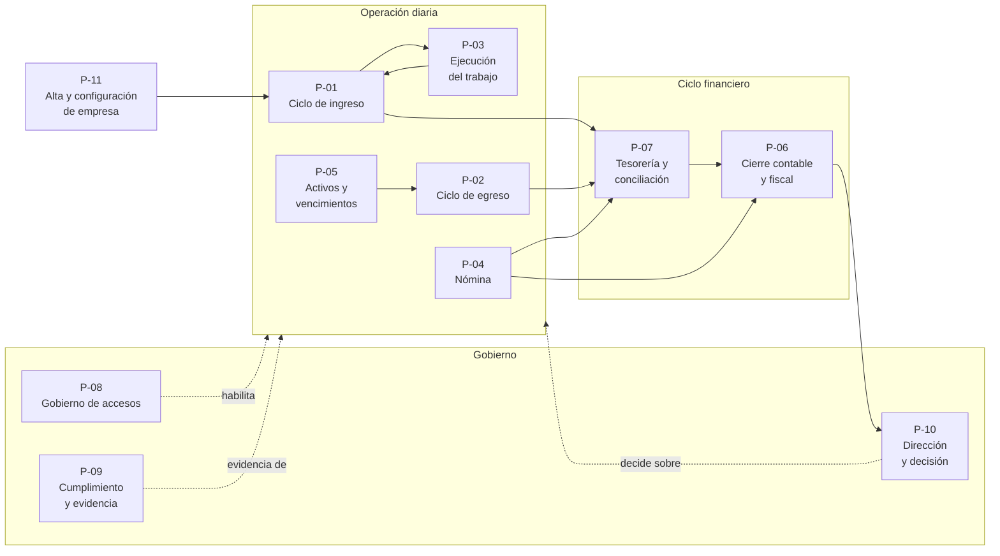
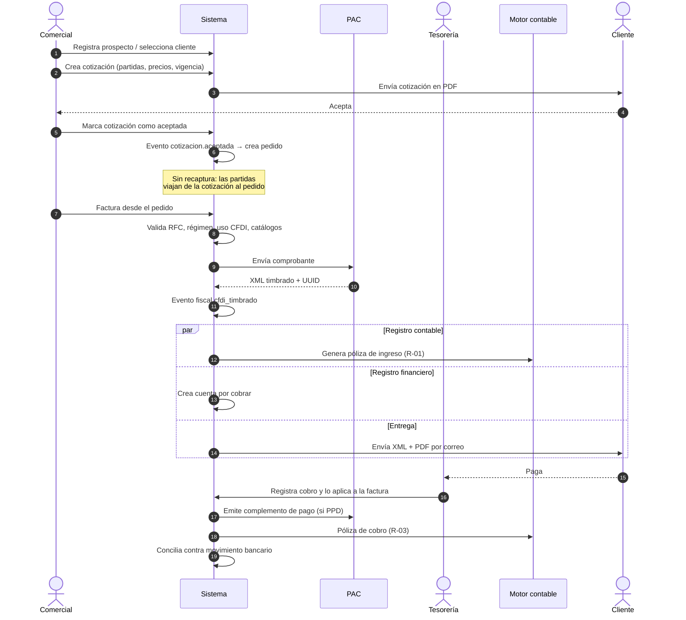
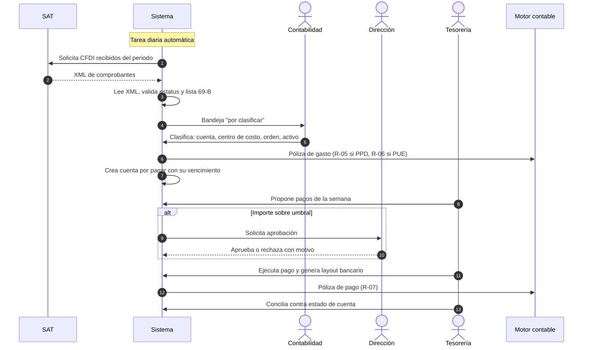
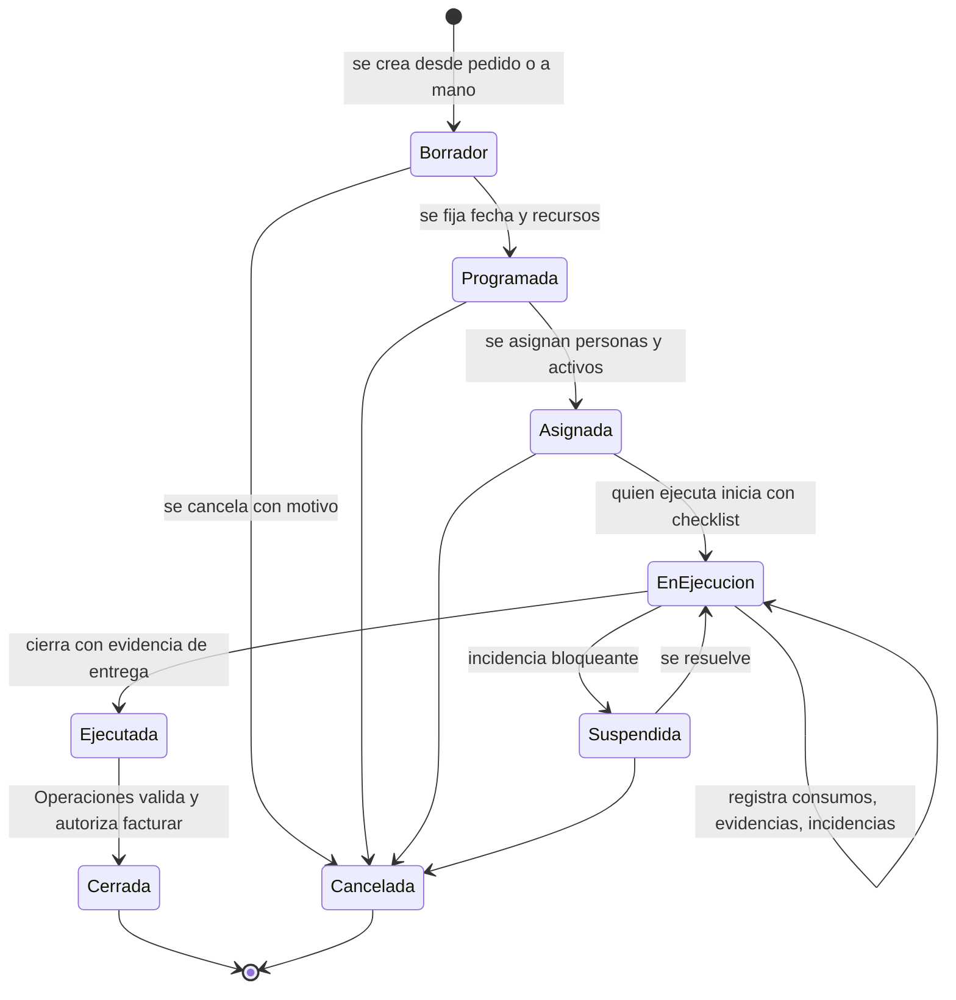
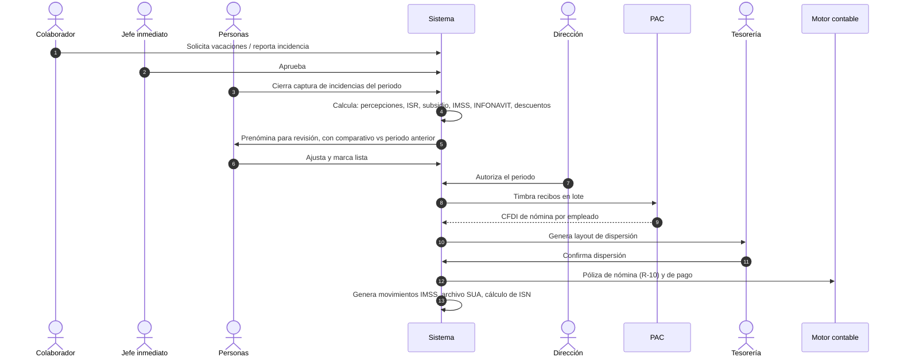
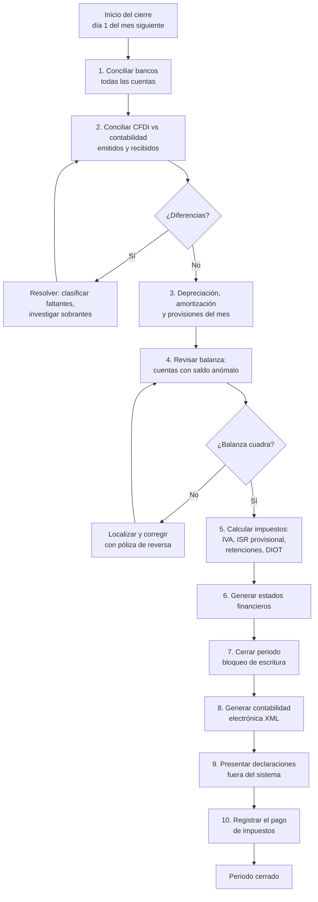

## 5. Procesos del negocio

> Parte del [SRS del OS](./00-indice.md). Las claves (`RF-`, `RNF-`, `CU-`, `RN-`) son estables y se referencian entre documentos.

Cada proceso describe cómo trabaja la empresa, no cómo se ve la pantalla. El software existe para soportar estos procesos; si un proceso cambia, cambian los requisitos que lo sirven.

Formato de cada proceso: objetivo · disparador · actores · precondiciones · flujo · excepciones · salidas · reglas · indicadores.

### 5.1 Mapa general de procesos

### 5.2 `P-01` · Ciclo de ingreso

**Objetivo.** Convertir una oportunidad comercial en dinero cobrado y registrado, capturando el dato una sola vez.

**Disparador.** Un prospecto solicita una propuesta, o un cliente existente pide un servicio o producto.

**Actores.** `ACT-07` Comercial (ejecuta) · `ACT-03` Dirección (autoriza descuentos fuera de política) · `ACT-04` Tesorería (cobra) · `ACT-05` Contabilidad (supervisa el registro) · `ACT-12` PAC (sella).

**Precondiciones.** La empresa tiene CSD cargado en el PAC, catálogo de productos y servicios configurado, y catálogo de cuentas con regla contable para ingresos.

**Flujo normal.**

| # | Paso | Quién | Salida |
|---|---|---|---|
| 1 | Registrar prospecto o seleccionar cliente existente | Comercial | Tercero en el maestro |
| 2 | Crear oportunidad y registrar actividades de seguimiento | Comercial | Oportunidad en el embudo |
| 3 | Elaborar cotización con partidas, precios de lista, vigencia y condiciones | Comercial | Cotización en estado `borrador` |
| 4 | Enviar cotización al cliente | Sistema | PDF enviado, cotización `enviada` |
| 5 | Registrar la aceptación del cliente | Comercial | Cotización `aceptada`; el sistema crea el pedido |
| 6 | Si el trabajo requiere ejecución, se dispara `P-03` | Sistema | Orden de trabajo |
| 7 | Facturar desde el pedido o desde la orden cerrada | Comercial | CFDI `por_timbrar` |
| 8 | Validar y timbrar | Sistema + PAC | CFDI `timbrado` con UUID |
| 9 | Registrar contablemente y crear la cuenta por cobrar | Motor contable | Póliza + CxC |
| 10 | Enviar XML y PDF al cliente | Sistema | Correo enviado y registrado |
| 11 | Gestionar cobranza según antigüedad y promesas de pago | Tesorería | Gestiones registradas |
| 12 | Registrar el cobro y aplicarlo a una o varias facturas | Tesorería | Cobro aplicado, saldo actualizado |
| 13 | Emitir complemento de pago si la factura era PPD | Sistema + PAC | CFDI de tipo pago |
| 14 | Conciliar contra el movimiento bancario | Tesorería | Movimiento conciliado |

**Excepciones.**

| Excepción | Comportamiento exigido |
|---|---|
| El cliente rechaza la cotización | Se registra el motivo. La cotización queda `rechazada` y alimenta el análisis de ganadas/perdidas |
| La cotización vence sin respuesta | Estado `vencida` automático al pasar la fecha de vigencia |
| El RFC del cliente no existe o el régimen no admite el uso de CFDI elegido | Se bloquea el timbrado **antes** de enviar al PAC, con mensaje que nombra el campo |
| El PAC rechaza el comprobante | El CFDI queda `error_timbrado` con el código y el mensaje del PAC. No se genera póliza. Se reintenta |
| El PAC no responde | El CFDI queda `por_timbrar` y se reintenta con espera creciente. Nunca se duplica el timbrado (§11.7) |
| El cliente paga de menos | La factura queda parcialmente saldada; el saldo insoluto sigue en antigüedad |
| El cliente paga de más o paga dos facturas juntas | Un cobro se aplica a varias facturas; el excedente queda como anticipo |
| La factura se emitió con error y ya está timbrada | Se cancela (con sustitución si procede) y se genera póliza de reversa. Nunca se edita |
| El cliente excede su límite de crédito | El pedido se bloquea y requiere autorización de Dirección |

**Salidas del proceso.** CFDI timbrado · póliza de ingreso · cuenta por cobrar · complemento de pago · movimiento bancario conciliado · datos para IVA trasladado cobrado.

**Reglas aplicables.** `RN-005`, `RN-007`, `RN-008`, `RN-009`, `RN-021`.

**Indicadores.** Tasa de conversión del embudo · tiempo de cotización a factura · DSO · porcentaje de facturas PPD con complemento emitido · porcentaje de cobros conciliados automáticamente.

### 5.3 `P-02` · Ciclo de egreso

**Objetivo.** Registrar, autorizar y pagar lo que la empresa debe, capturando el gasto desde la fuente oficial —el SAT— y no desde un papel.

**Disparador.** Un proveedor emite un CFDI a la empresa. El sistema lo descubre solo, por descarga masiva diaria.

**Actores.** `ACT-13` Planificador (descarga) · `ACT-05` Contabilidad (clasifica) · `ACT-08` Operaciones (valida la recepción) · `ACT-03` Dirección (autoriza sobre umbral) · `ACT-04` Tesorería (paga).

**Flujo normal.**

| # | Paso | Quién | Salida |
|---|---|---|---|
| 1 | Descargar los CFDI recibidos del SAT | Planificador | Comprobantes en bandeja |
| 2 | Validar estatus del comprobante y situación del emisor (69-B, opinión) | Sistema | Marca de riesgo si aplica |
| 3 | Clasificar: cuenta contable, centro de costo, orden de trabajo o activo | Contabilidad | Gasto clasificado |
| 4 | Conciliar contra orden de compra y recepción cuando existan | Operaciones | Conciliación de tres vías |
| 5 | Generar póliza y cuenta por pagar | Motor contable | Póliza + CxP |
| 6 | Programar pagos según vencimiento y flujo disponible | Tesorería | Propuesta de pago |
| 7 | Autorizar los que exceden el umbral | Dirección | Aprobación registrada |
| 8 | Ejecutar pago y generar layout bancario | Tesorería | Layout + póliza de pago |
| 9 | Conciliar contra el estado de cuenta | Tesorería | Movimiento conciliado |

**Excepciones.**

| Excepción | Comportamiento exigido |
|---|---|
| Existe un gasto sin CFDI | Se registra como gasto no deducible, marcado explícitamente. Nunca se inventa un comprobante |
| Existe un CFDI sin operación reconocida | Se marca para revisión. Es el mecanismo que detecta facturas apócrifas a nombre de la empresa |
| El proveedor aparece en la lista 69-B | El comprobante se marca como no deducible y genera alerta. No se borra: se documenta |
| El proveedor cancela un CFDI ya contabilizado | Se genera póliza de reversa y se avisa a Contabilidad |
| El importe pagado difiere del facturado | Se registra la diferencia (descuento, nota de crédito o error) y se exige su justificación |
| Un empleado pagó con recursos propios o con anticipo | Se registra como gasto por comprobar contra su cuenta de deudor, no contra bancos |
| El pago se rechaza en el banco | El pago vuelve a estado pendiente y la CxP se reabre |

**Salidas.** Póliza de gasto · CxP · pago · IVA acreditable pagado · insumos de la DIOT · retenciones enteradas.

**Reglas.** `RN-007`, `RN-013`, `RN-014`, `RN-020`.

**Indicadores.** Porcentaje de gastos que entran por descarga automática · días de clasificación pendiente · porcentaje de pagos con aprobación completa · gastos no deducibles sobre el total.

### 5.4 `P-03` · Ejecución del trabajo

**Objetivo.** Planear, ejecutar y documentar el trabajo comprometido, registrando lo que realmente costó.

**Disparador.** Un pedido aceptado que requiere ejecución, o una solicitud interna.

**Actores.** `ACT-08` Operaciones (planea y asigna) · `ACT-09` Campo (ejecuta) · `ACT-07` Comercial (factura al cierre).

**Flujo normal.**

| # | Paso | Quién | Salida |
|---|---|---|---|
| 1 | Crear la orden desde el pedido o manualmente, con plantilla del tipo de trabajo | Operaciones | Orden `borrador` |
| 2 | Programar fecha y verificar disponibilidad de recursos en la agenda | Operaciones | Orden `programada` |
| 3 | Asignar personas y activos, validando vigencias y disponibilidad | Operaciones | Orden `asignada` |
| 4 | Iniciar el trabajo con checklist de arranque | Campo (PWA) | Orden `en ejecución`, evidencias iniciales |
| 5 | Registrar consumos (materiales, horas, gastos) y evidencias durante la ejecución | Campo (PWA) | Consumos y archivos |
| 6 | Reportar incidencias si las hay | Campo | Incidencia con severidad y ubicación |
| 7 | Cerrar con evidencia de entrega y firma del cliente | Campo | Orden `ejecutada` |
| 8 | Validar y autorizar la facturación | Operaciones | Orden `cerrada`, evento que habilita facturar |
| 9 | Calcular el costo real y compararlo con lo cotizado | Sistema | Margen de la orden |

**Excepciones.**

| Excepción | Comportamiento exigido |
|---|---|
| No hay señal en el lugar de trabajo | La PWA guarda localmente y sincroniza al recuperar conexión, sin pérdida ni duplicación |
| Un activo asignado tiene mantenimiento vencido crítico | El sistema bloquea la asignación y explica por qué |
| Un empleado asignado tiene un documento obligatorio vencido | El sistema bloquea la asignación y notifica a Personas |
| El trabajo consume más de lo estimado | Se registra igual; la diferencia queda visible en el margen, no se oculta |
| El cliente rechaza el trabajo entregado | Se registra la incidencia, la orden vuelve a ejecución y el costo adicional queda registrado |
| La orden se cancela con consumos ya registrados | Los consumos permanecen y se contabilizan como costo sin ingreso asociado |

**Salidas.** Orden cerrada · consumos · evidencias · base para facturar · costo real para rentabilidad.

**Reglas.** `RN-017`, `RN-018`, `RN-019`.

**Indicadores.** Órdenes cerradas a tiempo · desviación costo real vs estimado · margen por orden · tiempo de ejecución.

### 5.5 `P-04` · Nómina

**Objetivo.** Calcular, autorizar, timbrar, dispersar y contabilizar la nómina, cumpliendo las obligaciones laborales y de seguridad social.

**Disparador.** El inicio de un periodo de nómina (semanal, quincenal o mensual).

**Actores.** `ACT-10` Colaborador (solicita) · jefe inmediato (aprueba) · `ACT-06` Personas (calcula) · `ACT-03` Dirección (autoriza) · `ACT-04` Tesorería (dispersa) · `ACT-12` PAC (timbra).

**Flujo normal.**

| # | Paso | Quién | Salida |
|---|---|---|---|
| 1 | Capturar y aprobar incidencias del periodo (faltas, incapacidades, horas extra, percepciones variables) | Colaborador y jefe | Incidencias aprobadas |
| 2 | Cerrar la captura del periodo | Personas | Periodo bloqueado para incidencias |
| 3 | Calcular la nómina | Sistema | Prenómina con detalle por empleado |
| 4 | Revisar la prenómina contra el periodo anterior y explicar variaciones | Personas | Prenómina validada |
| 5 | Autorizar el periodo | Dirección | Periodo autorizado |
| 6 | Timbrar los recibos en lote | Sistema + PAC | CFDI de nómina por empleado |
| 7 | Generar el layout de dispersión bancaria | Sistema | Archivo para el banco |
| 8 | Confirmar dispersión y conciliar | Tesorería | Movimientos conciliados |
| 9 | Registrar contablemente | Motor contable | Pólizas de provisión y pago |
| 10 | Generar movimientos afiliatorios, archivo de cuotas y cálculo de ISN | Sistema | Archivos para IDSE, SUA y declaración estatal |

**Excepciones.**

| Excepción | Comportamiento exigido |
|---|---|
| Una incidencia llega después del cierre de captura | Se registra en el periodo siguiente como ajuste retroactivo, identificado como tal. No se reabre un periodo timbrado |
| El timbrado falla para algunos empleados | El lote continúa; los fallidos quedan en estado de error individual y se reintentan sin re-timbrar los exitosos |
| Un recibo se timbró con error | Se cancela y se re-timbra. La póliza se corrige con reversa |
| Un empleado causa baja a mitad de periodo | Se calcula proporcional y se dispara el finiquito |
| Cambia la tabla de ISR o la UMA | Se carga el nuevo parámetro con su vigencia. Los periodos anteriores siguen usando el parámetro que tenían |
| El banco rechaza una dispersión individual | Ese pago vuelve a pendiente; el resto del lote no se afecta |

**Salidas.** Recibos timbrados · dispersión · pólizas · movimientos IMSS · archivo de cuotas · base de ISN · acumulados anuales para la declaración informativa.

**Reglas.** `RN-011`, `RN-016`, `RN-021`.

**Indicadores.** Recibos timbrados a la primera · tiempo de cálculo a dispersión · incidencias capturadas por el propio empleado · diferencias detectadas en revisión de prenómina.

### 5.6 `P-06` · Cierre contable y fiscal

**Objetivo.** Dar por terminado un periodo: que todo esté registrado, cuadrado, declarado y bloqueado.

**Disparador.** Fin de mes.

**Actores.** `ACT-05` Contabilidad (ejecuta) · `ACT-04` Tesorería (concilia) · `ACT-03` Dirección (aprueba reapertura, si llegara a ocurrir).

**Flujo normal, con su criterio de paso.**

| # | Paso | Criterio para continuar |
|---|---|---|
| 1 | Conciliación bancaria de todas las cuentas | 100% de movimientos conciliados o justificados |
| 2 | Conciliación CFDI vs contabilidad | Cero comprobantes sin registro y cero registros sin comprobante |
| 3 | Depreciación, amortización y provisiones | Cálculo generado y revisado |
| 4 | Revisión de balanza | Cargos = abonos; sin saldos de naturaleza contraria sin explicación |
| 5 | Cálculo de impuestos | IVA, ISR provisional, retenciones y DIOT calculados y cuadrados contra la balanza |
| 6 | Estados financieros | Generados y revisados |
| 7 | Cierre del periodo | El periodo queda bloqueado; toda escritura posterior se rechaza |
| 8 | Contabilidad electrónica | XML de catálogo y balanza válidos contra el esquema del SAT |
| 9 | Presentación de declaraciones | Fuera del sistema; se registra el acuse |
| 10 | Registro del pago de impuestos | Póliza de pago y conciliación |

**Excepciones.**

| Excepción | Comportamiento exigido |
|---|---|
| Aparece un gasto del periodo después del cierre | Se registra en el periodo abierto siguiente. Un periodo cerrado no se reabre por conveniencia |
| Es imprescindible reabrir un periodo | Solo Contabilidad, con aprobación de Dirección, y queda registrado en bitácora con motivo. Es una excepción auditada, no un botón normal |
| La balanza no cuadra | El cierre no avanza. No existe la opción de cerrar con diferencia |
| El cálculo del sistema difiere del cálculo del contador | Se documenta la diferencia y se resuelve antes de cerrar; si la regla estaba mal, se corrige la regla —que es dato— y se recalcula |

**Salidas.** Periodo cerrado · estados financieros · declaraciones calculadas · XML de contabilidad electrónica · pólizas de impuestos.

**Reglas.** `RN-001` a `RN-004`, `RN-007`, `RN-016`.

**Indicadores.** Días naturales para cerrar · número de ajustes posteriores · diferencias entre sistema y contador · porcentaje de conciliación automática.

### 5.7 `P-07` · Tesorería y conciliación

**Objetivo.** Saber en todo momento cuánto dinero hay, cuánto entra y cuánto sale, y que el saldo del sistema sea igual al del banco.

**Disparador.** Diario, y en cada movimiento de dinero.

**Flujo.** Importar el estado de cuenta → conciliar automáticamente por referencia, importe y fecha → resolver a mano los no conciliados → actualizar el flujo real → proyectar 13 semanas con CxC por vencimiento y promesas de pago, CxP programadas, nómina comprometida e impuestos estimados → identificar semanas con déficit → decidir.

**Excepciones.** Movimiento en el banco que no existe en el sistema (se investiga: puede ser un cargo no autorizado) · movimiento en el sistema que no llegó al banco (pago rechazado) · importe parcialmente distinto (comisión bancaria, diferencia cambiaria) · depósito de un cliente sin identificar (queda como cobro por aplicar).

**Indicadores.** Porcentaje conciliado automáticamente · días de desfase de conciliación · exactitud de la proyección a 4 semanas.

### 5.8 `P-05` · Activos y vencimientos

**Objetivo.** Que ningún activo, permiso, contrato o póliza de seguro se venza sin que alguien se entere a tiempo.

**Disparador.** Alta de un activo, contrato, permiso o póliza; y una revisión diaria automática.

**Flujo.** Registrar el bien o documento con su fecha de vencimiento y su responsable → programar mantenimientos por fecha o por lectura de uso → revisión diaria automática de vencimientos → alerta escalonada (anticipada, en el plazo, vencida) → ejecutar la renovación o el mantenimiento → registrar el costo, que llega desde `P-02`.

**Excepciones.** Vencimiento ignorado tras varias alertas: escala a Dirección · activo con mantenimiento crítico vencido: bloquea su asignación en `P-03` · documento renovado pero no cargado: la alerta persiste hasta que exista la evidencia.

**Indicadores.** Vencimientos atendidos antes del plazo · costo de mantenimiento por activo · disponibilidad de activos.

### 5.9 `P-08` · Gobierno de accesos

**Objetivo.** Que cada persona tenga exactamente los accesos que su función requiere, ni más ni menos, y que eso se pueda demostrar.

**Flujo.** Alta de empleado en Personas → creación de usuario con rol según puesto → asignación de permisos por rol, nunca individuales → uso → revisión periódica de accesos → baja de empleado, que revoca el acceso el mismo día.

**Excepciones.** Acceso temporal (suplencia): se otorga con vigencia y se revoca solo · empleado que cambia de puesto: se retira el rol anterior antes de otorgar el nuevo, nunca se acumulan · acceso de un tercero (contador externo): rol de solo lectura con alcance acotado y vigencia.

**Indicadores.** Usuarios activos sin empleado vigente (**debe ser 0**) · días entre baja laboral y revocación (**debe ser 0**) · permisos otorgados fuera de rol (**debe ser 0**).

### 5.10 `P-09` · Cumplimiento y evidencia

**Objetivo.** Poder demostrar, ante una auditoría o un conflicto, qué se hizo, cuándo, quién lo hizo y con qué respaldo.

**Flujo.** Toda operación deja bitácora → los documentos se guardan con hash y versión → las pólizas se encadenan con hash → los periodos cerrados quedan bloqueados → ante un requerimiento, se exporta el paquete de evidencia del periodo.

**Indicadores.** Integridad de la cadena de hash · porcentaje de operaciones con bitácora completa · tiempo para producir un paquete de evidencia.

### 5.11 `P-10` · Dirección y decisión

**Objetivo.** Convertir todo lo anterior en decisiones.

**Flujo.** Las áreas operan → las vistas analíticas agregan → el tablero muestra → las alertas interrumpen cuando algo se sale de rango → la dirección aprueba, corrige o redirige → los objetivos miden si funcionó.

**Regla que define este proceso.** Dirección **no captura datos propios**: solo lee lo que las demás áreas produjeron. Si un número no existe en otra área, no puede existir en el tablero. Esta regla evita el vicio más común de los sistemas directivos: un tablero alimentado a mano que dice lo que alguien quiere que diga.

### 5.12 `P-11` · Alta y configuración de una empresa

**Objetivo.** Poner una empresa a operar dentro del sistema sin escribir una línea de código.

**Flujo obligatorio y en este orden** —cada paso depende del anterior:

| # | Paso | Criterio de paso |
|---|---|---|
| 1 | Alta de la empresa: RFC, régimen fiscal, domicilio, sucursales | Datos validados contra catálogos del SAT |
| 2 | Carga de catálogos SAT vigentes y parámetros fiscales del año | Consulta por fecha devuelve el valor correcto |
| 3 | Catálogo de cuentas con código agrupador, revisado por el contador | Aprobación explícita registrada |
| 4 | Reglas contables activas para los eventos del negocio | Cada evento tiene su regla o se rechaza el cierre |
| 5 | Usuarios y roles | Cada persona con uno o más roles, ninguno con permisos individuales |
| 6 | Credenciales de PAC, banco y correo, cargadas en la bóveda | Prueba de conexión exitosa |
| 7 | Maestros: clientes, proveedores, productos y servicios, empleados | Cargados y validados |
| 8 | **Saldos iniciales**: balanza de apertura, CxC y CxP abiertas, activos con depreciación acumulada | **La balanza inicial del sistema es igual a la del contador, al centavo** |
| 9 | Timbrado de prueba en ambiente de pruebas y primer timbrado real | Ambos exitosos |
| 10 | Operación en paralelo con el método anterior durante dos cierres | Diferencias resueltas y aprobadas por el contador |

**El paso 8 es el que no se puede saltar.** Un sistema contable que arranca con saldos que no cuadran nunca vuelve a cuadrar, y todo lo construido encima hereda el error.

---

---

[← 04-necesidades-del-negocio](./04-necesidades-del-negocio.md) · [Índice](./00-indice.md) · [06-casos-de-uso →](./06-casos-de-uso.md)
