## 6. Casos de uso

> Parte del [SRS del OS](./00-indice.md). Las claves (`RF-`, `RNF-`, `CU-`, `RN-`) son estables y se referencian entre documentos.

### 6.1 Diagrama de casos de uso por actor

```mermaid
graph LR
    ADM(("Administrador"))
    COM(("Comercial"))
    TES(("Tesorería"))
    CONT(("Contabilidad"))
    PER(("Personas"))
    OPE(("Operaciones"))
    CAM(("Campo"))
    COL(("Colaborador"))
    DIR(("Dirección"))

    subgraph PLATAFORMA
        CU001["CU-001 Configurar empresa"]
        CU004["CU-004 Administrar usuarios y roles"]
        CU009["CU-009 Dar de baja un acceso"]
        CU011["CU-011 Aprobar una solicitud"]
        CU012["CU-012 Consultar bitácora"]
    end
    subgraph INGRESO
        CU020["CU-020 Cotizar"]
        CU021["CU-021 Convertir a pedido"]
        CU022["CU-022 Emitir CFDI"]
        CU023["CU-023 Registrar cobro"]
        CU024["CU-024 Gestionar cobranza"]
        CU025["CU-025 Cancelar CFDI"]
    end
    subgraph EGRESO
        CU030["CU-030 Clasificar CFDI recibido"]
        CU031["CU-031 Conciliar CFDI vs contabilidad"]
        CU033["CU-033 Autorizar y ejecutar pago"]
        CU034["CU-034 Comprobar gasto de empleado"]
    end
    subgraph CONTABLE
        CU040["CU-040 Consultar balanza y EF"]
        CU041["CU-041 Cerrar periodo"]
        CU042["CU-042 Registrar póliza manual"]
        CU043["CU-043 Calcular impuestos del mes"]
    end
    subgraph OPERACION
        CU050["CU-050 Crear y asignar orden"]
        CU051["CU-051 Ejecutar orden en campo"]
        CU055["CU-055 Cerrar orden y facturar"]
        CU056["CU-056 Comprar a proveedor"]
    end
    subgraph GENTE
        CU060["CU-060 Registrar incidencia"]
        CU061["CU-061 Calcular nómina"]
        CU062["CU-062 Timbrar y dispersar"]
        CU063["CU-063 Solicitar vacaciones"]
        CU064["CU-064 Calcular finiquito"]
    end
    subgraph DIRECCION
        CU070["CU-070 Consultar tablero"]
        CU071["CU-071 Atender alerta"]
    end

    ADM --> CU001
    ADM --> CU004
    ADM --> CU009
    COM --> CU020
    COM --> CU021
    COM --> CU022
    TES --> CU023
    TES --> CU024
    CONT --> CU025
    CONT --> CU030
    CONT --> CU031
    TES --> CU033
    COL --> CU034
    CONT --> CU040
    CONT --> CU041
    CONT --> CU042
    CONT --> CU043
    OPE --> CU050
    CAM --> CU051
    OPE --> CU055
    OPE --> CU056
    COL --> CU060
    PER --> CU061
    PER --> CU062
    COL --> CU063
    PER --> CU064
    DIR --> CU070
    DIR --> CU071
    DIR --> CU011
    DIR --> CU012
```

### 6.2 Catálogo de casos de uso

| ID | Caso de uso | Actor principal | Disparador | Proceso | Prioridad |
|---|---|---|---|---|---|
| `CU-001` | Configurar una empresa nueva | Administrador | Alta de cliente | `P-11` | Obligatorio |
| `CU-002` | Cargar catálogos SAT y parámetros fiscales | Administrador | Inicio de año o cambio normativo | `P-11` | Obligatorio |
| `CU-003` | Configurar catálogo de cuentas y reglas contables | Contabilidad | Alta de empresa | `P-11` | Obligatorio |
| `CU-004` | Administrar usuarios y roles | Administrador | Alta, cambio o baja de personal | `P-08` | Obligatorio |
| `CU-005` | Iniciar sesión con segundo factor | Cualquiera | Acceso diario | `P-08` | Obligatorio |
| `CU-006` | Cambiar de empresa activa | Usuario multiempresa | Trabajo en varias empresas | `P-08` | Importante |
| `CU-007` | Configurar integraciones y credenciales | Administrador | Alta o cambio de proveedor | `P-11` | Obligatorio |
| `CU-008` | Configurar reglas de aprobación y umbrales | Dirección | Definición de política | `P-08` | Obligatorio |
| `CU-009` | Revocar accesos por baja laboral | Administrador | Baja de empleado | `P-08` | Obligatorio |
| `CU-010` | Restaurar y verificar un respaldo | Administrador | Prueba trimestral | — | Obligatorio |
| `CU-011` | Aprobar o rechazar una solicitud | Dirección | Solicitud sobre umbral | `P-02` | Obligatorio |
| `CU-012` | Consultar la bitácora de un registro | Dirección, Contabilidad | Investigación | `P-09` | Obligatorio |
| `CU-020` | Elaborar y enviar una cotización | Comercial | Solicitud del cliente | `P-01` | Obligatorio |
| `CU-021` | Convertir cotización aceptada en pedido | Comercial | Aceptación del cliente | `P-01` | Obligatorio |
| `CU-022` | Emitir un CFDI de ingreso | Comercial | Pedido u orden cerrada | `P-01` | Obligatorio |
| `CU-023` | Registrar un cobro y emitir complemento | Tesorería | Depósito del cliente | `P-01` | Obligatorio |
| `CU-024` | Gestionar cobranza de facturas vencidas | Tesorería | Vencimiento | `P-01` | Importante |
| `CU-025` | Cancelar un CFDI timbrado | Contabilidad | Error o cancelación comercial | `P-01` | Obligatorio |
| `CU-026` | Autorizar crédito a un cliente | Dirección | Solicitud comercial | `P-01` | Importante |
| `CU-030` | Clasificar un CFDI recibido | Contabilidad | Descarga diaria | `P-02` | Obligatorio |
| `CU-031` | Conciliar CFDI contra contabilidad | Contabilidad | Cierre mensual | `P-02`, `P-06` | Obligatorio |
| `CU-032` | Registrar una cuenta por pagar | Contabilidad | Clasificación del gasto | `P-02` | Obligatorio |
| `CU-033` | Programar, autorizar y ejecutar pagos | Tesorería | Vencimientos de la semana | `P-02` | Obligatorio |
| `CU-034` | Comprobar un gasto de empleado | Colaborador | Gasto realizado | `P-02` | Importante |
| `CU-035` | Importar estado de cuenta y conciliar | Tesorería | Diario | `P-07` | Obligatorio |
| `CU-036` | Proyectar el flujo a 13 semanas | Tesorería | Semanal | `P-07` | Importante |
| `CU-040` | Consultar balanza y estados financieros | Contabilidad, Dirección | Cuando se necesite | `P-06` | Obligatorio |
| `CU-041` | Cerrar un periodo contable | Contabilidad | Fin de mes | `P-06` | Obligatorio |
| `CU-042` | Registrar una póliza manual | Contabilidad | Ajuste | `P-06` | Obligatorio |
| `CU-043` | Calcular impuestos del mes | Contabilidad | Cierre | `P-06` | Obligatorio |
| `CU-044` | Generar contabilidad electrónica | Contabilidad | Cierre o requerimiento | `P-06` | Obligatorio |
| `CU-045` | Reabrir un periodo cerrado | Contabilidad + Dirección | Excepción justificada | `P-06` | Obligatorio |
| `CU-046` | Corregir un asiento contable | Contabilidad | Se detecta un error en el libro | `P-06` | Obligatorio |
| `CU-050` | Crear, programar y asignar una orden | Operaciones | Pedido o solicitud | `P-03` | Obligatorio |
| `CU-051` | Ejecutar una orden en campo | Campo | Inicio del trabajo | `P-03` | Obligatorio |
| `CU-055` | Cerrar una orden y habilitar su facturación | Operaciones | Trabajo terminado | `P-03` | Obligatorio |
| `CU-056` | Requisitar, cotizar y ordenar una compra | Operaciones | Necesidad interna | `P-02` | Importante |
| `CU-057` | Recibir mercancía o servicio y conciliar tres vías | Operaciones | Entrega del proveedor | `P-02` | Importante |
| `CU-058` | Registrar un activo y programar su mantenimiento | Operaciones | Adquisición | `P-05` | Importante |
| `CU-060` | Registrar o aprobar una incidencia de nómina | Colaborador, jefe | Durante el periodo | `P-04` | Obligatorio |
| `CU-061` | Calcular la nómina del periodo | Personas | Cierre de periodo | `P-04` | Obligatorio |
| `CU-062` | Timbrar y dispersar la nómina | Personas, Tesorería | Nómina autorizada | `P-04` | Obligatorio |
| `CU-063` | Solicitar vacaciones o permiso | Colaborador | Necesidad personal | `P-04` | Importante |
| `CU-064` | Calcular un finiquito o liquidación | Personas | Terminación laboral | `P-04` | Obligatorio |
| `CU-065` | Generar movimientos IMSS y archivo de cuotas | Personas | Alta, baja, modificación, mes | `P-04` | Obligatorio |
| `CU-070` | Consultar el tablero ejecutivo | Dirección | Diario | `P-10` | Obligatorio |
| `CU-071` | Atender una alerta crítica | Quien corresponda | Alerta generada | `P-10` | Obligatorio |
| `CU-072` | Registrar y dar seguimiento a un contrato o permiso | Legal | Firma o renovación | `P-05` | Importante |
| `CU-073` | Consultar el negocio en lenguaje natural | Dirección | Pregunta puntual | `P-10` | Deseable |

### 6.3 Especificación detallada de los casos de uso críticos

Se especifican en detalle los casos de uso donde un malentendido cuesta dinero, incumple la ley o rompe la integridad del libro contable. El resto sigue la misma estructura y se detalla al construirse.

---

#### `CU-022` · Emitir un CFDI de ingreso

| Campo | Contenido |
|---|---|
| **Actor principal** | `ACT-07` Comercial |
| **Actores secundarios** | `ACT-12` PAC · Motor fiscal · Motor contable |
| **Objetivo** | Convertir un pedido u orden cerrada en una factura fiscalmente válida, sin recapturar datos |
| **Proceso** | `P-01` |
| **Frecuencia** | De 1 a 50 veces al día |
| **Prioridad** | Obligatorio |

**Precondiciones**

1. Existe un pedido en estado `confirmado` o una orden de trabajo en estado `cerrada`.
2. El cliente tiene RFC, régimen fiscal y código postal de domicilio fiscal registrados.
3. La empresa tiene configurada la integración con el PAC y su CSD cargado en él.
4. Existe folio disponible en la serie correspondiente.
5. El usuario tiene permiso `crear` sobre el recurso `finanzas.cfdi_emitidos`.

**Flujo principal**

| # | Actor | Acción | Respuesta del sistema |
|---|---|---|---|
| 1 | Comercial | Selecciona un pedido y elige "Facturar" | Precarga receptor, partidas, importes, impuestos, moneda y condiciones desde el pedido |
| 2 | Comercial | Indica uso de CFDI, método de pago (PUE/PPD) y forma de pago | Valida que el uso de CFDI sea compatible con el régimen fiscal del receptor |
| 3 | Comercial | Revisa el borrador | Muestra subtotal, descuentos, impuestos trasladados, retenciones y total, calculados por concepto |
| 4 | Comercial | Confirma la emisión | Ejecuta las validaciones previas completas (lista en §11.8) |
| 5 | — | — | Asigna folio de la serie, deja el CFDI en estado `por_timbrar` y lo envía al PAC |
| 6 | PAC | Sella | Devuelve XML timbrado, UUID, fecha y sello |
| 7 | — | — | Guarda XML y PDF en el almacén de archivos, pasa el CFDI a `timbrado` y publica el evento `fiscal.cfdi_timbrado` |
| 8 | — | — | El motor contable genera la póliza (regla `R-01` si PPD, `R-02` si PUE); tesorería crea la cuenta por cobrar; el sistema envía XML y PDF al cliente |
| 9 | Comercial | Ve la confirmación | Muestra UUID, enlace de descarga y estado de envío |

**Flujos alternativos**

| Ref | Condición | Comportamiento |
|---|---|---|
| 2a | El uso de CFDI no es compatible con el régimen del receptor | El sistema lo impide, nombra el campo y propone los usos válidos para ese régimen |
| 2b | El método de pago es PPD | La forma de pago se fija en "por definir" y el sistema programa la vigilancia del complemento de pago |
| 3a | El comercial aplica un descuento mayor al autorizado por su rol | Se genera una solicitud de aprobación y el CFDI no avanza hasta que se resuelva |
| 4a | El cliente excede su límite de crédito y el método es PPD | Se bloquea la emisión y se ofrece solicitar autorización a Dirección |
| 8a | El envío de correo falla | El CFDI sigue siendo válido. El envío queda en cola y se reintenta; se muestra su estado |

**Flujos de excepción**

| Ref | Excepción | Comportamiento exigido |
|---|---|---|
| E1 | Una validación previa falla (RFC inexistente, catálogo desconocido, impuesto mal calculado) | **No se envía nada al PAC.** Se muestra la lista completa de errores con el campo de cada uno. El CFDI permanece en `borrador` |
| E2 | El PAC rechaza el comprobante | El CFDI pasa a `error_timbrado` con el código y mensaje del PAC guardados. **No se genera póliza ni CxC.** Se permite corregir y reintentar |
| E3 | El PAC no responde dentro del tiempo límite | El CFDI permanece en `por_timbrar`. El sistema reintenta con espera creciente. **Antes de cada reintento consulta al PAC si el comprobante ya fue timbrado**, para no duplicarlo (§11.7) |
| E4 | Se agota el folio de la serie | Se bloquea la emisión y se alerta al Administrador. No se salta ni se reutiliza un folio |
| E5 | La conexión del usuario se pierde tras confirmar | La operación es idempotente por la clave del pedido: al recuperar, el usuario ve el resultado real, no un duplicado |

**Poscondiciones**

- **En caso de éxito:** existe un CFDI `timbrado` con UUID único; existe exactamente una póliza de ingreso asociada al evento; existe una cuenta por cobrar por el total, o un cobro registrado si el método es PUE y se cobró; el XML y el PDF están almacenados con hash; la bitácora registra autor y momento.
- **En caso de fallo:** no existe póliza, no existe CxC, no se consumió folio de forma irrecuperable, y el estado del CFDI explica exactamente qué pasó.

**Reglas aplicables.** `RN-005`, `RN-007`, `RN-008`, `RN-021`.
**Requisitos que lo implementan.** `RF-116`, `RF-117`, `RF-118`, `RF-121`, `RF-142`.
**Caso dorado asociado.** `CD-01`.

---

#### `CU-023` · Registrar un cobro y emitir el complemento de pago

| Campo | Contenido |
|---|---|
| **Actor principal** | `ACT-04` Tesorería |
| **Objetivo** | Registrar el dinero recibido, aplicarlo a las facturas correctas, cumplir la obligación del complemento y reconocer el IVA cobrado |
| **Proceso** | `P-01` |
| **Prioridad** | Obligatorio |

**Precondiciones.** Existe al menos una factura con saldo insoluto. Existe la cuenta bancaria destino. El usuario tiene permiso `crear` sobre `finanzas.cobros`.

**Flujo principal**

| # | Acción | Respuesta del sistema |
|---|---|---|
| 1 | Tesorería registra el cobro: fecha, importe, cuenta destino, forma de pago, referencia | Valida que la fecha no caiga en periodo cerrado |
| 2 | Selecciona las facturas a las que se aplica | Muestra solo las facturas del mismo cliente con saldo, con su antigüedad |
| 3 | Distribuye el importe entre facturas | Valida que ninguna aplicación exceda el saldo insoluto de su factura |
| 4 | Confirma | Registra el cobro, actualiza saldos, publica `finanzas.cobro_registrado` |
| 5 | — | Si alguna factura aplicada es PPD, construye y timbra el complemento de pago 2.0 |
| 6 | — | El motor contable genera la póliza: reconoce el IVA trasladado como **cobrado** (traslada de la cuenta de IVA no cobrado a la de IVA cobrado) |
| 7 | — | Deja el cobro disponible para conciliación bancaria |

**Flujos alternativos.**
- 3a. El importe excede la suma de saldos: el excedente se registra como **anticipo del cliente**, que es un pasivo, y se documenta como tal.
- 3b. El cobro corresponde a un cliente no identificado: queda como "cobro por aplicar", visible en el tablero de tesorería hasta su aplicación. No se contabiliza como ingreso.
- 5a. La factura era PUE y se cobró en la misma fecha de emisión: no se emite complemento.

**Excepciones.**
- E1. El complemento de pago falla en el PAC: el cobro queda registrado —el dinero entró— y el complemento pendiente, con alerta. **Nunca se pierde el registro del dinero por un problema de timbrado.**
- E2. Se intenta registrar un cobro con fecha de un periodo cerrado: se rechaza y se indica el periodo abierto más próximo.

**Poscondiciones.** Saldo de la factura actualizado · IVA reconocido como cobrado · complemento emitido si procedía · movimiento listo para conciliar.

**Reglas.** `RN-007`, `RN-008`, `RN-009`, `RN-004`.
**Requisitos.** `RF-142`, `RF-119`, `RF-121`. **Caso dorado.** `CD-02`.

---

#### `CU-030` · Clasificar un CFDI recibido

| Campo | Contenido |
|---|---|
| **Actor principal** | `ACT-05` Contabilidad |
| **Objetivo** | Convertir un comprobante bajado del SAT en un gasto contabilizado, deducible y pagable |
| **Proceso** | `P-02` |
| **Prioridad** | Obligatorio |

**Precondiciones.** La descarga masiva trajo comprobantes. Existe catálogo de cuentas y reglas contables.

**Flujo principal**

| # | Acción | Respuesta del sistema |
|---|---|---|
| 1 | Contabilidad abre la bandeja "por clasificar" | Lista los comprobantes con emisor, fecha, importe, estado ante el SAT y marca de riesgo 69-B |
| 2 | Selecciona un comprobante | Muestra el detalle del XML, sus conceptos e impuestos, y sugiere clasificación por historial del proveedor |
| 3 | Asigna cuenta contable, centro de costo y, si aplica, orden de trabajo o activo | Valida que la cuenta admita el tipo de movimiento |
| 4 | Indica si es deducible y, si no, el motivo | Si el emisor está en 69-B, el sistema marca no deducible por defecto y exige justificación para cambiarlo |
| 5 | Confirma | Publica `finanzas.cfdi_recibido_registrado`; el motor contable genera la póliza (`R-05` si PPD, `R-06` si PUE pagado); se crea la cuenta por pagar |

**Flujos alternativos.**
- 3a. Existe una orden de compra y una recepción: el sistema propone la conciliación de tres vías y señala diferencias de cantidad o precio.
- 3b. El gasto corresponde a un activo fijo: se dirige al alta del activo en lugar de a una cuenta de gasto, y se programa su depreciación.
- 4a. El comprobante es un anticipo: se registra contra la cuenta de anticipos a proveedores, no como gasto.

**Excepciones.**
- E1. El comprobante fue cancelado por el emisor después de contabilizarse: el sistema detecta el cambio de estatus en la siguiente descarga, alerta a Contabilidad y exige póliza de reversa.
- E2. El XML está incompleto o no es legible: queda en una bandeja de error con el motivo; nunca se descarta en silencio.
- E3. El comprobante corresponde a otra empresa del grupo: se puede reasignar solo si el usuario tiene acceso a ambas empresas; el movimiento queda en bitácora.

**Poscondiciones.** Gasto contabilizado · CxP creada · IVA acreditable registrado con el criterio correcto (pendiente si PPD, acreditable si ya pagado) · insumo de DIOT generado.

**Reglas.** `RN-007`, `RN-020`. **Requisitos.** `RF-139`, `RF-140`, `RF-121`. **Caso dorado.** `CD-04`.

---

#### `CU-041` · Cerrar un periodo contable

| Campo | Contenido |
|---|---|
| **Actor principal** | `ACT-05` Contabilidad |
| **Objetivo** | Dar por terminado un mes: completo, cuadrado y bloqueado |
| **Proceso** | `P-06` |
| **Prioridad** | Obligatorio |

**Precondiciones.** El periodo está abierto. El usuario tiene permiso `aprobar` sobre `contabilidad.periodos`.

**Flujo principal**

| # | Acción | Respuesta del sistema |
|---|---|---|
| 1 | Contabilidad abre el checklist de cierre | Muestra cada punto con su estado calculado automáticamente, no declarado a mano |
| 2 | Revisa los puntos en rojo | Cada punto enlaza a la pantalla donde se resuelve |
| 3 | Ejecuta depreciación, amortización y provisiones del mes | Genera las pólizas correspondientes |
| 4 | Revisa la balanza | Señala cuentas con saldo de naturaleza contraria y variaciones atípicas contra el mes anterior |
| 5 | Ejecuta el cálculo de impuestos | Muestra IVA, ISR provisional, retenciones y DIOT, cuadrados contra la balanza |
| 6 | Solicita el cierre | Verifica **todas** las condiciones de bloqueo (abajo) |
| 7 | Confirma | Marca el periodo `cerrado`, calcula el hash de cierre y publica `contable.periodo_cerrado` |

**Condiciones de bloqueo — el sistema NO permite cerrar si:**

| # | Condición | Por qué |
|---|---|---|
| 1 | La balanza no cuadra | Un cierre con diferencia es un error que se propaga a todos los meses siguientes |
| 2 | Existen movimientos bancarios sin conciliar ni justificar | El saldo del sistema no coincidiría con el real |
| 3 | Existen CFDI emitidos o recibidos del periodo sin registro contable | Faltaría ingreso o deducción |
| 4 | Existen pólizas en estado de error del motor contable | Hay hechos económicos no registrados |
| 5 | Existen eventos en la cola de errores sin resolver | Puede faltar un registro |
| 6 | La depreciación del mes no se ha calculado | El resultado estaría inflado |

Cuando una condición falla, el sistema **debe** indicar exactamente cuál, cuántos registros la incumplen y el enlace para resolverlos. Un mensaje de "no se puede cerrar" sin detalle es un defecto.

**Excepción — reapertura (`CU-045`).** Un periodo cerrado puede reabrirse solo con: rol Contabilidad, aprobación explícita de Dirección, motivo escrito y registro en bitácora. Al reabrir, el sistema invalida el hash de cierre y lo recalcula al volver a cerrar. La contabilidad electrónica ya entregada se marca para reenvío.

**Poscondiciones.** Periodo bloqueado · estados financieros del periodo disponibles e inmutables · impuestos calculados · hash de cierre registrado.

**Reglas.** `RN-001` a `RN-004`. **Requisitos.** `RF-130`, `RF-126`, `RF-127`. **Caso dorado.** `CD-05`.

---

#### `CU-046` · Corregir un asiento contable

| Campo | Contenido |
|---|---|
| **Actor principal** | `ACT-05` Contabilidad |
| **Objetivo** | Dejar los saldos correctos sin destruir la evidencia de lo que se registró |
| **Proceso** | `P-06` |
| **Prioridad** | Obligatorio |

**El principio.** El libro contable no se edita. Lo que se edita es **lo que todavía no es contabilidad**, y lo que ya lo es se corrige **agregando**, nunca sobrescribiendo. De ahí salen cuatro caminos, y el sistema elige el que corresponde según dónde esté el error:

| Dónde está el error | Camino | Qué hace el sistema |
|---|---|---|
| En el documento origen, aún sin contabilizar | **Editar el origen** (`RF-044`) | Nada contable. Se corrige el dato y, cuando se contabilice, nacerá bien |
| En una póliza en borrador | **Editar el borrador** (`RF-041`) | Nada contable. El borrador no existe para la balanza |
| En una póliza del libro, periodo abierto | **Corregir** (`RF-042`) | En una transacción: póliza de reversa + póliza correcta, ambas ligadas a la original, con motivo |
| Solo la cuenta, el tercero o la dimensión | **Reclasificar** (`RF-043`) | Póliza de ajuste que traslada el importe, ligada a la partida original |
| En una póliza de un periodo cerrado | **Ajuste en el periodo abierto**, o **reapertura** (`CU-045`) | El ajuste se marca como corrección de ejercicio anterior; la reapertura exige doble autorización |

**Flujo principal (corregir en periodo abierto).** Contabilidad abre la póliza → elige *Corregir* → escribe el motivo (obligatorio) → ajusta las partidas en un formulario que parte de las originales → el sistema valida cuadre y cuentas afectables → al confirmar, escribe la reversa y la póliza nueva en la misma transacción → el saldo queda corregido y la cadena queda visible.

**Reglas que el sistema debe imponer.**

| # | Regla |
|---|---|
| 1 | El motivo es obligatorio y queda en la póliza, no solo en la bitácora |
| 2 | La reversa y la póliza sustituta se escriben en la misma transacción: nunca existe un estado intermedio descuadrado |
| 3 | La póliza original conserva su número y su hash. Nada se renumera |
| 4 | La cadena de correcciones es consultable desde cualquier renglón de la balanza (`RF-045`) y **no es ocultable por ningún rol** |
| 5 | Si el periodo está cerrado, *Corregir* no aparece: aparece *Ajustar en el periodo actual*, o la reapertura con doble autorización |
| 6 | Si la póliza origina un CFDI timbrado, corregir la póliza no cancela el CFDI: son dos actos distintos y el sistema lo advierte |

**Excepciones.** Se intenta corregir una póliza que ya fue corregida: se permite, y la cadena crece; el sistema muestra la cadena antes de confirmar. Se intenta corregir una póliza incluida en contabilidad electrónica ya entregada: se permite, y el periodo se marca para reenvío, como en `CU-045`.

**Poscondiciones.** Saldos correctos · cadena de corrección completa y visible · periodo marcado para reenvío si aplica.

**Reglas.** `RN-001` a `RN-004`. **Requisitos.** `RF-041` a `RF-045`, `RF-123`.

---

#### `CU-051` · Ejecutar una orden de trabajo en campo

| Campo | Contenido |
|---|---|
| **Actor principal** | `ACT-09` Campo, desde la PWA, **frecuentemente sin señal** |
| **Objetivo** | Que quien hace el trabajo registre lo que hizo, con evidencia, en el menor número de toques posible |
| **Proceso** | `P-03` |
| **Prioridad** | Obligatorio |

**Precondiciones.** La orden está asignada a este usuario. La PWA está instalada y sincronizó la orden antes de perder la señal.

**Flujo principal**

| # | Acción | Respuesta del sistema |
|---|---|---|
| 1 | Abre "Mis órdenes" | Muestra las de hoy y las próximas, disponibles sin conexión |
| 2 | Abre la orden y pulsa "Iniciar" | Presenta el checklist de arranque con captura de fotos |
| 3 | Completa el checklist | Guarda localmente; marca la orden `en ejecución` |
| 4 | Registra consumos con foto del comprobante | Guarda localmente con marca de tiempo y ubicación |
| 5 | Reporta una incidencia si ocurre | Guarda con severidad, descripción, foto y ubicación |
| 6 | Cierra con evidencia de entrega y firma del cliente | Marca la orden `ejecutada` localmente |
| 7 | Recupera conexión | Sincroniza en orden cronológico; resuelve conflictos según §11.6; confirma qué se subió |

**Excepciones.**
- E1. El dispositivo se queda sin batería o la aplicación se cierra: lo capturado permanece en el almacenamiento local y se recupera al reabrir.
- E2. Se sincroniza un registro que ya existía en el servidor: la clave de idempotencia lo detecta y no duplica.
- E3. La orden fue cancelada en el servidor mientras se ejecutaba sin señal: se aceptan los registros de campo —el trabajo se hizo— y se marca el conflicto para que Operaciones lo resuelva. **Nunca se descarta trabajo real de una persona.**
- E4. La foto excede el tamaño permitido: se comprime en el dispositivo antes de guardarla.

**Poscondiciones.** Orden en estado `ejecutada` · consumos y evidencias registrados y atribuidos · costo real disponible para el margen.

**Requisitos.** `RF-014`, `RF-185`, `RF-187`, `RNF-047`.

---

#### `CU-061` · Calcular la nómina del periodo

| Campo | Contenido |
|---|---|
| **Actor principal** | `ACT-06` Personas |
| **Objetivo** | Calcular percepciones, deducciones y obligaciones de todos los empleados del periodo, correctamente a la primera |
| **Proceso** | `P-04` |
| **Prioridad** | Obligatorio |

**Precondiciones.** Existe periodo de nómina abierto. Los empleados tienen condiciones salariales vigentes. Los parámetros del año están cargados (tablas de ISR, subsidio, UMA, salario mínimo, cuotas, prima de riesgo, tasas de ISN).

**Flujo principal**

| # | Acción | Respuesta del sistema |
|---|---|---|
| 1 | Personas cierra la captura de incidencias | Bloquea nuevas incidencias para ese periodo |
| 2 | Ejecuta el cálculo | Para cada empleado: percepciones ordinarias y variables, gravado y exento por tipo, ISR según tabla del periodo, subsidio, cuotas IMSS obrero y patronal, INFONAVIT, FONACOT, descuentos, neto |
| 3 | Revisa la prenómina | Muestra comparativo contra el periodo anterior, resaltando variaciones superiores al umbral configurado |
| 4 | Investiga las variaciones | Cada renglón enlaza a las incidencias que lo explican |
| 5 | Marca la prenómina como lista | Solicita autorización a Dirección |
| 6 | Dirección autoriza | El periodo queda listo para timbrar |

**Reglas de cálculo que el sistema debe cumplir.**

| # | Regla | Consecuencia |
|---|---|---|
| 1 | Toda tabla, tope y tasa se lee por la **fecha del periodo**, no por la fecha de ejecución | Recalcular un periodo viejo da el mismo resultado que dio entonces |
| 2 | El SDI se integra con el factor correspondiente a la antigüedad y las prestaciones vigentes, con tope en UMA | El cálculo de cuotas es correcto |
| 3 | Las percepciones se clasifican en gravadas y exentas por tipo, con sus topes legales | El ISR y el CFDI de nómina son correctos |
| 4 | El subsidio para el empleo aplica la regla vigente del periodo | Este subsidio ha cambiado recientemente; no se asume |
| 5 | El redondeo se aplica al final de cada concepto, nunca en pasos intermedios acumulados | Diferencias de centavos multiplicadas por la plantilla |
| 6 | Un empleado con baja a media quincena se calcula proporcional por días trabajados | Pago correcto |

**Excepciones.**
- E1. Falta un parámetro vigente para la fecha del periodo: **el cálculo se detiene** y nombra el parámetro faltante. No se usa el del año anterior.
- E2. Un empleado no tiene condiciones salariales vigentes: se excluye y se reporta; el resto se calcula.
- E3. El resultado de un empleado sale negativo (descuentos mayores a percepciones): se marca para revisión y se aplica el tope legal de descuento.

**Poscondiciones.** Prenómina calculada y autorizada · base para timbrado · provisión contable pendiente hasta el timbrado.

**Requisitos.** `RF-160` a `RF-169`. **Caso dorado.** `CD-06`.

---

#### `CU-004` · Administrar usuarios y roles

| Campo | Contenido |
|---|---|
| **Actor principal** | `ACT-02` Administrador |
| **Actor secundario** | `ACT-01` Propietario, único que autoriza combinaciones incompatibles |
| **Quién puede asignar roles** | Solo Administrador y Propietario. Ningún otro rol, por alto que sea: Dirección lo ve todo y no reparte accesos |
| **Objetivo** | Que cada persona tenga exactamente los accesos de su función, aunque su función sean varias |
| **Proceso** | `P-08` |
| **Prioridad** | Obligatorio |

**Flujo principal.** Crear usuario (correo, nombre, empresa) → asignar **uno o más roles**, nunca permisos sueltos → si la combinación es incompatible, el sistema la bloquea y pide autorización del Propietario con motivo → el sistema envía invitación → el usuario establece contraseña y configura su segundo factor → el sistema registra el alta en bitácora.

**Reglas que el sistema debe imponer.**

| # | Regla |
|---|---|
| 1 | Los permisos se otorgan **por rol**. No existe la opción de dar un permiso individual, porque esa excepción es la que vuelve ingobernable el acceso |
| 2 | Un usuario puede tener **varios roles en la misma empresa**. Sus permisos son la unión de ellos (`RF-031`). Una persona de 15 empleados hace dos funciones; el sistema lo reconoce en lugar de obligar a inventar un usuario falso |
| 3 | Ciertas combinaciones rompen la segregación de funciones y están marcadas como incompatibles (`RF-032`). No se prohíben: se bloquean hasta que el Propietario las autorice con un motivo, y quedan visibles en el reporte de control interno mientras existan |
| 4 | El rol Propietario es excluyente y no se combina: ya los contiene todos (`RF-033`) |
| 5 | El Administrador no puede otorgarse a sí mismo acceso a contenido de negocio |
| 6 | Un usuario puede pertenecer a varias empresas, con roles distintos en cada una |
| 7 | Un acceso temporal lleva fecha de vencimiento y se revoca solo |
| 8 | Al cambiar de puesto, los roles anteriores se retiran en la misma operación en que se otorgan los nuevos |
| 9 | La baja laboral de un empleado revoca sus accesos el mismo día, automáticamente |
| 10 | Toda alta, cambio y baja de rol queda en bitácora con autor, momento y —si hubo excepción de segregación— motivo |

**Excepciones.** Se intenta eliminar el último usuario con rol Propietario: se rechaza, porque dejaría la empresa sin administrador posible. Se intenta dar de baja a un usuario con aprobaciones pendientes: se exige reasignarlas primero.

**Requisitos.** `RF-004` a `RF-009`, `RF-031` a `RF-033`.

---

---

[← 05-procesos-del-negocio](./05-procesos-del-negocio.md) · [Índice](./00-indice.md) · [07-requisitos-funcionales →](./07-requisitos-funcionales.md)
