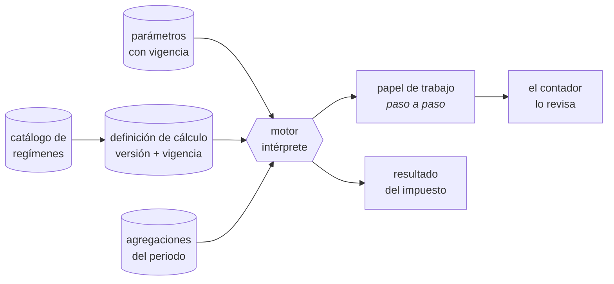
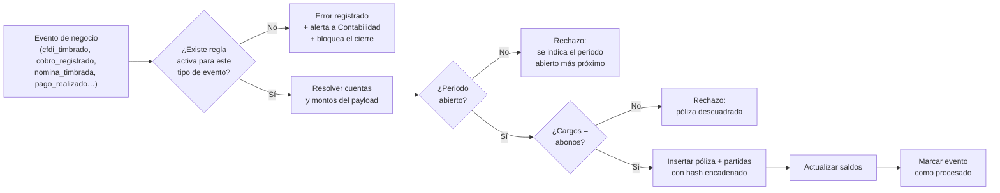

## 7. Requisitos funcionales

> Parte del [SRS del OS](./00-indice.md). Las claves (`RF-`, `RNF-`, `CU-`, `RN-`) son estables y se referencian entre documentos.

### 7.0 Cómo leer esta sección

Los requisitos están agrupados por módulo, y la numeración reserva un bloque a cada uno para que crezca sin renumerar:

| Bloque | Módulo | Esquema de base de datos |
|---|---|---|
| `RF-001` a `RF-019` | Plataforma: empresa, identidad, permisos, configuración | `plataforma` |
| `RF-020` a `RF-030` | Servicios transversales: eventos, bitácora, archivos, alertas, flujos, documentos | `plataforma` |
| `RF-031` a `RF-040` | Plataforma: identidad y permisos (ampliación) | `plataforma` |
| `RF-041` a `RF-050` | Contabilidad: preparación y corrección (ampliación) | `contabilidad` |
| `RF-051` a `RF-065` | Motor fiscal: regímenes y cálculos como definiciones de datos (ampliación) | motor `fiscal` |
| `RF-101` a `RF-115` | Comercial | `comercial` |
| `RF-116` a `RF-120` | Motor fiscal — emisión de comprobantes | motor `fiscal` |
| `RF-121` a `RF-130` | Contabilidad y motor contable | `contabilidad` |
| `RF-131` a `RF-141` | Fiscal — recepción, impuestos y declaraciones | motor `fiscal` |
| `RF-142` a `RF-152` | Tesorería | `finanzas` |
| `RF-153` a `RF-159` | Control de gestión | `finanzas`, `analitica` |
| `RF-160` a `RF-179` | Personas y nómina | `personas`, motor `nomina` |
| `RF-180` a `RF-189` | Operaciones — ejecución del trabajo | `operaciones` |
| `RF-190` a `RF-199` | Abastecimiento, inventario y activos | `operaciones` |
| `RF-200` a `RF-209` | Legal y Riesgo | `legal` |
| `RF-210` a `RF-219` | Dirección | `direccion`, `analitica` |
| `RF-220` a `RF-229` | Tecnología y Datos | `plataforma` |
| `RF-230` a `RF-235` | Agentes de IA | transversal |
| `RF-236` a `RF-239` | Espacio del Colaborador | `personas` |

Los rangos de la tabla anterior son **reservas**: los números no usados dentro de un bloque quedan libres para crecer sin renumerar lo existente. Un requisito nuevo toma el siguiente número libre de su bloque.

Cada requisito indica su **criterio de aceptación**: la condición objetiva que decide si está terminado. Un requisito sin criterio verificable no se considera especificado.

Los requisitos aquí cubren los niveles Esencial y, donde se indica, Profesional y Avanzado. El catálogo completo de las 402 funciones, con su nivel y departamento, está en `docs/areas/`; esta sección especifica **el comportamiento**, el catálogo especifica **el alcance comercial**.

---

### 7.1 Plataforma: empresa, identidad y permisos

| ID | Requisito | Criterio de aceptación | Prioridad | Función |
|---|---|---|---|---|
| `RF-001` | El sistema **debe** permitir dar de alta una empresa con RFC, razón social, régimen fiscal, domicilio fiscal con código postal, logotipo y sucursales | Una empresa nueva queda operativa sin escribir código ni ejecutar migraciones | Obligatorio | `TEC-005` |
| `RF-002` | El sistema **debe** aislar por completo los datos entre empresas mediante seguridad a nivel de fila en toda tabla de negocio | Un usuario de la empresa A no lee ni escribe ningún registro de la empresa B, ni por interfaz, ni por API, ni por consulta directa. Prueba automatizada por módulo | Obligatorio | `TEC-005` |
| `RF-003` | El sistema **debe** permitir que un usuario pertenezca a varias empresas, con roles distintos en cada una, y cambiar de empresa activa sin cerrar sesión | El cambio de empresa recarga el contexto completo; ningún dato de la empresa anterior permanece visible | Importante | `TEC-001` |
| `RF-004` | El sistema **debe** permitir crear, modificar y desactivar usuarios, asignándoles **uno o más roles por empresa**. Los permisos se otorgan siempre por rol | No existe interfaz ni mecanismo para otorgar un permiso individual fuera de rol. Un usuario con dos roles obtiene exactamente la unión de ambos, según `RF-031` | Obligatorio | `TEC-001` |
| `RF-005` | El sistema **debe** reservar la asignación de roles a los roles Administrador y Propietario, y separar el rol Administrador (gestiona el sistema) del acceso a contenido de negocio. Administrador **es** combinable con un rol de negocio —una empresa chica no tiene a nadie más—, pero esa combinación es incompatible según `RF-032` y requiere autorización | Un usuario con rol Administrador y sin rol de negocio no puede leer facturas, pólizas, salarios ni saldos. Verificado por prueba. Si tiene además un rol de negocio, ve exactamente lo de ese rol y la combinación queda registrada | Obligatorio | `TEC-001` |
| `RF-006` | El sistema **debe** proponer un plan durante la configuración inicial, a partir del número de empleados y las ventas anuales declaradas | La propuesta se calcula con la fórmula de estratificación vigente; el usuario puede ignorarla. **Nunca restringe funciones ya contratadas** | Deseable | `TEC-005` |
| `RF-007` | El sistema **debe** implementar un modelo de permiso compuesto por recurso, acción (ver, crear, editar, aprobar, eliminar, exportar), alcance de datos (todos / su área / propios) y campos sensibles | La matriz de `docs/06-matriz-roles.md` se carga como semilla y se verifica con pruebas por rol | Obligatorio | `TEC-001` |
| `RF-008` | El sistema **debe** exigir segundo factor de autenticación (TOTP) a quien tenga alguno de los roles Propietario, Administrador, Dirección, Tesorería, Contabilidad o Personas, en cualquiera de sus empresas | Basta un rol de esa lista, en una sola empresa, para que el segundo factor sea obligatorio. Sin él no se completa el inicio de sesión | Obligatorio | `TEC-011` |
| `RF-009` | El sistema **debe** revocar automáticamente los accesos de un usuario cuando su empleado asociado se da de baja | El mismo día de la baja, el usuario no puede iniciar sesión. Consulta de control: usuarios activos sin empleado vigente = 0 | Obligatorio | `TEC-004` |
| `RF-010` | El sistema **debe** mantener un catálogo único de productos y servicios, y un maestro único de terceros (clientes, proveedores, ambos), compartido por todos los módulos | Un cliente que también es proveedor es un solo registro con dos roles, no dos registros | Obligatorio | `COM-002`, `OPE-012` |
| `RF-011` | El sistema **debe** almacenar los catálogos del SAT (productos y servicios, unidades, formas y métodos de pago, usos de CFDI, regímenes, aduanas, impuestos) con su vigencia, y validarlos contra ellos | Un valor fuera de catálogo se rechaza antes de enviar al PAC, señalando el campo | Obligatorio | `TEC-005` |
| `RF-012` | El sistema **debe** almacenar todo parámetro fiscal, laboral y de seguridad social como dato con fecha de vigencia, y resolverlo **por la fecha del hecho económico** | Recalcular una operación de un ejercicio anterior produce exactamente el mismo resultado que produjo entonces. Ningún parámetro aparece en el código fuente: verificado por análisis estático | Obligatorio | `TEC-005` |
| `RF-013` | El sistema **debe** administrar series y folios por tipo de documento, garantizando unicidad y continuidad | Dos emisiones simultáneas nunca obtienen el mismo folio; no se salta ningún número sin registro de su causa | Obligatorio | `TEC-005` |
| `RF-014` | El sistema **debe** ofrecer una aplicación web instalable (PWA) con cámara, geolocalización, almacenamiento local y cola de sincronización | Una captura hecha sin conexión se sincroniza íntegra al recuperar red, sin duplicar ni perder datos. Prueba: modo avión durante toda la captura | Obligatorio | `TEC-005` |
| `RF-015` | El sistema **debe** permitir configurar campos adicionales por empresa en las entidades principales, sin modificar el esquema | Un campo adicional se crea, se captura, se muestra, se filtra y se exporta sin desplegar código | Importante | `TEC-005` |
| `RF-016` | El sistema **debe** registrar y administrar integraciones externas con sus credenciales en bóveda cifrada, mostrando solo una referencia | Tras guardarse, un secreto no vuelve a ser legible por ningún usuario ni por la interfaz | Obligatorio | `TEC-006` |
| `RF-017` | El sistema **debe** ejecutar respaldos automáticos diarios y permitir exportar íntegramente los datos de una empresa en formato abierto | Una restauración de prueba trimestral se completa y se documenta. La exportación incluye datos y archivos | Obligatorio | `TEC-007` |
| `RF-018` | El sistema **debe** permitir configurar la política de aprobaciones: umbrales por tipo de operación, rol aprobador y cadena de escalamiento | Un cambio de umbral aplica a las operaciones nuevas sin requerir despliegue | Obligatorio | `TEC-005` |
| `RF-019` | El sistema **debe** permitir configurar reglas de alerta: qué vigilar, con cuánta anticipación, a quién notificar y por qué canal | Una regla nueva empieza a generar alertas en la siguiente ejecución diaria | Obligatorio | `TEC-005` |
| `RF-031` | El sistema **debe** resolver los permisos de un usuario con varios roles como la **unión** de ellos: por cada recurso, la acción más amplia y el alcance más amplio que le otorgue cualquiera de sus roles | Resolución determinista y probada: Tesorería `V C E` + Contabilidad `V E X` sobre el mismo recurso da `V C E X`. Alcance `propios` + `todos` da `todos`. El sistema muestra en una sola pantalla los **permisos efectivos** de cualquier usuario, con el rol que origina cada uno | Obligatorio | `TEC-001` |
| `RF-032` | El sistema **debe** impedir que quien asigna roles se otorgue a sí mismo una combinación incompatible, y **debe** mantener una **matriz de combinaciones incompatibles** de roles (segregación de funciones) y, al intentar asignar una de ellas, bloquear la operación salvo autorización explícita del rol Propietario, con motivo registrado | La combinación Tesorería + Dirección (solicita y aprueba pagos) no se asigna sin autorización. La autorización queda en bitácora con autor, motivo y momento, y la excepción aparece de forma permanente en el reporte de control interno de `RF-159` hasta que se retire | Obligatorio | `TEC-001`, `FIN-048` |
| `RF-033` | El sistema **debe** tratar el rol Propietario como **excluyente**: no se combina con ningún otro, porque ya los contiene todos; y **debe** impedir que una empresa se quede sin al menos un Propietario activo | Asignar Propietario retira los demás roles de esa empresa en la misma operación. Retirar el último Propietario se rechaza con mensaje explícito | Obligatorio | `TEC-001` |

### 7.2 Servicios transversales

| ID | Requisito | Criterio de aceptación | Prioridad |
|---|---|---|---|
| `RF-020` | Todo cambio relevante de negocio **debe** publicar un evento en la tabla de salida (outbox) **dentro de la misma transacción** que lo produjo | Si la transacción de negocio falla, el evento no existe. Si tiene éxito, el evento existe. Prueba con fallo inducido | Obligatorio |
| `RF-021` | El sistema **debe** despachar los eventos pendientes a sus suscriptores, con reintentos de espera creciente y envío a una cola de errores tras agotarlos | Un suscriptor caído no pierde eventos; al restablecerse, procesa el rezago en orden | Obligatorio |
| `RF-022` | Todo suscriptor **debe** ser idempotente, registrando los eventos ya procesados | Reprocesar un evento no genera una segunda póliza, un segundo correo ni un segundo timbrado. Prueba: entrega duplicada forzada | Obligatorio |
| `RF-023` | Un evento enviado a la cola de errores **debe** generar una alerta y quedar visible en una bandeja operativa con su carga útil y el error | Ningún evento se descarta en silencio. La bandeja permite reintentar tras corregir | Obligatorio |
| `RF-024` | Toda escritura de negocio **debe** registrarse en bitácora con usuario, momento, dirección de origen, entidad, acción y valor anterior | La bitácora de un registro reconstruye su historia completa. La bitácora no admite edición ni borrado | Obligatorio |
| `RF-025` | El sistema **debe** ejecutar una revisión diaria de vencimientos (contratos, permisos, pólizas, obligaciones fiscales, mantenimientos, documentos de empleados, cuentas por cobrar y pagar) y generar alertas escalonadas | Un vencimiento simulado genera alerta en la anticipación configurada, en el plazo y al vencerse | Obligatorio |
| `RF-026` | Las alertas **debe**n entregarse en la aplicación y por correo, con acuse de lectura, y escalar al superior si no se atienden en el plazo configurado | Una alerta crítica no atendida escala automáticamente y queda registrada | Obligatorio |
| `RF-027` | El sistema **debe** almacenar archivos con hash de contenido, versión, tipo documental y control de acceso por permiso, entregándolos mediante URL firmada de vigencia limitada | Un enlace caducado deja de funcionar. Dos cargas del mismo archivo comparten hash y no se duplican | Obligatorio |
| `RF-028` | El motor de flujos **debe** ejecutar aprobaciones por reglas configurables, con bandeja de pendientes, registro de decisión y motivo, y delegación temporal | Una operación sobre umbral no avanza sin aprobación registrada de un rol distinto al capturista | Obligatorio |
| `RF-029` | El motor de documentos **debe** generar PDF a partir de plantillas por empresa (cotización, pedido, factura, estado de cuenta, recibo) | Una plantilla se modifica sin desplegar código. El PDF generado es idéntico en cada ejecución con los mismos datos | Obligatorio |
| `RF-030` | El sistema **debe** ofrecer búsqueda transversal por folio, RFC, nombre, importe y fecha, respetando permisos | Un usuario solo encuentra lo que puede ver. La búsqueda responde dentro del umbral de `RNF-011` | Importante |

### 7.3 Comercial

| ID | Requisito | Criterio de aceptación | Prioridad | Función |
|---|---|---|---|---|
| `RF-101` | Gestionar prospectos y un embudo de oportunidades con etapas configurables, probabilidad, valor estimado y motivo de pérdida | Una oportunidad recorre el embudo y su historia queda registrada. El motivo de pérdida es obligatorio al perder | Obligatorio | `COM-001`, `COM-003` |
| `RF-102` | Elaborar cotizaciones con partidas, precios de lista, descuentos, impuestos, vigencia, condiciones y plantilla de la empresa | La cotización se envía en PDF y cambia de estado al ser enviada, aceptada, rechazada o vencida | Obligatorio | `COM-005` |
| `RF-103` | Registrar actividades y seguimiento (llamadas, correos, reuniones) asociados a un tercero u oportunidad, con recordatorios | La ficha del cliente muestra la historia completa de interacciones | Obligatorio | `COM-004` |
| `RF-104` | Convertir una cotización aceptada en pedido **sin recapturar ninguna partida ni importe** | El pedido creado reproduce exactamente las partidas, precios, impuestos y condiciones de la cotización. Verificado por prueba de igualdad campo a campo | Obligatorio | `COM-006` |
| `RF-105` | Administrar listas de precios por cliente, volumen o vigencia, con control de descuento máximo por rol | Un descuento superior al permitido genera una solicitud de aprobación y detiene el documento | Importante | `COM-037` |
| `RF-106` | Mantener una ficha de cliente 360 que muestre contactos, cotizaciones, pedidos, órdenes, facturas, saldo, antigüedad y actividades | Todo lo anterior se ve en una pantalla, sin exportar ni cruzar reportes | Obligatorio | `COM-002` |
| `RF-107` | Registrar metas por vendedor y mostrar el avance en un tablero de ventas | El avance se calcula desde documentos reales, nunca capturado a mano | Importante | `COM-009`, `COM-010` |
| `RF-108` | Gestionar campañas de correo, formularios, páginas de aterrizaje, segmentación y origen de prospectos | Un prospecto generado por formulario entra al embudo con su origen identificado | Importante | `COM-011` a `COM-016` |
| `RF-109` | Gestionar tickets de servicio multicanal con acuerdos de nivel de servicio, base de conocimiento, quejas, devoluciones y encuesta de satisfacción | Un ticket que excede su SLA genera alerta y escala | Importante | `COM-017` a `COM-021` |
| `RF-110` | Registrar el historial de correo y mensajería asociado al cliente | Un correo enviado desde el sistema queda en la ficha del cliente | Importante | `COM-008` |

### 7.4 Motor fiscal — emisión

Este bloque es el de mayor riesgo del sistema: un comprobante mal emitido tiene consecuencias legales y fiscales. Por eso sus requisitos son más detallados y todos llevan caso dorado.

| ID | Requisito | Criterio de aceptación | Prioridad |
|---|---|---|---|
| `RF-116` | El sistema **debe** construir el modelo de un CFDI 4.0 de ingreso a partir de un pedido o de una orden cerrada, sin captura adicional de partidas | La factura reproduce el documento de origen. Cero campos recapturados. Caso dorado `CD-01` | Obligatorio |
| `RF-117` | El sistema **debe** ejecutar, **antes** de enviar al PAC, la validación completa: estructura del RFC, existencia y vigencia de claves de catálogo, compatibilidad entre régimen fiscal del receptor y uso de CFDI, coherencia entre método y forma de pago, objeto de impuesto por concepto, y cuadre de la suma de impuestos con la suma de conceptos | Ningún comprobante inválido llega al PAC. Los errores se muestran todos juntos, cada uno nombrando su campo. Prueba con 10 comprobantes inválidos distintos | Obligatorio |
| `RF-118` | El sistema **debe** timbrar mediante un adaptador de PAC, guardar XML y PDF, registrar el UUID y manejar los estados `borrador`, `por_timbrar`, `timbrado`, `error_timbrado`, `cancelacion_solicitada`, `cancelado` | Un fallo de red no produce comprobantes duplicados: antes de reintentar, el sistema consulta al PAC si el comprobante ya existe. Prueba con interrupción forzada | Obligatorio |
| `RF-119` | El sistema **debe** emitir el complemento de recepción de pagos 2.0 al registrar el cobro de una factura PPD, y vigilar que ninguna factura PPD cobrada quede sin complemento | Una factura PPD cobrada sin complemento genera alerta diaria hasta resolverse. Caso dorado `CD-02` | Obligatorio |
| `RF-120` | El sistema **debe** permitir cancelar un CFDI con motivo y, cuando aplique, comprobante sustituto, y **debe** generar la póliza de reversa correspondiente | Un CFDI cancelado deja el libro contable consistente, sin borrar la póliza original. Caso dorado `CD-03` | Obligatorio |

**Comportamiento obligatorio del cálculo de importes** (`RF-117`, detalle):

1. Los importes se calculan **por concepto**: base, descuento, impuestos trasladados y retenidos.
2. El redondeo se aplica al final de cada concepto, a dos decimales, con la regla de redondeo hacia el valor más cercano y, en el empate, hacia arriba.
3. Los totales se obtienen **sumando conceptos ya redondeados**, nunca calculando sobre el total.
4. Si la suma de impuestos por concepto difiere del total declarado en cualquier centavo, el comprobante **no se envía**.
5. Todo importe se opera con decimal exacto. El uso de punto flotante en cualquier cálculo monetario es un defecto bloqueante (`RE-07`).

#### 7.4.1 Cómo es una definición de cálculo

Una definición es una **lista ordenada de pasos**. Cada paso tiene una clave, una descripción en español, una expresión, y su fundamento legal. El motor los evalúa en orden y guarda el resultado de cada uno: eso es el papel de trabajo.

Un paso puede ser de cinco tipos, y ninguno más:

| Tipo | Qué hace | Ejemplo |
|---|---|---|
| `agregacion` | Suma un conjunto del periodo, acotado por la base del régimen | Ingresos efectivamente cobrados de enero a marzo |
| `parametro` | Resuelve un parámetro por la fecha del hecho | Coeficiente de utilidad del ejercicio anterior; tasa del régimen |
| `expresion` | Aritmética decimal exacta sobre pasos anteriores | `utilidad = ingresos − deducciones` |
| `tabla` | Aplica una tabla progresiva por rangos | Tarifa de ISR de personas físicas; tabla de tasas de RESICO |
| `condicional` | Elige entre dos pasos según una comparación | Si la utilidad es negativa, el pago es cero |

**Reglas que hacen esto seguro.** Un motor que interpreta datos es una puerta si no se acota, así que se acota:

| # | Regla |
|---|---|
| 1 | El lenguaje no tiene ciclos ni llamadas externas; toda ejecución termina (`RF-054`) |
| 2 | Una definición solo lee el alcance que declara, y siempre dentro de la empresa que ejecuta. El aislamiento por fila sigue debajo, intacto |
| 3 | Todo importe es decimal exacto con su regla de redondeo declarada. Nunca punto flotante |
| 4 | Una definición no se activa sin pasar sus casos dorados firmados por el contador (`RF-056`) |
| 5 | Las definiciones las escribe el proveedor, no el cliente (`RF-058`). El cliente configura sus datos, no la mecánica del impuesto |
| 6 | Cada ejecución guarda qué versión usó, para que recalcular el pasado reproduzca el pasado (`RF-057`) |

**Por qué vale la pena.** La ley fiscal mexicana cambia cada año: tarifas, topes, facilidades administrativas del autotransporte, tablas de RESICO. Con el cálculo en código, cada enero es un despliegue urgente con todos los clientes en juego. Con el cálculo como dato, es cargar una versión nueva que ya pasó sus casos dorados, con la anterior intacta para recalcular ejercicios previos.

---

### 7.5 Contabilidad y motor contable

| ID | Requisito | Criterio de aceptación | Prioridad | Función |
|---|---|---|---|---|
| `RF-121` | El motor contable **debe** generar la póliza correspondiente a cada evento de negocio, aplicando **reglas almacenadas como datos**, no como código | El contador modifica una regla desde la interfaz y la siguiente operación se contabiliza con la regla nueva, sin desplegar código | Obligatorio | `FIN-002` |
| `RF-122` | El sistema **debe** permitir registrar pólizas manuales de ingreso, egreso y diario, con adjuntos y justificación | Una póliza manual descuadrada se rechaza en el momento de guardarla | Obligatorio | `FIN-003` |
| `RF-123` | El libro contable **debe** ser de solo inserción: prohibido modificar o eliminar pólizas y partidas. Las correcciones se hacen con póliza de reversa (`RF-042`) o reclasificación (`RF-043`); lo que se corrige libremente vive antes del libro, en la zona de preparación (`RF-041`) | Un intento de `UPDATE` o `DELETE` falla a nivel de base de datos, no solo de aplicación. Prueba: ejecución directa en SQL. **No existe credencial, rol ni contraseña que lo permita**: la restricción no distingue quién pregunta | Obligatorio | `FIN-002` |
| `RF-124` | El sistema **debe** producir libro diario, libro mayor, auxiliares y balanza de comprobación, exportables | La balanza cuadra siempre. La exportación conserva el formato que el contador necesita | Obligatorio | `FIN-004` |
| `RF-125` | El sistema **debe** generar balance general y estado de resultados a cualquier fecha, en tiempo real | El estado de resultados de hoy incluye la operación de hoy | Obligatorio | `FIN-005` |
| `RF-126` | El sistema **debe** cerrar periodos con checklist automático y bloquear toda escritura posterior en el periodo cerrado | Se cumplen íntegramente las condiciones de bloqueo de `CU-041`. Caso dorado `CD-05` | Obligatorio | `FIN-007` |
| `RF-127` | El sistema **debe** calcular depreciación y amortización contable y fiscal, incluyendo activos por derecho de uso y su pasivo por arrendamiento conforme a la NIF D-5 | La tabla de amortización de un arrendamiento a 36 meses coincide con la del contador. Caso dorado `CD-05` | Obligatorio | `FIN-008`, `FIN-038` |
| `RF-128` | El sistema **debe** soportar operaciones en moneda extranjera con tipo de cambio por fecha y revaluación periódica (nivel Profesional) | La diferencia cambiaria se registra automáticamente al revaluar | Importante | `FIN-029` |
| `RF-129` | El sistema **debe** registrar provisiones y amortizaciones recurrentes del periodo | Una provisión configurada se genera sola en cada cierre | Importante | `FIN-031` |
| `RF-130` | El sistema **debe** presentar un checklist de cierre cuyo estado se calcula automáticamente, no se declara a mano | Cada punto del checklist enlaza a la pantalla donde se resuelve y muestra cuántos registros lo incumplen | Obligatorio | `FIN-007` |
| `RF-041` | El sistema **debe** ofrecer una **zona de preparación**: toda póliza nace en estado borrador, donde se edita y se elimina libremente, y solo al aprobarse cruza al libro contable | Un borrador no aparece en balanza, libro diario, estados financieros ni contabilidad electrónica. Editarlo no deja póliza de ajuste, porque todavía no es contabilidad. Al aprobarse se valida cuadre, cuentas afectables y periodo abierto, y se vuelve inmutable | Obligatorio | `FIN-003` |
| `RF-042` | El sistema **debe** ofrecer la operación **corregir** sobre una póliza del libro en un periodo abierto: en una sola transacción genera la póliza de reversa y la póliza correcta, ambas ligadas a la original, con motivo obligatorio | El usuario ve una sola acción; el libro registra tres pólizas encadenadas. El saldo queda como si el error no hubiera ocurrido. Sin motivo, la operación no procede | Obligatorio | `FIN-003` |
| `RF-043` | El sistema **debe** permitir **reclasificar** una partida registrada —cambiar cuenta contable, tercero o dimensión analítica (centro de costos, proyecto, activo)— generando automáticamente la póliza de ajuste que traslada el importe | La partida original no se altera. El ajuste queda ligado a ella con motivo y autor. Si el periodo está cerrado, el ajuste se registra en el periodo abierto más cercano y se marca como corrección de un ejercicio anterior | Obligatorio | `FIN-003`, `FIN-004` |
| `RF-044` | El sistema **debe** permitir corregir el **documento origen** (clasificación, cuenta sugerida, tercero, dimensión) de una operación aún no contabilizada, sin restricción alguna | Mientras el evento no haya generado póliza, el dato se edita como cualquier otro registro operativo. La limpieza de datos ocurre aquí, no en el libro | Obligatorio | `FIN-003` |
| `RF-045` | El sistema **debe** mostrar, para cualquier póliza o partida, su **cadena completa de correcciones**: original, reversas, pólizas sustitutas y reclasificaciones, con autor, momento y motivo de cada paso | Desde cualquier renglón de la balanza se llega en un clic a la historia completa. Ninguna parte de esa cadena es ocultable, ni por el Propietario | Obligatorio | `FIN-004`, `FIN-049` |

**Contrato del motor contable.** El motor es el único componente autorizado a escribir en el esquema contable. Funciona así:

**Reglas que este diagrama impone:**

- Un evento sin regla contable **no se ignora**: se registra como error y bloquea el cierre. El silencio es lo que produce contabilidades incompletas.
- El motor nunca "ajusta" para cuadrar. Si no cuadra, rechaza.
- El hash de cada póliza incluye el hash de la anterior, formando una cadena verificable de principio a fin.

### 7.6 Fiscal — recepción, impuestos y declaraciones

| ID | Requisito | Criterio de aceptación | Prioridad | Función |
|---|---|---|---|---|
| `RF-131` | El sistema **debe** calcular el IVA mensual con criterio de flujo: trasladado efectivamente cobrado, acreditable efectivamente pagado y retenido efectivamente cobrado, con saldo a favor acumulable | El cálculo cuadra contra las cuentas de IVA de la balanza, al centavo. Caso dorado `CD-07` | Obligatorio | `FIN-012` |
| `RF-132` | El sistema **debe** calcular y controlar las retenciones de ISR e IVA, tanto efectuadas a terceros como sufridas | Las retenciones enteradas coinciden con las registradas en los comprobantes del periodo | Obligatorio | `FIN-013` |
| `RF-133` | El sistema **debe** generar la DIOT del periodo a partir de los CFDI recibidos efectivamente pagados, agrupados por RFC y tipo de operación, en el formato vigente | El archivo se acepta en el portal de la autoridad sin ajustes manuales. Caso dorado `CD-09` | Obligatorio | `FIN-014` |
| `RF-134` | El sistema **debe** calcular el pago provisional de ISR **del régimen que tenga la empresa**, ejecutando la definición de cálculo vigente para ese régimen (`RF-053`) | Cada régimen soportado tiene su definición y sus casos dorados. El del régimen general —coeficiente de utilidad, pérdidas pendientes, PTU, pagos previos y retenciones— es el caso dorado `CD-08`; los demás, `CD-11` en adelante. El cálculo coincide con el del contador | Obligatorio | `FIN-011` |
| `RF-135` | El sistema **debe** calcular la declaración anual del régimen de la empresa y, donde aplique, la base de PTU, también como definición de datos | Cuadra contra los estados financieros del ejercicio. Donde el régimen no genera PTU ni coeficiente, la definición simplemente no los incluye | Obligatorio | `FIN-015` |
| `RF-136` | El sistema **debe** mantener un calendario fiscal con todas las obligaciones aplicables, sus fechas límite, su estado y sus alertas | Ninguna obligación llega a su fecha sin haber alertado. Estado visible: pendiente, calculada, presentada, pagada | Obligatorio | `FIN-016` |
| `RF-137` | El sistema **debe** generar los archivos de contabilidad electrónica (catálogo, balanza y pólizas) conforme al formato vigente | Los XML validan contra el esquema oficial sin errores | Obligatorio | `FIN-006` |
| `RF-138` | El sistema **debe** descargar diariamente los CFDI emitidos y recibidos desde el SAT, mediante adaptador, y detectar cambios de estatus de comprobantes ya registrados | Un comprobante cancelado por el emisor se detecta en la siguiente descarga y genera alerta | Obligatorio | `FIN-009` |
| `RF-139` | El sistema **debe** permitir clasificar cada CFDI recibido (cuenta, centro de costo, orden, activo, deducible o no) y generar su póliza y su cuenta por pagar | La bandeja de pendientes por clasificar llega a cero antes de cerrar. Caso dorado `CD-04` | Obligatorio | `FIN-010` |
| `RF-140` | El sistema **debe** validar a los proveedores contra la lista del artículo 69-B y su opinión de cumplimiento, marcando como no deducibles los comprobantes afectados | Un proveedor que aparece en la lista genera alerta y marca sus comprobantes; cambiar esa marca exige justificación registrada | Obligatorio | `FIN-017` |
| `RF-141` | El sistema **debe** conciliar los CFDI del periodo contra los registros contables, en ambos sentidos | Reporta comprobantes sin registro y registros sin comprobante. Ambas listas deben estar vacías para cerrar | Obligatorio | `FIN-010` |
| `RF-051` | El sistema **debe** mantener el **catálogo de regímenes fiscales** como dato: clave del SAT, fundamento legal, tipo de persona, base de acumulación (devengado o flujo), obligaciones aplicables y vigencia | Agregar un régimen soportado es dar de alta una fila y su definición de cálculo. Ninguna parte del código menciona un régimen por nombre: verificado por análisis estático | Obligatorio | `FIN-011`, `TEC-005` |
| `RF-052` | La **base de acumulación** del régimen **debe** gobernar la regla contable que convierte un evento en póliza: en devengado, la factura acumula el ingreso; en flujo, lo acumula el cobro | La misma venta produce pólizas distintas en dos empresas de régimen distinto, con la misma regla y sin código condicional. Casos dorados `CD-11` y `CD-12` | Obligatorio | `FIN-002` |
| `RF-053` | Todo cálculo fiscal **debe** existir como **definición de datos versionada con vigencia** —una secuencia ordenada de pasos que el motor interpreta—, nunca como algoritmo en código | Cambiar la mecánica de un cálculo (no solo una tasa) es cargar una versión nueva de la definición. Prueba: alterar la definición del ISR provisional y ver el resultado cambiar sin desplegar | Obligatorio | `FIN-011` |
| `RF-054` | El lenguaje de las definiciones **debe** ser **restringido y sin efectos secundarios**: aritmética decimal exacta, comparaciones, mínimos y máximos, tablas progresivas, condicionales, y referencias a parámetros con vigencia, a agregaciones del periodo y a pasos anteriores. Sin ciclos, sin acceso a datos fuera del alcance declarado, sin llamadas externas | Una definición no puede leer datos de otra empresa, ni ejecutarse indefinidamente, ni provocar una escritura. Verificado con pruebas adversas | Obligatorio | `TEC-011` |
| `RF-055` | Toda ejecución de un cálculo **debe** producir un **papel de trabajo**: cada paso con su descripción, su fórmula, sus entradas, su resultado y su fundamento legal | El contador revisa el cálculo paso por paso sin abrir el código. Un resultado sin papel de trabajo se considera defecto | Obligatorio | `FIN-011` |
| `RF-056` | Una definición de cálculo **no debe** poder activarse sin pasar sus **casos dorados** firmados por el contador | Publicar una definición que falla un caso dorado se rechaza con el detalle de la diferencia. Prueba: intentar activar una definición con un paso alterado | Obligatorio | `FIN-011` |
| `RF-057` | El sistema **debe** registrar, en cada ejecución, la **versión de la definición y de los parámetros** utilizados, y recalcular un periodo anterior con esa misma versión | Recalcular un pago provisional de hace dos años produce exactamente el resultado que produjo entonces, aunque la definición vigente hoy sea otra | Obligatorio | `FIN-011` |
| `RF-058` | Las definiciones de cálculo **deben** ser del proveedor del sistema, **no editables por la empresa cliente** ni por ninguno de sus roles, incluido el Propietario | No existe interfaz para que un cliente altere un cálculo fiscal. Lo que el cliente configura son sus datos y sus opciones declaradas (coeficiente, facilidades aplicadas), nunca la mecánica del impuesto | Obligatorio | `TEC-001` |
| `RF-059` | El sistema **debe** permitir que una empresa **cambie de régimen con fecha de efecto**, conservando la historia | Los periodos anteriores al cambio se calculan y se reimprimen con el régimen que tenían entonces. El cambio queda en bitácora con su fecha y su autor | Importante | `FIN-011` |
| `RF-060` | El **calendario de obligaciones** de cada empresa **debe** derivarse de su régimen, su tamaño y su actividad, como datos | Una empresa de RESICO de personas físicas no ve en su calendario la contabilidad electrónica. Agregar o retirar una obligación no toca el código (`RF-136`) | Obligatorio | `FIN-012` |

### 7.7 Tesorería

| ID | Requisito | Criterio de aceptación | Prioridad | Función |
|---|---|---|---|---|
| `RF-142` | El sistema **debe** llevar cuentas por cobrar con antigüedad de saldos, y permitir aplicar un cobro a una o varias facturas, con control de excedente como anticipo | Ninguna aplicación excede el saldo insoluto de su factura. La antigüedad se calcula por vencimiento real | Obligatorio | `FIN-020` |
| `RF-143` | El sistema **debe** ejecutar cobranza automatizada: recordatorios programados, estados de cuenta, registro de gestiones y promesas de pago | Una factura vencida genera su recordatorio sin intervención. Las promesas alimentan la proyección de flujo | Importante | `FIN-021` |
| `RF-144` | El sistema **debe** administrar límite y días de crédito por cliente, bloqueando pedidos que lo excedan hasta su autorización | Un pedido que excede el límite no avanza sin aprobación de Dirección, registrada | Importante | `FIN-022` |
| `RF-145` | El sistema **debe** proyectar el flujo de efectivo a 13 semanas, combinando saldo actual, CxC por vencimiento y promesas, CxP programadas, nómina comprometida e impuestos estimados | La proyección se recalcula al cambiar cualquier insumo. Se señalan las semanas con déficit | Importante | `FIN-026` |
| `RF-146` | El sistema **debe** administrar cuentas bancarias y cajas con saldo en tiempo real | El saldo del sistema coincide con el conciliado del banco | Obligatorio | `FIN-018` |
| `RF-147` | El sistema **debe** importar estados de cuenta bancarios y conciliar automáticamente por referencia, importe y fecha, dejando los no conciliados en una bandeja | Una importación repetida del mismo archivo no duplica movimientos. Meta: ≥ 80% conciliado automáticamente | Obligatorio | `FIN-019` |
| `RF-148` | El sistema **debe** administrar caja chica, anticipos y comprobación de gastos de empleados, con su registro contra la cuenta del deudor | Un gasto comprobado descuenta del anticipo; el remanente se reembolsa o se descuenta, con registro | Importante | `FIN-025` |
| `RF-149` | El sistema **debe** llevar cuentas por pagar con calendario de vencimientos y estado | La CxP refleja el saldo real considerando pagos parciales y notas de crédito | Obligatorio | `FIN-023` |
| `RF-150` | El sistema **debe** permitir programar pagos por vencimiento, prioridad y disponibilidad de flujo | La propuesta de pago semanal se genera con un clic y es editable antes de autorizar | Importante | `FIN-024` |
| `RF-151` | El sistema **debe** generar layouts de dispersión bancaria por banco | El archivo se carga en el portal del banco sin edición manual | Importante | `FIN-034` |
| `RF-152` | El sistema **debe** exigir autorización para pagos que excedan el umbral configurado, otorgada por un **usuario distinto** de quien los capturó y con rol autorizado | Un pago sobre umbral sin aprobación no se ejecuta. Quien captura no puede aprobar su propio pago aunque acumule el rol que aprueba: el control es sobre la persona, no sobre el rol. Verificado con prueba | Obligatorio | `FIN-024` |

### 7.8 Control de gestión

| ID | Requisito | Criterio de aceptación | Prioridad | Función |
|---|---|---|---|---|
| `RF-153` | Presupuesto anual por cuenta y centro de costo, con comparativo contra lo real | La variación se calcula automáticamente contra la balanza | Importante | `FIN-041`, `FIN-042` |
| `RF-154` | Centros de costo aplicables a ingresos, costos y gastos | Un estado de resultados por centro de costo cuadra con el consolidado | Importante | `FIN-028` |
| `RF-155` | Costeo y rentabilidad por línea, cliente, sucursal y orden de trabajo | El margen de una orden incluye consumos, costo de personal asignado y depreciación prorrateada. Caso dorado `CD-10` | Importante | `FIN-043`, `FIN-044` |
| `RF-156` | Indicadores financieros calculados (liquidez, endeudamiento, rotación, márgenes, DSO, DPO) | Cada indicador muestra su fórmula y sus insumos, sin cifras capturadas a mano | Importante | `FIN-045` |
| `RF-157` | Proyecciones y escenarios financieros | Un escenario se guarda, se compara y no altera los datos reales | Deseable | `FIN-046` |
| `RF-158` | Evaluación de inversiones (valor presente neto, tasa interna de retorno) | Los resultados coinciden con el cálculo financiero estándar, verificado con casos conocidos | Deseable | `FIN-047` |
| `RF-159` | Matriz de autorizaciones y controles internos con segregación de funciones | El sistema reporta cualquier combinación de permisos que rompa la segregación | Importante | `FIN-048`, `FIN-049` |

### 7.9 Personas y nómina

| ID | Requisito | Criterio de aceptación | Prioridad | Función |
|---|---|---|---|---|
| `RF-160` | Expediente digital del empleado con documentos, vigencias y datos personales protegidos | Un documento obligatorio faltante o vencido genera alerta a Personas | Obligatorio | `PER-001` |
| `RF-161` | Puestos, organigrama y contratos laborales con plantillas | El organigrama se deriva de los puestos, no se dibuja a mano | Obligatorio | `PER-002`, `PER-003` |
| `RF-162` | Registro y aprobación de incidencias (faltas, incapacidades, horas extra, permisos, percepciones variables) y control de asistencia con geolocalización | Una incidencia capturada por el empleado y aprobada por su jefe entra al cálculo sin recaptura | Obligatorio | `PER-009`, `PER-010` |
| `RF-163` | Solicitud, aprobación y control de vacaciones y permisos, con saldo por antigüedad conforme a la ley vigente | El saldo de vacaciones se calcula automáticamente y no permite exceder lo disponible sin autorización | Obligatorio | `PER-011` |
| `RF-164` | Motor de nómina: percepciones gravadas y exentas, ISR del periodo, subsidio para el empleo, SDI, cuotas IMSS obrero y patronal, INFONAVIT, FONACOT, otros descuentos y neto | El cálculo de un periodo pasado, repetido hoy, produce el mismo resultado. Caso dorado `CD-06` | Obligatorio | `PER-005`, `PER-006` |
| `RF-165` | Timbrado del complemento de nómina 1.2 por lote, con reintento individual | Un fallo individual no detiene el lote ni re-timbra los exitosos | Obligatorio | `PER-007` |
| `RF-166` | Confidencialidad salarial: los importes individuales solo son visibles para Personas y Propietario; Dirección accede únicamente a cifras agregadas | Una consulta de Dirección nunca devuelve un salario individual. Verificado por prueba de RLS | Obligatorio | `PER-005` |
| `RF-167` | Dispersión de nómina con generación de layout bancario y conciliación posterior | El layout se genera desde los recibos autorizados, sin captura | Obligatorio | `PER-008` |
| `RF-168` | Cálculo de aguinaldo, prima vacacional y reparto de PTU | Los resultados coinciden con el cálculo legal verificado por el contador | Obligatorio | `PER-012`, `PER-014` |
| `RF-169` | Cálculo de finiquitos y liquidaciones, distinguiendo ambos supuestos | El sistema explica cada concepto del cálculo y su fundamento | Obligatorio | `PER-013` |
| `RF-170` | Generación de movimientos afiliatorios al IMSS (altas, bajas, modificaciones de salario) | El archivo se acepta en el portal del IMSS sin ajustes | Obligatorio | `PER-004` |
| `RF-171` | Determinación de cuotas y generación del archivo para el sistema de autodeterminación | Las cifras coinciden con la determinación oficial del periodo | Obligatorio | `PER-015` |
| `RF-172` | Control de créditos INFONAVIT y FONACOT, con su descuento en nómina y su entero | Un crédito activo se descuenta automáticamente en cada periodo | Obligatorio | `PER-015` |
| `RF-173` | Registro de la prima de riesgo de trabajo de la empresa y su aplicación en el cálculo de cuotas | Un cambio de prima aplica desde su fecha de vigencia | Obligatorio | `PER-025` |
| `RF-174` | Acumulados anuales por empleado y generación de constancias | Los acumulados cuadran con la suma de los recibos timbrados del ejercicio | Obligatorio | `PER-017` |
| `RF-175` | Cálculo del impuesto sobre nómina estatal, con tasa por estado de la sucursal | Una empresa con sucursales en dos estados calcula cada una con su tasa | Obligatorio | `PER-016` |
| `RF-176` | Aplicación, seguimiento y evidencia de la NOM-035 | Las encuestas, sus resultados y las acciones derivadas quedan registradas y son exportables como evidencia | Obligatorio | `PER-019` |
| `RF-177` | Registro de accidentes y riesgos de trabajo, con su seguimiento e indicadores | Un accidente registrado alimenta el indicador de siniestralidad | Obligatorio | `PER-022` |
| `RF-178` | Control de equipo de protección personal, comisión de seguridad e higiene y protección civil | Las entregas de equipo quedan con acuse; los recorridos de la comisión quedan documentados | Obligatorio | `PER-021`, `PER-023`, `PER-024` |
| `RF-179` | Registro de capacitación obligatoria y generación de constancias DC-3 | El plan anual de capacitación y su cumplimiento son exportables | Obligatorio | `PER-018` |

### 7.10 Operaciones — ejecución del trabajo

| ID | Requisito | Criterio de aceptación | Prioridad | Función |
|---|---|---|---|---|
| `RF-180` | Crear órdenes de trabajo desde un pedido o manualmente, usando plantillas por tipo de trabajo | La orden creada desde un pedido conserva su vínculo y sus partidas | Obligatorio | `OPE-001`, `OPE-002` |
| `RF-181` | Planear y agendar recursos (personas, activos) en un calendario con detección de conflictos | Asignar un recurso ya ocupado se bloquea o exige confirmación explícita | Obligatorio | `OPE-003` |
| `RF-182` | Asignar personas y activos a una orden | La asignación es visible para quien ejecuta desde su dispositivo | Obligatorio | `OPE-004` |
| `RF-183` | Seguimiento en tiempo real del estado de las órdenes, en lista y en tablero | El estado refleja lo que campo reporta, sin intermediarios | Obligatorio | `OPE-005`, `OPE-011` |
| `RF-184` | Registrar consumos por orden (materiales, horas, gastos) con su costo | El costo de la orden es la suma de sus consumos valuados, sin estimaciones | Obligatorio | `OPE-008` |
| `RF-185` | Capturar evidencias con foto, firma, ubicación y marca de tiempo desde la PWA, con funcionamiento sin conexión | Una evidencia capturada sin red llega íntegra al sincronizar, con su marca de tiempo original | Obligatorio | `OPE-007` |
| `RF-186` | Validar, al asignar, que el activo no tenga mantenimiento crítico vencido y que el empleado no tenga documento obligatorio vencido | La asignación se bloquea y explica cuál vigencia falla | Obligatorio | `OPE-042`, `PER-001` |
| `RF-187` | Registrar incidencias operativas con severidad, descripción, evidencia, ubicación y seguimiento hasta su resolución | Una incidencia de severidad alta genera alerta inmediata | Obligatorio | `OPE-009` |
| `RF-188` | Cerrar la orden y habilitar su facturación, calculando el costo real y el margen contra lo cotizado | Al cerrar, el margen está disponible sin cálculo manual | Obligatorio | `OPE-010` |
| `RF-189` | Ejecutar checklists y procedimientos configurables por tipo de trabajo | Un checklist incompleto impide cerrar la orden si así se configuró | Obligatorio | `OPE-006` |

### 7.11 Abastecimiento, inventario y activos

| ID | Requisito | Criterio de aceptación | Prioridad | Función |
|---|---|---|---|---|
| `RF-190` | Administrar proveedores con documentos, condiciones y opinión de cumplimiento | Un proveedor con documentación vencida genera alerta antes de pagarle | Obligatorio | `OPE-012` |
| `RF-191` | Requisiciones internas con flujo de aprobación | Una requisición aprobada puede convertirse en orden de compra sin recaptura | Importante | `OPE-013` |
| `RF-192` | Solicitud de cotizaciones a varios proveedores y comparativo | El comparativo muestra precio, tiempo de entrega y condiciones lado a lado | Importante | `OPE-014` |
| `RF-193` | Órdenes de compra con seguimiento de su estado | El proveedor y la fecha comprometida quedan registrados | Importante | `OPE-015` |
| `RF-194` | Recepción de bienes y servicios, total o parcial | Una recepción parcial deja la orden de compra abierta por el saldo | Importante | `OPE-016` |
| `RF-195` | Conciliación de tres vías: orden de compra, recepción y factura | Las diferencias de cantidad o precio se señalan y bloquean el pago hasta resolverse | Importante | `OPE-017` |
| `RF-196` | Historial de precios por proveedor y devoluciones a proveedor | Una compra fuera del rango histórico de precio genera alerta | Importante | `OPE-018`, `OPE-019` |
| `RF-197` | Inventario básico condicional (existencias en un almacén, entradas y salidas, costo promedio, punto de reorden), activable por empresa | Con el inventario desactivado, ninguna pantalla ni cálculo lo requiere | Importante | `OPE-020` a `OPE-023` |
| `RF-198` | Registro de activos con identificación, ubicación, responsable, propiedad (propio o arrendado) y lectura de uso | Un activo arrendado se vincula a su contrato y genera su derecho de uso conforme a `RF-127` | Importante | `OPE-040` |
| `RF-199` | Mantenimiento preventivo por fecha o por lectura de uso, mantenimiento correctivo, historial y costo por activo, garantías, seguros y talleres | Un mantenimiento vencido genera alerta y, si es crítico, bloquea la asignación del activo | Importante | `OPE-042` a `OPE-047` |

### 7.12 Legal y Riesgo

| ID | Requisito | Criterio de aceptación | Prioridad | Función |
|---|---|---|---|---|
| `RF-200` | Repositorio de contratos con plantillas, versiones, partes, vigencias y alertas de renovación | Un contrato próximo a vencer alerta con la anticipación configurada | Obligatorio | `LEG-001` |
| `RF-201` | Firma electrónica de documentos con constancia de conservación conforme a la NOM-151, mediante proveedor autorizado | La constancia queda asociada al documento y es verificable | Importante | `LEG-003` |
| `RF-202` | Solicitudes de contrato desde otras áreas, con flujo de revisión | Una solicitud comercial llega a Legal con su contexto, sin correos | Importante | `LEG-002` |
| `RF-203` | Documentos corporativos y libros sociales (acta constitutiva, estatutos, asambleas) | Los documentos se conservan con versión y hash, sin posibilidad de borrado | Obligatorio | `LEG-004` |
| `RF-204` | Poderes y facultades vigentes, con alcance y vencimiento | Un poder vencido se señala antes de usarse en una operación | Obligatorio | `LEG-005` |
| `RF-205` | Registro del beneficiario controlador conforme al CFF | La información exigida está completa y es exportable ante requerimiento | Obligatorio | `LEG-006` |
| `RF-206` | Registro de marcas y propiedad intelectual con sus vigencias | Una renovación próxima alerta con meses de anticipación | Importante | `LEG-007` |
| `RF-207` | Permisos y licencias con vigencias, responsable y evidencia documental | Ningún permiso vence sin alerta previa. Un permiso vencido bloquea la operación que lo requiere | Obligatorio | `LEG-008` |
| `RF-208` | Registro de riesgos, mapa de calor, planes de mitigación, pólizas de seguro y siniestros | Un siniestro registra su reclamación y su seguimiento hasta el cobro | Importante | `LEG-020` a `LEG-024` |
| `RF-209` | Cumplimiento: matriz de obligaciones regulatorias, políticas con acuse, línea de denuncia, datos personales y antilavado | Cada obligación tiene responsable, periodicidad, estado y evidencia | Importante | `LEG-013` a `LEG-019` |

### 7.13 Dirección

| ID | Requisito | Criterio de aceptación | Prioridad | Función |
|---|---|---|---|---|
| `RF-210` | Tablero ejecutivo con indicadores de todas las áreas, calculados desde vistas analíticas | Ningún número del tablero se captura a mano. Cada uno permite navegar hasta los documentos que lo componen | Obligatorio | `DIR-001` |
| `RF-211` | Alertas críticas de negocio (flujo insuficiente, cartera vencida, incumplimientos, vencimientos, desviaciones de margen) | Una alerta crítica llega a su destinatario y su atención queda registrada | Obligatorio | `DIR-002` |
| `RF-212` | Bandeja de aprobaciones centralizadas para Dirección | Toda solicitud pendiente se ve en un lugar, con su antigüedad | Obligatorio | `DIR-003` |
| `RF-213` | Objetivos del negocio con avance calculado desde datos reales | El avance nunca se captura manualmente | Obligatorio | `DIR-004` |
| `RF-214` | Juntas, minutas y acuerdos con responsable y fecha compromiso, y su seguimiento | Un acuerdo vencido sin cerrar aparece en el tablero | Importante | `DIR-005` |
| `RF-215` | Reporte ejecutivo automático periódico, enviado por correo | El reporte se genera y envía sin intervención, con los datos del periodo | Importante | `DIR-006` |
| `RF-216` | Consulta del negocio en lenguaje natural, respetando permisos del usuario que pregunta | Una pregunta cuya respuesta excede los permisos del usuario se rechaza explicando el límite, sin filtrar el dato | Deseable | `DIR-007` |
| `RF-217` | Planeación estratégica, OKRs en cascada e iniciativas (nivel Profesional) | Un OKR se vincula a los indicadores que lo miden | Importante | `DIR-008` a `DIR-010` |
| `RF-218` | Portafolio de proyectos con semáforos y priorización (nivel Profesional) | El estado del proyecto se deriva de sus tareas, no se declara | Importante | `DIR-013` a `DIR-016` |
| `RF-219` | Gobierno corporativo: consejo, comités, asambleas y seguimiento de acuerdos (nivel Profesional) | Las convocatorias y actas quedan archivadas con su evidencia | Importante | `DIR-017` a `DIR-020` |

### 7.14 Tecnología y Datos

| ID | Requisito | Criterio de aceptación | Prioridad | Función |
|---|---|---|---|---|
| `RF-220` | Inventario de equipos y licencias, con responsable y vencimientos | Un equipo sin responsable asignado aparece en el reporte de control | Importante | `TEC-002` |
| `RF-221` | Mesa de ayuda interna de TI con tickets y base de conocimiento | Un ticket sin atender en su SLA escala | Importante | `TEC-003` |
| `RF-222` | Constructor de reportes y tableros personalizados, sujeto a los permisos del usuario | Un reporte creado por un usuario nunca muestra datos que ese usuario no puede ver | Importante | `TEC-018`, `TEC-019` |
| `RF-223` | Conexión de herramientas externas de inteligencia de negocio mediante credenciales de solo lectura y alcance limitado | La credencial se revoca sin afectar a los usuarios | Importante | `TEC-020` |
| `RF-224` | Control de calidad de datos: duplicados, campos vacíos obligatorios, inconsistencias | El reporte de calidad se ejecuta periódicamente y propone la corrección | Importante | `TEC-021` |
| `RF-225` | Políticas de acceso y sesión, recertificación periódica de accesos y alertas de actividad sospechosa | La recertificación produce una lista firmada por el responsable de cada área | Importante | `TEC-011` a `TEC-013` |
| `RF-226` | Registro de incidentes de seguridad con su clasificación y seguimiento | Un incidente queda documentado desde su detección hasta su cierre | Importante | `TEC-015` |
| `RF-227` | Automatizaciones sin código sobre eventos del sistema | Una automatización se crea, se prueba y se desactiva sin desplegar | Importante | `TEC-009` |
| `RF-228` | Control de cambios de configuración con registro de quién cambió qué y cuándo | Un cambio de configuración se puede revertir desde su historial | Importante | `TEC-010` |
| `RF-229` | API pública documentada, con llaves por empresa, alcance limitado y control de consumo | Una llave comprometida se revoca sin afectar a otras. Su consumo es visible y limitable | Importante | `TEC-006` |

### 7.15 Agentes de IA

| ID | Requisito | Criterio de aceptación | Prioridad |
|---|---|---|---|
| `RF-230` | Todo agente de IA **debe** ejecutarse con los permisos del usuario que lo invoca, sin ampliarlos en ningún caso | Un agente invocado por un usuario de Comercial no puede leer nóminas. Verificado por prueba explícita | Obligatorio |
| `RF-231` | Toda acción de un agente que modifique datos **debe** requerir confirmación humana explícita antes de ejecutarse | Ningún agente escribe sin aprobación. Las acciones de solo lectura no la requieren | Obligatorio |
| `RF-232` | Toda intervención de un agente **debe** quedar en bitácora, identificando al agente, al usuario invocador y la acción | La bitácora distingue una acción humana de una asistida | Obligatorio |
| `RF-233` | Los agentes **deben** citar los registros en los que basan su respuesta, con enlace navegable | Una afirmación sin respaldo verificable se considera defecto del agente | Importante |
| `RF-234` | El sistema **debe** medir y limitar el consumo de los agentes por empresa y por periodo | El consumo es visible y se puede acotar sin desactivar el sistema | Importante |
| `RF-235` | Un agente **debe** declarar explícitamente cuando no puede responder por falta de datos o de permisos, en lugar de estimar | Ante datos insuficientes, el agente lo dice; no completa con supuestos | Obligatorio |

### 7.16 Espacio del Colaborador

| ID | Requisito | Criterio de aceptación | Prioridad | Función |
|---|---|---|---|---|
| `RF-236` | Todo empleado **debe** poder consultar y descargar sus recibos de nómina timbrados y sus constancias | El empleado accede sin pedirlo a nadie. Solo ve lo propio | Obligatorio | `PER-001` |
| `RF-237` | Todo empleado **debe** poder solicitar vacaciones y permisos y ver el estado de su solicitud y su saldo | La solicitud llega a su jefe y su resolución le notifica | Obligatorio | `PER-011` |
| `RF-238` | Todo empleado **debe** poder registrar y comprobar sus gastos y ver su reembolso | El gasto comprobado sigue el flujo de `RF-148` | Importante | `FIN-025` |
| `RF-239` | Todo empleado **debe** poder consultar su expediente de capacitación y sus constancias | El empleado descarga su DC-3 sin intervención de Personas | Importante | `PER-018` |

---

---

[← 06-casos-de-uso](./06-casos-de-uso.md) · [Índice](./00-indice.md) · [08-requisitos-no-funcionales →](./08-requisitos-no-funcionales.md)
