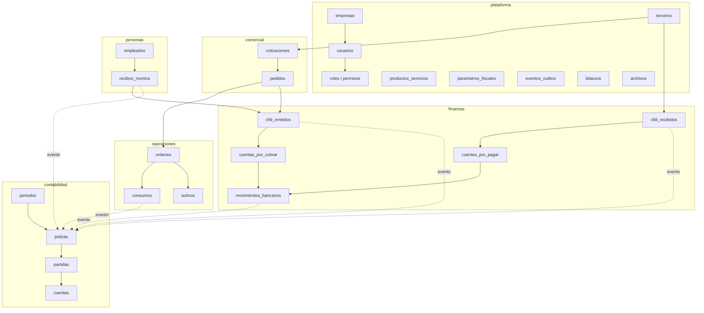

## 9. Modelo de datos lógico

> Parte del [SRS del OS](./00-indice.md). Las claves (`RF-`, `RNF-`, `CU-`, `RN-`) son estables y se referencian entre documentos.

Esta sección describe **qué información existe y cómo se relaciona**, a nivel lógico. El modelo físico detallado, tabla por tabla y columna por columna, está en `docs/04-modelo-de-datos.md`.

### 9.1 Organización por esquema

Cada módulo posee un esquema y **solo escribe en el suyo**. Las lecturas entre esquemas se hacen por vistas o por contratos; las escrituras cruzadas están prohibidas por `RE-02`.

| Esquema | Contenido principal | Quién escribe |
|---|---|---|
| `plataforma` | Empresas, sucursales, usuarios, roles, permisos, terceros, productos y servicios, catálogos SAT, parámetros fiscales, folios, configuración, eventos, bitácora, archivos, secretos, integraciones, aprobaciones, alertas | Módulo de plataforma |
| `comercial` | Prospectos, oportunidades, actividades, cotizaciones, pedidos, campañas, tickets | Módulo comercial |
| `operaciones` | Órdenes de trabajo, plantillas, asignaciones, checklists, evidencias, consumos, incidencias, proveedores, compras, recepciones, inventario, activos, mantenimientos | Módulo de operaciones |
| `finanzas` | Cuentas bancarias, movimientos, CFDI emitidos y recibidos, cuentas por cobrar y pagar, cobros, pagos, gastos, arrendamientos, declaraciones | Módulo de finanzas |
| `contabilidad` | Cuentas, periodos, reglas contables, pólizas, partidas, saldos | **Solo el motor contable** |
| `personas` | Empleados, puestos, contratos, condiciones salariales, incidencias, periodos de nómina, recibos, movimientos de seguridad social, seguridad y salud | Módulo de personas |
| `legal` | Contratos, documentos corporativos, poderes, permisos, marcas, riesgos, pólizas de seguro, siniestros, obligaciones | Módulo legal |
| `direccion` | Objetivos, juntas, acuerdos, iniciativas, proyectos | Módulo de dirección |
| `analitica` | Vistas de solo lectura que agregan datos de todos los esquemas | Nadie escribe: son vistas |

### 9.2 Reglas de integridad obligatorias

| # | Regla | Implementación |
|---|---|---|
| 1 | Toda tabla de negocio tiene `empresa_id` no nulo y política de aislamiento | Restricción + política en la misma migración |
| 2 | Toda tabla de negocio tiene `creado_en`, `creado_por`, `actualizado_en`, `actualizado_por` | Columnas obligatorias con disparador |
| 3 | Los importes son decimales de precisión fija, nunca punto flotante | Tipo `numeric(18,2)` en base de datos; decimal exacto en la aplicación |
| 4 | Las fechas se almacenan en UTC y se presentan en la zona de la empresa | Tipo con zona horaria |
| 5 | Ninguna tabla de negocio admite borrado físico; se usa estado o baja lógica, salvo en el libro contable donde no se admite ni siquiera eso | Revisión por módulo |
| 6 | Toda llave foránea entre esquemas apunta a una entidad estable del esquema destino | Revisión de migraciones |
| 7 | Las partidas contables cumplen `(cargo = 0) <> (abono = 0)` | Restricción en la tabla |
| 8 | Las pólizas cumplen `total_cargos = total_abonos` | Restricción diferida, verificada al cierre de la transacción |
| 9 | Un CFDI timbrado tiene UUID único a nivel global de la instancia | Índice único |
| 10 | Un evento procesado por un suscriptor no se reprocesa | Llave primaria compuesta de evento y suscriptor |

### 9.3 Entidades centrales y sus vínculos

**Lo que este diagrama hace explícito:** ningún módulo escribe directamente en `contabilidad`. Las flechas punteadas son eventos, no llamadas. Esa es la diferencia entre un sistema con contabilidad integrada y uno con contabilidad acoplada.

---

---

[← 08-requisitos-no-funcionales](./08-requisitos-no-funcionales.md) · [Índice](./00-indice.md) · [10-arquitectura →](./10-arquitectura.md)
