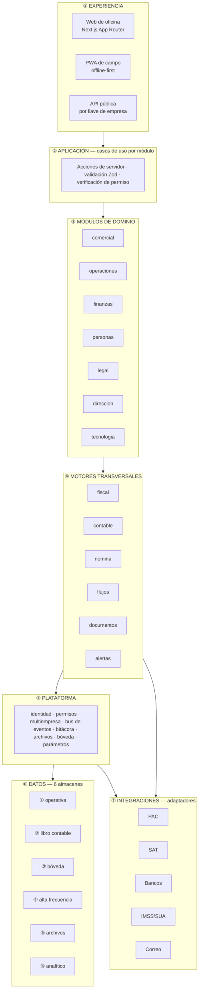
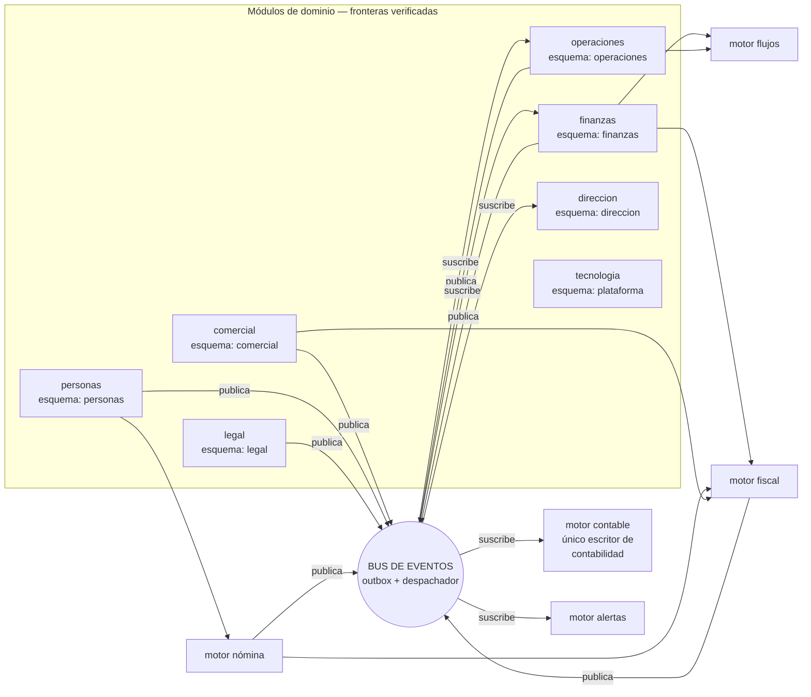
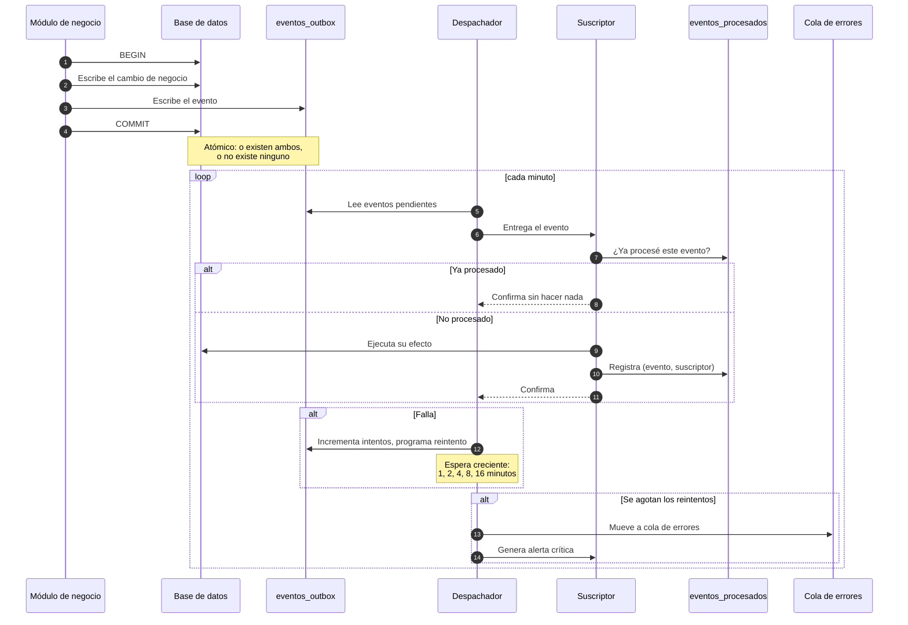
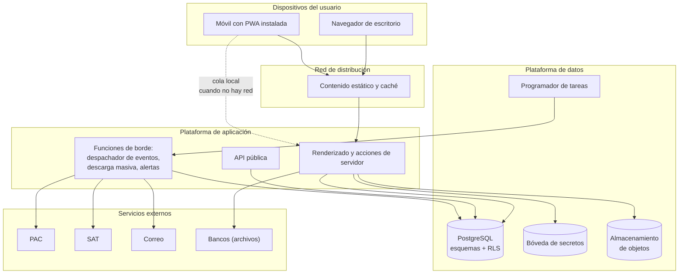
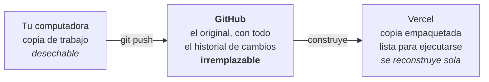
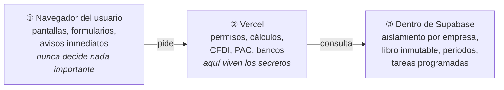
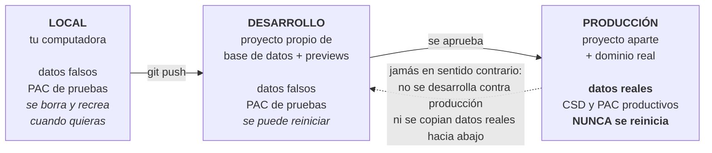
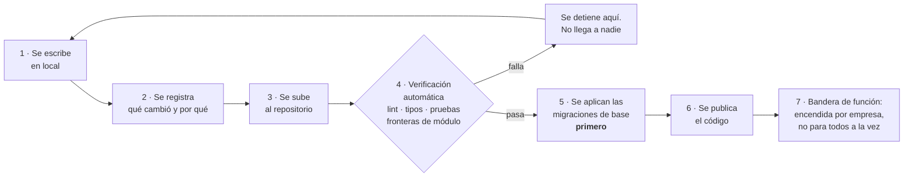
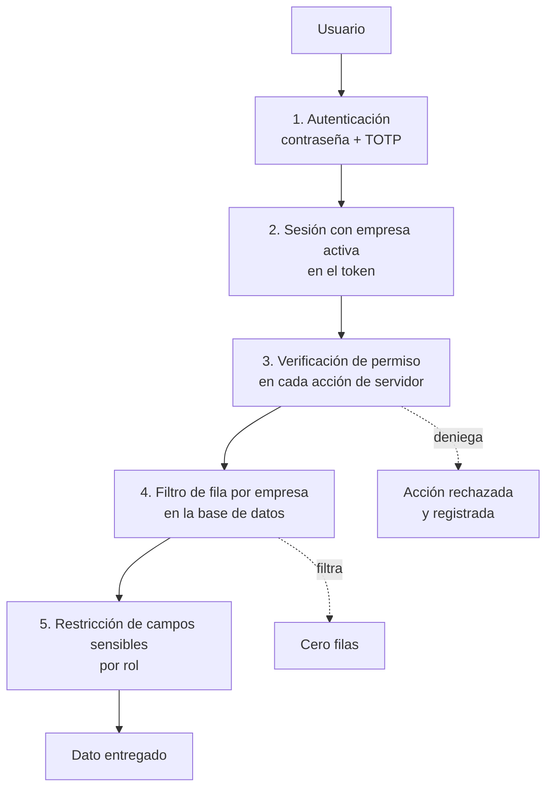
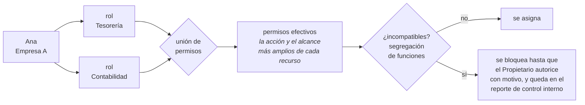

## 10. Arquitectura del sistema

> Parte del [SRS del OS](./00-indice.md). Las claves (`RF-`, `RNF-`, `CU-`, `RN-`) son estables y se referencian entre documentos.

### 10.1 Principios de arquitectura

| # | Principio | Consecuencia práctica |
|---|---|---|
| 1 | **Una sola aplicación, módulos con fronteras reales** | El usuario vive en una pantalla; el código vive en compartimentos verificables |
| 2 | **La frontera se verifica con herramienta, no con disciplina** | La compilación falla si alguien cruza una frontera |
| 3 | **Los módulos se comunican por eventos, no por llamadas** | Agregar un suscriptor no modifica a quien publica |
| 4 | **La contabilidad es un destino, no un módulo más** | Solo un componente escribe en ella, y solo reaccionando a eventos |
| 5 | **Las reglas cambiantes son datos** | Un cambio normativo es una carga de datos, no un despliegue |
| 6 | **Lo externo vive detrás de un adaptador** | Cambiar de proveedor no toca el negocio |
| 7 | **Multiempresa desde la primera línea** | Agregarlo después es reescribir |
| 8 | **Lo que no se puede medir, no se promete** | Todo requisito no funcional tiene número |

### 10.2 Vista de capas

**Reglas de dependencia entre capas** —se verifican automáticamente (`RNF-094`):

1. Una capa **solo** depende de la capa inmediatamente inferior. La experiencia nunca habla con la base de datos.
2. Un módulo de la capa ③ **nunca** importa internals de otro módulo de la capa ③. Solo su contrato público.
3. Los motores de la capa ④ **no** conocen a los módulos: reciben eventos y datos, devuelven resultados.
4. La capa ⑦ solo se alcanza desde motores y plataforma, nunca desde un módulo de dominio.
5. El almacén ② (libro contable) solo es escrito por el motor contable.

### 10.3 Vista de módulos y comunicación

**Ejemplo concreto de por qué esto importa.** Cuando se emite una factura, el módulo comercial **no** llama a contabilidad, ni a tesorería, ni al servicio de correo. Publica un hecho: *se timbró un CFDI*. Tres suscriptores reaccionan de forma independiente:

| Suscriptor | Qué hace | Si falla |
|---|---|---|
| Motor contable | Genera la póliza de ingreso | Se reintenta; el CFDI sigue siendo válido |
| Finanzas | Crea la cuenta por cobrar | Se reintenta; la póliza ya existe |
| Alertas | Envía el comprobante al cliente | Se reintenta; nada más se afecta |

Agregar mañana un cuarto suscriptor —por ejemplo, avisar por mensajería al vendedor— **no modifica una sola línea del módulo comercial**. Eso es lo que hace que el sistema pueda crecer a 402 funciones sin volverse frágil.

### 10.4 Los seis almacenes de datos

Separar los datos por naturaleza, no por módulo, es lo que permite que la contabilidad sea inmutable mientras la operación es ágil.

| # | Almacén | Qué guarda | Naturaleza | Reglas |
|---|---|---|---|---|
| ① | **Operativa** | Todo el registro de negocio: clientes, cotizaciones, órdenes, facturas, empleados | Lectura y escritura frecuentes | Un esquema por módulo; RLS en todo |
| ② | **Libro contable** | Cuentas, periodos, pólizas, partidas, saldos | **Solo inserción** | Escrito únicamente por el motor contable; hash encadenado; periodos bloqueables |
| ③ | **Bóveda cifrada** | CSD, e.firma, credenciales de PAC, banco y API, CLABE, salarios | Acceso restringido | Las tablas guardan referencias, no valores |
| ④ | **Alta frecuencia** | Bitácora y todo dato de alta cadencia que no es registro de negocio | Escritura masiva, lectura ocasional | Particionable por fecha; archivable |
| ⑤ | **Archivos** | XML, PDF, fotos, evidencias, documentos legales | Objetos inmutables | Hash de contenido; versiones; URLs firmadas |
| ⑥ | **Analítico** | Vistas que agregan para tableros y reportes | Solo lectura | Nadie escribe; se recalculan |

**Por qué esta separación no es un lujo.** Sin ella ocurren tres cosas que arruinan sistemas de este tipo:

1. La contabilidad se contamina con correcciones operativas y deja de ser evidencia.
2. La bitácora y los datos de alta cadencia hacen crecer las tablas de negocio hasta volver lentas las consultas del día a día.
3. Las credenciales terminan en columnas de texto y una fuga de base de datos se convierte en una fuga de certificados fiscales.

### 10.5 Bus de eventos: mecanismo exacto

**Las cuatro garantías que esto da y que el sistema necesita:**

| Garantía | Por qué es indispensable aquí |
|---|---|
| **Si el negocio se registró, el evento existe** | Nunca hay una factura sin su póliza pendiente |
| **Si el negocio falló, el evento no existe** | Nunca hay una póliza de una factura que no se emitió |
| **Procesar dos veces = procesar una vez** | Un reintento no genera una segunda póliza ni un segundo correo |
| **Nada se pierde en silencio** | Un evento fallido termina en una bandeja visible con alerta, nunca en el olvido |

**Catálogo de eventos.** El catálogo completo, con su carga útil y sus suscriptores, está en `docs/05-catalogo-eventos.md`. La convención de nombres es `<modulo>.<entidad>_<verbo_en_pasado>`: `comercial.pedido_creado`, `fiscal.cfdi_timbrado`, `finanzas.cobro_registrado`, `contable.periodo_cerrado`. Se nombra por **lo que pasó en el negocio**, no por lo que debe hacerse en consecuencia: un evento llamado `generar_poliza` acoplaría a quien publica con quien reacciona, que es justo lo que se quiere evitar.

### 10.6 Los motores

| Motor | Responsabilidad | Entrada | Salida | Quién lo consume |
|---|---|---|---|---|
| **Fiscal** | Construir, validar, timbrar y cancelar comprobantes; calcular impuestos | Documento de negocio, parámetros vigentes | XML timbrado, UUID, cálculos de impuestos | Comercial, Finanzas, Nómina |
| **Contable** | Traducir eventos a pólizas mediante reglas almacenadas como datos | Evento + reglas + catálogo de cuentas | Póliza con partidas cuadradas | Nadie lo llama: reacciona a eventos |
| **Nómina** | Calcular percepciones, deducciones, ISR, subsidio, SDI, cuotas | Empleados, incidencias, parámetros del periodo | Recibos con su detalle | Personas |
| **Flujos** | Ejecutar aprobaciones según reglas configurables | Solicitud + reglas + roles | Aprobación o rechazo registrado | Finanzas, Operaciones, Personas |
| **Documentos** | Generar PDF desde plantillas por empresa | Datos + plantilla | Archivo en el almacén ⑤ | Todos |
| **Alertas** | Vigilar condiciones y notificar | Reglas + revisión diaria + eventos | Notificaciones con escalamiento | Todos |

**Regla común a todos los motores:** son deterministas y sin estado propio de negocio. Dada la misma entrada y los mismos parámetros vigentes, producen exactamente la misma salida. Esto es lo que permite recalcular un periodo antiguo y obtener el resultado que se obtuvo entonces (`RNF-114`).

### 10.7 Vista de despliegue

**Decisiones de despliegue y su justificación:**

| Decisión | Por qué |
|---|---|
| Cómputo administrado, sin servidores propios | Una persona no puede operar infraestructura y construir 402 funciones a la vez |
| Base de datos administrada con RLS nativa | El aislamiento entre empresas se apoya en la base de datos, no en el código de aplicación |
| Tareas programadas dentro de la plataforma de datos | Sobreviven a despliegues; no dependen de un servidor encendido |
| Almacenamiento de objetos separado de la base | Los archivos crecen distinto que los datos y se sirven distinto |
| PWA en lugar de aplicación nativa | Una base de código, sin ciclos de aprobación de tiendas, con capacidad de trabajo sin conexión |

#### 10.7.1 Dónde vive el código y dónde corre

Son dos preguntas distintas que conviene no mezclar: **vivir** es dónde está guardado; **correr** es dónde se ejecuta cuando alguien lo usa.

**Qué corre en cada lugar, y por qué ahí:**

| Dónde corre | Qué corre | Por qué ahí |
|---|---|---|
| **Navegador del usuario** | La interfaz: pantallas, formularios, validaciones inmediatas de formato | Responde sin esperar a la red. **Nunca** se le confía una decisión: el usuario puede manipular lo que corre en su propia máquina |
| **Vercel** (servidores de aplicación) | Verificación de permisos, cálculos fiscales y contables, construcción del CFDI, llamadas al PAC, al SAT y a los bancos | Es donde viven los secretos y donde se toman las decisiones. El navegador nunca ve una credencial |
| **Supabase** (dentro de la base de datos) | El aislamiento por empresa, el rechazo de `UPDATE` sobre pólizas, el bloqueo de periodos cerrados, el despachador de eventos, las tareas programadas | **Estas reglas no pueden fallar nunca.** Lo que corre en la aplicación puede tener un error; lo que corre en la base se aplica siempre, venga la petición de donde venga |

**El principio que ordena este reparto:** *cuanto más grave sea que una regla falle, más abajo vive.* Una validación de formato puede vivir en el navegador; el aislamiento entre empresas vive en la base de datos, que es lo más abajo que existe.

#### 10.7.2 Los servidores no guardan nada

Una petición de un usuario dura unos cientos de milisegundos: llega, un servidor cualquiera la atiende, pide a la base de datos que lea o escriba, responde y **olvida todo**. El siguiente clic del mismo usuario lo puede atender otro servidor distinto, sin consecuencia alguna.

| Pieza | ¿Guarda estado? | Si se pierde |
|---|---|---|
| Servidores de aplicación | **No** | Otro atiende la siguiente petición; nadie lo nota |
| Base de datos | **Sí, todo** | Se pierde el negocio. Es la pieza que se respalda |
| Almacén de archivos | **Sí** | Se pierden XML, PDF y evidencias. También se respalda |
| Repositorio en GitHub | **Sí, la historia** | Se pierde la capacidad de reconstruir y de saber por qué algo está como está |

De ahí se derivan dos consecuencias que este SRS convierte en requisitos:

1. **No se asigna infraestructura por usuario ni por empresa a nivel de cómputo.** Un servidor atiende peticiones de cualquier empresa; la separación vive en los datos, no en las máquinas (`RF-002`).
2. **La unidad de aislamiento es la empresa, nunca el usuario.** Los usuarios de una misma empresa *deben* compartir datos: el vendedor cotiza, contabilidad factura y tesorería cobra sobre el mismo documento. Separar usuarios entre sí rompería el sistema en lugar de protegerlo.

#### 10.7.3 Los tres entornos

El código es el mismo en los tres. Lo que cambia son los datos y las credenciales.

| | Local | Desarrollo | Producción |
|---|---|---|---|
| Datos | Falsos | Falsos y semillas de prueba | **Reales de los clientes** |
| PAC | Ambiente de pruebas | Ambiente de pruebas | Productivo, con el CSD real |
| Se puede borrar y recrear | Todos los días | Cuando haga falta | **Nunca** |
| Cuándo se crea | Al iniciar (`T-PLT-01`) | Al iniciar | Cuando existan RFC, e.firma, CSD y contrato con el PAC (`T-END-04`) |

**Dos reglas absolutas sobre entornos:**

- **Nunca se desarrolla conectado a producción**, ni para depurar un caso real.
- **Nunca se copian datos reales hacia desarrollo** (`RNF-066`). Si hace falta reproducir un caso, se construye la semilla que lo reproduce.

#### 10.7.4 El viaje de un cambio

**El orden del paso 5 y 6 no es negociable:** la migración de base de datos se aplica **antes** que el código que la necesita. Al revés, el código nuevo consulta columnas que todavía no existen y falla para todos los clientes al mismo tiempo. De ahí la regla de las migraciones en dos pasos (§13.4, punto 2).

#### 10.7.5 Qué es irremplazable y qué no

| Pieza | ¿Irremplazable? | Cómo se recupera |
|---|---|---|
| Tu computadora | No | Se vuelve a clonar el repositorio |
| Despliegue en Vercel | No | Se reconstruye desde el repositorio en minutos |
| **Repositorio en GitHub** | **Sí** | Solo por sus copias: cada computadora que lo clonó tiene el historial completo |
| **Base de datos de producción** | **Sí** | Respaldo diario + exportación por empresa (`RNF-043`, `T-PLT-19`) |
| Almacén de archivos | Sí | Respaldo del proveedor + exportación por empresa |

Dos de las cinco piezas son irremplazables. Todo el esfuerzo de respaldo, inmutabilidad y aislamiento se concentra en esas dos; las otras tres son deliberadamente desechables.

### 10.8 Seguridad en la arquitectura

**Cinco capas, cada una suficiente por sí sola para detener una fuga.** El principio es que **ninguna capa confía en la anterior**:

| Capa | Qué detiene | Qué pasa si falla sola |
|---|---|---|
| 1. Autenticación | A quien no tiene cuenta | Las otras cuatro siguen protegiendo |
| 2. Sesión con empresa | El acceso a otra empresa por manipulación de la petición | La capa 4 lo detiene en la base de datos |
| 3. Permiso por acción | Acciones que el rol no permite | La capa 4 y 5 limitan el daño |
| 4. Aislamiento por fila | Cualquier lectura o escritura fuera de la empresa activa | Es la última línea; por eso nunca se desactiva |
| 5. Campos sensibles | Que un rol autorizado a la entidad vea columnas que no le corresponden (salarios) | Sin ella, Dirección vería salarios individuales |

**Regla operativa que se deriva:** ocultar un botón en la interfaz **no es un control de seguridad**, es una comodidad. Todo control vive en el servidor y en la base de datos (`RNF-055`, `RNF-054`).

#### 10.8.1 Una persona con varios roles

La capa 3 no pregunta "¿cuál es tu rol?" sino "¿alguno de tus roles te autoriza esto?". Una persona puede tener varios roles en la misma empresa, porque en una empresa de 15 personas la misma persona lleva Tesorería y Contabilidad. Sus permisos son la **unión**: por cada recurso, la acción más amplia y el alcance más amplio que le dé cualquiera de sus roles (`RF-031`).

Esto abre una puerta que hay que vigilar, y el SRS la vigila en tres niveles:

| Nivel | Qué hace |
|---|---|
| **Visibilidad** | Una pantalla muestra los permisos efectivos de cualquier usuario y qué rol origina cada uno. Sin ella, apilar roles es inauditable |
| **Bloqueo con excepción** | Las combinaciones que rompen la segregación de funciones están marcadas y se bloquean; solo el Propietario las autoriza, con motivo, y la excepción vive en el reporte de control interno mientras exista (`RF-032`) |
| **Control sobre la persona** | Aunque la excepción esté autorizada, quien captura un pago nunca lo aprueba él mismo, aunque acumule el rol que aprueba. El control es sobre la persona, no sobre el rol (`RN-013`, `RF-152`) |

**Y el operador del sistema no aparece aquí.** Quien opera la plataforma —el proveedor— no es un rol de esta matriz ni de ninguna otra: vive en un plano aparte, con identidad propia y sin acceso a contenido de negocio. Ver el **Anexo D**.

**Lo que no cambia:** la capa 5 no se une hacia arriba. Los salarios individuales los otorga el rol Personas o el Propietario; acumular Dirección y Comercial no los alcanza nunca. Y el rol Propietario es excluyente: ya los contiene todos, así que no se combina (`RF-033`).

La matriz completa de combinaciones incompatibles está en `docs/06-matriz-roles.md`.

### 10.9 Multiempresa

| Aspecto | Decisión | Razón |
|---|---|---|
| Modelo | Una base de datos, un esquema por módulo, `empresa_id` en cada tabla, aislamiento por fila | Simplicidad operativa y costo; el aislamiento lo garantiza la base de datos |
| Identidad | Un usuario puede pertenecer a varias empresas y tener **varios roles en cada una**; los permisos son la unión | Un contador externo atiende varios clientes; en una empresa chica una persona lleva Tesorería y Contabilidad |
| Contexto | La empresa activa viaja en el token de sesión y determina el filtro | El cambio de empresa recarga el contexto completo |
| Configuración | Catálogo de cuentas, reglas contables, plantillas, parámetros y numeración son **por empresa** | Dos empresas del mismo grupo pueden operar distinto |
| Datos compartidos | Solo los catálogos oficiales del SAT son globales | Todo lo demás pertenece a una empresa |
| Límite del modelo | A partir de la escala de `RNF-031`, se aplica el particionado de §13.3 | El modelo actual es correcto para el volumen actual y el siguiente orden de magnitud |
| Distribución comercial | Suscripción sobre la instancia compartida; instancia dedicada como excepción de precio alto. **Nunca se vende el código fuente** | Ver el anexo de multiempresa y distribución, y `ADR-0004` |

### 10.10 Decisiones de arquitectura registradas

| ADR | Decisión | Consecuencia principal | Costo de revertir |
|---|---|---|---|
| `ADR-0001` | Monolito modular en lugar de microservicios | Una transacción, un despliegue; la frontera se verifica por herramienta | Bajo: un módulo con contrato y esquema propios puede extraerse |
| `ADR-0002` | Libro contable inmutable y aislado | Auditabilidad real; corregir cuesta una póliza de reversa | No se revierte: un libro mutable es un defecto, no una variante |
| `ADR-0003` | Delegar el sellado de CFDI y la descarga masiva a proveedores | Primera factura real en semanas, no en meses | Bajo: ambos viven detrás de adaptador |
| `ADR-0004` | Multiempresa agrupada con aislamiento por fila | Un cliente nuevo es un alta de datos; una función llega a todos a la vez | Alto al revés: agregarlo después sería reescribir |
| `ADR-0005` | Stack: Next.js + PostgreSQL sobre Supabase + Vercel | Una persona puede construir y operar; cada regla crítica queda donde no se puede saltar | Medio: los adaptadores acotan el cambio de proveedor |
| `ADR-0006` | Regímenes como catálogo y cálculos fiscales como definiciones de datos | Un cambio del SAT es una carga, no un despliegue; agregar un régimen no toca el motor | Reversible régimen por régimen; la base de acumulación, no |

Los ADR completos, con sus alternativas consideradas, están en `docs/adr/`.

### 10.11 Por qué esta arquitectura y no otra

Las decisiones anteriores se toman juntas y se sostienen entre sí. Esta sección explica el razonamiento en lenguaje llano, para que quien llegue después entienda **qué problema resuelve cada una** y qué pasaría si se cambiara.

| Decisión | La alternativa obvia | Por qué se descartó | Qué pasaría si se cambiara hoy |
|---|---|---|---|
| **Una aplicación, módulos con fronteras verificadas** | Microservicios | Multiplican despliegues, contratos de red y consistencia eventual. Lo construye una persona: ese trabajo es justo el que no existe | Se puede extraer un módulo después, porque ya tiene contrato y esquema propios. Al revés —unir microservicios— no |
| **Comunicación por eventos, no por llamadas** | Que un módulo llame a otro directamente | Cada función nueva obligaría a modificar las anteriores: el costo de agregar crecería con lo ya construido. Con 402 funciones eso es fatal | Agregar un suscriptor hoy no toca a quien publica. Si se cambiara, cada cambio se volvería una cadena de cambios |
| **Reglas contables y parámetros fiscales como datos** | Escribirlos en el código | La norma cambia cada año. Con reglas en código, cada enero es un despliegue; y recalcular un periodo viejo daría un resultado distinto al que dio entonces | Hoy un cambio del SAT es cargar un parámetro. Si estuviera en código, sería un despliegue urgente con todos los clientes en juego |
| **Libro contable inmutable** | Pólizas editables con bitácora | La bitácora dice que algo cambió, pero el libro deja de ser evidencia de lo que se registró en su momento. Ante la autoridad, no es defendible | No se cambia. Un libro mutable no es una variante de diseño, es un defecto |
| **Aislamiento por fila en la base de datos** | Filtrar por empresa en el código | Un olvido en una consulta dejaría de ser un error y pasaría a ser una fuga de datos entre clientes | Es la única barrera sin otra detrás. No se apaga ni para depurar |
| **Una instalación compartida** | Una instalación por cliente | El costo de operar crece con cada venta: actualizar, respaldar y vigilar N sistemas. Una persona no puede | Mover un cliente a su propia instancia es configuración, porque cada fila ya lleva `empresa_id`. Al revés sería reescribir |
| **Secretos en bóveda cifrada** | Guardarlos en columnas de la base | Una fuga de base de datos se convertiría en una fuga de certificados fiscales: alguien podría facturar en nombre del cliente | Los secretos no se leen, se usan. Cambiarlo no aporta nada y expone todo |
| **Servidores sin estado** | Servidores que recuerdan al usuario | Un servidor que guarda algo no se puede tirar ni multiplicar. Perderlo sería perder datos | Hoy un servidor puede caerse sin consecuencia. Si guardara estado, cada caída sería un incidente |
| **PWA en vez de aplicación nativa** | Aplicaciones de iOS y Android | Serían dos bases de código más, con ciclos de aprobación de tiendas, para un caso de uso que se resuelve con una página instalable | Se puede envolver la PWA en una aplicación nativa después si hiciera falta; el código no se tira |
| **Cómputo y base de datos administrados** | Servidores propios | Operar infraestructura es un trabajo de tiempo completo que competiría con construir el producto | PostgreSQL es estándar y la exportación completa existe: cambiar de proveedor mueve datos, no reescribe el sistema |

**Las tres ideas de fondo, si hubiera que resumir la arquitectura en tres frases:**

1. **Lo que no puede fallar vive lo más abajo posible.** El aislamiento entre empresas y la inmutabilidad contable viven dentro de la base de datos, no en el código, porque el código se equivoca.
2. **Lo que cambia seguido vive como dato, no como código.** Tasas, tablas fiscales, reglas contables, planes contratados y banderas de función: todo eso se modifica sin desplegar.
3. **Lo que es caro de operar no se multiplica.** Una aplicación, una base de datos, un despliegue. La separación entre clientes se logra con datos, no con infraestructura repetida.

---

---

[← 09-modelo-de-datos](./09-modelo-de-datos.md) · [Índice](./00-indice.md) · [11-comportamiento-del-sistema →](./11-comportamiento-del-sistema.md)
