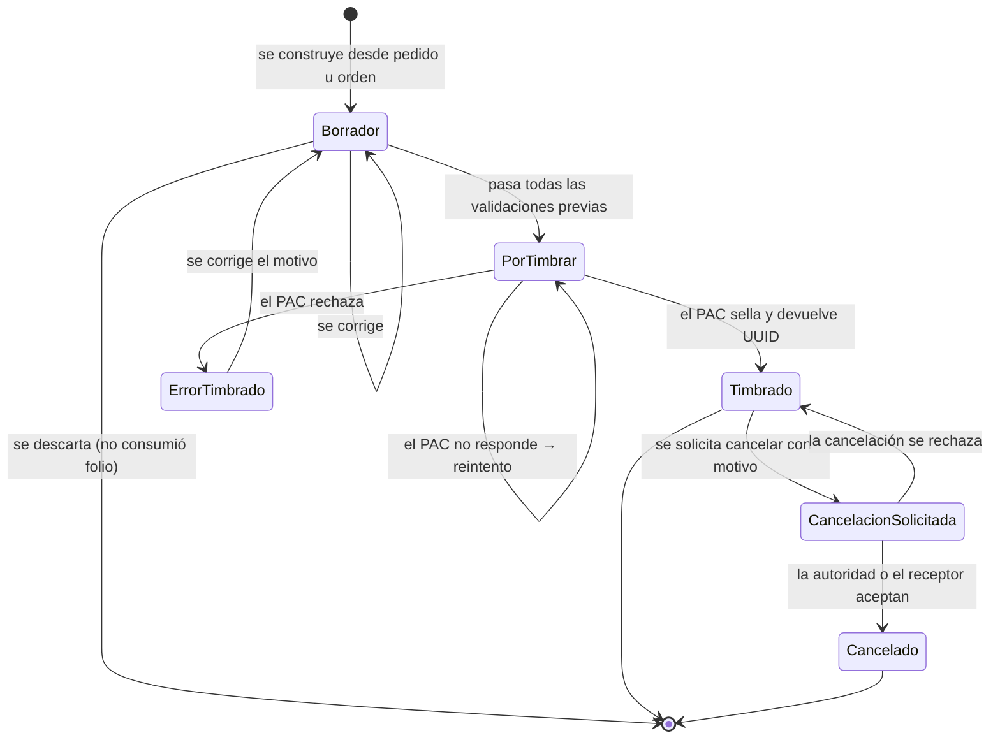
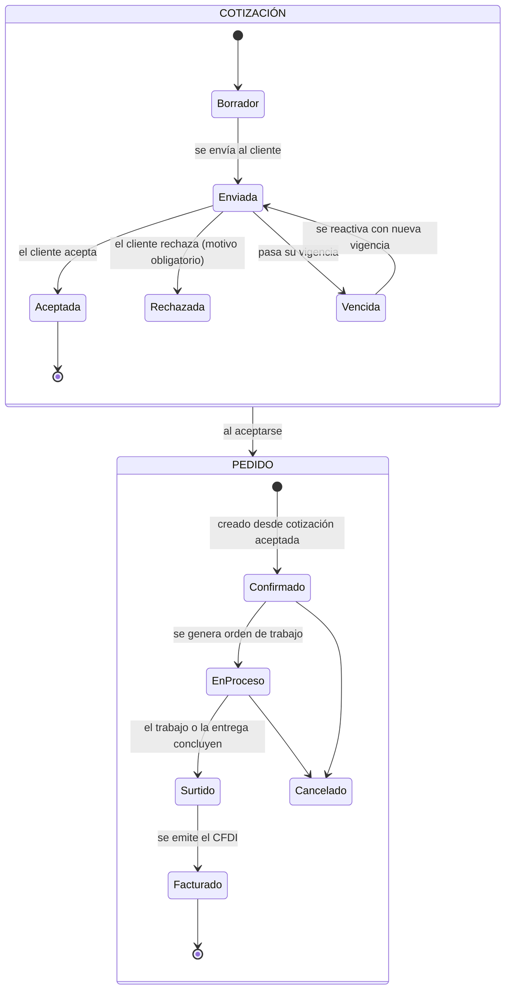
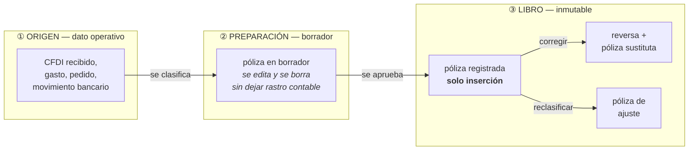
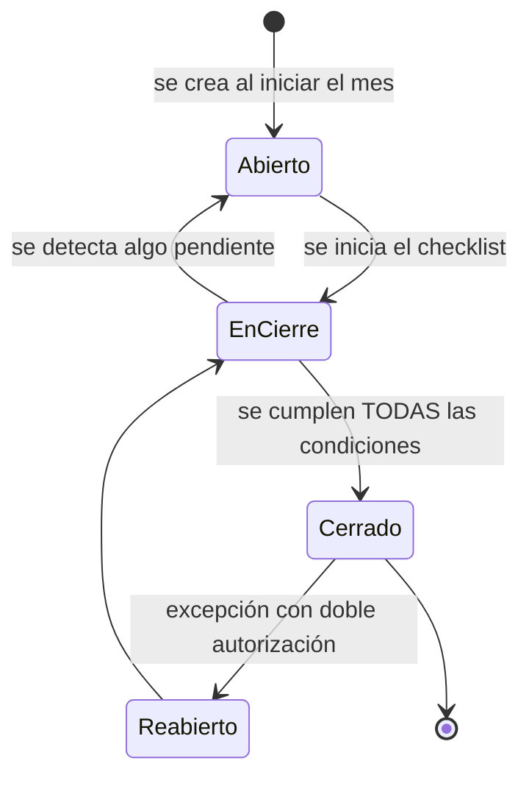
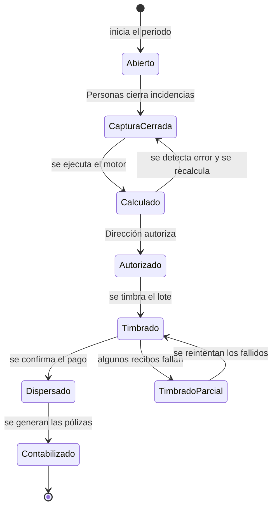

## 11. Comportamiento del sistema

> Parte del [SRS del OS](./00-indice.md). Las claves (`RF-`, `RNF-`, `CU-`, `RN-`) son estables y se referencian entre documentos.

Los requisitos dicen qué hace el sistema. Esta sección dice **cómo se comporta**: en qué estados puede estar cada cosa, qué transiciones son legales, qué ocurre cuando algo falla y cómo calcula.

### 11.1 Estados de un comprobante fiscal (CFDI)

| Transición | Quién la dispara | Efectos obligatorios |
|---|---|---|
| Borrador → PorTimbrar | Usuario con permiso, tras validación completa | Se asigna folio de la serie |
| PorTimbrar → Timbrado | Respuesta del PAC | Se guardan XML y PDF, se publica el evento, se genera póliza y cuenta por cobrar, se envía al cliente |
| PorTimbrar → ErrorTimbrado | Rechazo del PAC | Se guarda el código y mensaje. **No** se genera póliza ni cuenta por cobrar |
| PorTimbrar → PorTimbrar | Falta de respuesta | Antes de reintentar se consulta al PAC si el comprobante ya existe |
| Timbrado → CancelacionSolicitada | Contabilidad, con motivo | Se registra el motivo y, si aplica, el sustituto |
| CancelacionSolicitada → Cancelado | Confirmación | **Se genera póliza de reversa**; la cuenta por cobrar se cancela; el evento se publica |

**Estados prohibidos.** No existe transición de `Timbrado` a `Borrador`, ni de `Cancelado` a ningún otro estado. Un comprobante timbrado no se edita jamás (`RN-005`).

### 11.2 Estados de una cotización y un pedido

**Regla de bloqueo.** Un pedido de un cliente que excede su límite de crédito no puede pasar de `Confirmado` a `EnProceso` sin autorización registrada (`RF-144`).

### 11.3 Estados de una orden de trabajo

Definidos en §5.4. Las reglas de transición obligatorias:

| Regla | Comportamiento |
|---|---|
| No se puede asignar un recurso no disponible | El sistema muestra el conflicto y exige resolverlo |
| No se puede asignar un activo con mantenimiento crítico vencido | Bloqueo con explicación (`RF-186`) |
| No se puede asignar a un empleado con documento obligatorio vencido | Bloqueo con notificación a Personas |
| No se puede cerrar una orden con checklist obligatorio incompleto | Bloqueo, indicando qué falta |
| No se puede registrar consumos en una orden cerrada | Rechazo (`RN-017`) |
| Cancelar una orden con consumos no borra los consumos | Quedan como costo sin ingreso, visibles en el análisis |

### 11.3.1 Las tres zonas del registro contable

El sistema separa físicamente lo que se puede corregir de lo que no. No es una regla de la aplicación: son tablas distintas con permisos distintos.

| Zona | Qué vive ahí | Quién puede cambiarlo | Qué ve la balanza |
|---|---|---|---|
| ① **Origen** | El documento operativo antes de contabilizarse: clasificación, cuenta sugerida, tercero, dimensión | Quien tenga permiso sobre ese documento. Edición libre (`RF-044`) | Nada. Todavía no es contabilidad |
| ② **Preparación** | La póliza en borrador, cuadrando | Contabilidad. Edición y borrado libres (`RF-041`) | Nada. El borrador no existe para ningún reporte |
| ③ **Libro** | La póliza registrada | **Nadie.** Solo se agrega: reversa, sustituta o ajuste (`RF-042`, `RF-043`) | Todo |

**Dónde está la línea.** El cruce de ② a ③ es el único punto irreversible del sistema, y es deliberado: es el momento en que un dato se convierte en evidencia. Antes de esa línea, corrige cuanto quieras; después, corriges **agregando**. Por eso la zona de preparación importa tanto: es la que hace que la inmutabilidad del libro no estorbe el trabajo diario.

**Lo que esto resuelve en la práctica.** Casi todo lo que se siente como "necesito editar la contabilidad" es en realidad un error de la zona ① o ② que se contabilizó demasiado pronto. Contabilizar más tarde —al aprobar, no al capturar— elimina la mayor parte del problema sin tocar el libro.

**Lo que el sistema no tiene, y por qué.** No existe un mecanismo para modificar un asiento registrado, ni una credencial, rol o contraseña que lo habilite, ni un registro de cambios separado del libro. La restricción vive en la base de datos y no pregunta quién es el solicitante (`RF-123`). Un libro que se puede alterar sin que se note deja de ser evidencia de nada: es precisamente lo que el CFF art. 28, la NOM-151 y la NIF A-4 exigen que sea imposible. Y en una instalación compartida por varias empresas, una sola puerta de ese tipo comprometería a todos los clientes a la vez, no solo a uno.

---

### 11.4 Estados de un periodo contable

| Estado | Qué se permite | Qué se prohíbe |
|---|---|---|
| `Abierto` | Toda operación con fecha del periodo | — |
| `EnCierre` | Operaciones y ajustes; el checklist se recalcula | — |
| `Cerrado` | Solo consulta | Toda escritura con fecha del periodo. Rechazo a nivel de base de datos |
| `Reabierto` | Lo mismo que `Abierto` | Requiere rol Contabilidad **y** aprobación de Dirección **y** motivo escrito; queda en bitácora; invalida el hash de cierre hasta el nuevo cierre |

### 11.5 Estados de una nómina

**Regla que evita el error más caro de nómina:** una vez `Timbrado`, el periodo no vuelve atrás. Una corrección se hace cancelando el recibo individual y re-timbrándolo, o mediante ajuste en el periodo siguiente, identificado como retroactivo. Reabrir un periodo timbrado produciría inconsistencia entre lo declarado al SAT y lo registrado.

### 11.6 Comportamiento sin conexión y resolución de conflictos

La PWA de campo opera asumiendo que **no hay red**, y trata la conexión como una mejora, no como un requisito.

| Situación | Comportamiento obligatorio |
|---|---|
| El usuario abre la aplicación sin red | Ve sus órdenes asignadas, sincronizadas la última vez que hubo conexión |
| Captura una evidencia, un consumo o una incidencia | Se guarda en el dispositivo con su marca de tiempo **original** y una clave de idempotencia |
| La aplicación se cierra o el dispositivo se apaga | Lo capturado persiste; se recupera al reabrir |
| Se recupera la conexión | Se sincroniza en orden cronológico, reintentando cada registro fallido individualmente |
| El servidor ya tenía ese registro | La clave de idempotencia lo detecta; no se duplica |
| El registro local contradice al servidor | **Gana el registro de campo para los datos que solo campo conoce** (evidencias, consumos, lecturas). Gana el servidor para el estado administrativo (asignación, cancelación) |
| La orden fue cancelada en el servidor mientras se ejecutaba sin red | Se aceptan los registros de campo —el trabajo se hizo— y se marca un conflicto para que Operaciones lo resuelva. **Nunca se descarta el trabajo de una persona** |
| La foto excede el límite | Se comprime en el dispositivo antes de guardarla |
| La cola supera el límite de almacenamiento | Se avisa al usuario y se prioriza la sincronización de lo más antiguo |

### 11.7 Comportamiento ante fallas de servicios externos

Este es el apartado que distingue un sistema que aguanta un mal día de uno que no.

| Servicio | Falla | Comportamiento obligatorio | Lo que NUNCA debe pasar |
|---|---|---|---|
| **PAC** | No responde | El comprobante queda `por_timbrar`; reintento con espera creciente; antes de cada reintento se consulta si ya fue timbrado | Emitir dos veces el mismo comprobante |
| **PAC** | Rechaza | Estado `error_timbrado` con código y mensaje; el usuario corrige y reintenta | Generar póliza o cuenta por cobrar de un comprobante no timbrado |
| **PAC** | Caído prolongadamente | Se alerta a Dirección; el resto del sistema opera con normalidad; los comprobantes se acumulan en cola y se emiten al restablecerse | Bloquear toda la operación por no poder facturar |
| **SAT descarga masiva** | No responde | Se reintenta al día siguiente; se permite captura manual de gastos; al restablecerse, la descarga recupera el histórico y detecta duplicados | Perder gastos del periodo |
| **SAT** | Cambia el formato o la versión | El adaptador falla de forma explícita y alerta; se actualiza el adaptador y los parámetros | Enviar comprobantes malformados en silencio |
| **Banco** | El archivo de estado de cuenta cambia de formato | La importación falla señalando la línea y la columna; se permite mapeo manual | Importar datos mal interpretados |
| **Banco** | Rechaza una dispersión | El pago vuelve a pendiente; el resto del lote no se afecta; se alerta a Tesorería | Marcar como pagado algo que no se pagó |
| **Correo** | No entrega | El envío queda en cola con reintentos; el estado es visible en el documento | Que el usuario crea que el cliente recibió su factura |
| **Base de datos** | No disponible | El sistema muestra un estado de mantenimiento; la PWA sigue capturando localmente | Perder lo capturado |
| **Despachador de eventos** | Se detiene | Los eventos se acumulan en la tabla de salida y se procesan al reanudar, en orden | Perder eventos o procesarlos fuera de orden dentro de la misma entidad |

### 11.8 Reglas de cálculo y representación

**Dinero.**

| Regla | Detalle |
|---|---|
| Representación | Decimal de precisión fija: `numeric(18,2)` en base de datos; decimal exacto o entero en centavos en la aplicación. **Punto flotante prohibido** |
| Redondeo | A dos decimales, al valor más cercano; en el empate, hacia arriba |
| Orden de operaciones | Se calcula por concepto, se redondea el concepto, y se suman conceptos redondeados. Nunca se calcula sobre el total |
| Diferencias por redondeo | Si la suma de conceptos no coincide con el total esperado, **se rechaza el documento**; no se "ajusta" la diferencia silenciosamente |
| Moneda extranjera | Se guarda el importe en moneda original, el tipo de cambio aplicado y su fecha, y el equivalente en pesos. Los tres se conservan |

**Fechas y horas.**

| Regla | Detalle |
|---|---|
| Almacenamiento | Siempre en UTC, con zona horaria explícita |
| Presentación | En la zona horaria de la empresa (por defecto, la del centro de México) |
| Fecha fiscal | La fecha del hecho económico determina el periodo, el parámetro vigente y la declaración. **Nunca la fecha de captura** |
| Captura retroactiva | Permitida mientras el periodo esté abierto; rechazada si está cerrado, indicando el periodo abierto más próximo |

**Parámetros vigentes.**

| Regla | Detalle |
|---|---|
| Resolución | Todo parámetro se consulta por la fecha del hecho económico |
| Ausencia | Si no existe parámetro vigente para esa fecha, **el cálculo se detiene** y nombra el parámetro faltante. Nunca se usa el del periodo anterior |
| Historicidad | Recalcular una operación antigua produce el resultado que produjo entonces (`RNF-114`) |

**Validaciones previas al timbrado** (lista completa, exigida por `RF-117`):

1. RFC del emisor y del receptor con estructura válida y longitud correcta.
2. Régimen fiscal del receptor existente y vigente en el catálogo.
3. Uso de CFDI compatible con el régimen fiscal del receptor.
4. Código postal del domicilio fiscal del receptor presente y existente en el catálogo.
5. Cada concepto con clave de producto o servicio y clave de unidad vigentes.
6. Objeto de impuesto declarado por concepto.
7. Método de pago coherente con la forma de pago (PPD implica forma "por definir").
8. Moneda y, si no es peso mexicano, tipo de cambio presente.
9. Impuestos trasladados y retenidos calculados por concepto y coincidentes con los totales.
10. Total = suma de importes − descuentos + traslados − retenciones, al centavo.
11. Serie y folio disponibles.
12. Emisor con CSD vigente configurado en el PAC.

Si cualquiera falla, **no se envía nada al PAC** y se muestran **todos** los errores juntos, cada uno con su campo. Mostrarlos de uno en uno obliga al usuario a doce intentos y es un defecto de diseño.

### 11.9 Auditoría y trazabilidad

| Qué se registra | Dónde | Cuánto tiempo | Quién lo consulta |
|---|---|---|---|
| Toda escritura de negocio: autor, momento, origen, valores anterior y nuevo | Bitácora | ≥ 5 años | Dirección, Contabilidad, Administrador |
| Toda póliza, con su hash encadenado | Libro contable | ≥ 5 años, inmutable | Contabilidad, auditoría |
| Todo comprobante emitido y recibido, en su XML original | Archivos | ≥ 5 años, inmutable | Contabilidad, auditoría |
| Toda aprobación: quién, cuándo, qué decidió, con qué motivo | Bitácora de aprobaciones | ≥ 5 años | Dirección, auditoría |
| Todo acceso fallido y actividad anómala | Registro de seguridad | ≥ 1 año | Administrador |
| Toda intervención de un agente de IA, con su invocador | Bitácora | ≥ 5 años | Dirección, Administrador |
| Todo cambio de configuración y de regla contable | Bitácora de configuración | ≥ 5 años | Administrador, Contabilidad |

**Prueba de integridad.** En cada cierre, el sistema recorre la cadena de hash del libro contable completo y verifica que ningún eslabón esté roto. Una ruptura genera alerta crítica inmediata y bloquea el cierre.

### 11.10 Concurrencia

| Situación | Comportamiento obligatorio |
|---|---|
| Dos usuarios editan el mismo documento | El segundo en guardar recibe aviso de que el documento cambió, con las diferencias, y decide |
| Dos emisiones simultáneas de comprobante | La asignación de folio es atómica; nunca se repite ni se salta un folio sin registro |
| Dos aplicaciones de cobro sobre la misma factura | La segunda valida contra el saldo actualizado; si ya no hay saldo, se rechaza |
| Dos cierres simultáneos del mismo periodo | El segundo encuentra el periodo cerrado y se rechaza |
| El motor contable recibe el mismo evento dos veces | La tabla de eventos procesados lo detecta; no se genera una segunda póliza |
| Dos sincronizaciones de la PWA del mismo dispositivo | La clave de idempotencia evita la duplicación |

---

---

[← 10-arquitectura](./10-arquitectura.md) · [Índice](./00-indice.md) · [12-interfaces →](./12-interfaces.md)
