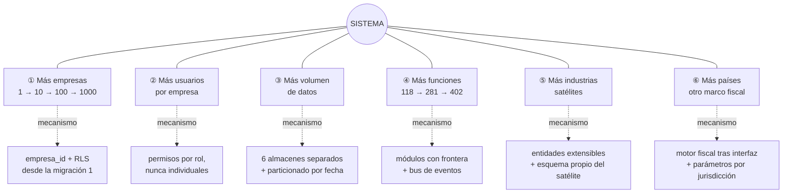

## 13. Escalabilidad y evolución

> Parte del [SRS del OS](./00-indice.md). Las claves (`RF-`, `RNF-`, `CU-`, `RN-`) son estables y se referencian entre documentos.

Esta sección responde una pregunta concreta: **qué hay que preparar hoy para que crecer mañana sea barato**. La respuesta no es "usar tecnología que escale": es dejar puntos de extensión donde el crecimiento va a ocurrir, y prohibir desde el principio las decisiones que después son carísimas de deshacer.

### 13.1 Las seis dimensiones de crecimiento

El sistema crece en seis direcciones independientes. Cada una tiene su mecanismo previsto.

### 13.2 Puntos de extensión: dónde se enchufa lo nuevo

Un punto de extensión es un lugar previsto donde agregar algo **no obliga a modificar lo existente**. El sistema tiene ocho.

| # | Punto de extensión | Qué permite agregar sin tocar lo existente | Cómo se garantiza |
|---|---|---|---|
| 1 | **Bus de eventos** | Un suscriptor nuevo que reaccione a un hecho ya publicado | Quien publica no conoce a quien escucha. Prueba: agregar un suscriptor sin modificar al publicador |
| 2 | **Reglas contables como datos** | Un tratamiento contable nuevo, o distinto por empresa | El motor lee reglas de una tabla; el contador las edita |
| 3 | **Parámetros con vigencia** | Tasas, tablas y topes de cualquier ejercicio o jurisdicción | Ningún valor normativo en código (`RE-06`) |
| 4 | **Adaptadores de integración** | Otro PAC, otro banco, otro proveedor de descarga | La interfaz la define el sistema (`RE-10`) |
| 5 | **Entidades extensibles del núcleo** | Un satélite que agregue atributos a orden, cotización, activo o empleado | El satélite crea tablas en su esquema que apuntan a las del núcleo. Cero cambios en el núcleo (`RNF-091`) |
| 6 | **Campos adicionales por empresa** | Un dato que una empresa necesita y otra no | Configuración, no migración (`RF-015`) |
| 7 | **Catálogo de roles y permisos** | Un rol nuevo, o un ajuste de alcance | Los permisos son datos; la matriz es semilla, no código |
| 8 | **Complementos fiscales** | Un complemento del SAT específico de un giro | Módulos dentro del motor fiscal; el constructor base no cambia |

**La prueba de que el diseño funcionó** llegará el día en que se construya el primer satélite. El criterio es binario y está en `RNF-091`: **cero tablas del núcleo modificadas**. Si hay que alterar la tabla de órdenes para que quepa el trabajo de una industria, el núcleo se diseñó mal y hay que corregirlo antes de continuar, no después.

### 13.3 Estrategia por etapa de crecimiento

Lo que sirve para una empresa no sirve para mil. Esto declara **qué cambia en cada salto y qué no debe cambiar nunca**.

| Etapa | Escala | Qué se mantiene igual | Qué cambia | Señal que indica que llegó el momento |
|---|---|---|---|---|
| **A. Primera empresa** | 1 empresa · 50 usuarios · 500 documentos/mes | Todo lo especificado aquí | Nada | — |
| **B. Primeras decenas** | 10 empresas · 500 usuarios | Modelo de datos, arquitectura, aislamiento | Índices afinados por empresa; caché de catálogos; métricas por empresa | Consultas > 1 s en p95 |
| **C. Cientos** | 100 empresas | Modelo de datos y arquitectura | Particionado de las tablas de alto volumen (bitácora, partidas, movimientos) por empresa y fecha; réplica de lectura para analítica; límites de consumo por empresa | Tablas > 50 millones de filas, o una empresa degradando a las demás |
| **D. Miles** | 1 000 empresas | El modelo lógico y los contratos | Segmentación física: grupos de empresas en instancias separadas de base de datos, con enrutamiento por empresa. La aplicación no cambia porque **siempre** filtró por `empresa_id` | Límites del motor de base de datos, o requisitos de residencia de datos distintos por cliente |
| **E. Extracción de un módulo** | Un módulo con carga desproporcionada | El contrato del módulo y sus eventos | Ese módulo se despliega aparte; su contrato local se vuelve remoto y su suscripción, una cola | Un módulo consume más recursos que el resto junto |

**La razón por la que el salto D es barato** es una sola decisión tomada hoy: que **toda tabla de negocio lleve `empresa_id` desde su primera migración** (`RE-05`). Repartir empresas entre instancias cuando cada fila ya sabe a quién pertenece es configuración. Hacerlo cuando no lo sabe es reescribir el sistema.

### 13.4 Lo que NUNCA debe hacerse

Estas son las decisiones que parecen atajos y que destruyen la capacidad de crecer. Cada una está prohibida por un requisito:

| # | Anti-patrón | Por qué destruye la escalabilidad | Prohibido por |
|---|---|---|---|
| 1 | Desactivar el aislamiento por fila "un momento, para probar" | Es la última línea de defensa entre empresas; una vez que el código asume que puede leer todo, nunca se recupera | `RE-05`, `RNF-054` |
| 2 | Que un módulo escriba en el esquema de otro | Las fronteras dejan de existir y el sistema se vuelve un monolito clásico, imposible de dividir después | `RE-02`, `RNF-094` |
| 3 | Escribir una tasa, tabla o tope fiscal en el código | Cada cambio normativo se vuelve un despliegue; y recalcular el pasado da resultados equivocados | `RE-06`, `RNF-114` |
| 4 | Llamar directamente a otro módulo en lugar de publicar un evento | Cada función nueva obliga a modificar las anteriores; el costo de agregar crece con lo ya construido | `RE-01`, `RF-020` |
| 5 | Permitir editar una póliza "solo en este caso" | El libro deja de ser evidencia y se pierde la razón de ser del producto | `RE-04`, `RN-003` |
| 6 | Otorgar un permiso individual fuera de rol | Los accesos se vuelven ingobernables en cuanto hay más de veinte personas | `RF-004` |
| 7 | Guardar dinero en punto flotante | Los centavos se pierden y la balanza deja de cuadrar; se descubre meses después | `RE-07` |
| 8 | Meter lógica específica de una industria en el núcleo | El núcleo deja de servir a las demás industrias y se vuelve un producto vertical | `RNF-090` |
| 9 | Guardar bitácora y datos de alta cadencia en las tablas de negocio | Las consultas diarias se vuelven lentas y el crecimiento golpea donde más duele | §10.4 |
| 10 | Construir el tablero antes que sus fuentes | Obliga a capturar números a mano, y ese vicio no se corrige después | `RF-210` |

### 13.5 Evolución del catálogo de funciones

El producto crece de 118 funciones (nivel Esencial) a 402. Ese crecimiento es la prueba de fuego del diseño modular.

| Regla de evolución | Detalle |
|---|---|
| Las claves son permanentes | Se agregan al final de su área; nunca se renumeran ni se reciclan. Viven en commits, pruebas y en este documento |
| Una función pertenece a un área y un departamento | Si parece pertenecer a dos, está mal definida o son dos funciones |
| El nivel decide el plan, no el orden de construcción | Mover una función de nivel cambia en qué plan aparece, no su clave ni su módulo |
| Nada legalmente obligatorio sale del nivel Esencial | Facturar, timbrar nómina, declarar y conservar documentos no se venden como add-on |
| La línea base de seguridad tampoco | Roles, bitácora, respaldos y cifrado están en el plan más básico |
| Una función que solo sirve a una industria no es núcleo | Prueba práctica: ¿la necesitan por igual una empresa de servicios de tecnología y una comercializadora? |

El catálogo completo, editable por área, está en `docs/areas/`. Agregar una función es un cambio de documento con su propio flujo (`/agregar-funcion`), nunca un cambio de código improvisado.

### 13.6 Preparación para otras jurisdicciones

El sistema es hoy un producto mexicano, y eso es correcto: un producto fiscal genérico no sirve bien en ningún país. Pero la arquitectura **debe** dejar preparada la salida, porque rehacerla después sería una reescritura.

| Elemento | Estado hoy | Qué se necesita para otro país |
|---|---|---|
| Motor fiscal | Implementa normativa mexicana | Vive detrás de una interfaz; se agrega una implementación por jurisdicción |
| Parámetros | Con vigencia por fecha | Se agrega dimensión de jurisdicción a la clave del parámetro |
| Catálogo de cuentas | Con código agrupador del SAT | El código agrupador es un atributo opcional; otro país usa su propia clasificación |
| Motor contable | Reglas como datos | Las reglas ya son por empresa; se vuelven por empresa y jurisdicción |
| Nómina | Normativa laboral mexicana | Misma estrategia: interfaz + implementación por jurisdicción |
| Moneda | Peso mexicano base, multimoneda en Profesional | Moneda funcional configurable por empresa |
| Idioma | Español de México | Todo texto visible debe salir de un archivo de traducción, nunca estar escrito en el código |
| Zona horaria | Configurable por empresa | Ya resuelto: almacenamiento en UTC |
| Residencia de datos | Región única declarada | Segmentación física por región, con el mismo mecanismo del salto D de §13.3 |

**Requisito que esto impone desde hoy:** ningún texto visible al usuario se escribe directamente en el código, y ninguna regla fiscal se implementa fuera del motor fiscal. Cumplir estas dos condiciones convierte una expansión internacional en trabajo acotado en lugar de una reconstrucción.

### 13.7 Preparación para inteligencia artificial

El producto se define como un sistema que convierte operación en inteligencia. Eso exige preparación desde el principio, no después.

| Preparación | Por qué desde ahora | Requisito |
|---|---|---|
| Los eventos describen **hechos de negocio** con su contexto completo | Un histórico de eventos bien nombrados es el insumo de cualquier modelo futuro | `RF-020` |
| Toda operación queda fechada y atribuida | Sin serie temporal atribuible no hay predicción posible | `RF-024` |
| Los agentes heredan permisos, no los amplían | Introducir agentes después sin este principio obliga a rediseñar el acceso | `RF-230` |
| Toda afirmación de un agente cita su origen | Un agente que no se puede verificar no se puede usar para decidir | `RF-233` |
| El consumo de IA se mide por empresa | Sin medición, el costo se descubre en la factura | `RF-234` |
| Los agentes no escriben sin confirmación humana | Un error automatizado a escala es más caro que cien errores manuales | `RF-231` |

---

---

[← 12-interfaces](./12-interfaces.md) · [Índice](./00-indice.md) · [14-calidad-y-pruebas →](./14-calidad-y-pruebas.md)
