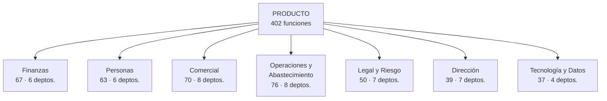
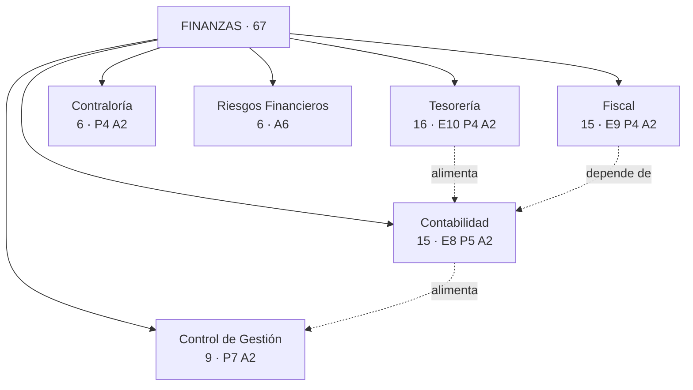
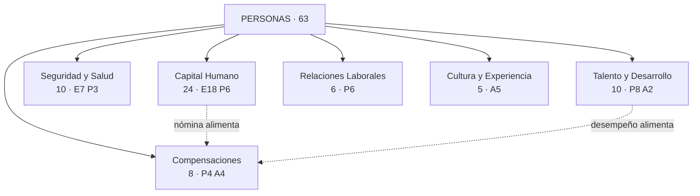
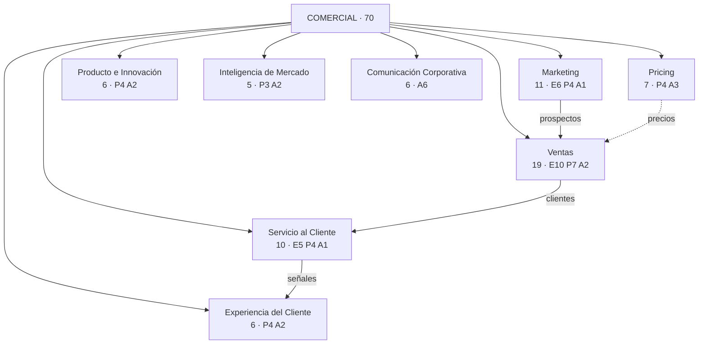
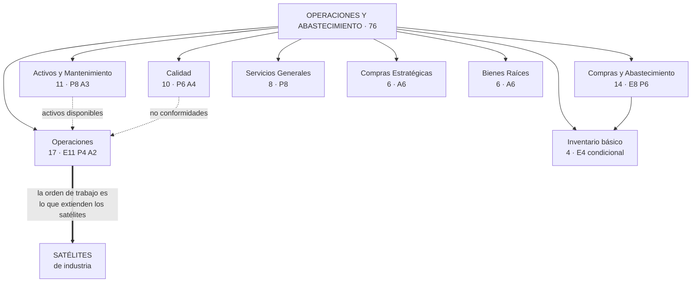
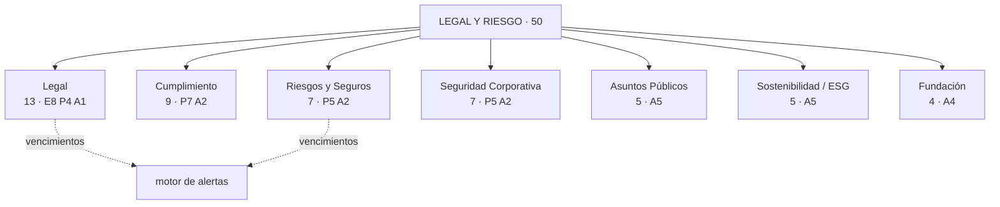
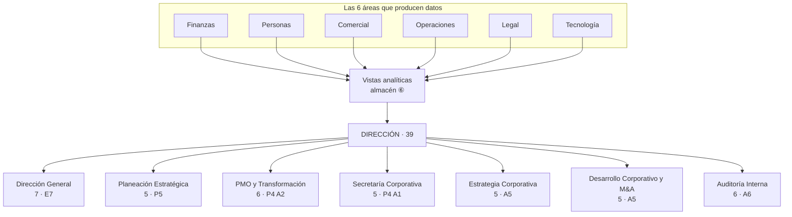
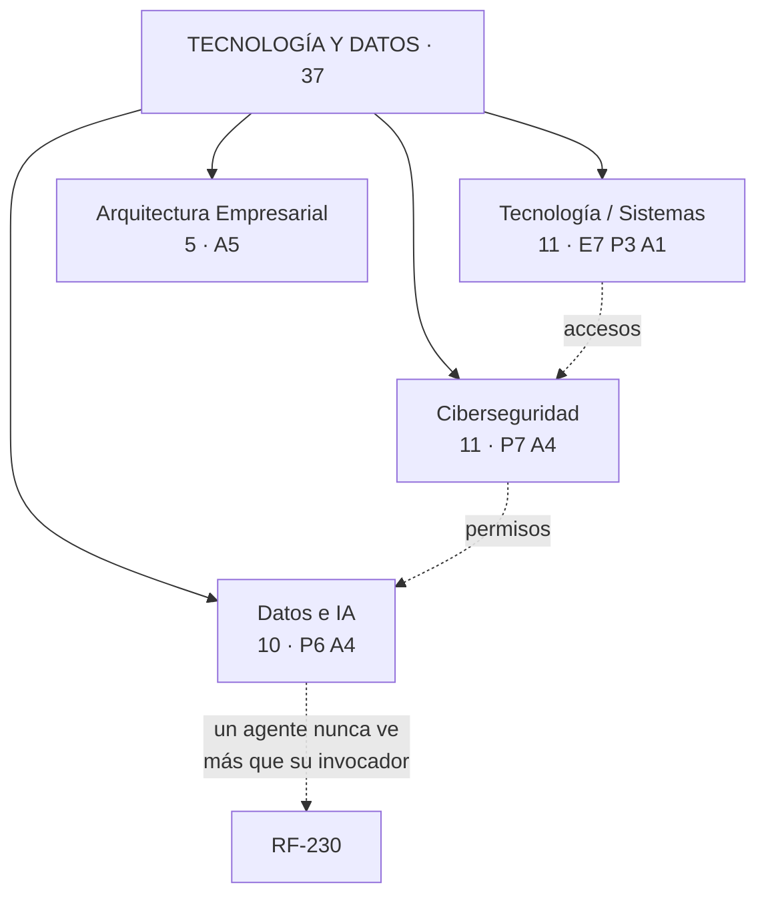

# Anexo A · Departamentos, características y funciones

> Parte del [SRS del OS](./00-indice.md). Este anexo describe **qué hace cada departamento**, cuándo aparece en una empresa real, qué lo caracteriza dentro del sistema y qué funciones lo componen. El catálogo editable función por función está en [`../areas/`](../areas/00-indice.md).

## A.1 Cómo está organizado el producto

El sistema se organiza como se organiza una empresa: **7 áreas → 46 departamentos → 402 funciones**. No es una taxonomía inventada para el software: es el mapa de los departamentos que existen en empresas reales, filtrado por una regla — **solo entran los que existen sin importar el giro**.

### Las tres dimensiones de cada función

Cada una de las 402 funciones se ubica por tres coordenadas, y las tres son independientes:

| Dimensión | Valores | Qué decide |
|---|---|---|
| **Área** | 7 | En qué módulo de código y en qué esquema de base de datos vive |
| **Departamento** | 46 | A qué parte de la empresa sirve, y quién la usa |
| **Nivel** | `E` Esencial · `P` Profesional · `A` Avanzado | En qué plan comercial aparece |

**El nivel no dice cuándo se construye.** Dice en qué plan se vende. El orden de construcción lo fija [`../11-plan-de-construccion.md`](../11-plan-de-construccion.md).

### Qué significa cada nivel en términos de empresa

| Nivel | Plan | Funciones | A quién sirve | Qué caracteriza a sus funciones |
|---|---|---|---|---|
| `E` Esencial | Basic | 118 | Micro y pequeña empresa (hasta ~30 personas) | **Operar y cumplir.** Sin esto la empresa no puede facturar, pagar, declarar ni pagar nómina. Incluye todo lo legalmente obligatorio y la línea base de seguridad |
| `P` Profesional | Pro | 281 acumuladas | Mediana empresa (30–250 personas) | **Controlar, planear y medir.** Aparece cuando hay más de una persona por función y hace falta coordinar, no solo ejecutar |
| `A` Avanzado | Max | 402 | Empresa grande o grupo | **Consolidar, gobernar y predecir.** Aparece cuando hay varias unidades de negocio, consejo, auditoría interna o presencia multipaís |

### Las dos reglas que no se rompen al mover funciones de nivel

1. **Nada legalmente obligatorio sale de `E`.** Facturar, timbrar nómina, declarar impuestos y conservar documentos 5 años no se venden como complemento.
2. **La línea base de seguridad tampoco.** Roles, bitácora, respaldos y cifrado de datos sensibles están en el plan más básico.

### Distribución de las funciones

```mermaid
graph LR
    subgraph E["NIVEL ESENCIAL — 118"]
        E1["Finanzas 27"]
        E2["Personas 25"]
        E3["Comercial 21"]
        E4["Operaciones 23"]
        E5["Legal 8"]
        E6["Dirección 7"]
        E7["Tecnología 7"]
    end
    subgraph P["NIVEL PROFESIONAL — +163"]
        P1["Finanzas 24"]
        P2["Personas 27"]
        P3["Comercial 30"]
        P4["Operaciones 32"]
        P5["Legal 21"]
        P6["Dirección 13"]
        P7["Tecnología 16"]
    end
    subgraph A["NIVEL AVANZADO — +121"]
        A1["Finanzas 16"]
        A2["Personas 11"]
        A3["Comercial 19"]
        A4["Operaciones 21"]
        A5["Legal 21"]
        A6["Dirección 19"]
        A7["Tecnología 14"]
    end
    E --> P --> A
```

**Lo que revela esta distribución.** En el nivel Esencial, el peso está en Finanzas, Personas y Operaciones: lo que una empresa chica necesita es cobrar, pagar, pagar nómina y ejecutar. Legal y Dirección casi no aparecen, porque en una empresa de 15 personas el dueño *es* la dirección y lo legal se resuelve con un despacho. En el nivel Avanzado la proporción se invierte: Legal, Dirección y Comercial dominan, porque lo que distingue a una empresa grande no es que opere distinto, sino que **gobierna, consolida y analiza**.

---

## A.2 Finanzas — 67 funciones · 6 departamentos

**Qué resuelve el área.** Todo el dinero: lo que entra, lo que sale, cómo se registra, cuánto se debe al fisco y qué dicen los números. Es el área más regulada del sistema y la que impone más restricciones técnicas al resto.

**Característica que la distingue.** Es la única área con un **libro inmutable**: sus pólizas no se editan ni se borran nunca. Todo lo demás en el sistema es corregible; la contabilidad no.

| Departamento | Qué hace | Cuándo aparece en una empresa | Característica dentro del sistema | Funciones |
|---|---|---|---|---|
| **Contabilidad** | Registra todo hecho económico, produce libros, balanza, estados financieros y el cierre de cada periodo | Desde el día uno: es obligación legal | Único destino de escritura del motor contable. Sus pólizas nacen de eventos, no de captura | `FIN-001` a `FIN-008` (E) · `FIN-028` a `FIN-032` (P) · `FIN-052`, `FIN-053` (A) |
| **Fiscal** | Cumple con el SAT: emite y recibe comprobantes, calcula IVA, ISR, retenciones, DIOT y contabilidad electrónica | Desde el día uno | Es el área de mayor riesgo legal del producto. Cada función lleva caso dorado firmado por el contador | `FIN-009` a `FIN-017` (E) · `FIN-033` a `FIN-036` (P) · `FIN-054`, `FIN-055` (A) |
| **Tesorería** | Administra el dinero disponible: bancos, cobranza, pagos, flujo de efectivo | Desde el día uno | Es donde el IVA se vuelve exigible: en México se causa al cobrar y se acredita al pagar | `FIN-018` a `FIN-027` (E) · `FIN-037` a `FIN-040` (P) · `FIN-056`, `FIN-057` (A) |
| **Control de Gestión (FP&A)** | Presupuesta, costea, mide rentabilidad y proyecta | Cuando la empresa deja de caber en la cabeza del dueño (~30 personas) | No captura datos: lee de contabilidad y operaciones. Si el dato no existe abajo, aquí no existe | `FIN-041` a `FIN-047` (P) · `FIN-058`, `FIN-059` (A) |
| **Contraloría** | Vigila que los controles internos se cumplan: autorizaciones, segregación de funciones, revisión de pólizas | Cuando quien autoriza ya no es quien ejecuta | Convierte la política de control en reglas del motor de flujos, no en un documento que nadie lee | `FIN-048` a `FIN-051` (P) · `FIN-060`, `FIN-061` (A) |
| **Riesgos Financieros** | Mide y cubre exposición cambiaria, de tasas, de commodities y de crédito | Cuando hay deuda relevante, moneda extranjera o insumos volátiles | Puramente analítico; no genera asientos por sí mismo | `FIN-062` a `FIN-067` (A) |

---

## A.3 Personas — 63 funciones · 6 departamentos

**Qué resuelve el área.** Todo lo relativo a las personas que trabajan en la empresa: desde su contratación hasta su recibo de nómina timbrado y sus obligaciones de seguridad social.

**Característica que la distingue.** Es la única área con **datos restringidos por ley y por decencia**: salarios, incapacidades y exámenes médicos. Ningún otro rol —ni siquiera Dirección— ve importes individuales.

| Departamento | Qué hace | Cuándo aparece | Característica dentro del sistema | Funciones |
|---|---|---|---|---|
| **Capital Humano** | Expediente, contratos, nómina completa, IMSS, incidencias, vacaciones, finiquitos, constancias | Desde el primer empleado | El departamento con más funciones obligatorias del sistema (18 en nivel Esencial). La nómina no admite aproximaciones | `PER-001` a `PER-018` (E) · `PER-026` a `PER-031` (P) |
| **Seguridad y Salud en el Trabajo** | NOM-035, comisión mixta, accidentes, equipo de protección, protección civil, prima de riesgo | Obligatorio desde el primer empleado, aunque se ignore en la práctica | Produce evidencia exportable ante inspección, no solo registros internos | `PER-019` a `PER-025` (E) · `PER-032` a `PER-034` (P) |
| **Talento y Desarrollo** | Reclutamiento, selección, onboarding, capacitación, evaluación de desempeño, planes de carrera | Cuando se contrata con regularidad, no por emergencia | Un candidato aprobado se convierte en empleado sin recapturar su expediente | `PER-035` a `PER-042` (P) · `PER-053`, `PER-054` (A) |
| **Compensaciones y Beneficios** | Tabulador, bonos, comisiones, prestaciones, simulación de incrementos, valuación de puestos | Cuando el sueldo deja de negociarse caso por caso | Consume datos salariales: hereda la restricción de acceso de `RF-166` | `PER-043` a `PER-046` (P) · `PER-055` a `PER-058` (A) |
| **Relaciones Laborales** | Reglamento interior, actas administrativas, sindicato, REPSE, conciliación laboral | Cuando hay sindicato, conflictos o servicios especializados | Todo documento aquí es evidencia potencial en un juicio laboral: versión y hash obligatorios | `PER-047` a `PER-052` (P) |
| **Cultura y Experiencia del Empleado** | Clima, reconocimientos, comunicación interna, bienestar, diversidad | Cuando la rotación cuesta más que el programa para evitarla | Único departamento del área que mide percepción, no hechos | `PER-059` a `PER-063` (A) |

---

## A.4 Comercial — 70 funciones · 8 departamentos

**Qué resuelve el área.** Conseguir clientes, venderles, cobrarles bien y conservarlos.

**Característica que la distingue.** Es donde **nace el dato** que recorre todo el sistema: un cliente capturado aquí termina en una póliza, en una declaración y en el tablero de dirección sin volver a escribirse.

| Departamento | Qué hace | Cuándo aparece | Característica dentro del sistema | Funciones |
|---|---|---|---|---|
| **Ventas** | Prospectos, embudo, actividades, cotizaciones, pedidos, facturación desde pedido, metas, tablero | Desde el día uno | Contiene la cadena que elimina la recaptura: cotización → pedido → factura | `COM-001` a `COM-010` (E) · `COM-022` a `COM-028` (P) · `COM-052`, `COM-053` (A) |
| **Marketing** | Segmentación, formularios, campañas, contenido, origen de prospectos, marca | Cuando dejar de vender por referidos se vuelve necesario | Cierra el circuito: un prospecto generado aquí llega al embudo con su origen identificado | `COM-011` a `COM-016` (E) · `COM-029` a `COM-032` (P) · `COM-054` (A) |
| **Servicio al Cliente** | Tickets, acuerdos de nivel de servicio, base de conocimiento, quejas, devoluciones, satisfacción | Cuando las quejas dejan de caber en un buzón de correo | Un ticket que excede su plazo escala solo | `COM-017` a `COM-021` (E) · `COM-033` a `COM-036` (P) · `COM-055` (A) |
| **Pricing y Revenue Management** | Listas de precios, descuentos con autorización, promociones, margen por precio | Cuando cada vendedor pone el precio que quiere | Aquí vive el control de descuento máximo por rol, que bloquea documentos | `COM-037` a `COM-040` (P) · `COM-056` a `COM-058` (A) |
| **Experiencia del Cliente** | Recorrido del cliente, NPS, salud de cuenta, riesgo de cancelación, lealtad | Cuando retener vale más que adquirir | Mezcla datos duros (facturación, tickets) con percepción | `COM-041` a `COM-044` (P) · `COM-059`, `COM-060` (A) |
| **Producto e Innovación** | Hoja de ruta, banco de ideas, ciclo de vida, fichas técnicas | Cuando el catálogo evoluciona y no solo se repone | Alimenta el catálogo de productos y servicios de la plataforma | `COM-045` a `COM-048` (P) · `COM-061`, `COM-062` (A) |
| **Inteligencia de Mercado** | Competidores, segmentos, encuestas, tendencias, participación de mercado | Cuando las decisiones de precio y producto necesitan afuera, no solo adentro | Único departamento que almacena datos externos como insumo formal | `COM-049` a `COM-051` (P) · `COM-063`, `COM-064` (A) |
| **Comunicación Corporativa** | Sala de prensa, medios, reputación, crisis, voceros, informe anual | Cuando la empresa es visible y una nota puede costarle dinero | Incluye protocolo de crisis: flujo de aprobación con tiempos exigentes | `COM-065` a `COM-070` (A) |

---

## A.5 Operaciones y Abastecimiento — 76 funciones · 8 departamentos

**Qué resuelve el área.** Hacer el trabajo y conseguir lo necesario para hacerlo. Es el área más grande del sistema y **el contenedor donde se enchufan los satélites de industria**.

**Característica que la distingue.** Contiene la entidad más importante para la extensibilidad del producto: la **orden de trabajo** (`OPE-001`). Un satélite de transporte la extiende como viaje; uno de construcción, como frente de obra; uno de servicios, como visita. Por eso se diseña genérica desde el principio.

| Departamento | Qué hace | Cuándo aparece | Característica dentro del sistema | Funciones |
|---|---|---|---|---|
| **Operaciones** | Órdenes de trabajo, plantillas, agenda de recursos, asignación, seguimiento, checklists, evidencias, consumos, incidencias, cierre y facturación | Desde el día uno en cualquier empresa que ejecute algo | **Punto de extensión número uno del producto.** Es donde se mide el costo real de hacer el trabajo | `OPE-001` a `OPE-011` (E) · `OPE-024` a `OPE-027` (P) · `OPE-056`, `OPE-057` (A) |
| **Compras y Abastecimiento** | Proveedores, requisiciones, cotizaciones comparadas, órdenes de compra, recepción, conciliación de tres vías, devoluciones | Desde que se le compra a alguien con regularidad | La conciliación de tres vías es el control que evita pagar lo que no llegó | `OPE-012` a `OPE-019` (E) · `OPE-028` a `OPE-033` (P) |
| **Inventario básico** | Existencias en un almacén, entradas y salidas, costo promedio, punto de reorden | **Condicional:** solo si la empresa maneja bienes físicos | Se activa por configuración. Con él desactivado, ninguna pantalla lo pide | `OPE-020` a `OPE-023` (E, condicional) |
| **Calidad** | Estándares, inspecciones, no conformidades, acciones correctivas, sistema de gestión, auditorías internas, mejora continua | Cuando un cliente lo exige o una certificación lo obliga | Produce evidencia auditable bajo esquemas de certificación | `OPE-034` a `OPE-039` (P) · `OPE-058` a `OPE-061` (A) |
| **Activos y Mantenimiento** | Registro de activos, resguardos, mantenimiento preventivo y correctivo, historial, costo, refacciones, garantías, talleres | Cuando hay equipo cuya falla detiene el trabajo | Un mantenimiento crítico vencido **bloquea la asignación** del activo (`RF-186`) | `OPE-040` a `OPE-047` (P) · `OPE-062` a `OPE-064` (A) |
| **Servicios Generales** | Instalaciones, solicitudes internas, servicios y vencimientos, salas, vehículos utilitarios, visitantes, consumibles | Cuando hay oficina que administrar | Concentra los gastos recurrentes que nadie vigila hasta que suben | `OPE-048` a `OPE-055` (P) |
| **Compras Estratégicas** | Categorías de gasto, licitaciones, contratos marco, riesgo de proveedores, ahorros medidos, abastecimiento internacional | Cuando comprar bien es una ventaja competitiva, no un trámite | Mide ahorro contra una línea base, no contra la intención | `OPE-065` a `OPE-070` (A) |
| **Bienes Raíces Corporativos** | Portafolio de inmuebles, arrendamientos, ubicaciones, obras, costo de ocupación, predial | Cuando hay varias ubicaciones propias o arrendadas | Se conecta con el tratamiento contable de arrendamientos (NIF D-5) | `OPE-071` a `OPE-076` (A) |

---

## A.6 Legal y Riesgo — 50 funciones · 7 departamentos

**Qué resuelve el área.** Que la empresa no se meta en problemas y que, si se mete, tenga con qué defenderse.

**Característica que la distingue.** Casi todo lo que guarda es **evidencia**: documentos con versión, hash y conservación obligatoria. Es el área donde el sistema hace más por lo que **no** debe pasar que por lo que debe pasar.

| Departamento | Qué hace | Cuándo aparece | Característica dentro del sistema | Funciones |
|---|---|---|---|---|
| **Legal** | Contratos, solicitudes de contrato, firma electrónica, documentos corporativos, poderes, beneficiario controlador, marcas, permisos y licencias | Desde la constitución de la empresa | Todos sus documentos alimentan el motor de alertas por vencimiento. Un permiso vencido bloquea la operación que lo requiere | `LEG-001` a `LEG-008` (E) · `LEG-009` a `LEG-012` (P) · `LEG-030` (A) |
| **Cumplimiento** | Matriz de obligaciones regulatorias, políticas con acuse, línea de denuncia, datos personales, antilavado, debida diligencia de terceros | Cuando la empresa entra en un sector regulado o crece lo bastante para ser visible | Cada obligación tiene responsable, periodicidad, estado y evidencia. No es un documento: es un tablero | `LEG-013` a `LEG-019` (P) · `LEG-031`, `LEG-032` (A) |
| **Riesgos y Seguros** | Registro de riesgos, mapa de calor, planes de mitigación, pólizas de seguro, siniestros | Cuando el patrimonio a proteger justifica pensarlo | Un siniestro sigue su reclamación hasta el cobro, y ese cobro se contabiliza | `LEG-020` a `LEG-024` (P) · `LEG-033`, `LEG-034` (A) |
| **Seguridad Corporativa** | Incidentes, accesos físicos, rondas, investigaciones internas, protocolos | Cuando hay instalaciones, inventario o personal que proteger | Separado de la ciberseguridad, que vive en Tecnología | `LEG-025` a `LEG-029` (P) · `LEG-035`, `LEG-036` (A) |
| **Asuntos Públicos** | Mapa de autoridades, monitoreo regulatorio, cámaras, trámites, licitaciones públicas | Cuando el negocio depende de decisiones de gobierno | Incluye vigilancia del diario oficial, que alimenta la matriz de obligaciones | `LEG-037` a `LEG-041` (A) |
| **Sostenibilidad / ESG** | Huella de carbono, indicadores ambientales y sociales, reportes, cumplimiento ambiental | Cuando un cliente, un banco o un inversionista lo exige | Sus indicadores se alimentan de consumos reales del área de operaciones | `LEG-042` a `LEG-046` (A) |
| **Fundación** | Programas sociales, donativos con recibo, voluntariado, medición de impacto | Cuando hay una estructura filantrópica formal | Los donativos deducibles requieren tratamiento fiscal específico | `LEG-047` a `LEG-050` (A) |

---

## A.7 Dirección — 39 funciones · 7 departamentos

**Qué resuelve el área.** Ver el negocio completo y decidir.

**Característica que la distingue.** Es la única área que **no captura datos propios**. Lee de las demás a través de vistas analíticas. Si un número no existe en otra área, no puede existir aquí. Esa regla evita el vicio más común de los sistemas directivos: un tablero alimentado a mano que dice lo que alguien quiere que diga.

| Departamento | Qué hace | Cuándo aparece | Característica dentro del sistema | Funciones |
|---|---|---|---|---|
| **Dirección General** | Tablero ejecutivo, alertas críticas, aprobaciones centralizadas, objetivos, juntas y acuerdos, reporte automático, consulta en lenguaje natural | Desde el día uno: siempre hay alguien que dirige | Ningún número de su tablero se captura a mano; cada uno navega hasta los documentos que lo componen | `DIR-001` a `DIR-007` (E) |
| **Planeación Estratégica** | Plan estratégico, OKRs en cascada, iniciativas, revisión trimestral, balanced scorecard | Cuando la empresa planea a más de un trimestre | Un OKR se vincula a los indicadores que lo miden; no se declara su avance | `DIR-008` a `DIR-012` (P) |
| **PMO y Transformación** | Portafolio de proyectos, priorización, semáforos, recursos compartidos, beneficios logrados, gestión del cambio | Cuando hay más proyectos que capacidad para hacerlos | El estado del proyecto se deriva de sus tareas, no lo declara su responsable | `DIR-013` a `DIR-016` (P) · `DIR-021`, `DIR-022` (A) |
| **Secretaría Corporativa** | Consejo y comités, asambleas, seguimiento de acuerdos, estructura accionaria, portal del consejero | Cuando hay socios que no operan el negocio | Convocatorias y actas con conservación y evidencia formal | `DIR-017` a `DIR-020` (P) · `DIR-023` (A) |
| **Estrategia Corporativa** | Portafolio de negocios, asignación de capital, valuación de unidades, tablero consolidado, escenarios | Cuando hay más de un negocio bajo el mismo techo | Consume el paquete de Grupo Empresarial para consolidar | `DIR-024` a `DIR-028` (A) |
| **Desarrollo Corporativo y M&A** | Pipeline de oportunidades, debida diligencia, valuación, integración post-adquisición, alianzas | Cuando crecer por adquisición es una opción real | Su cuarto de datos exige control de acceso por documento y por persona | `DIR-029` a `DIR-033` (A) |
| **Auditoría Interna** | Plan anual basado en riesgos, papeles de trabajo, hallazgos, seguimiento, reporte al comité, auditoría continua | Cuando el consejo necesita una mirada independiente | Consume la bitácora y el libro contable como evidencia primaria | `DIR-034` a `DIR-039` (A) |

---

## A.8 Tecnología y Datos — 37 funciones · 4 departamentos

**Qué resuelve el área.** Dos cosas distintas que conviene no confundir: **el área de sistemas del cliente** (sus equipos, sus accesos, su mesa de ayuda) y **la configuración de la plataforma** (usuarios, roles, integraciones, respaldos).

**Característica que la distingue.** Es la única área cuyo rol principal —el Administrador— **no tiene acceso a contenido de negocio**. Administra el sistema sin ver el dinero. Separar esas dos cosas es un control, no una comodidad.

| Departamento | Qué hace | Cuándo aparece | Característica dentro del sistema | Funciones |
|---|---|---|---|---|
| **Tecnología / Sistemas** | Consola de usuarios y roles, inventario de equipos, mesa de ayuda, accesos ligados a altas y bajas, configuración, integraciones, respaldos | Desde el día uno | Contiene la configuración que hace que una empresa nueva opere sin escribir código (`RF-001`) | `TEC-001` a `TEC-007` (E) · `TEC-008` a `TEC-010` (P) · `TEC-024` (A) |
| **Ciberseguridad** | Políticas de acceso, recertificación, actividad sospechosa, dispositivos, incidentes, simulacros, riesgo de proveedores, SSO, monitoreo, pruebas de penetración | Cuando hay información que perder y gente suficiente para perderla | Lo que aquí es "función vendible" en nivel Profesional, su **línea base** está en el nivel Esencial y nunca se vende aparte | `TEC-011` a `TEC-017` (P) · `TEC-025` a `TEC-028` (A) |
| **Datos e IA** | Constructor de reportes, tableros personalizados, conexión a herramientas externas, calidad de datos, agentes personalizados, automatizaciones, modelos predictivos, gobierno de datos | Cuando hay suficiente historia acumulada para que valga la pena | Todo agente hereda los permisos de quien lo invoca. Sin esa regla, la IA es una fuga de datos | `TEC-018` a `TEC-023` (P) · `TEC-029` a `TEC-032` (A) |
| **Arquitectura Empresarial** | Mapa de sistemas, estándares, hoja de ruta tecnológica, gestión de APIs, multi-entorno | Cuando hay varios sistemas que deben entenderse entre sí | Único departamento que documenta al sistema mismo dentro del sistema | `TEC-033` a `TEC-037` (A) |

---

## A.9 Los 46 departamentos por tamaño de empresa

Una misma empresa no tiene los 46 departamentos: tiene los que su tamaño justifica. Esta tabla dice cuándo aparece cada uno **en la realidad**, y por lo tanto en qué plan tiene sentido venderlo.

| Aparece en | Departamentos | Total |
|---|---|---|
| **Micro y pequeña** (nivel Esencial) | Contabilidad · Fiscal · Tesorería · Capital Humano · Seguridad y Salud · Ventas · Marketing · Servicio al Cliente · Operaciones · Compras y Abastecimiento · Inventario básico (condicional) · Legal · Dirección General · Tecnología / Sistemas | **14** |
| **Mediana** (se suman en Profesional) | Control de Gestión · Contraloría · Talento y Desarrollo · Compensaciones · Relaciones Laborales · Pricing · Experiencia del Cliente · Producto e Innovación · Inteligencia de Mercado · Calidad · Activos y Mantenimiento · Servicios Generales · Cumplimiento · Riesgos y Seguros · Seguridad Corporativa · Planeación Estratégica · PMO · Secretaría Corporativa · Ciberseguridad · Datos e IA | **20** |
| **Grande o grupo** (se suman en Avanzado) | Riesgos Financieros · Cultura y Experiencia del Empleado · Comunicación Corporativa · Compras Estratégicas · Bienes Raíces Corporativos · Asuntos Públicos · Sostenibilidad / ESG · Fundación · Estrategia Corporativa · Desarrollo Corporativo y M&A · Auditoría Interna · Arquitectura Empresarial | **12** |

**Matiz importante:** un departamento "de empresa grande" no está prohibido para una chica. Una micro empresa que necesita ciberseguridad puede contratarla como complemento sin comprar el plan completo. El plan agrupa lo típico; **no restringe lo necesario**.

## A.10 Qué NO es un departamento del núcleo

Tres categorías de funciones quedaron fuera a propósito, y conviene saber por qué:

| Categoría | Ejemplos | Por qué no es núcleo | Dónde queda |
|---|---|---|---|
| **Específicas de una industria** | Despacho de viajes, frente de obra, expediente clínico, planeación de producción | Solo sirven a un giro. Meterlas al núcleo lo volvería un producto vertical | Satélites de industria |
| **Específicas de un modelo de negocio** | Multi-almacén, comercio electrónico, comercio exterior, consolidación de grupo | Dependen de cómo vende o se estructura la empresa, no de su tamaño ni de su giro | Los 4 paquetes de [`../areas/08-paquetes-de-modelo.md`](../areas/08-paquetes-de-modelo.md) |
| **Que el sistema no debe hacer** | Presentar declaraciones ante el SAT, mover dinero, sustituir el criterio del contador | La autoridad no lo permite, o exige juicio profesional humano | Fuera del producto, documentado en §1.3.2 |

**La prueba de pertenencia al núcleo**, aplicable a cualquier función que alguien proponga agregar:

> ¿La necesitan por igual una empresa de servicios de tecnología y una comercializadora?
> Si solo una de las dos, por su giro: **es satélite, no núcleo**.

---

[← 17-trazabilidad](./17-trazabilidad.md) · [Índice](./00-indice.md) · [19-diagramas →](./19-diagramas.md)
