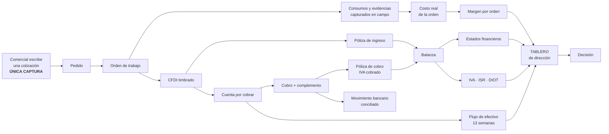
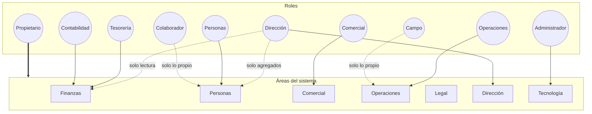
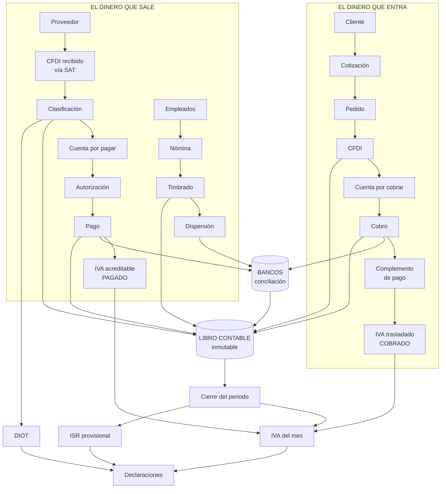
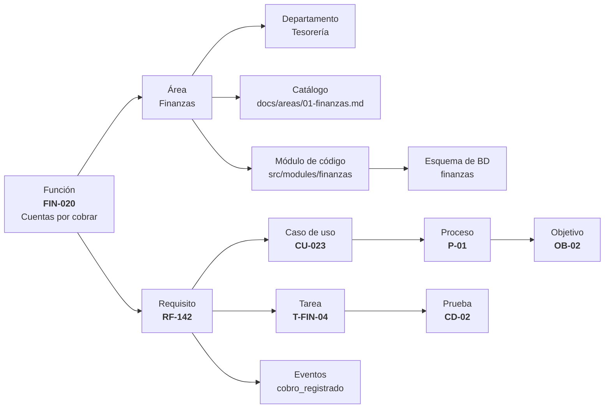
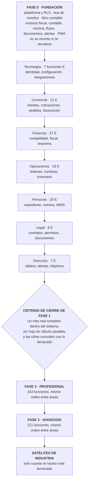

# Anexo B · Catálogo de diagramas

> Parte del [SRS del OS](./00-indice.md). Este anexo reúne **todos los diagramas de la especificación**, dice qué muestra cada uno y dónde vive, y agrega seis vistas de conjunto que no caben dentro de una sola sección.

Los diagramas están escritos en Mermaid dentro del propio Markdown: se ven en VS Code (con la extensión de Mermaid o la vista previa), en GitHub y en cualquier visor compatible, y **se editan como texto**, sin herramienta de dibujo.

---

## B.1 Índice de diagramas de la especificación

| # | Diagrama | Qué muestra | Dónde vive |
|---|---|---|---|
| 1 | Arquitectura de producto | Núcleo, paquetes de modelo y satélites, y la relación entre ellos | [§2.1](./02-descripcion-general.md) |
| 2 | Diagrama de contexto | Quién y qué interactúa con el sistema, y en qué dirección | [§2.2](./02-descripcion-general.md) |
| 3 | Modelo conceptual del dominio | Las entidades del negocio y cómo se relacionan | [§3.1](./03-dominio-y-glosario.md) |
| 4 | Mapa general de procesos | Los 11 procesos y sus dependencias | [§5.1](./05-procesos-del-negocio.md) |
| 5 | Ciclo de ingreso (secuencia) | De la cotización al cobro conciliado, con quién hace qué | [§5.2](./05-procesos-del-negocio.md) |
| 6 | Ciclo de egreso (secuencia) | De la descarga del SAT al pago conciliado | [§5.3](./05-procesos-del-negocio.md) |
| 7 | Estados de una orden de trabajo | Ciclo de vida completo con sus transiciones legales | [§5.4](./05-procesos-del-negocio.md) |
| 8 | Nómina (secuencia) | De la incidencia al recibo timbrado y contabilizado | [§5.5](./05-procesos-del-negocio.md) |
| 9 | Cierre contable y fiscal | Los 10 pasos y sus criterios de paso | [§5.6](./05-procesos-del-negocio.md) |
| 10 | Casos de uso por actor | Qué puede hacer cada rol | [§6.1](./06-casos-de-uso.md) |
| 10a | Motor de cálculo fiscal | Cómo una definición de datos, sus parámetros y las agregaciones producen el impuesto y su papel de trabajo | [§7.4.1](./07-requisitos-funcionales.md) |
| 11 | Motor contable | Cómo un evento se convierte en póliza, y cuándo se rechaza | [§7.5](./07-requisitos-funcionales.md) |
| 12 | Entidades centrales por esquema | Qué tabla vive en qué esquema y cómo se enlazan | [§9.3](./09-modelo-de-datos.md) |
| 13 | Vista de capas | Las 7 capas y sus reglas de dependencia | [§10.2](./10-arquitectura.md) |
| 14 | Vista de módulos | Quién publica y quién escucha en el bus de eventos | [§10.3](./10-arquitectura.md) |
| 15 | Bus de eventos (secuencia) | El patrón outbox paso a paso, con reintentos y cola de errores | [§10.5](./10-arquitectura.md) |
| 16 | Vista de despliegue | Dónde corre cada pieza | [§10.7](./10-arquitectura.md) |
| 16a | Dónde vive el código | Las tres copias del mismo código y cuál es irremplazable | [§10.7.1](./10-arquitectura.md) |
| 16b | Dónde corre el código | Navegador, Vercel y dentro de la base: qué decide cada uno | [§10.7.1](./10-arquitectura.md) |
| 16c | Los tres entornos | Local, desarrollo y producción, y por qué los datos reales nunca bajan | [§10.7.3](./10-arquitectura.md) |
| 16d | El viaje de un cambio | Del teclado al cliente, con las migraciones antes del código | [§10.7.4](./10-arquitectura.md) |
| 17 | Capas de seguridad | Las 5 barreras entre el usuario y el dato | [§10.8](./10-arquitectura.md) |
| 17a | Una persona con varios roles | Cómo se unen los permisos y dónde se detiene una combinación incompatible | [§10.8.1](./10-arquitectura.md) |
| 18 | Estados de un CFDI | Ciclo de vida del comprobante fiscal | [§11.1](./11-comportamiento-del-sistema.md) |
| 19 | Estados de cotización y pedido | Del borrador a la factura | [§11.2](./11-comportamiento-del-sistema.md) |
| 19a | Las tres zonas del registro contable | Origen, borrador y libro: dónde se corrige libremente y dónde solo se agrega | [§11.3.1](./11-comportamiento-del-sistema.md) |
| 20 | Estados de un periodo contable | Abierto, en cierre, cerrado, reabierto | [§11.4](./11-comportamiento-del-sistema.md) |
| 21 | Estados de una nómina | Del periodo abierto a la contabilización | [§11.5](./11-comportamiento-del-sistema.md) |
| 22 | Dimensiones de crecimiento | Las 6 direcciones en que el sistema crece y su mecanismo | [§13.1](./13-escalabilidad-y-evolucion.md) |
| 23–30 | Mapas por área | Departamentos de cada área y sus relaciones internas | [Anexo A](./18-departamentos-y-funciones.md) |
| 37 | Dos planos: negocio y operación | Por qué el operador no es un rol sino otro plano | [Anexo D.1](./21-plano-de-operacion.md) |
| 38 | El acceso de soporte | Quién lo concede, con qué alcance y dónde queda registrado | [Anexo D.4](./21-plano-de-operacion.md) |
| 31–36 | Vistas de conjunto | Las seis de abajo | Este documento |

---

## B.2 Mapa completo del producto: 7 áreas · 46 departamentos

Lo que se vende, todo junto. Cada caja es un departamento; el color de la etiqueta indica en qué nivel empieza a aparecer.

```mermaid
graph LR
    OS(("OS<br/>402 funciones"))

    OS --> FIN["<b>FINANZAS</b> · 67"]
    FIN --> F1["Contabilidad · 15 · E"]
    FIN --> F2["Fiscal · 15 · E"]
    FIN --> F3["Tesorería · 16 · E"]
    FIN --> F4["Control de Gestión · 9 · P"]
    FIN --> F5["Contraloría · 6 · P"]
    FIN --> F6["Riesgos Financieros · 6 · A"]

    OS --> PER["<b>PERSONAS</b> · 63"]
    PER --> P1["Capital Humano · 24 · E"]
    PER --> P2["Seguridad y Salud · 10 · E"]
    PER --> P3["Talento y Desarrollo · 10 · P"]
    PER --> P4["Compensaciones · 8 · P"]
    PER --> P5["Relaciones Laborales · 6 · P"]
    PER --> P6["Cultura · 5 · A"]

    OS --> COM["<b>COMERCIAL</b> · 70"]
    COM --> C1["Ventas · 19 · E"]
    COM --> C2["Marketing · 11 · E"]
    COM --> C3["Servicio al Cliente · 10 · E"]
    COM --> C4["Pricing · 7 · P"]
    COM --> C5["Experiencia del Cliente · 6 · P"]
    COM --> C6["Producto e Innovación · 6 · P"]
    COM --> C7["Inteligencia de Mercado · 5 · P"]
    COM --> C8["Comunicación Corporativa · 6 · A"]

    OS --> OPE["<b>OPERACIONES</b> · 76"]
    OPE --> O1["Operaciones · 17 · E"]
    OPE --> O2["Compras · 14 · E"]
    OPE --> O3["Inventario básico · 4 · E*"]
    OPE --> O4["Calidad · 10 · P"]
    OPE --> O5["Activos y Mantenimiento · 11 · P"]
    OPE --> O6["Servicios Generales · 8 · P"]
    OPE --> O7["Compras Estratégicas · 6 · A"]
    OPE --> O8["Bienes Raíces · 6 · A"]

    OS --> LEG["<b>LEGAL Y RIESGO</b> · 50"]
    LEG --> L1["Legal · 13 · E"]
    LEG --> L2["Cumplimiento · 9 · P"]
    LEG --> L3["Riesgos y Seguros · 7 · P"]
    LEG --> L4["Seguridad Corporativa · 7 · P"]
    LEG --> L5["Asuntos Públicos · 5 · A"]
    LEG --> L6["Sostenibilidad ESG · 5 · A"]
    LEG --> L7["Fundación · 4 · A"]

    OS --> DIR["<b>DIRECCIÓN</b> · 39"]
    DIR --> D1["Dirección General · 7 · E"]
    DIR --> D2["Planeación Estratégica · 5 · P"]
    DIR --> D3["PMO · 6 · P"]
    DIR --> D4["Secretaría Corporativa · 5 · P"]
    DIR --> D5["Estrategia Corporativa · 5 · A"]
    DIR --> D6["Desarrollo Corporativo · 5 · A"]
    DIR --> D7["Auditoría Interna · 6 · A"]

    OS --> TEC["<b>TECNOLOGÍA Y DATOS</b> · 37"]
    TEC --> T1["Tecnología / Sistemas · 11 · E"]
    TEC --> T2["Ciberseguridad · 11 · P"]
    TEC --> T3["Datos e IA · 10 · P"]
    TEC --> T4["Arquitectura Empresarial · 5 · A"]
```

**Cómo se lee.** `E` significa que el departamento **empieza** en el nivel Esencial; casi todos siguen creciendo en los niveles superiores. `E*` marca el inventario básico, que es condicional: se activa solo si la empresa maneja bienes físicos. El detalle de cada departamento está en el [Anexo A](./18-departamentos-y-funciones.md).

---

## B.3 El viaje de un dato: de la cotización al tablero

Este es el diagrama que explica el producto entero en una imagen. Un dato se captura **una vez**, a la izquierda, y llega solo hasta la decisión de dirección, a la derecha.

**Lo que hay que notar.** Hay **una sola caja de captura humana** en todo el recorrido (y una segunda en campo, para lo que solo campo conoce). Todo lo demás son consecuencias automáticas. Cada flecha que en un sistema tradicional sería "alguien vuelve a escribir esto en otro lado" aquí es un evento del bus.

Si en la implementación aparece una segunda captura del mismo dato, eso **es un defecto**, no una decisión de diseño (objetivo `OP-01`).

---

## B.4 Quién usa qué: actores contra áreas

**Las cuatro reglas que este diagrama hace visibles:**

1. El **Propietario** es el único con acceso total. No se le puede restringir.
2. El **Administrador** administra el sistema y **no ve contenido de negocio**. Es la separación que impide que quien da los accesos también vea el dinero.
3. **Dirección** lee todo, pero de Personas solo ve cifras agregadas: nunca un salario individual.
4. **Campo** y **Colaborador** solo ven lo propio. Su alcance de datos no es "el área", es "mis registros".

---

## B.5 El ciclo del dinero completo

Las dos mitades del negocio, y el punto donde convergen.

**La regla mexicana que este diagrama codifica.** El IVA **no** se causa al facturar: se causa al **cobrar**. Y no se acredita al recibir la factura: se acredita al **pagar**. Por eso las flechas del IVA salen del cobro y del pago, no de la emisión y la recepción. Esa particularidad es la razón técnica por la que tesorería y contabilidad no pueden construirse como módulos independientes.

---

## B.6 Trazabilidad: de la función al código

Cómo se responde en segundos la pregunta "¿dónde vive `FIN-020`?".

**Por qué esto importa.** La correspondencia **uno a uno** entre área, módulo y esquema es lo que permite que el sistema crezca a 402 funciones sin que nadie se pierda. Un commit dice `feat(FIN-020): …`; ese identificador lleva hasta el requisito, la prueba, el proceso de negocio que lo justifica y el objetivo que lo paga.

---

## B.7 Orden de construcción

No es un calendario con fechas: es un orden de dependencias. Cada fase empieza cuando la anterior cumplió su criterio.

**Por qué Dirección va al final, siempre.** No captura datos propios: lee de las demás áreas. Un tablero construido antes que sus fuentes muestra ceros, y la tentación de llenarlo a mano arruina la disciplina del resto del sistema.

**Por qué Comercial va antes que Finanzas.** El dato nace en Comercial. Construir facturación antes de tener clientes y pedidos obliga a inventar una pantalla de captura de facturas que después sobra, y que se queda para siempre.

---

## B.8 Cómo se editan estos diagramas

| Necesidad | Cómo se hace |
|---|---|
| Ver un diagrama | VS Code con la extensión de Mermaid, o la vista previa de Markdown; también se renderiza en GitHub |
| Cambiar un diagrama | Se edita el bloque de código `mermaid` directamente en el Markdown. No hay archivo binario ni herramienta intermedia |
| Agregar un diagrama | Se agrega el bloque en la sección que le corresponde y se registra en la tabla de [B.1](#b1-índice-de-diagramas-de-la-especificación) |
| Exportar a imagen | Cualquier exportador de Mermaid, si hace falta para una presentación. El original sigue siendo el texto |

**Regla de mantenimiento:** un diagrama que contradice al texto es un defecto del documento. Cuando algo cambia, **se actualizan ambos en el mismo cambio**, no "después".

---

[← 18-departamentos-y-funciones](./18-departamentos-y-funciones.md) · [Índice](./00-indice.md) · [20-multiempresa-y-distribucion →](./20-multiempresa-y-distribucion.md)
