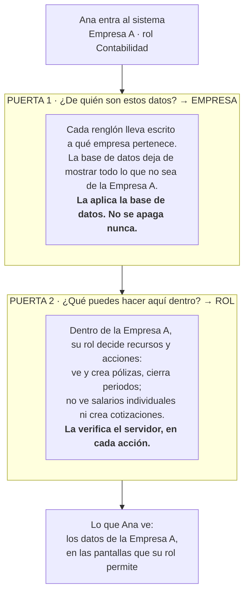
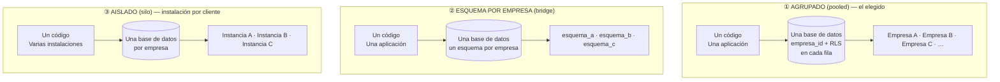
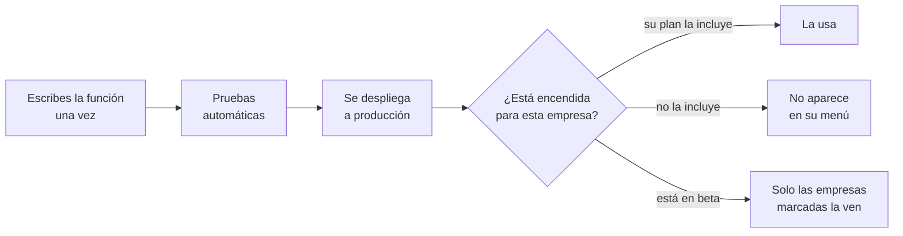
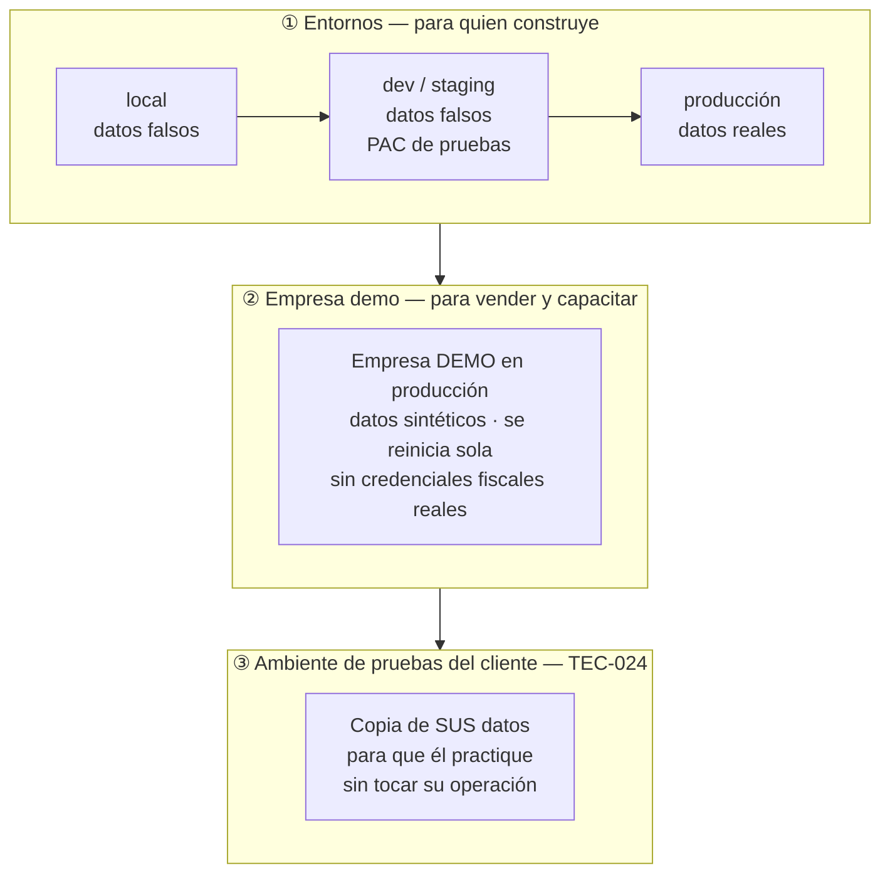
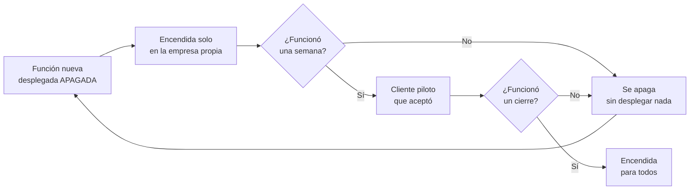
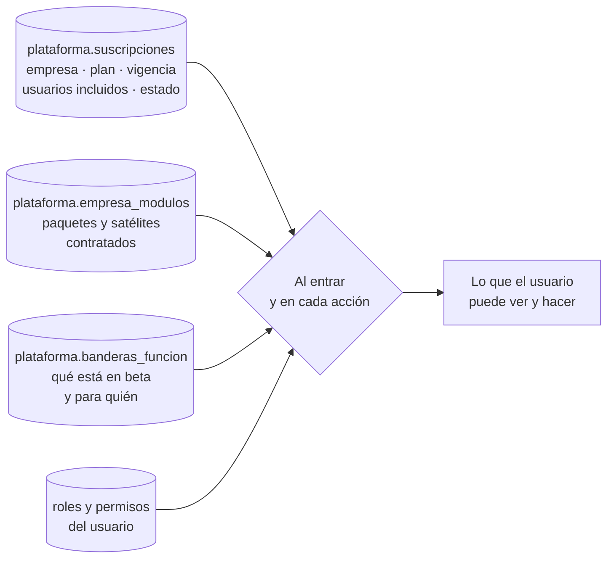

# Anexo C · Multiempresa, licencias y distribución

> Parte del [SRS del OS](./00-indice.md). Este anexo responde una pregunta de negocio con consecuencias técnicas: **cómo vender el mismo sistema a muchas empresas sin reescribir código ni multiplicar el trabajo de mantenerlo.** Complementa [§10.9](./10-arquitectura.md) y [§13.3](./13-escalabilidad-y-evolucion.md).

---

## C.1 La pregunta y la respuesta corta

> *"Quiero vender este sistema a varias empresas. Cada una independiente, que no se conozcan entre sí, que compartan el código pero no los datos. Si agrego una función, que llegue a todas. Y quiero un sandbox para probar sin romper lo que ya funciona."*

**Eso es exactamente lo que el sistema ya hace**, y es la forma estándar de construir software que se vende por suscripción. Se llama **multiempresa con aislamiento por fila** (*multi-tenant pooled*), y las tres decisiones que lo hacen posible ya están tomadas y escritas en la especificación:

| Decisión | Dónde vive | Qué garantiza |
|---|---|---|
| Toda tabla de negocio lleva `empresa_id` desde su primera migración | `RE-05`, `RF-002` | Cada fila sabe de quién es |
| Políticas de aislamiento en la base de datos, nunca solo en la aplicación | `RNF-054` | Un error de programación no expone datos de otra empresa |
| Un solo código, una sola aplicación desplegada | `RE-01`, `ADR-0001` | Una función escrita una vez llega a todas las empresas |

**Una corrección a la idea original.** Mencionaste "bases de datos distintas conectadas". Es al revés: las bases de datos de las empresas **nunca se conectan entre sí**. Lo único compartido es el código y los catálogos oficiales del SAT. Conectar los datos de dos clientes sería justo el defecto que este diseño existe para impedir.

---

## C.1 bis · Empresa y rol son dos puertas distintas

La confusión más común al entender este modelo es pensar que el aislamiento entre empresas es "un permiso más". No lo es: son dos mecanismos separados, en dos capas distintas, y ninguno sustituye al otro.

**La prueba de que son cosas distintas:**

| Usuario | Empresa | Rol | Facturas de A | Facturas de B | Salarios de A |
|---|---|---|---|---|---|
| Ana | A | Contabilidad | Sí | **No** | No |
| Beto | A | **Propietario** (el rol más alto) | Sí | **No** | Sí |
| Carla | B | Propietario | No | Sí | No (ve los de B) |

Beto es dueño de la Empresa A y tiene el rol más poderoso del sistema —ve hasta los salarios individuales— y aun así **no ve una sola fila de la Empresa B**. Ningún rol, por alto que sea, abre la puerta de otra empresa.

**Y la diferencia práctica que importa al programar.** Si alguien escribe `SELECT * FROM facturas` y olvida filtrar:

| Si el filtro lo pusiera la aplicación | Como está construido |
|---|---|
| Devuelve las facturas de **todos los clientes**. Un descuido se vuelve una fuga | Devuelve **solo las de la empresa conectada**. El descuido produce un reporte incompleto, nunca una fuga |

Una frase para recordarlo: **la empresa decide qué filas existen; el rol decide qué haces con las filas que existen.**

## C.2 Los tres modelos posibles

Toda empresa de software que vende a varios clientes elige entre estos tres. No hay un cuarto.

| | ① Agrupado | ② Esquema por empresa | ③ Aislado |
|---|---|---|---|
| **Aislamiento de datos** | Por política de fila en la base de datos | Por esquema | Físico, total |
| **Agregar una función a todos** | Un despliegue | Un despliegue + migrar N esquemas | N despliegues |
| **Costo por cliente nuevo** | Casi cero | Bajo | Alto: infraestructura propia |
| **Esfuerzo de operación** | Uno | Crece con N | Crece con N, linealmente |
| **Restaurar solo a un cliente** | Difícil: hay que resolverlo (C.8) | Medio | Trivial |
| **Un cliente pesado afecta a los demás** | Sí, si no hay límites | Sí | No |
| **Cliente que exige sus datos aparte** | No lo satisface | A medias | Lo satisface |
| **Viable para una persona construyendo** | **Sí** | Apenas | No |

**Decisión: modelo ① para todos los clientes**, con el ③ disponible como excepción de precio alto para quien lo exija por contrato o regulación (C.9). El ② no se usa: tiene los inconvenientes de ambos y las ventajas de ninguno a esta escala.

---

## C.3 Cómo se agrega una empresa

Vender una licencia **no implica escribir una línea de código**. Es un alta de datos.

```mermaid
flowchart LR
    V["Se cierra<br/>la venta"] --> A["1. Alta de la empresa<br/>RFC, régimen, domicilio"]
    A --> B["2. Suscripción<br/>plan, módulos, usuarios,<br/>vigencia"]
    B --> C["3. Catálogos y<br/>parámetros fiscales"]
    C --> D["4. Catálogo de cuentas<br/>revisado por su contador"]
    D --> E["5. Usuarios y roles"]
    E --> F["6. Credenciales<br/>PAC, banco, correo<br/>→ bóveda"]
    F --> G["7. Maestros<br/>clientes, proveedores,<br/>empleados"]
    G --> H["8. Saldos iniciales<br/>BLOQUEANTE:<br/>cuadrar al centavo"]
    H --> I["9. Timbrado de prueba<br/>y primero real"]
    I --> J["10. Dos cierres<br/>en paralelo"]
    J --> K["Empresa<br/>operando"]
```

Este es el proceso `P-11` del SRS. Los pasos 1 a 7 son configuración; el 8 es el que no se puede saltar, porque una contabilidad que arranca descuadrada nunca vuelve a cuadrar.

**Consecuencia comercial que conviene entender desde ahora:** el cuello de botella para crecer **no es el software, es la implementación**. Cada empresa nueva necesita que alguien cargue sus saldos iniciales y que su contador revise el catálogo de cuentas. Ese trabajo se cobra aparte y se vuelve, con el tiempo, un puesto o un socio implementador.

---

## C.4 Cómo se agrega una función a todas las empresas

Lo que decide qué ve cada empresa **son datos, no código**. Tres interruptores independientes, y esta separación es la que evita que el producto se bifurque:

| Interruptor | Qué controla | Dónde vive | Ejemplo |
|---|---|---|---|
| **Plan contratado** | Qué nivel de funciones compró | `plataforma.suscripciones` | Basic ve 118 funciones, Max ve 402 |
| **Módulos y paquetes** | Qué complementos compró | `plataforma.empresa_modulos` | Una comercializadora activa inventario; una de servicios no |
| **Bandera de función** | Qué está en prueba o en despliegue gradual | `plataforma.banderas_funcion` | La función nueva se enciende primero en una empresa |

**Regla que no se rompe nunca:** no existe una rama de código, un archivo ni un `if` por nombre de cliente. Si alguna vez aparece `if (empresa === 'FLEETER')` en el código, el producto acaba de dejar de ser un producto. Lo que un cliente necesita distinto se resuelve con configuración, con campos adicionales (`RF-015`) o con un módulo que cualquiera puede contratar.

---

## C.5 El sandbox: tres niveles distintos

"Probar sin romper lo que existe" son en realidad tres necesidades diferentes, y cada una tiene su mecanismo.

| Nivel | Para qué sirve | Quién lo usa | Cuándo se construye |
|---|---|---|---|
| **① Entornos** | Que una función nueva no toque datos reales hasta estar probada | Quien construye | Desde el primer día. Ya está en `docs/17-operacion-y-despliegue.md` |
| **② Empresa demo** | Demostrar el producto a un prospecto y capacitar sin riesgo | Ventas, implementación | Cuando haya algo que vender |
| **③ Ambiente de pruebas del cliente** | Que el cliente pruebe un cierre o una nómina con sus propios datos, sin afectar su operación | El cliente | Nivel Avanzado (`TEC-024`) |

**El cuarto mecanismo, el más importante en el día a día: las banderas de función.** Una función nueva se despliega **apagada**, se enciende primero en la empresa propia, después en un cliente que aceptó ser el primero, y solo entonces para todos. Así, "romper lo que ya existe" deja de ser un riesgo de todo o nada.

Apagar una bandera es un cambio de dato: tarda segundos y no requiere desplegar. Revertir un despliegue tarda minutos y arrastra todo lo demás que venía en él. Por eso la bandera es la red de seguridad real.

---

## C.6 Los riesgos reales de compartir la base de datos

Esta es la parte honesta. El modelo agrupado tiene cinco riesgos que conviene conocer **antes** de tener veinte clientes, no después.

| # | Riesgo | Qué pasa si ocurre | Control que ya existe | Qué falta agregar |
|---|---|---|---|---|
| 1 | **Fuga entre empresas** | Un cliente ve datos de otro. Pérdida de confianza irreparable | Cinco capas independientes (§10.8); RLS en la base de datos, no en el código | Prueba automática de aislamiento por cada módulo, obligatoria en CI |
| 2 | **Una migración rompe a todos a la vez** | Todos los clientes caídos el mismo día | Migraciones acumulativas y hacia adelante (`RNF-104`) | Migraciones en dos pasos: primero el código que tolera ambos estados, después la migración que elimina el viejo |
| 3 | **Un cliente pesado degrada a los demás** | Un cliente con 50 000 facturas hace lento el sistema para todos | Almacenes separados (§10.4) | Límites de consumo por empresa (`RNF-035`) y alerta cuando una empresa domina |
| 4 | **Restaurar los datos de un solo cliente** | El respaldo devuelve a *todos* al estado de ayer, incluidos los que no tenían problema | Respaldo diario (`RNF-043`) | Exportación lógica por empresa, diaria, y procedimiento probado de reimportación (C.8) |
| 5 | **Presión por personalizar** | "Solo para este cliente" se dice una vez y el producto se bifurca para siempre | Plan, módulos y banderas como datos (C.4) | Una regla escrita: lo que pida un cliente y sirva a los demás se vuelve función del catálogo; lo que solo le sirva a él, se cobra como desarrollo aparte y vive en su propio módulo |

El riesgo 4 es el que más subestima quien empieza. Merece su propia sección.

---

## C.7 Los controles que hay que construir, en orden

No hace falta todo desde el primer cliente. Este es el orden en que cada control se vuelve necesario.

| Cuándo | Control | Por qué en ese momento |
|---|---|---|
| **Antes del primer cliente externo** | Prueba automática de aislamiento por módulo | Un cliente externo es alguien que puede demandarte |
| **Antes del primer cliente externo** | Exportación diaria por empresa | Sin esto no puedes restaurar a uno solo |
| **Antes del primer cliente externo** | Contrato de servicio: disponibilidad, respaldo, residencia de datos, propiedad de los datos | El cliente lo va a preguntar |
| **Con 2 o 3 clientes** | Banderas de función | Con un cliente puedes avisar por teléfono; con tres, no |
| **Con 5 clientes** | Métricas por empresa: uso, errores, consumo | Para saber a quién le está yendo mal antes de que llame |
| **Con 10 clientes** | Límites de consumo por empresa | Uno ya es lo bastante grande para estorbar a los demás |
| **Con 10 clientes** | Ventana de mantenimiento y aviso previo | Ya no puedes desplegar cuando se te ocurra |
| **Con 50 clientes** | Particionado de las tablas grandes; réplica de lectura | Lo dice `§13.3`, etapa C |
| **Con 100+ clientes** | Segmentación física por grupos de empresas | Etapa D. Es barata *porque* cada fila lleva `empresa_id` desde hoy |

---

## C.8 Respaldo y restauración de una sola empresa

El respaldo de la base de datos completa sirve para un desastre general. **No sirve** para el caso real y frecuente: un cliente borró mal algo, o una carga inicial salió mal, y hay que devolverlo a como estaba el martes — sin tocar a los demás.

**Lo que hay que construir:**

| Mecanismo | Qué hace | Frecuencia |
|---|---|---|
| **Exportación lógica por empresa** | Vuelca todos los datos de una empresa a archivos, con sus archivos adjuntos | Diaria, automática |
| **Reimportación a una empresa nueva** | Carga esa exportación como una empresa distinta, para comparar antes de decidir | Bajo demanda |
| **Procedimiento de reemplazo** | Sustituye los datos de la empresa por los de la exportación, dentro de una transacción, con bitácora | Bajo demanda, con autorización |
| **Prueba trimestral** | Se restaura una empresa de prueba y se verifica que quedó igual | Trimestral (`RNF-044`) |

**Regla dura:** el libro contable **nunca se restaura selectivamente**. Es inmutable por diseño (`ADR-0002`). Si hubo un error contable, se corrige con pólizas de reversa, no rebobinando el libro. Restaurar contabilidad borraría justamente la evidencia que la hace válida ante la autoridad.

---

## C.9 El cliente que exige su propia instalación

Va a pasar: un cliente grande, un banco, una dependencia de gobierno, o alguien con una política interna que prohíbe compartir infraestructura. Hay una forma correcta y una forma que destruye el producto.

| | ✅ Forma correcta: **instancia dedicada** | ❌ Forma que destruye: **venderle el código** |
|---|---|---|
| Qué recibe | Su propia base de datos y su propio despliegue | Una copia del código fuente |
| Qué código corre | **El mismo repositorio, la misma versión** | Su copia, que se congela el día uno |
| Cómo se actualiza | Con el mismo despliegue automatizado que los demás | Nunca, o a mano, o nunca igual |
| Quién lo opera | Tú | Él, o nadie |
| Qué pasa a los 2 años | Sigue siendo el mismo producto | Son dos productos distintos y tú mantienes ambos |
| Precio | Varias veces la suscripción normal | Una sola vez, y te cuesta para siempre |

**La regla:** puedes vender aislamiento. **No vendas el código.** Un cliente con el código fuente es un producto bifurcado que no puedes actualizar, no puedes soportar y no puedes dejar de mantener.

Si el cliente exige garantías sobre qué pasa si tu empresa desaparece, la figura que existe para eso es el **depósito de código en custodia** (*escrow*): un tercero guarda una copia y solo se la entrega al cliente si tú incumples o cierras. Le da su garantía sin darte el problema.

**Lo que hay que hacer hoy para que una instancia dedicada sea posible mañana, sin rediseñar nada:**

1. Que absolutamente toda la configuración viva en variables de entorno y en datos, nunca en el código.
2. Que el despliegue sea automatizado y repetible, no una secuencia de pasos manuales que alguien recuerda.
3. Que las migraciones se apliquen solas al desplegar.
4. Que ninguna función dependa de la existencia de otras empresas en la base de datos.

Las cuatro ya son reglas de la especificación. **Por eso una instancia dedicada, hoy, sería configuración y no un proyecto.**

---

## C.10 Las licencias como datos

Lo que un cliente compró se guarda, se consulta y se aplica en el servidor. No es un archivo de licencia ni una llave que alguien pueda copiar.

**Lo visible = lo contratado ∩ lo que permite el rol ∩ lo que la bandera habilita.** Los tres filtros se aplican en el servidor, siempre (`RNF-055`). Ocultar un botón en la pantalla no es un control de licencia, igual que no es un control de seguridad.

**Qué pasa cuando una suscripción vence.** Esto hay que decidirlo antes de vender la primera, porque involucra datos fiscales que el cliente está legalmente obligado a conservar:

| Estado | Qué puede hacer el cliente | Cuánto dura |
|---|---|---|
| **Activa** | Todo lo contratado | Mientras pague |
| **Vencida, en gracia** | Todo, con aviso visible | Por definir (sugerido: 15 días) |
| **Suspendida** | Solo leer y **exportar sus datos**. No puede facturar ni capturar | Por definir (sugerido: 60 días) |
| **Cerrada** | Nada. Sus datos se conservan cifrados el plazo legal y se le entregan si los pide | 5 años, por obligación fiscal |

**Regla que conviene escribir en el contrato desde la primera venta:** los datos son del cliente, siempre, y puede exportarlos completos en cualquier momento (`RNF-075`) — incluso con la suscripción suspendida. Un sistema que retiene los datos fiscales de una empresa como palanca de cobro es indefendible legal y comercialmente.

---

## C.11 Lo que esto agrega al plan de construcción

Nada de esto cambia la arquitectura: la confirma. Lo que agrega son tareas concretas, en el momento en que cada una se vuelve necesaria.

| Tarea | Qué construye | Cuándo |
|---|---|---|
| `T-PLT-17` | Suscripciones, módulos contratados y su verificación en el servidor | Antes del segundo cliente |
| `T-PLT-18` | Banderas de función por empresa, con pantalla de administración | Antes del segundo cliente |
| `T-PLT-19` | Exportación lógica diaria por empresa, con sus archivos | Antes del primer cliente externo |
| `T-PLT-20` | Reimportación y reemplazo de los datos de una empresa, con bitácora | Antes del primer cliente externo |
| `T-PLT-21` | Métricas y límites de consumo por empresa | Con 5 a 10 clientes |
| `T-PLT-22` | Empresa demo con datos sintéticos que se reinicia sola | Cuando haya algo que vender |
| `T-END-06` | Prueba de aislamiento entre empresas, obligatoria en cada integración | Antes del primer cliente externo |

---

## C.12 Resumen en cinco frases

1. **Tu idea es la correcta y ya está construida:** un código, una aplicación, y cada fila de datos marcada con la empresa a la que pertenece.
2. **Las empresas no se conectan entre sí.** Comparten el código; los datos jamás se tocan.
3. **Una función nueva llega a todas con un despliegue**, y lo que cada una ve lo deciden su plan, sus módulos y las banderas — que son datos, no código.
4. **El sandbox son tres cosas distintas:** entornos para quien construye, una empresa demo para vender, y un ambiente de pruebas para el cliente. La red de seguridad diaria son las banderas.
5. **Nunca vendas el código.** Vende suscripción; y a quien exija aislamiento total, véndele una instancia dedicada que corre el mismo repositorio.

---

[← 19-diagramas](./19-diagramas.md) · [Índice](./00-indice.md)
