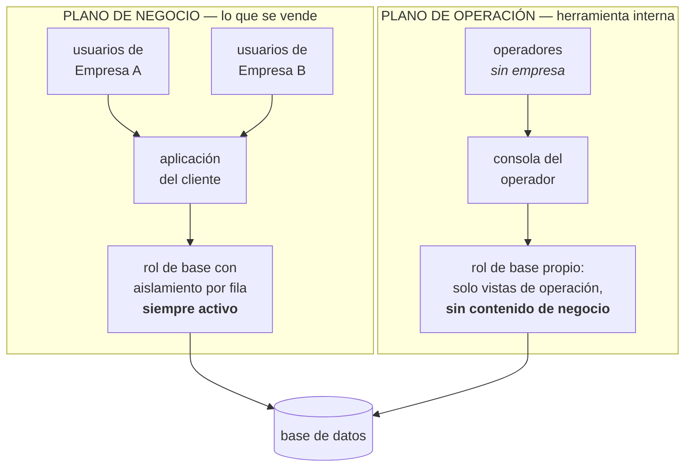
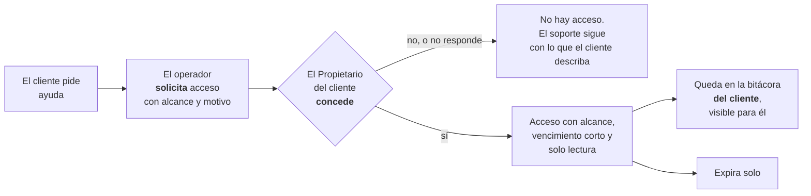

# Anexo D · El plano de operación (consola del operador)

> Parte del [SRS del OS](./00-indice.md). Las claves (`RF-`, `RNF-`, `CU-`, `RN-`, `RI-`) son estables y se referencian entre documentos.

> Este anexo describe la herramienta que usa **quien opera el sistema** —ustedes, el proveedor— y no forma parte de lo que se le vende al cliente. Ninguna de sus funciones lleva clave del catálogo (`FIN-`, `TEC-`…) ni cuenta dentro de las 402.

---

## D.1 La decisión de fondo: un plano aparte, nunca un rol

La tentación natural es crear un rol "superadministrador" que vea todas las empresas. **Está prohibido, y la prohibición es estructural, no de estilo.**

Los roles viven *dentro* de la Puerta 1 (§10.8.1). Toda la arquitectura de aislamiento descansa en una frase: *ningún rol, por alto que sea, abre la puerta de otra empresa* (`RF-002`, `RF-033`, `ADR-0004`). Un rol que sí la abriera convertiría esa frase en mentira, y con ella se caería el argumento completo por el cual una instalación compartida es defendible. Peor: un error ordinario de permisos —el tipo de error que ocurre— podría escalar hasta ese rol y alcanzar a todos los clientes a la vez.

Por eso el operador no es un usuario con más permisos. Es **otro plano**, con otra identidad, otra aplicación y otro camino a la base de datos.

**La regla que hace esto defendible:** la consola ve **metadatos y telemetría**, no contenido de negocio. Sabe que la Empresa A timbró 340 comprobantes este mes y que tres fallaron; no sabe a quién le facturó ni por cuánto. Esa distinción separa una herramienta de operación de una llave maestra.

---

## D.2 Qué ve y qué no ve

| Ve | No ve |
|---|---|
| Conteos y volúmenes por empresa: comprobantes, pólizas, usuarios activos, almacenamiento | El contenido de un comprobante, una póliza o un contrato |
| Estado de salud: disponibilidad, latencia, tasa de error por módulo | Nombres de clientes, proveedores o empleados de una empresa |
| Rezago de la cola de eventos y contenido de la cola de errores, **con los datos de negocio enmascarados** | Importes, saldos, estados financieros |
| Tareas programadas: cuáles corrieron, cuáles fallaron, cuánto tardaron | **Salarios individuales — jamás, por ninguna vía** |
| Migraciones aplicadas por entorno, versión desplegada | **La bóveda de secretos — jamás**: CSD, e.firma, credenciales bancarias y del PAC |
| Plan contratado, módulos y banderas de función por empresa | Los archivos del almacén (XML, PDF, evidencia de campo) |
| Bitácora de acceso de los propios operadores | La bitácora de negocio de una empresa, salvo acceso de soporte concedido (D.4) |

**Las dos prohibiciones absolutas** —salarios y bóveda— no tienen excepción ni siquiera bajo acceso de soporte concedido. Son las mismas dos cosas que ningún rol del cliente alcanza sin ser Personas o Propietario, y el operador no es ni una cosa ni la otra.

---

## D.3 Qué contiene la consola

| Módulo | Para qué sirve | Por qué importa |
|---|---|---|
| **Salud del sistema** | Disponibilidad, latencia por ruta, errores por módulo, rezago de la cola de eventos, cola de errores del bus, cola de timbrado, tareas programadas fallidas | Enterarse antes que el cliente. Un sistema multiempresa falla para todos a la vez |
| **Uso por empresa** | Comprobantes, almacenamiento, usuarios activos, cercanía a los límites del plan | Dice a quién hay que subir de plan y quién está por reventar un límite |
| **Ciclo de vida del cliente** | Alta de empresa, plan contratado, módulos y banderas de función encendidas por empresa, suspensión y reactivación | Es la operación comercial del producto. Todo son datos (`ADR-0004`); la consola es donde se administran |
| **Entrega de cambios** | Qué versión corre en cada entorno, qué migraciones se aplicaron, qué bandera está encendida para quién | El despliegue gradual por bandera (§10.7.4) necesita un lugar donde verse |
| **Sandbox de operador** | Crear una empresa de demostración con datos semilla, probar una función contra ella, desecharla | Experimentar sin tocar a nadie |
| **Soporte** | Solicitar, ejercer y auditar el acceso temporal a los datos de un cliente (D.4) | El punto más delicado de todo el anexo |
| **Definiciones fiscales** | Cargar, validar contra casos dorados y activar versiones de las definiciones de cálculo (`RF-053`, `RF-056`) | Es el lugar natural del trabajo de `ADR-0006`, y no pertenece a ningún cliente |

**El sandbox de operador nunca usa datos reales de un cliente.** `RNF-066` prohíbe copiar datos de producción hacia abajo, y esa prohibición no tiene excepción para el operador: los datos son de los clientes, no del proveedor. El sandbox se llena con semillas sintéticas.

---

## D.4 El acceso de soporte: el caso difícil

Tarde o temprano un cliente dirá "no me cuadra la balanza, entren a ver". Ese es el momento en que un sistema bien diseñado se convierte en uno mal diseñado, si se resuelve mal.

Las condiciones, todas obligatorias:

| # | Condición |
|---|---|
| 1 | **El cliente concede.** El operador solicita; el Propietario de esa empresa autoriza. Nunca al revés, y nunca el operador por su cuenta |
| 2 | **Alcance acotado**: el módulo o la entidad que se va a revisar, no la empresa entera |
| 3 | **Vencimiento corto y automático.** El acceso expira solo; no se renueva callado |
| 4 | **Solo lectura.** El operador no escribe en los datos del cliente; propone y el cliente ejecuta |
| 5 | **Registrado en la bitácora del cliente**, no solo en la del proveedor, y visible para él en su propia pantalla mientras ocurre y después |
| 6 | **Salarios y bóveda quedan fuera** aunque el acceso esté concedido |
| 7 | Se notifica al Propietario al concederse, al ejercerse y al expirar |

**Por qué tan estricto.** Frente a la Ley Federal de Protección de Datos Personales en Posesión de los Particulares, el proveedor es **encargado** respecto de los datos personales que sus clientes le confían: empleados, clientes, proveedores. Un acceso que el cliente no concede ni ve es tratamiento sin base y sin trazabilidad. La consola no es un detalle técnico: es parte del cumplimiento.

---

## D.5 Identidad del operador

| Aspecto | Decisión | Razón |
|---|---|---|
| Dónde vive | Tabla propia, **sin `empresa_id`** | Un operador no pertenece a ninguna empresa. No es un usuario del sistema con más permisos: es otra especie |
| Cómo entra | Segundo factor obligatorio, sin excepción, y llave física donde sea posible | Es la credencial más valiosa del sistema completo |
| Qué puede hacer | Permisos propios del plano de operación, independientes de la matriz de roles del cliente | Las dos matrices no se tocan ni se heredan |
| Cómo se audita | Toda acción del operador queda en una bitácora propia, de solo inserción, **que el operador no puede borrar ni editar** | Las mismas reglas que le exigimos al libro contable valen para quien opera el sistema |
| Separación de funciones | Quien da de alta operadores no es quien ejerce acceso de soporte | El mismo principio de `RF-032`, aplicado al proveedor |

---

## D.6 Dónde vive el código de la consola

Comparte repositorio, porque comparte modelo de datos y se despliega a la vez; pero es un **espacio propio** con su propia frontera verificada, igual que cualquier módulo (`ADR-0001`):

- Ruta o subdominio aparte, nunca una sección de la aplicación del cliente.
- Su propio módulo, con su propia `contracts/`. **La aplicación del cliente no importa nada de la consola, y la consola no importa internals de los módulos de negocio.**
- Su propio rol de base de datos, con permisos explícitos sobre vistas de operación. **Nunca un rol con desactivación general del aislamiento por fila**: lo que la consola necesita ver se expone como vista agregada, no como acceso libre a las tablas.

Esa última línea es la que impide que este anexo se convierta, con el tiempo, en la puerta trasera que dice no ser.

---

## D.7 Qué se construye y cuándo

Nada de esto va antes de tener el núcleo operando. El orden:

| Momento | Qué existe |
|---|---|
| **Antes del primer cliente** | Alta de empresa y activación de plan y módulos. Salud básica: errores, cola de eventos, tareas fallidas. Nada más |
| **Con el primer cliente externo** | Uso por empresa, exportación lógica por empresa (`C.8`), bitácora de operador, acceso de soporte completo con concesión del cliente |
| **Con varios clientes** | Tablero de salud completo, sandbox de operador, entrega por banderas, administración de definiciones fiscales |
| **Nunca** | Un rol que atraviese empresas. Un acceso a datos de cliente sin concesión. Salarios o bóveda en la consola. Datos reales en el sandbox |

---

## D.8 Resumen en cinco frases

1. **El operador no es un rol; es un plano aparte** — porque un rol que cruza empresas destruye la única barrera sin nada detrás.
2. **La consola ve metadatos, no contenido**: cuántos, cuánto tarda, qué falló; nunca a quién ni por cuánto.
3. **Entrar a los datos de un cliente lo concede el cliente**, con alcance, vencimiento y registro en su propia bitácora.
4. **Salarios y bóveda no están, nunca, bajo ninguna autorización.**
5. **Lo que le exigimos al libro contable se lo exigimos a quien opera el sistema**: su bitácora es de solo inserción y él no puede borrarla.

---

---

[← C · Multiempresa y distribución](./20-multiempresa-y-distribucion.md) · [Índice](./00-indice.md) · [E · Mapa de riesgos →](./22-mapa-de-riesgos.md)
